# 梯度下降算法背后的数学直觉

> 原文：<https://pub.towardsai.net/mathematical-intuition-behind-the-gradient-descent-algorithm-143a051c3fa9?source=collection_archive---------3----------------------->

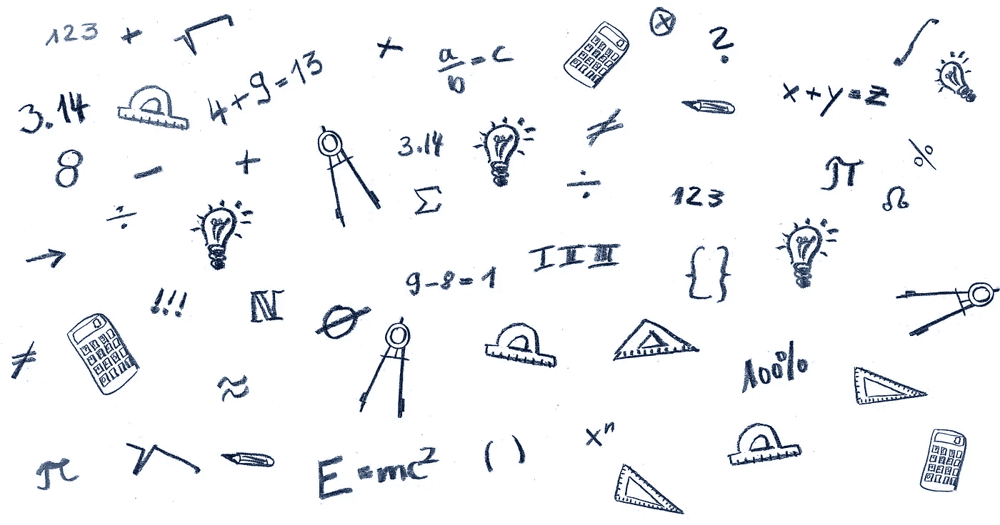

图片由[皮克斯拜](https://pixabay.com//?utm_source=link-attribution&utm_medium=referral&utm_campaign=image&utm_content=6784617)的 Gerd Altmann 提供

## 均方误差的梯度下降算法

**作者:** [普拉蒂克·舒克拉](https://www.linkedin.com/in/pratik-shukla28/)

> "头脑不是一个需要被填满的容器，而是一团需要被点燃的火."— [普鲁塔克](https://en.wikipedia.org/wiki/Plutarch)

## 梯度下降系列博客:

1.  [梯度下降算法](/the-gradient-descent-algorithm-defddd1d312e)
2.  [梯度下降算法背后的数学直觉](/mathematical-intuition-behind-the-gradient-descent-algorithm-143a051c3fa9)(你来了！)
3.  [梯度下降算法&及其变种](/the-gradient-descent-algorithm-and-its-variants-e0915796dbf2)

## 目录:

1.  [简介](#e135)
2.  [均方误差梯度下降算法的推导](#a99a)
3.  [梯度下降算法的工作示例](#23a9)
4.  [结束注释](#dc1b)
5.  [参考资料和资源](#3080)

## 简介:

欢迎光临！今天，我们正致力于发展一种强大的数学直觉，关于梯度下降算法如何找到其参数的最佳值。拥有这种感觉可以帮助你抓住机器学习输出中的错误，并对梯度下降算法如何使机器学习变得如此强大感到更加舒服。在接下来的几页中，我们将推导均方误差函数的梯度下降算法的方程。我们将使用本博客的结果来编写梯度下降算法。让我们开始吧！

## 均方误差梯度下降算法的推导；

## 1.第一步:

输入数据显示在下面的矩阵中。在这里，我们可以观察到有 ***m*** 个训练例子和 ***n*** 个特征。

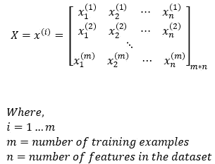

图 1:输入特征

> **尺寸:** X = (m，n)

## 2.第二步:

预期输出矩阵如下所示。我们的预期输出矩阵的大小将是 ***m*1*** ，因为我们有 ***m*** 个训练示例。

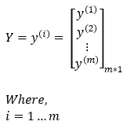

图 2:预期的输出

> **尺寸:** Y = (m，1)

## 3.第三步:

我们将在要训练的参数中添加一个偏差元素。

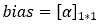

图 3:偏置元件

> **维度:** α = (1，1)

## 4.第四步:

在我们的参数中，我们有权重矩阵。权重矩阵将具有 ***n*** 个元素。这里， ***n*** 是我们训练数据集的特征数。

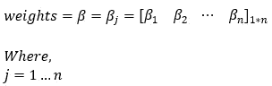

图 4:输入的权重

> **维数:** β = (1，n)

## 5.第五步:

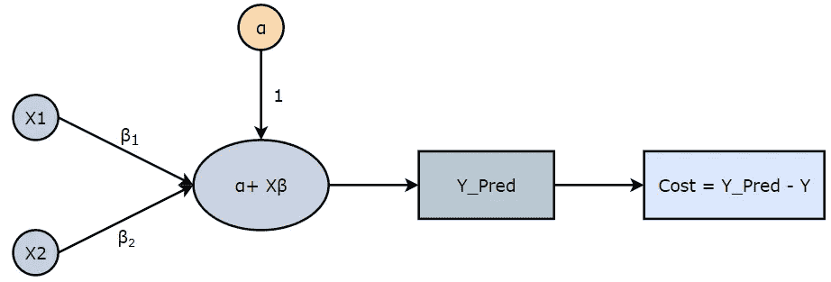

图 5:简单线性回归中的正向传播

每个训练示例的预测值由下式给出:

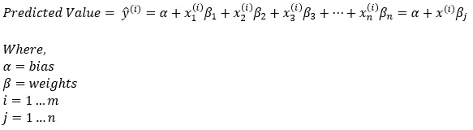

图 6:预测值

请注意，我们正在对权重矩阵(β)进行转置，以使维度符合矩阵乘法规则。

> **维度:**预测值= (1，1) + (m，n) * (1，n)
> 
> —对权重矩阵(β)进行转置
> 
> **维度:**预测值= (1，1) + (m，n) * (n，1) = (m，1)

## 6.第六步:

均方误差定义如下。

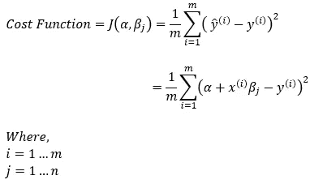

图 7:成本函数

> **维度:**成本=标量函数

## 7.第七步:

我们将使用下面的梯度下降规则来确定这种情况下的最佳参数。

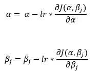

图 8:使用梯度下降算法更新参数

> **维度:** α = (1，1) & β = (1，n)

## 8.第 8 步:

现在，我们来求代价函数关于偏差元素( ***α*** )的偏导数。

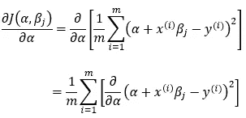

图 9:成本函数相对于偏差的偏导数

> **尺寸:** (1，1)

## 9.第九步:

现在，我们正试图简化上述方程，以找到偏导数。

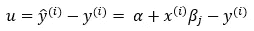

图 10:简化计算

> **维度:** u = (m，1)

## 10.第十步:

基于 [Step — 9](#6453) ，我们可以将成本函数写成:

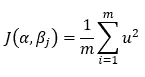

图 11:成本函数

> **尺寸:**标量函数

## 11.第 11 步:

接下来，我们将使用链式法则来计算成本函数相对于截距( ***α*** )的偏导数。

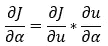

图 12:寻找成本函数相对于偏差的偏导数

> **尺寸:**(米，1)

## 12.第 12 步:

接下来，我们正在计算 [Step — 11](#d650) 的偏导数的第一部分。

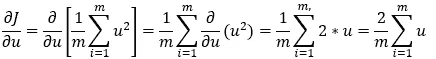

图 13:寻找成本函数的偏导数

> **尺寸:** (m，1)

## 13.第十三步:

接下来，我们计算[步骤的偏导数的第二部分— 11](#d650) 。

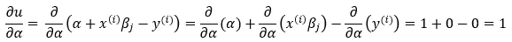

图-14:寻找紫外线偏差的偏导数

> **维度:**标量函数

## 14.第 14 步:

接下来，我们将[步骤— 12](#bc41) 和[步骤— 13](#5fad) 的结果相乘，得到最终结果。

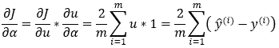

图 15:寻找成本函数相对于偏差的偏导数

> **尺寸:**(米，1)

## 15.步骤 15:

接下来，我们将使用链式法则来计算成本函数相对于权重的偏导数( ***β*** )。

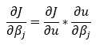

图 16:寻找成本函数相对于重量的偏导数

> **尺寸:** (1，n)

## 16.第 16 步:

接下来，我们计算[步骤— 15](#aedf) 的偏导数的第二部分。

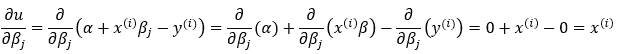

图-17:寻找紫外线重量的偏导数

> **尺寸:** (m，n)

## 17.第 17 步:

接下来，我们将 [Step — 12](#bc41) 和 [Step — 16](#4746) 的结果相乘，得到偏导数的最终结果。

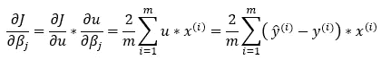

图 18:寻找成本函数相对于重量的偏导数

现在，既然我们想要有 ***n*** 个权重值，我们就从上面的等式中去掉求和部分。

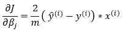

图 19:寻找成本函数相对于重量的偏导数

请注意，这里我们将不得不转置计算的第一部分，以使其符合矩阵乘法规则。

> **尺寸:** (m，1) * (m，n)
> 
> —对误差部分进行转置—
> 
> **维度:** (1，m) * (m，n) = (1，n)

## 18.第 18 步:

接下来，我们将所有计算的值放入 [Step — 7](#3954) 中，以计算用于更新 **α的梯度规则。**

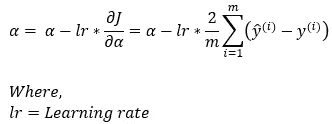

图 20:使用梯度下降更新偏差

> **维度:** α = (1，1)

## 19.第 19 步:

接下来，我们将所有计算出的值放入 [Step — 7](#3954) 中，计算出更新 ***β*** 的梯度规则。

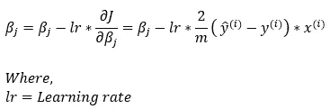

图 21:使用梯度下降更新权重

请注意，我们必须转置误差值，以使函数与矩阵乘法规则兼容。

> **维度:** β = (1，n) — (1，n) = (1，n)

## 梯度下降算法的工作示例:

现在，我们举个例子，看看梯度下降算法是如何找到最佳参数值的。

## 1.第一步:

输入数据显示在下面的矩阵中。在这里，我们可以观察到有 ***4*** 的训练实例和 ***2*** 的特点。

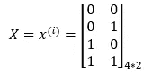

图 22:输入矩阵

## 2.第二步:

预期输出矩阵如下所示。我们预期的输出矩阵大小为 ***4*1*** ，因为我们有 ***4*** 个训练示例。

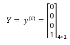

图 23:预期的输出

## 3.第三步:

我们将在要训练的参数中添加一个偏差元素。这里，我们选择 0 作为偏差的初始值。

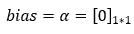

图 24:偏置元件

## 4.第四步:

在我们的参数中，我们有权重矩阵。权重矩阵将有 2 个元素。这里，2 是我们的训练数据集的特征数量。最初，我们可以为权重矩阵选择任意随机数。

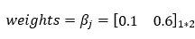

图 25:权重矩阵

## 5.第五步:

接下来，我们将使用输入矩阵、权重矩阵和偏差来预测值。

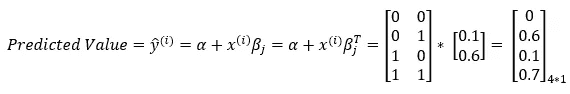

图 26:预测值

## 6.第六步:

接下来，我们使用下面的等式计算成本。

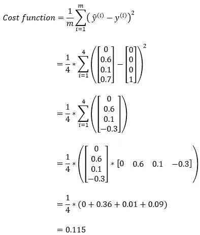

图 27:在预测中计算成本

## 7.第七步:

接下来，我们计算成本函数相对于偏差元素的偏导数。我们将在梯度下降算法中使用这个结果来更新偏差参数的值。

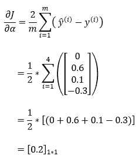

图 28:成本函数相对于偏差元素的偏导数

## 8.第 8 步:

接下来，我们计算成本函数相对于权重矩阵的偏导数。我们将在梯度下降算法中使用这个结果来更新权重矩阵的值。

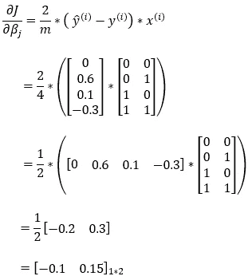

图 29:成本函数相对于权重矩阵的偏导数

## 9.第九步:

接下来，我们定义学习率的值。学习率是控制模型学习速度的参数。

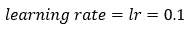

图 30:学习率

## 10.第十步:

接下来，我们使用梯度下降规则来更新 bias 元素的参数值。

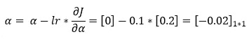

图-31:使用梯度下降算法更新偏差元素的值

## 11.第 11 步:

接下来，我们使用梯度下降规则来更新权重矩阵的参数值。

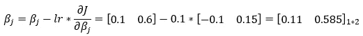

图 32:使用梯度下降算法更新权重矩阵的值

## 12.第 12 步:

现在，我们重复这个过程多次，以找到我们模型的最佳参数。在每次迭代中，我们使用参数的更新值。

## 结束注释:

这就是我们如何使用均方误差的梯度下降算法找到更新的规则。我们希望这引发了你的好奇心，让你渴望更多的机器学习知识。在以后的博客中，我们将使用我们在这里得到的规则来实现梯度下降算法，所以不要错过梯度下降系列的第三部分，这是它的大结局！

[](https://www.buymeacoffee.com/pratu)

给普拉蒂克买杯咖啡！

## 引用:

对于学术背景下的归属，请引用该工作为:

```
Shukla, et al., “Mathematical Intuition behind the Gradient Descent Algorithm”, Towards AI, 2022
```

## BibTex 引文:

```
@article{pratik_2022, 
 title={Mathematical Intuition behind the Gradient Descent Algorithm}, 
 url={[https://towardsai.net/p/l/mathematical-intuition-behind-the-gradient-descent-algorithm](https://towardsai.net/p/l/mathematical-intuition-behind-the-gradient-descent-algorithm)}, 
 journal={Towards AI}, 
 publisher={Towards AI Co.}, 
 author={Pratik, Shukla},
 editor={Lauren, Keegan},  
 year={2022}, 
 month={Oct}
}
```

## 参考资料和资源:

1.  [梯度下降—维基百科](https://en.wikipedia.org/wiki/Gradient_descent)