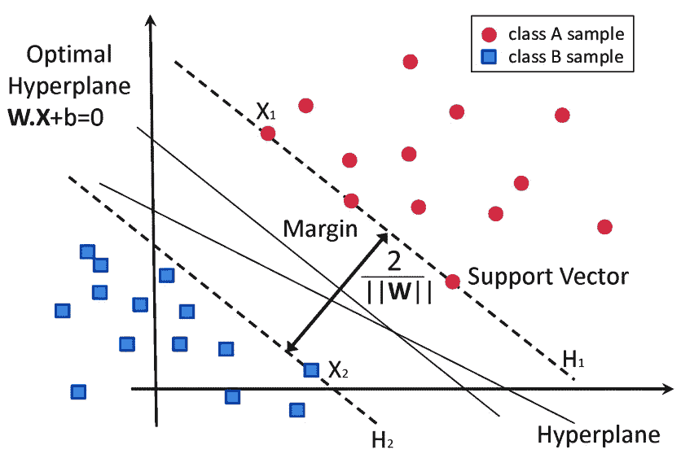
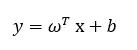
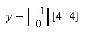
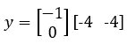
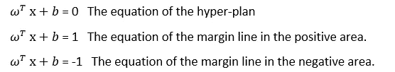
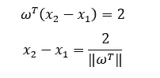
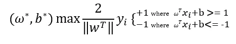
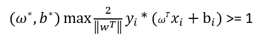
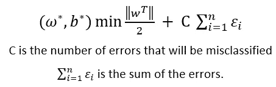

# 支持向量机背后的数学

> 原文：<https://pub.towardsai.net/mathematics-behind-support-vector-machine-208ccaa39121?source=collection_archive---------1----------------------->

## [数学](https://towardsai.net/p/category/mathematics)

[马太·亨利](https://unsplash.com/@matthewhenry?utm_source=medium&utm_medium=referral)在 [Unsplash](https://unsplash.com?utm_source=medium&utm_medium=referral) 上拍照

机器学习算法可以作为黑盒，但这是最糟糕的使用方法。理解它们是如何工作的至关重要。理解任何机器学习模型的要点是，模型如何拟合数据，模型中使用的超参数是什么，模型如何预测测试数据？在这篇博客中，我们将尝试理解“支持向量机”算法以及该算法所基于的数学原理。

**什么是支持向量机？**
支持向量机(Support Vector Machine)是一种监督分类 ML 算法，用于通过寻找数据点组之间的距离并最大化它们之间的间隙来将数据点分类为两类。

有监督的 ML 算法意味着用于训练模型的数据集已经被标记，并且模型的主要任务是对数据点进行分类，这不同于无监督算法，无监督算法基于未标记的数据集，并且利用特征之间的关系找到分类的类别。

假设我们有如下图所示的数据点。为简单起见，我们假设只有两个独立变量。
超平面是空间中的一个平面，用于分隔两个数据点类。SVM 模型的主要任务是找到最佳超计划来分类数据点。

通过支持向量机(SVM)对数据进行分类。来自研究门户(参考文献中的链接)

超计划可以由下面的等式表示。

w 是常数的向量，表示平面的斜率。在这个例子中，向量可以用两个常数[-1 和 0]来表示。现在，让我们取两个数据点，每个类一个，并找到它们到超平面的投影。假设超平面通过原点 so，b = 0。
对于第一个数据点(x1 = 4，x2 = 4)，代入超平面方程后，我们发现 y 的值为负。

y = -1 * 4 + 0* 4 = -4 →负数

对于第二个数据点(x1 = -4，x2 = -4)，y 的值将为正。

y = -1 * -4 + 0* -4 = 4 →正
我们看到任意数据点在超平面一侧的投影总是正的，在另一侧总是负的。此时，我们能够通过将数据点投影到超平面图来对其进行分类，并找到每个点的类别。

现在，我们需要找到超平面的方程和超平面两侧的边距，以便对数据点进行分类。此外，我们需要找到用于为超计划找到最佳向量的优化函数。为了找到边缘线，我们将假设边缘线通过每个类中最近的点。因此，边缘线(或平面图)的方程式如下。

为了找出两条边缘线之间的距离，我们减去两个数据点，因此，我们得到下面的等式。

根据上面所示的等式，我们需要最大化该函数，以便找到最佳的边缘计划，保证没有数据点被错误分类(这意味着最小数量的数据点应该位于边缘区域，并且没有数据点位于其他类中)。
模型应该找到使下面的函数最大化的 w 和 b 的值。

它可以用一种更简单的方式表达如下。

它可以表示为下面的最小化函数。

注意，误差求和项已经被添加到优化函数中，以克服过拟合问题。

在现实生活的数据集中，数据点不能使用简单的超计划进行分类，而是使用更复杂的分类器。使用核技巧和软间隔技术来确定分类器的方程和阈值。

在这篇博客中，我们讨论了 SVM 的简单概念及其背后的数学。在接下来的博客中，我们将深入探讨更高级的技术，比如多项式内核和内核技巧。

感谢您的阅读！
如有任何反馈或问题，请通过我的链接个人资料联系我。

[https://www.linkedin.com/in/bassemessam/](https://www.linkedin.com/in/bassemessam/)

**参考文献:**

[https://www . researchgate . net/figure/Classification-of-data-by-support-vector-machine-SVM _ fig 8 _ 304611323](https://www.researchgate.net/figure/Classification-of-data-by-support-vector-machine-SVM_fig8_304611323)

https://www.youtube.com/watch?v=H9yACitf-KM&list = plzotaelrmxvpbtrwtjkn 3 wwqxzkmtxgwe&index = 83

[https://www.youtube.com/watch?v=efR1C6CvhmE](https://www.youtube.com/watch?v=efR1C6CvhmE)