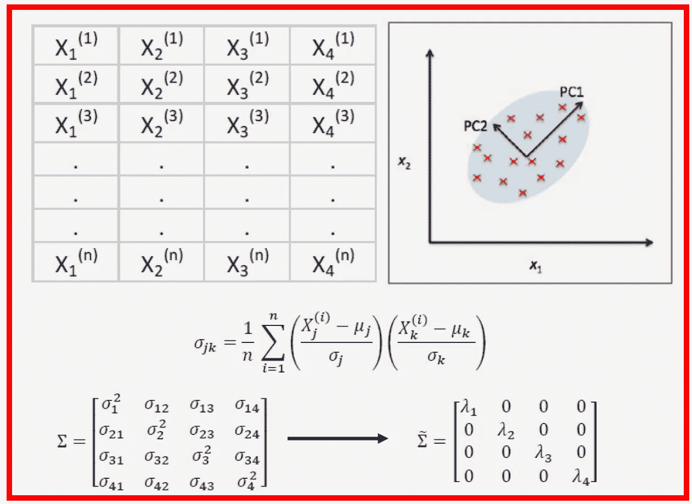
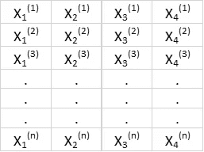
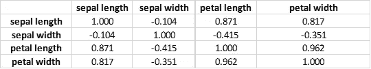
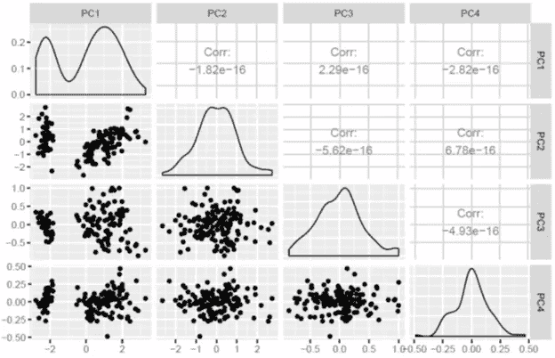
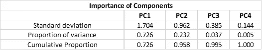

# 用 R 代码实现的主成分分析数学

> 原文：<https://pub.towardsai.net/mathematics-of-principal-component-analysis-with-r-code-implementation-595a340908fa?source=collection_archive---------0----------------------->

Benjamin O. Tayo 的图片

## 数据科学

## R 码实现的主成分分析的理论基础

# 一.导言

在机器学习中，包含特征(预测器)和离散类别标签的数据集(用于逻辑回归等分类问题)；或特征和连续结果(对于线性回归问题),用于构建预测模型，该模型可以对看不见的数据进行预测。模型的预测能力在很大程度上取决于训练数据集的质量和大小。

通常，数据集越大越好，但是，在数据集的大小和训练所需的计算时间之间存在权衡。事实证明，在非常大的数据集中，特征中可能存在大量冗余，或者数据集中可能存在大量不重要的特征，因此降维技术可以用于仅选择训练所需的有限数量的相关特征。

**主成分分析(PCA)** 是一种用于特征提取的统计方法。PCA 用于高维和高度相关的数据。PCA 的基本思想是将原始的特征空间转换到主成分空间，如下图**图 1** 所示:

**图 1** : PCA 算法从旧的特征空间转换到新的特征空间，去除特征相关性。Benjamin O. Tayo 的图片

PCA 变换实现了以下目标:

**a)** 通过只关注占数据集中方差大部分的成分，减少最终模型中使用的特征数量。

**b)** 去除特征之间的相关性。

# 二。主成分分析的数学基础

假设我们有一个与 *4* 特征和 *n* 观察高度相关的特征矩阵，如下面的**表 1** 所示:

**表 1** 。具有 4 个变量和 n 个观察值的特征矩阵。

为了可视化特征之间的相关性，我们可以生成一个散点图，如图**图 1** 所示。为了量化特征之间的相关程度，我们可以使用以下等式计算协方差矩阵:

在矩阵形式中，协方差矩阵可以表示为 4×4 对称矩阵:

可以通过执行酉变换(PCA 变换)来对角化该矩阵，以获得以下结果:

由于矩阵的迹在酉变换下保持不变，我们观察到对角矩阵的特征值之和等于包含在特征 X1、X2、X3 和 X4 中的总方差。因此，我们可以定义以下数量:

请注意，当 p = 4 时，累积方差如预期的那样等于 1。

# 三。r .认证后活动的实施

为了说明 PCA 是如何工作的，我们通过检查虹膜数据集来展示一个例子。R 代码可以从这里下载:[*https://github . com/bot 13956/principal _ component _ analysis _ iris _ dataset/blob/master/PCA _ iris dataset。r*](https://github.com/bot13956/principal_component_analysis_iris_dataset/blob/master/PCA_irisdataset.R)

让我们看看协方差矩阵:

**表二**。虹膜数据集的相关矩阵。

**表 2** 显示了虹膜数据集中原始特征之间的强相关性。**图 2** 是一个成对图，显示了原始特征之间的散点图、密度图和相关系数。注意原始特征之间的强相关性。

**图二**。原始特征空间中虹膜数据集的配对图。

现在让我们检查变换后的协方差矩阵:

**表 3** 。PCA 空间中的协方差矩阵。

**表 3** 显示了变换特征之间的零相关性。**图 4** 显示了 PCA 空间中的配对图。我们看到特征之间的相关性已经被去除。

**图 3** 。PCA 空间中虹膜数据集的配对图。

**表 4** 总结了 PCA 计算得出的有用指标:

**表 4** 。PCA 计算的有用指标汇总。

基于这一总结，我们看到 99.5%的方差是由前三个主成分贡献的(p = 3)。这意味着在最终模型中，第四主成分 PC4 可以被丢弃，因为它对方差的贡献可以忽略不计。

# 四。总结和结论

总之，我们解释了 PCA 的数学基础，并展示了如何使用 iris 数据集在 R 中实现 PCA 算法。用于执行计算的 R 代码可以从这里下载:[*https://github . com/bot 13956/principal _ component _ analysis _ iris _ dataset/blob/master/PCA _ iris dataset。r*](https://github.com/bot13956/principal_component_analysis_iris_dataset/blob/master/PCA_irisdataset.R)

# 其他数据科学/机器学习资源

[数据科学最低要求:开始从事数据科学时你需要知道的 10 项基本技能](https://towardsdatascience.com/data-science-minimum-10-essential-skills-you-need-to-know-to-start-doing-data-science-e5a5a9be5991)

[数据科学课程](https://medium.com/towards-artificial-intelligence/data-science-curriculum-bf3bb6805576)

[机器学习的基本数学技能](https://medium.com/towards-artificial-intelligence/4-math-skills-for-machine-learning-12bfbc959c92)

[3 个最佳数据科学 MOOC 专业](https://medium.com/towards-artificial-intelligence/3-best-data-science-mooc-specializations-d58da382f628)

[进入数据科学的 5 个最佳学位](https://towardsdatascience.com/5-best-degrees-for-getting-into-data-science-c3eb067883b1)

[2020 年开始数据科学之旅的 5 个理由](https://towardsdatascience.com/5-reasons-why-you-should-begin-your-data-science-journey-in-2020-2b4a0a5e4239)

[数据科学的理论基础——我应该关心还是仅仅关注实践技能？](https://towardsdatascience.com/theoretical-foundations-of-data-science-should-i-care-or-simply-focus-on-hands-on-skills-c53fb0caba66)

[机器学习项目规划](https://towardsdatascience.com/machine-learning-project-planning-71bdb3a44349)

[如何组织您的数据科学项目](https://towardsdatascience.com/how-to-organize-your-data-science-project-dd6599cf000a)

[大型数据科学项目的生产力工具](https://medium.com/towards-artificial-intelligence/productivity-tools-for-large-scale-data-science-projects-64810dfbb971)

[数据科学作品集比简历更有价值](https://towardsdatascience.com/a-data-science-portfolio-is-more-valuable-than-a-resume-2d031d6ce518)

[数据科学 101 —包含 R 和 Python 代码的中型平台短期课程](https://medium.com/towards-artificial-intelligence/data-science-101-a-short-course-on-medium-platform-with-r-and-python-code-included-3cdc9d489c6d)

如有问题和疑问，请发邮件给我:benjaminobi@gmail.com