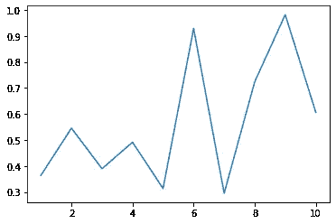
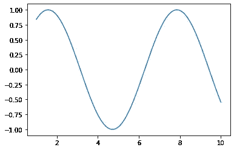
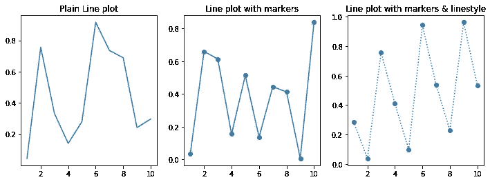
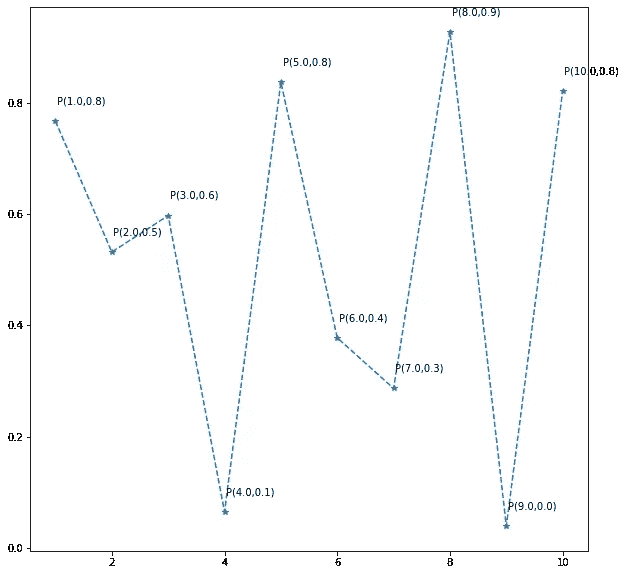
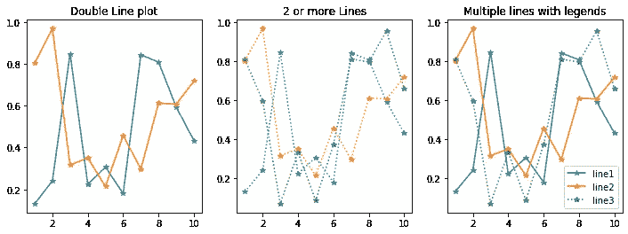

# Matplotlib 详细解释的线图| Python

> 原文：<https://pub.towardsai.net/matplotlib-complete-beginners-guide-to-line-plots-a436e18d69e4?source=collection_archive---------0----------------------->

## Matplotlib 在 30 天内变得简单


安妮·尼加德在 [Unsplash](https://unsplash.com/s/photos/lines-plot?utm_source=unsplash&utm_medium=referral&utm_content=creditCopyText) 上拍摄的照片

# 快速回顾:

1.  [基础知识介绍](https://medium.com/towards-artificial-intelligence/day-1-of-matplotlib-e942923a10ae)
2.  [如何在一个窗口中显示多个支线剧情](https://medium.com/towards-artificial-intelligence/day-2-of-matplotlib-how-to-fit-multiple-subplots-in-the-same-window-c964f49ee503)
3.  [如何处理图&轴](https://medium.com/towards-artificial-intelligence/day-3-of-matplotlib-figure-axes-explained-in-detail-d6e98f7cd4e7)
4.  [散点图完整指南](https://medium.com/towards-artificial-intelligence/matplotlib-complete-beginners-guide-to-scatter-plots-f5b7040cb6ec)

# 今天的话题:

这是最常用的一种**“线图”**，广泛应用于各种行业，如金融(股票预测)、生物(衰退预测)、体育(团队比较)等等。

*   用于线图的命令
*   多线图
*   向每个点添加注释
*   自定义标记、线条样式和图例

我们使用以下命令

```
import matplotlib.pyplot as pltplt.plot(x,y)
```

让我们画一个简单的线图

```
import numpy as npx = np.arange(1,11)
y = np.random.random(10)plt.plot(x,y)
plt.show()
```



基本线图

再来一个:

```
x = np.linspace(1,10,1000)
y = np.sin(x)plt.plot(x,y)
plt.show()
```



使用标记、线型、注释和图例自定义线图



```
fig, (ax1, ax2, ax3) = plt.subplots(1,3, figsize = (12,4))x = np.arange(1,11)
y1 = np.random.random(10)
y2 = np.random.random(10)
y3 = np.random.random(10)ax1.plot(x, y1)
ax1.set_title('Plain Line plot')ax2.plot(x, y2, marker = 'o')
ax2.set_title('Line plot with markers')ax3.plot(x, y3, marker = 'o', linestyle = ':')
ax3.set_title('Line plot with markers & linestyle')plt.show()
```

让我们试着用它的(x，y)坐标来注释每个点，这可能很棘手，因为我们需要指定注释应该出现的坐标:



使用简单的 For 循环生成注释

```
plt.figure(figsize = (10,10))x = np.arange(1,11)
y = np.random.random(10)
y = np.random.random(10)plt.plot(x,y, marker = '*', linestyle = '--')for i in range(len(x)):
    xi = "{:.1f}".format(x[i])
    yi = "{:.1f}".format(y[i])
    s = str("P(" + str(xi) + ',' + str(yi) + ')' )
    plt.text(x[i] + 0.03, y[i] + 0.03, s)
```

多线情节和图例的添加:

当有两行或更多行时，最好使用图例来指定每一行。



```
fig, (ax1, ax2, ax3) = plt.subplots(1,3, figsize = (12,4))x = np.arange(1,11)
y1 = np.random.random(10)
y2 = np.random.random(10)
y3 = np.random.random(10)ax1.plot(x, y1, marker = '*')
ax1.plot(x, y2, marker = '*')
ax1.set_title('Double Line plot')ax2.plot(x, y1, marker = '*', linestyle = ':')
ax2.plot(x, y2, marker = '*', linestyle = ':')
ax2.plot(x, y3, marker = '*', linestyle = ':')
ax2.set_title('2 or more Lines')ax3.plot(x, y1, marker = '*', label = 'line1')
ax3.plot(x, y2, marker = '*' , label = 'line2')
ax3.plot(x, y3, marker = '*', linestyle = ':', label = 'line3')
ax3.set_title('Multiple lines with legends')
plt.legend()plt.show()
```

希望这是有帮助的！

明天另一个故事见:)

来源:

[http://python-graph-gallery.com/line-chart/](http://python-graph-gallery.com/line-chart/)