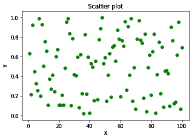
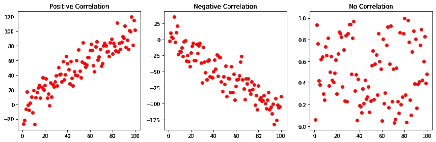
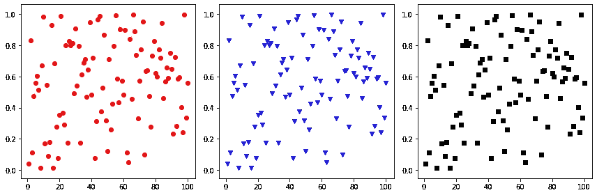
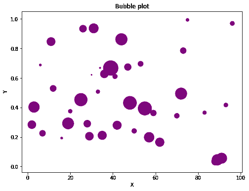

# Matplotlib 散点图详细说明| Python

> 原文：<https://pub.towardsai.net/matplotlib-complete-beginners-guide-to-scatter-plots-f5b7040cb6ec?source=collection_archive---------0----------------------->

## Matplotlib 在 30 天内变得简单


Erol Ahmed 在 [Unsplash](https://unsplash.com/s/photos/scatter?utm_source=unsplash&utm_medium=referral&utm_content=creditCopyText) 上拍摄的照片

**快速回顾一下我们到目前为止所学的内容:**

1.  如果你错过了以前的商店，在这里查看它们
2.  如何搭配[支线剧情](https://medium.com/@davidgladson5/day-2-of-matplotlib-how-to-fit-multiple-subplots-in-the-same-window-c964f49ee503)
3.  使用[图&轴](https://medium.com/@davidgladson5/day-3-of-matplotlib-figure-axes-explained-in-detail-d6e98f7cd4e7)

**今天我们将完全专注于单个主题“散点图”:**

*   如何画散点图？
*   为什么我们需要散点图？
*   散点图有哪些种类？
*   我们能给散点图添加第三个维度吗？

# 要绘制散点图，我们使用以下命令:

```
plt.scatter(x, y)
```

或者

```
plt.plot(x, y, linestyle = 'none')
```

两者产生相同的输出:

```
#importing the libraries
import numpy as np
import matplotlib.pyplot as plt#assign x, y values
x = np.arange(1,101)
y = np.random.random(100)#plot
plt.scatter(x,y, marker = 'o', color = 'g')
plt.title('Scatter plot')
plt.xlabel('X')
plt.ylabel('Y')
plt.show()
```



# 但是，我们为什么需要散点图呢？

> 散点图帮助我们确定 X-Y 变量之间的关系。它们有三种:

1.  正相关
2.  负相关
3.  不相关

这些可以通过下图来解释:



解释 3 种散点图的图形

1.  正相关:随着 x 值的增加，y 值也增加。
2.  负相关:随着 x 值的增加，y 值减少。
3.  无相关性:随着 x 值的增加，y 值变得随机。

上述地块的代码:

```
fig, (ax1, ax2, ax3) = plt.subplots(1,3, figsize = (12,4))x = np.arange(1,101)
y1 = [np.random.randn(100)*15 + x]
y2 = [np.random.randn(100)*15 - x]
y3 = np.random.random(100)ax1.scatter(x,y1, marker = 'o', color = 'r')
ax1.set_title('Positive Correlation')ax2.scatter(x,y2, marker = 'o', color = 'r')
ax2.set_title('Negative Correlation')ax3.scatter(x,y3, marker = 'o', color = 'r')
ax3.set_title('No Correlation')plt.tight_layout()
plt.show()
```

**玩马克笔&颜色:**

Matplotlib 允许我们选择标记的类型和颜色，如下所示。

```
['.','o','v','^','>','<','s','p','*','h','H','D','d','1','','']
```



使用各种标记和颜色

```
fig, (ax1, ax2, ax3) = plt.subplots(1,3, figsize = (12,4))x = np.arange(1,101)
y = np.random.random(100)markers_list = ['.','o','v','^','>','<','s','p','*','h','H','D','d','1','','']ax1.scatter(x,y, marker = 'o', color = 'r')
ax2.scatter(x,y, marker = 'v', color = 'b')
ax3.scatter(x,y, marker = 's', color = 'black')plt.tight_layout()
plt.show()
```

# 添加第三维

3D 版散点图只不过是一个“气泡图”。其中每个标记的大小是随 X & Y 变化的变量。



```
x = np.arange(1,101)
y = np.random.random(100)
z = np.random.randn(100)plt.figure(figsize = (8,6))
plt.scatter(x,y, s = z*400, marker = ‘o’, color = ‘purple’)
plt.title(‘Bubble plot’)
plt.xlabel(‘X’)
plt.ylabel(‘Y’)
plt.show()
```

今天就到这里，明天见另一个故事:)

*来源:*

[](http://python-graph-gallery.com/scatter-plot/) [## 散点图

### 散点图显示 2 个维度上的 2 组数据的值。每个点代表一个观察。在…上的位置

python-graph-gallery.com](http://python-graph-gallery.com/scatter-plot/) [](http://python-graph-gallery.com/bubble-plot/) [## 气泡图

### 气泡图是一个散点图，其中添加了第三维:一个附加变量的值表示…

python-graph-gallery.com](http://python-graph-gallery.com/bubble-plot/)