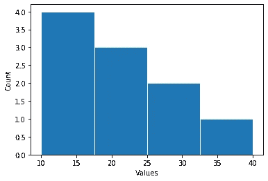
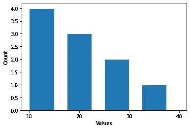
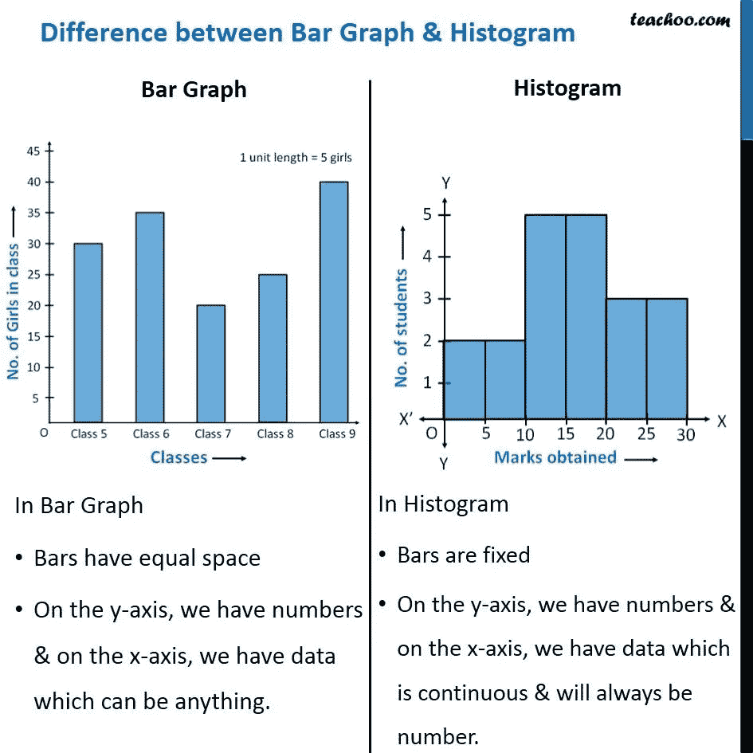
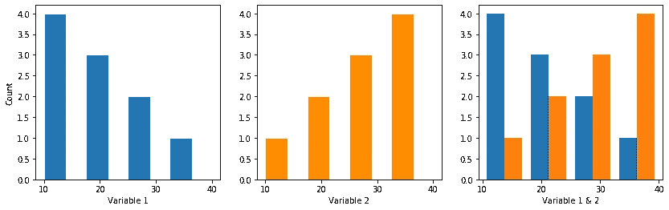
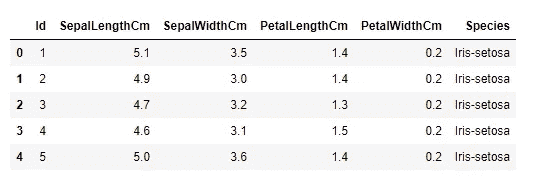
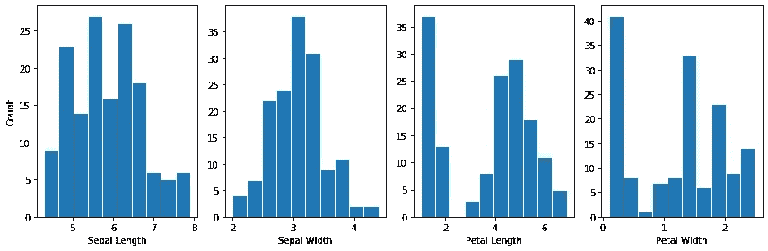
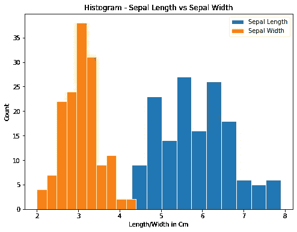
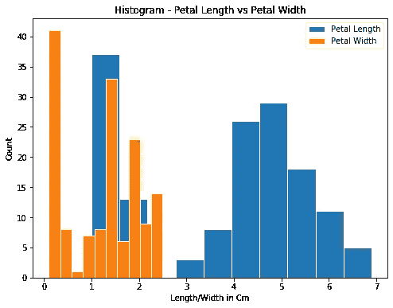

# Matplotlib 直方图从头开始解释| Python

> 原文：<https://pub.towardsai.net/matplotlib-histograms-explained-from-scratch-python-6fe3e9d26de3?source=collection_archive---------0----------------------->

## Matplotlib 在 30 天内变得简单


[马太·亨利](https://unsplash.com/@matthewhenry?utm_source=unsplash&utm_medium=referral&utm_content=creditCopyText)在 [Unsplash](https://unsplash.com/s/photos/buildings?utm_source=unsplash&utm_medium=referral&utm_content=creditCopyText) 上拍照

# 快速回顾:

1.  [线条图](https://medium.com/towards-artificial-intelligence/matplotlib-complete-beginners-guide-to-line-plots-a436e18d69e4)
2.  [散点图](https://medium.com/towards-artificial-intelligence/matplotlib-complete-beginners-guide-to-scatter-plots-f5b7040cb6ec)
3.  [图&轴](https://medium.com/towards-artificial-intelligence/day-3-of-matplotlib-figure-axes-explained-in-detail-d6e98f7cd4e7)
4.  [支线剧情](https://medium.com/towards-artificial-intelligence/day-2-of-matplotlib-how-to-fit-multiple-subplots-in-the-same-window-c964f49ee503)
5.  [Matplotlib 简介](https://medium.com/towards-artificial-intelligence/day-1-of-matplotlib-e942923a10ae)

> 你知道直方图的灵感来自曼哈顿的摩天大楼吗？


图片来源:[http://visualoop.com/blog/93852/interactive-inspiration-160](http://visualoop.com/blog/93852/interactive-inspiration-160)

# 今天的话题:

直方图！

在本文中，我们将讨论以下主题:

*   直方图的定义
*   创建直方图的基本命令
*   条形图和直方图的区别
*   多个直方图的组合
*   对样本数据集应用直方图

## 定义:

直方图是单个变量的 1D 的直观表示。例如，考虑一个数字列表[10，10，10，20，20，30，30，40]

这里我们有 4-10，3-20，2-30，1-40。这只不过是一个频率或数量的计数。让我们试着用直方图来形象化:

## 基本命令:

> plt.hist()

```
import matplotlib.pyplot as plt
import pandas as pd
import numpy as np
import randomx = [10,10,10,10,20,20,20,30,30,40]plt.hist(x,4 ,edgecolor = 'white')
plt.show()
```



基本直方图

哇！那真的很神奇，不是吗？但是这里面有缺陷

1.  x 标签与我们的列表值不同
2.  条形的宽度太宽

让我们纠正这些:

```
plt.hist(x,4, width = 5, edgecolor = 'white')
plt.xticks([10,20,30,40])
plt.show()
```



基本直方图(更新)

## 条形图和直方图的区别:

嗯，对于我们大多数人来说，这仍然是一个困惑 b/w 条形图&直方图。这里有一个主要区别:直方图是单个变量的 1D 表示，而条形图是两个独立变量的 2D 表示。



资料来源:teachoo.com

## 多个直方图的组合:

Matplotlib 允许我们将两个不同的直方图(但是具有相同范围的 x 值)合并成一个图。



```
x = [10,10,10,10,20,20,20,30,30,40]
y = [40,40,40,40,30,30,30,20,20,10]fig, (ax1, ax2, ax3) = plt.subplots(1,3, figsize = (14,4))ax1.hist(x, bins = 4, width = 4, edgecolor = 'white', align = 'mid')
ax1.set_xticks([10,20,30,40])
ax1.set_xlabel('Variable 1')ax2.hist(y, bins = 4, width = 4, edgecolor = 'white', color = 'darkorange')
ax2.set_xticks([10,20,30,40])
ax2.set_xlabel('Variable 2')ax3.hist([x,y], bins = 4)
ax3.set_xticks([10,20,30,40])
ax3.set_xlabel('Variable 1 & 2')plt.show()
```

## 对样本数据集应用直方图:

我们将使用标准的虹膜数据

```
df = pd.read_csv(‘iris.csv’)
```

让我们看看前几行

```
df.head()
```



虹膜数据集概述

现在我们知道有四列，让我们试着为这四列创建直方图:

```
fig, (ax1, ax2, ax3, ax4) = plt.subplots(1,4, figsize = (12,4))ax1.hist(df['SepalLengthCm'], edgecolor = 'white', align = 'mid')
ax1.set_xlabel('Sepal Length')
ax1.set_ylabel('Count')ax2.hist(df['SepalWidthCm'], edgecolor = 'white', align = 'mid')
ax2.set_xlabel('Sepal Width')ax3.hist(df['PetalLengthCm'], edgecolor = 'white', align = 'mid')
ax3.set_xlabel('Petal Length')ax4.hist(df['PetalWidthCm'], edgecolor = 'white', align = 'mid')
ax4.set_xlabel('Petal Width')plt.tight_layout()
plt.show()
```



从上面的图中，我们看到第二个图的分布接近正态分布&其余的是偏斜的。

现在，我们将把萼片图和花瓣图结合在一起:

```
plt.figure(figsize = (8,6))
plt.hist(df['SepalLengthCm'], edgecolor = 'white', label = 'Sepal Length')
plt.hist(df['SepalWidthCm'], edgecolor = 'white', label = 'Sepal Width')
plt.legend()
plt.title('Histogram - Sepal Length vs Sepal Width')
plt.xlabel('Length/Width in Cm')
plt.ylabel('Count')
plt.show()
```



```
plt.figure(figsize = (8,6))
plt.hist(df['PetalLengthCm'], edgecolor = 'white', label = 'Petal Length')
plt.hist(df['PetalWidthCm'], edgecolor = 'white', label = 'Petal Width')
plt.legend()
plt.title('Histogram - Petal Length vs Petal Width')
plt.xlabel('Length/Width in Cm')
plt.ylabel('Count')
plt.show()
```



希望这能帮助你入门！明天另一个故事见:)