# Plotly Express:通过交互式可视化解释数据

> 原文：<https://pub.towardsai.net/matplotlib-is-dead-long-life-to-plotly-express-e1671dce0d18?source=collection_archive---------0----------------------->

## 数据可视化，意见


作者图片

这是使用其他工具来可视化数据的最佳时机。你知道 **Matplotlib** 吗？你做梦去吧。也许它可以很容易应用并且不占用太多内存，但是很难从静态图中观察到特征随时间的变化。

不经意间，当我开始为我的数据科学实习工作时，我开始使用一个神话般的 Python 库。我做梦也没想到这样的事情会发生。它叫做**剧情快车**。你终于可以和图表互动了。令人惊讶的是，它可以看到每个细节，每个点，你甚至可以缩放你想要检查的间隔。

在本文中，我将向您展示使用这个神奇的库的基本知识。是的，不可思议，也许我夸大了，但是我认为你可以理解这些五彩缤纷的动态的情节。它非常容易使用，有直观的功能，没有很长的代码。让我们开始这段旅程，就像爱丽丝梦游仙境一样！

# Plotly Express

Plotly 是一家使用 Python、R 和 JavaScript 构建交互式高质量数据可视化工具的公司。它于 2012 年在加拿大蒙特利尔成立。它提供了种类繁多的产品，尤其是 Dash，一个用于构建基于 web 的分析应用程序的框架。2019 年，他们发布了新的高级 Python 可视化库: [Plotly Express](https://plotly.com/python/plotly-express/) 。通常作为 px 导入的 **plotly.express** 模块包含使用**图形对象**构建图形的函数。该图的构建模块包含在 **plotly.graph_objects** 模块中，由形成布局的轨迹(散点图、直方图等)和轨迹类型的属性组成。plotly.express 的功能使用起来很直观，并且可以很好地处理 Pandas DataFrame 对象。

# 概观

在本教程中，我们将使用相同的数据集来显示图表。我想你在哪里听过，因为它很有名。它叫做**虹膜**。该名称背后的原因是由于它包含三种鸢尾属物种，并由这三种物种各自的 50 个样本组成。从每个样本中收集了四个特征:萼片和花瓣的长度和宽度。

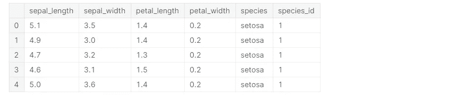

一旦我们导入了库和数据集，我们就可以开始尝试显示绘图的基本功能。下面是一个**散点图**的例子，显示了萼片的宽度和长度之间的关系。使用 Plotly Express 模块中的函数 scatter，我们可以轻松地构建图形，指定 DataFrame 对象的必要参数、x 轴上的变量和 y 轴上的变量。

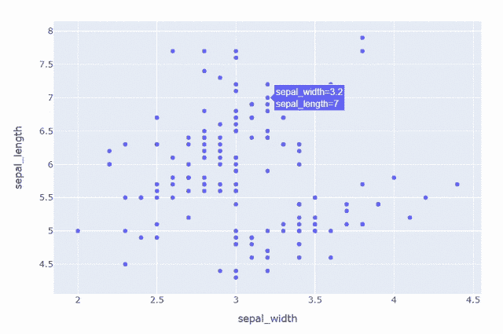

可以建立更精细的散点图，包括物种和花瓣长度作为信息。三个物种中的每一个都由不同的颜色代表，而圆点的大小与花瓣的长度成正比。结果是这张漂亮的图表:

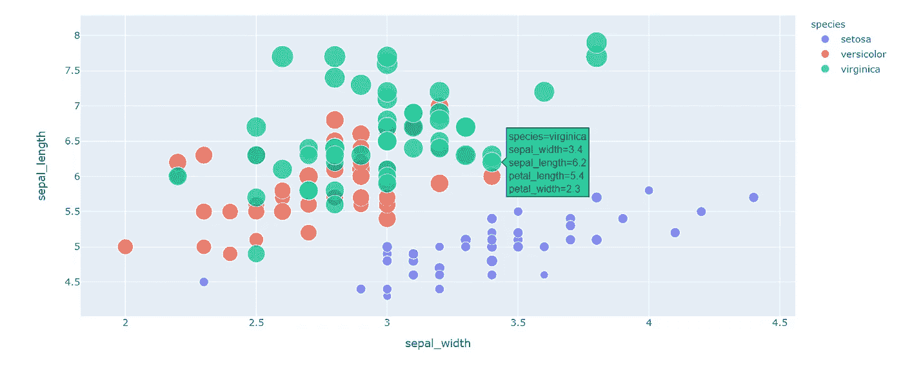

但是，如果我们想要对数据集中的所有要素有一个概述呢？简单的散点图是不够的。一个 **3D 散点图**是这个问题的解决方案。在这个三维图中，我包含了五个维度:

*   第一维:萼片在 x 轴上的长度
*   第二维:y 轴上的花瓣长度
*   第三维:z 轴上的花瓣宽度
*   第四维:不同的颜色对应不同的物种
*   第五维:圆点的大小与萼片的宽度成正比

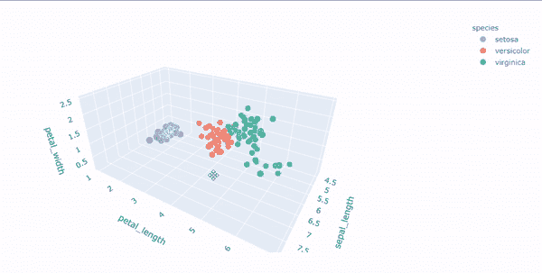

另一种很好地表示每对特征之间关系的方法是使用函数 scatter_matrix:

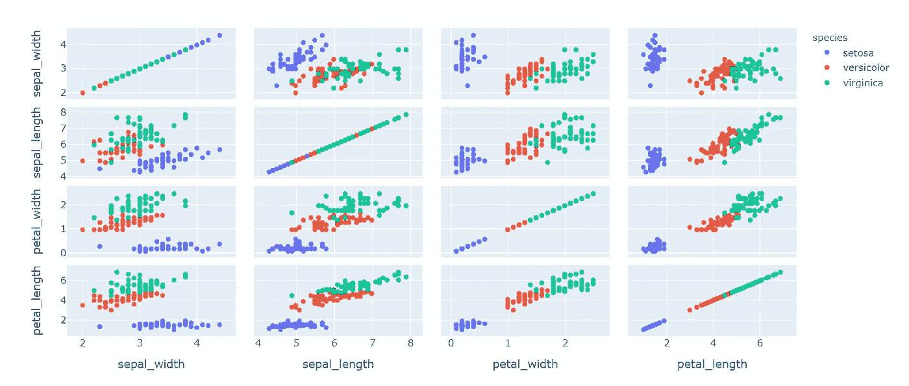

在我们看到了这些特征之间的关系之后，我们可能会有兴趣看看这些特征的分布。了解特定特性的值的分布的一个简单方法是显示一个**箱线图**。从这个图形工具中，您可以一次观察到许多模式:方差、中位数、第一个和第三个分位数以及异常值。

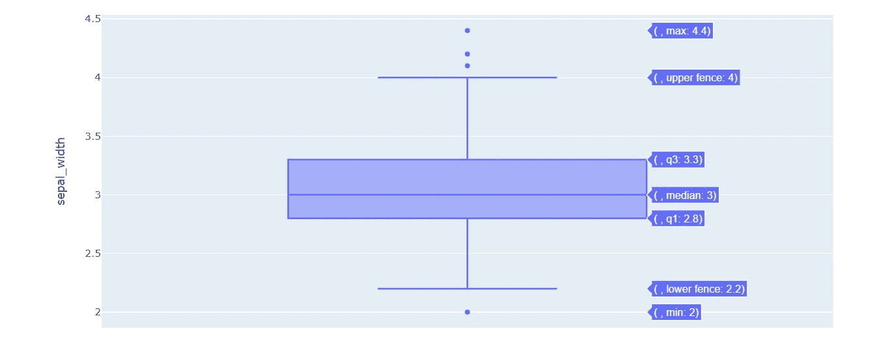

得益于 plotly.express 模块提供的交互式箱线图，可以直观显示与最小值和最大值、第一、第二和第三分位数相对应的特定值。下面我还包括了三个物种的信息，指定了 y 变量:


为了获得关于数据分布的更完整的信息，我们还需要**直方图**。它表示特定数值变量的每个值的频率分布。每个容器计算该特定值出现的次数。有很多可能的聚合函数，比如 sum 和 average，而不仅仅是 count。使用函数 px.histogram()可以可视化萼片宽度特征的频率分布:

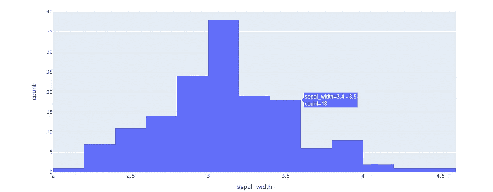

和以前一样，我想用一个特征来展示物种之间的差异。通过为不同的萼片宽度值生成几个直方图是可能的。每种颜色代表三种物种中的一种。还有一些叠加直方图并降低不透明度的函数，以便能够同时看到三个直方图，即使它们具有相同的值。

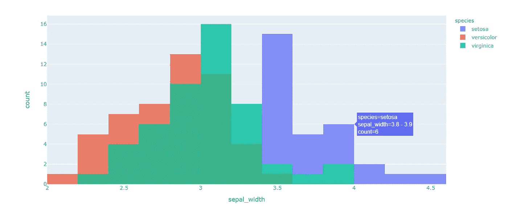

使用直方图函数，还可以构建**条形图**。我们可以计算三个物种中每一个的观察次数:

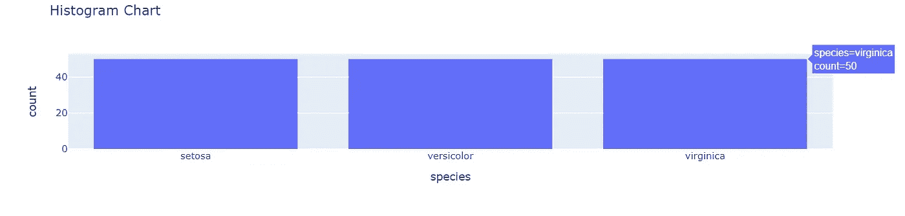

事实上，该数据集为每个物种收集了 50 个样本。Plotly Express 提供了其他工具，可以将更多的情节组合在一起。在这种情况下，我们可以将散点图与箱线图结合起来，用于包含的每个功能:

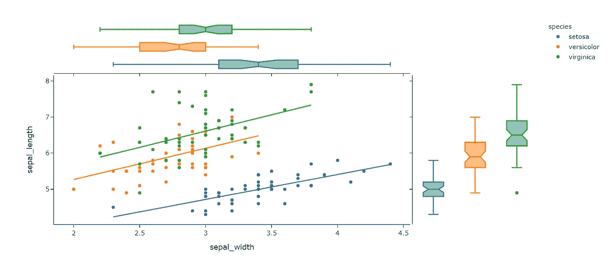

或者我们可以立刻看到散点图和直方图:

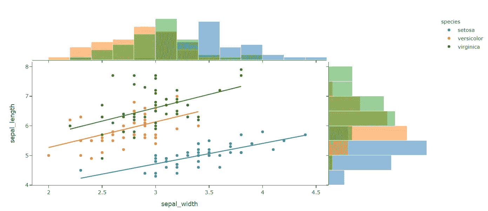

# 保存文件

有许多方法可以将数字导出到您的本地 PC 上。更直观的方法是单击图表顶部的摄像机底部:

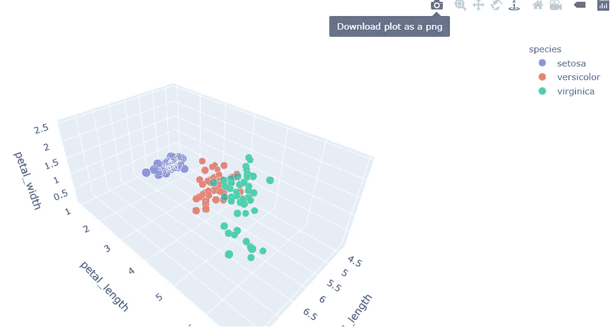

第二种可能是在已经创建了绘图之后添加 Python 代码行:

```
fig.write_image("images/fig1.png")
fig.write_html("images/fig1.html")
```

如果你想存储一个静态图形，典型的导出图形的格式有 **png** 、 **jpeg** 、 **webp** 、 **svg** 、 **pdf** 、 **eps、html** 。

# 最终想法:

在本教程中，我只展示了这个惊人的库的最著名的图形。还有许多其他多彩的情节有待发现。你最终可以在 [Plotly Express](https://plotly.com/python/plotly-express/) 的官网上寻找其他代码示例。该网站是一个赏心悦目的网站，你不会后悔决定看看这些高质量和交互式条形图，散点图，热图，直方图，支线剧情和更多。如果你在这个单调的 covid 时期感到无聊，看看剧情，你会感觉好一点。GitHub 代码可在[这里](https://github.com/eugeniaring/plotly_express/blob/main/plotlyexpress.ipynb)获得。感谢您的阅读。祝您愉快！

您有兴趣看看使用这个库的其他文章吗？下面我建议另一个美丽的视觉化应用于 PCA 的故事。

[](/machine-learning-1096c38e6a18) [## 主成分分析的变量约简

### 使用库 Plotly Express 对 MNIST 数据集进行可视化的示例

pub.towardsai.net](/machine-learning-1096c38e6a18) 

你喜欢我的文章吗？ [***成为会员***](https://eugenia-anello.medium.com/membership) ***每天无限获取数据科学新帖！这是一种间接的支持我的方式，不会给你带来任何额外的费用。如果您已经是会员，*** [***订阅***](https://eugenia-anello.medium.com/subscribe) ***每当我发布新的数据科学和 python 指南时，您都可以收到电子邮件！***