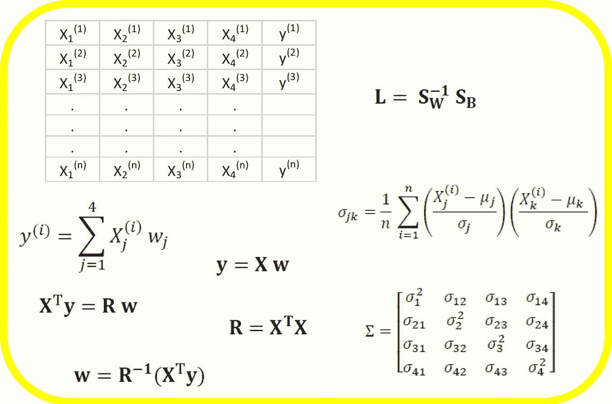
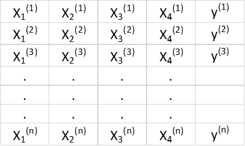
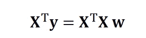
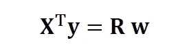
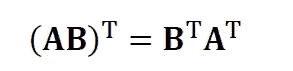
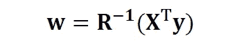
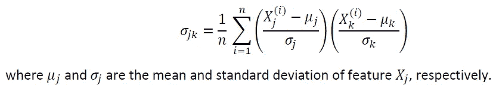

# 数据科学中的矩阵总是实的和对称的

> 原文：<https://pub.towardsai.net/matrices-in-data-science-are-always-real-and-symmetric-67dbf910213f?source=collection_archive---------2----------------------->

Benjamin O. Tayo 的图片

## [数据科学](https://towardsai.net/p/category/data-science)

## 因为数据科学处理现实世界的问题，所以数据科学中的矩阵必须是实的和对称的

# 介绍

线性代数是数学的一个分支，在数据科学和机器学习中非常有用。大多数机器学习模型都可以用矩阵形式表示。因为数据科学处理的是现实世界的问题，所以数据科学中的矩阵必须是实的和对称的。对此也有一些例外。在图像处理等高级数据科学模型中，傅立叶分析被大量使用。因此，人们很容易遇到定义在复数空间上的矩阵。除此之外，对于大多数基本的数据科学和机器学习问题，遇到的矩阵总是实的和对称的。

在本文中，我们将考虑数据科学和机器学习中经常遇到的三个实对称矩阵模型的例子，即回归矩阵(**R**)；协方差矩阵和线性判别分析矩阵( **L** )。

# 示例 1:线性回归矩阵

假设我们有一个包含 4 个预测要素和 *n* 个观测值的数据集，如下所示。

**表 1** 。具有 4 个变量和 n 个观察值的特征矩阵。第 5 列是目标变量(y)。

我们希望构建一个多元回归模型来预测 *y* 值(第 5 列)。因此，我们的模型可以表示为

在矩阵形式中，该方程可以写成

其中 **X** 是(n×4)特征矩阵， **w** 是表示待确定回归系数的(4×1)矩阵， **y** 是包含目标变量 y 的 n 个观测值的(n×1)矩阵。

注意 **X** 是一个矩形矩阵，所以我们不能通过取 **X** 的逆来解上面的方程。

为了将 **X** 转换成方阵，我们通过 **X** 的**转置**将等式的左侧和右侧相乘，即

这个等式也可以表示为

在哪里

是(4 x 4)回归矩阵。显然，我们观察到 **R** 是一个实对称矩阵。请注意，在线性代数中，两个矩阵乘积的转置遵循以下关系

既然我们已经简化了回归问题，并用(4x4)实数、对称且可逆的回归矩阵 **R** 来表示它，那么就可以直接表明回归方程的精确解是

# 示例 2:协方差矩阵

假设我们有一个高度相关的特征矩阵，其中有 *4 个*特征和 *n 个*观察值，如下面的**表 2** 所示:

**表二**。具有 4 个变量和 n 个观察值的特征矩阵

为了可视化特征之间的相关性，我们可以生成一个散点图。要量化要素之间的相关程度(多重共线性)，我们可以使用以下公式计算协方差矩阵:

在矩阵形式中，协方差矩阵可以表示为 4 x 4 实对称矩阵:

我们再次看到，协变矩阵是实的和对称的。可以通过执行酉变换(也称为主成分分析(PCA)变换)来对角化该矩阵，以获得以下内容:

由于矩阵的迹在酉变换下保持不变，我们观察到对角矩阵的特征值之和等于包含在特征 X1、X2、X3 和 X4 中的总方差。

# 例 3:线性判别分析矩阵

数据科学中实对称矩阵的另一个例子是线性判别分析(LDA)矩阵。这个矩阵可以用以下形式表示

其中 **S_W** 是特征内散布矩阵， **S_B** 是特征间散布矩阵。由于矩阵 **S_W** 和 **S_B** 都是实对称的，因此 **L** 也是实对称的。 **L** 的对角化产生了一个优化类可分性和降维的特征子空间。因此，LDA 是一种监督算法，而 PCA 不是。

有关 LDA 实施的更多详细信息，请参见以下参考资料:

[机器学习:通过线性判别分析降维](https://medium.com/towards-artificial-intelligence/machine-learning-dimensionality-reduction-via-linear-discriminant-analysis-cc96b49d2757)

[使用 Iris 数据集实施 LDA 的 GitHub 存储库](https://github.com/bot13956/linear-discriminant-analysis-iris-dataset)

[塞巴斯蒂安·拉什卡的《Python 机器学习》，第 3 版(第 5 章)](https://github.com/rasbt/python-machine-learning-book-3rd-edition)

# 摘要

总之，我们已经讨论了数据科学和机器学习中实矩阵和对称矩阵的三个例子，即回归矩阵(**R**)；协方差矩阵和线性判别分析矩阵( **L** )。因为数据科学处理的是现实世界的问题，所以数据科学中的矩阵必须是实的和对称的。

# 其他数据科学/机器学习资源

数据科学需要多少数学知识？

[数据科学课程](https://medium.com/towards-artificial-intelligence/data-science-curriculum-bf3bb6805576)

[进入数据科学的 5 个最佳学位](https://towardsdatascience.com/5-best-degrees-for-getting-into-data-science-c3eb067883b1)

[数据科学的理论基础——我应该关心还是仅仅关注实践技能？](https://towardsdatascience.com/theoretical-foundations-of-data-science-should-i-care-or-simply-focus-on-hands-on-skills-c53fb0caba66)

[机器学习项目规划](https://towardsdatascience.com/machine-learning-project-planning-71bdb3a44349)

[如何组织你的数据科学项目](https://towardsdatascience.com/how-to-organize-your-data-science-project-dd6599cf000a)

[大型数据科学项目的生产力工具](https://medium.com/towards-artificial-intelligence/productivity-tools-for-large-scale-data-science-projects-64810dfbb971)

[数据科学作品集比简历更有价值](https://towardsdatascience.com/a-data-science-portfolio-is-more-valuable-than-a-resume-2d031d6ce518)

***如有疑问，请发邮件给我***:benjaminobi@gmail.com