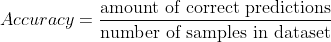
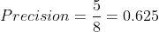
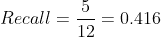
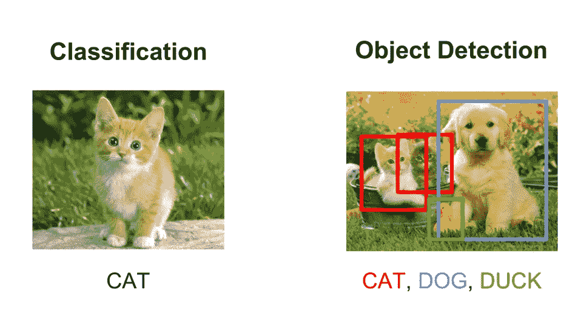
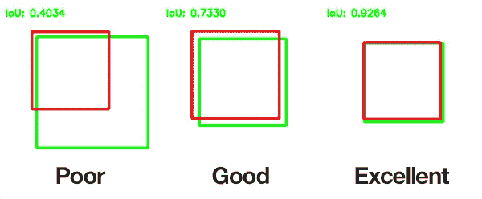
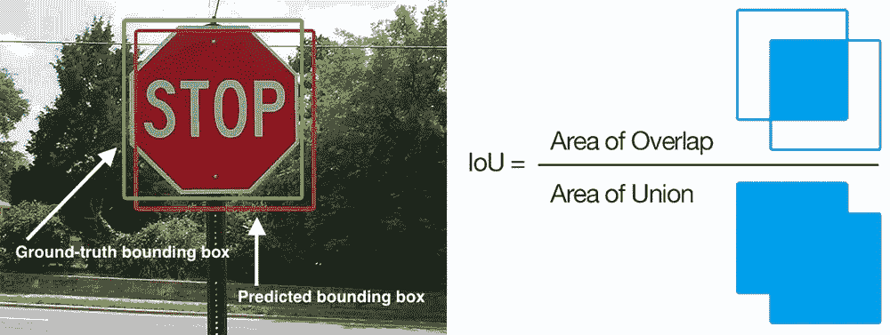

# 客户的平均精度

> 原文：<https://pub.towardsai.net/mean-average-precision-for-clients-aecb0b039ac9?source=collection_archive---------2----------------------->

## [数据科学](https://towardsai.net/p/category/data-science)

## 平均精度度量的非技术解释

**免责声明**:这个项目是为我的客户创建的，因为简单地解释这样一个复杂的指标相当具有挑战性，因此不要指望在这里看到太多的数学或方程，请记住我尽量保持简单。

# **精度**

准确性是最普通的衡量标准。想象一下我们在做一个图片里有没有狗的分类。为了测试我们的分类器，我们准备了一个测试集，包括包含狗和不包含狗的图片。然后，我们将我们的分类器应用于每张图片，并获得预测的类别。

我们可以用这个简单的公式计算精度。

准确(性)

# 精确度和召回率

有更多的方法来确定一个模型工作得如何，另外两种方法是**精确**和**回忆**。它们展示的东西有点不同，通常是成对出现的。

继续我们的狗识别器， **precision** 显示有多少预测的狗实际上是狗。

而**召回**是正确预测的狗与我们测试集中狗的数量之比。

## 例子

假设我们的测试集包含 12 张有狗的图片和 8 张没有狗的图片。我们应用我们的分类器，得到 8 张预测为“狗”的图片，其余 12 张预测为“不是狗”。在这 8 个标记为“狗”的单词中，只有 5 个实际上是“狗”，其余的都是错的。

所以我们的**精度**是

精确

而我们的**召回**是

回忆

**为什么要用精度和召回？**

这两个指标让我们对模型产生的错误有了更深入的了解，从而允许我们分析和创建更好的解决方案。由于这种深入的理解，我们坚持他们，而不是准确性指标。

# 并集上的交集

为了充分理解平均精度度量，我们需要知道什么是并集上的交集。

它在我们创建对象检测解决方案时出现，并且需要确定我们在图片中找到对象的程度。

分类为检测([来源](https://bit.ly/34STnIX))

我们不仅需要对物体进行分类，还需要对其进行定位。那些彩色的小矩形被称为边界框。

假设我们有一个物体检测模型，但是我们用什么方法来衡量它的检测能力呢？这就是交集大于并集(IoU)派上用场的时候了。

为了计算这一点，我们需要一个测试集，其中包含所谓的基本事实边界框，当然，首先必须对它们进行标记，以便在进行测试时，我们可以将真实数据与预测数据进行比较。

假设绿色框是我们的地面真实边界框(我们事先用手和眼睛标记的框)，红色框是我们的模型预测的。

并集上的交集示例([源](https://en.wikipedia.org/wiki/Jaccard_index))

这个公式现在非常简单

交集超过联合公式([来源](https://www.pyimagesearch.com/2018/05/14/a-gentle-guide-to-deep-learning-object-detection/)

澄清一下，它是基础真实边界框和预测边界框之间的重叠(或相交)面积与这两者的联合面积的比率。

# 平均精度

那么什么是**平均精度** (mAP)呢？为了计算它，我们需要为 IoU 设置一个阈值，例如 0.5。这意味着当我们在一个边界框中定位该对象的 50%时，我们说该对象被检测到。

然后我们要做的就是计算精度和召回值。有一种方法可以将这两个值合并成一个值，但是这种方法更高级一些，所以我们不打算在这里讨论。

之后，我们一小步一小步地改变 IoU 的阈值。例如，下一个阈值将是 0.55。然后再次计算精度和召回值。

并且再次改变 IoU 的阈值。现在会是 0.6。再次计算精度和召回值。通常，这些阈值从 0.5 开始，以 0.05 为步长一直到 0.9。

然后 mean average precision 是在所有阈值上平均的精度和召回的组合值。

# 它显示了什么？

它显示了模型对具有不同检测阈值的对象的分类效果。值越高，模型越好。结果差异很大，但通常情况下，一个工作良好的模型在复杂任务中的 mAP 为 0.45–0.5。

你可以在 COCO 数据集上查看一个模特地图的例子:[https://pjreddie.com/darknet/yolo/](https://pjreddie.com/darknet/yolo/)。

希望对你有帮助。

*联系我上*[*Twitter*](https://twitter.com/poddiachyi)*，*[*LinkedIn*](https://www.linkedin.com/in/poddiachyi/)*，* [*脸书*](https://www.facebook.com/poddiachyi) *，关注我上*[*GitHub*](https://github.com/Poddiachyi)*！*