# 衡量新冠肺炎疫苗的有效性

> 原文：<https://pub.towardsai.net/measure-the-effectiveness-of-covid-19-vaccinations-f635e3e2696f?source=collection_archive---------3----------------------->

## [数据分析](https://towardsai.net/p/category/data-analysis)

## 测量 Covid19 疫苗接种有效性的尝试

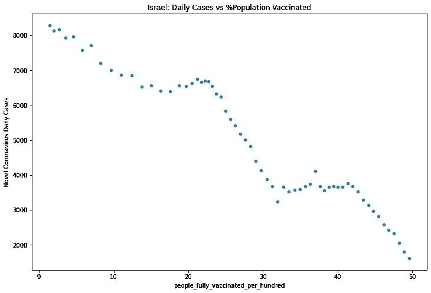

在本帖中，我们将尝试测量新冠肺炎疫苗的有效性。这个分析是非常基本的，我们不能得出安全的结论，它是基于这样的假设:随着越来越多的人接种疫苗，我们预计每天的病例和死亡人数会越来越少。一些我们需要提及的事情:

*   我们没有考虑新冠肺炎的**季节性**。我们知道，在夏季，我们预计每天的病例会减少。
*   我们不考虑政府采取的措施，如封锁等。
*   接种疫苗的人口比例是一个单调递增的序列。

我们的数据来源是[我们的数据世界](https://ourworldindata.org/covid-vaccinations)和[世界计量表](https://www.worldometers.info/coronavirus/)。对于这个例子，我们将考虑国家**以色列**以及**完全**接种疫苗并可在此[找到](https://drive.google.com/file/d/1qbaTYc8z08nZPC9LCBoh4jgLOBj5noYJ/view?usp=sharing)的人口比例。此外，我们将使用 [covid-daily](https://pypi.org/project/covid-daily/) Python 库从 Worldometers 获取数据。请注意，我们有截止到 2021 年 3 月 18 日的数据，到这个时候，以色列已经为 51.77%的 T21 人接种了疫苗。最后，请记住，完全接种疫苗的人的记录始于**2021–01–10**。

# 完全接种疫苗与新病例

```
import pandas as pd
import covid_dailyKPI = covid_daily.data(country='israel', chart = 'graph-cases-daily',  as_json=False)Vaccinated = pd.read_csv("share-people-fully-vaccinated-covid.csv")# Get Data only for Israel
Vaccinated.query("Entity=='Israel'" , inplace = True)# Start Measuring from the time the vaccines started
Vaccinated.query("people_fully_vaccinated_per_hundred>0" , inplace = True)# Conver the Day to Datetime Index
Vaccinated['Day'] = pd.DatetimeIndex(Vaccinated['Day'])# Join the data
merged = KPI.merge(Vaccinated, how='inner', left_index=True, right_on='Day')
merged.index=merged.Day
merged.index.name = 'Date'merged
```

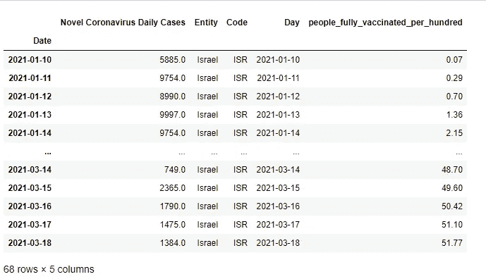

# 散点图

从下面的散点图中，我们可以看到新病例和完全接种疫苗的人之间的负相关关系。

```
merged.plot.scatter('people_fully_vaccinated_per_hundred', 'Novel Coronavirus Daily Cases',  
                    figsize=(12,8), title = "Israel: Daily Cases vs %Population Vaccinated")
```

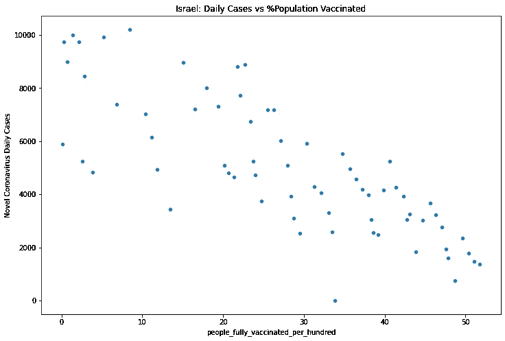

# 用 7 天的滚动窗口平滑数据

日常案例以及他们衡量这些案例的方式存在问题。因此，最好通过考虑两个变量的 7 天滚动窗口的平均值来平滑数据。

```
rolling_merged = merged[['people_fully_vaccinated_per_hundred', 'Novel Coronavirus Daily Cases']].rolling(7).mean().dropna()rolling_merged.plot.scatter('people_fully_vaccinated_per_hundred', 'Novel Coronavirus Daily Cases',  
                    figsize=(12,8), title = "Israel: Daily Cases vs %Population Vaccinated")
```


现在，我们有了一个更清晰的观点，很明显，数据是强负相关的。让我们得到原始数据和平滑数据的相关性:

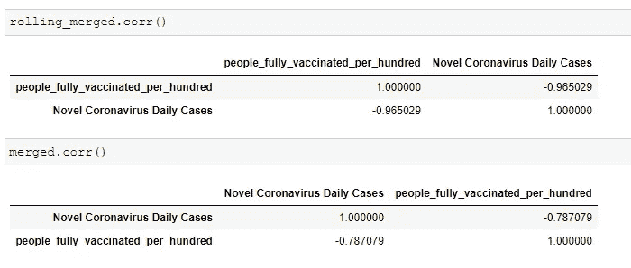

对于平滑数据，相关性为 **-0.965** ，对于原始数据，相关性为 **-0.787**

# 完全接种疫苗与死亡

让我们进行同样的分析，但是这次考虑每天的死亡人数。

```
KPI = covid_daily.data(country='israel', chart = 'graph-deaths-daily',  as_json=False)# Join the data
merged = KPI.merge(Vaccinated, how='inner', left_index=True, right_on='Day')
merged.index=merged.Day
merged.index.name = 'Date'merged.plot.scatter('people_fully_vaccinated_per_hundred', 'Novel Coronavirus Daily Deaths',  
                    figsize=(12,8), title = "Israel: Daily Deaths vs %Population Vaccinated")
```

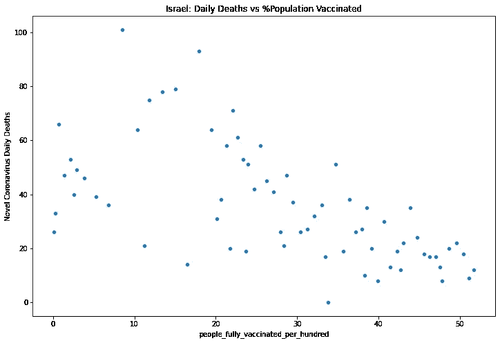

```
rolling_merged = merged[['people_fully_vaccinated_per_hundred', 'Novel Coronavirus Daily Deaths']].rolling(7).mean().dropna()rolling_merged.plot.scatter('people_fully_vaccinated_per_hundred', 'Novel Coronavirus Daily Deaths',  
                    figsize=(12,8), title = "Israel: Daily Deaths vs %Population Vaccinated")
```

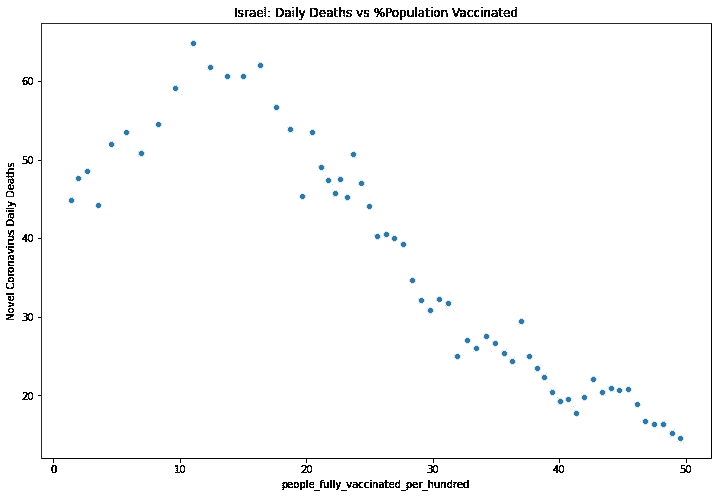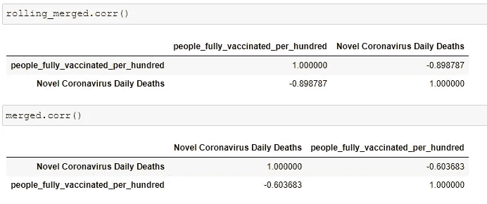

我们可以看到，当我们考虑每天的死亡人数时，相关性也是负的，其中平滑数据是 **-0.8987** ，原始数据是 **-0.603**

最后，我们可以通过考虑 30 天的滚动窗口，在平滑的一天运行滚动相关性。

```
rolling_merged['people_fully_vaccinated_per_hundred'].\ rolling(30).corr(rolling_merged['Novel Coronavirus Daily Deaths']).\ dropna().plot(figsize=(12,8), title="Rolling Correlation")
```

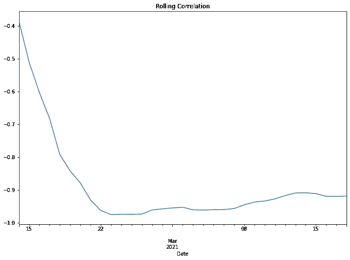

# 外卖

我们之所以考虑以色列，是因为它是迄今为止完全接种率最高的国家。我们可以根据至少注射过一次疫苗的人进行分析。在这一分析中，可以批评的是，除了接种疫苗以外，其他原因也可能导致每日病例和死亡人数减少。然而，我们不能忽视这种强烈的负相关性，特别是在二月和三月，这两个月我们观察到更多的新冠肺炎病例。保持监测这种相关性是有趣的，尤其是当 70%的人口已经接种疫苗时，这是一个与所谓的“群体免疫”相关的数字。最后，我们可以看到，在接种疫苗的第一天，无论是对新病例还是死亡病例都没有影响。

# **多余部分**

为方便起见，让我们以原始格式并考虑 7 天的滚动窗口(移动平均)来看一下每日新增病例和死亡人数。

```
covid_daily.data(country='israel', chart = 'graph-cases-daily',  as_json=False).plot(figsize=(12,8), title="New Cases")covid_daily.data(country='israel', chart = 'graph-cases-daily',  as_json=False).rolling(7).mean().plot(figsize=(12,8), title="New Cases with Moving Average of 7 days")covid_daily.data(country='israel', chart = 'graph-deaths-daily',  as_json=False).plot(figsize=(12,8), title="Deaths")covid_daily.data(country='israel', chart = 'graph-deaths-daily',  as_json=False).rolling(7).mean().plot(figsize=(12,8), title="Deaths with Moving Average of 7 days")
```

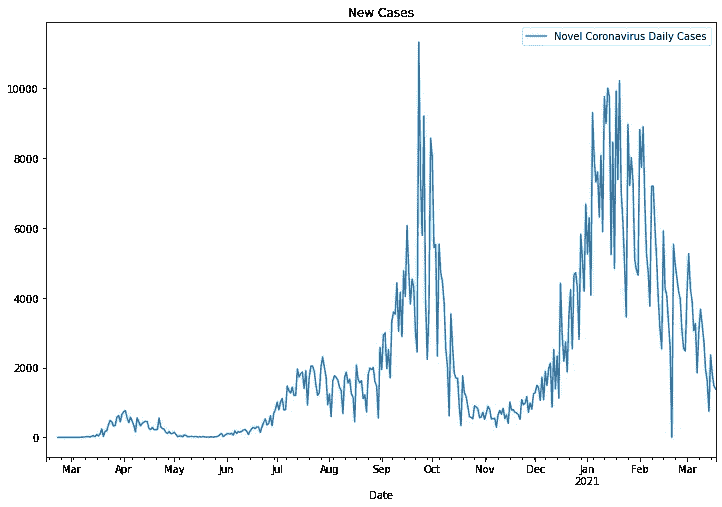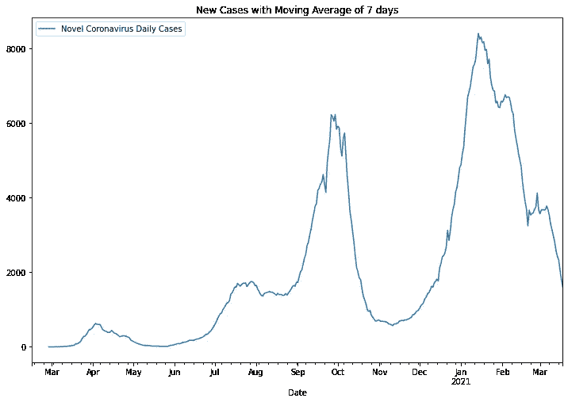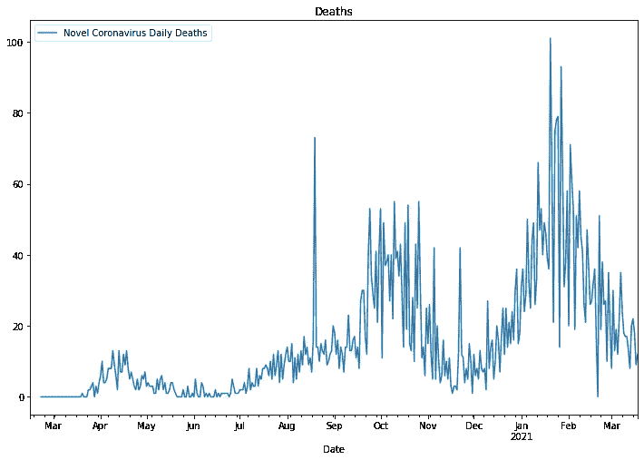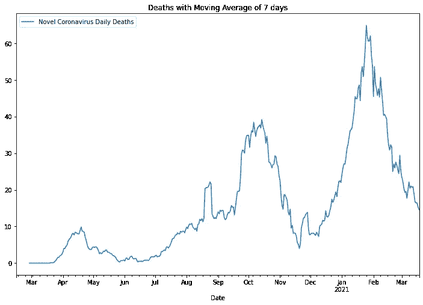

*原载于*[*https://predictivehacks.com*](https://predictivehacks.com/measure-the-effectiveness-of-covid-19-vaccinations/)*。*