# 医学图像分割:2018 数据科学碗

> 原文：<https://pub.towardsai.net/medical-image-segmentation-2018-data-science-bowl-3093bef449a5?source=collection_archive---------0----------------------->

## [深度学习](https://towardsai.net/p/category/machine-learning/deep-learning)

## 使用深度细胞神经网络(UNet，UNet++，HRNet)进行跨成像实验的细胞核分割的案例研究

[国立癌症研究所](https://unsplash.com/@nci?utm_source=medium&utm_medium=referral)在 [Unsplash](https://unsplash.com?utm_source=medium&utm_medium=referral) 上拍摄的照片

# 目录

1.  **摘要**
2.  **简介** -使用的问题陈述和数据集
    -商业问题的 ML 公式化
    -现实世界的约束
    -使用的指标
3.  **文献综述** -医学图像分割的挑战
    -滑动窗口法
    - UNet
4.  **探索性数据分析**
5.  **使用的深度学习架构** -UNet
    -unet++
    -HRNet
6.  **结果和讨论**
7.  **培训后量化**
8.  **网络应用**
9.  **总结与未来工作**
10.  **致谢**
11.  **参考文献**

# 摘要

为了找到治愈任何疾病的方法，研究人员分析样本细胞对各种治疗的反应，并了解潜在的生物过程。识别细胞核是大多数分析的起点，因为它有助于识别样本中的每个单个细胞。自动化这一过程可以节省大量时间，允许更有效的药物测试和更快地解开治愈。在这个案例研究中，我建议使用深度细胞神经网络在各种条件下自动检测图像中的细胞核。我总共设计了三个由 U-Net、U-Net++和 HRNet 衍生而来的网络，并使用平均 IoU 作为度量来比较它们的性能。可以看出，基于 U-Net 的模型表现最佳，IoU 平均得分为 0.861。

# 介绍

[图像分割](https://en.wikipedia.org/wiki/Image_segmentation)分割图像的特定区域，以便更好地理解和分析。例如，在医学领域，在脑部扫描中，医生可能希望突出显示特定区域(人眼不容易观察到)，以便更好地诊断。另一个应用是在自动驾驶汽车中，当您需要分割图像中不同类型的对象时。下面是视网膜图像中血管分割的一个例子。

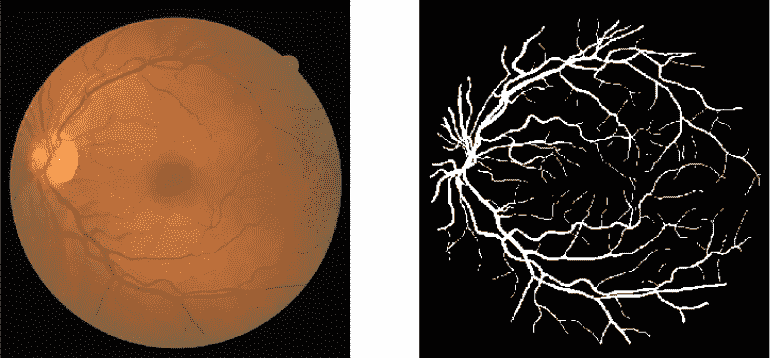

视网膜图像及其分割掩模([https://drive.grand-challenge.org/](https://drive.grand-challenge.org/)

一般来说，有两种类型的分割:语义和实例。在语义分割中，不同类别的对象被分开分割(例如，将人从背景中分离)。然而，在实例分割中，同一类别的不同实例被分割(例如，在同一图片中将不同的人彼此分开)

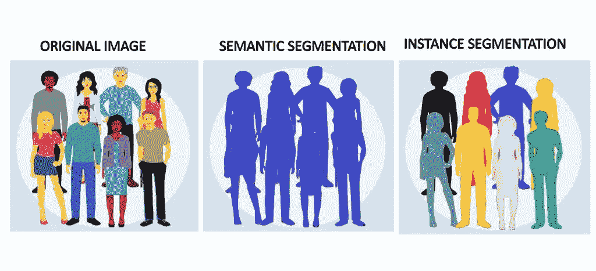

[https://learnopencv . com/human-pose-estimation-using-key point-rcnn-in-py torch/](https://learnopencv.com/human-pose-estimation-using-keypoint-rcnn-in-pytorch/)

## 使用真实世界的问题陈述和数据集

在这个案例研究中，我试图解决一个基于语义的医学分割问题。使用的数据集来自 Kaggle 竞赛 [2018 数据科学碗](https://www.kaggle.com/c/data-science-bowl-2018/)。这已被用作 U-Net++和 DoubleUNet 的基准数据集。数据集由不同背景条件下的细胞核图像组成。任务是从背景中分割细胞核。下面显示了来自数据集的图像及其分割细胞核掩模的几个例子。

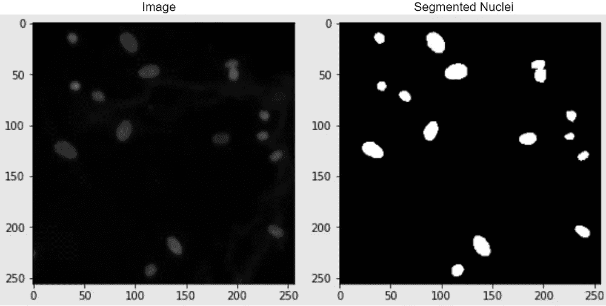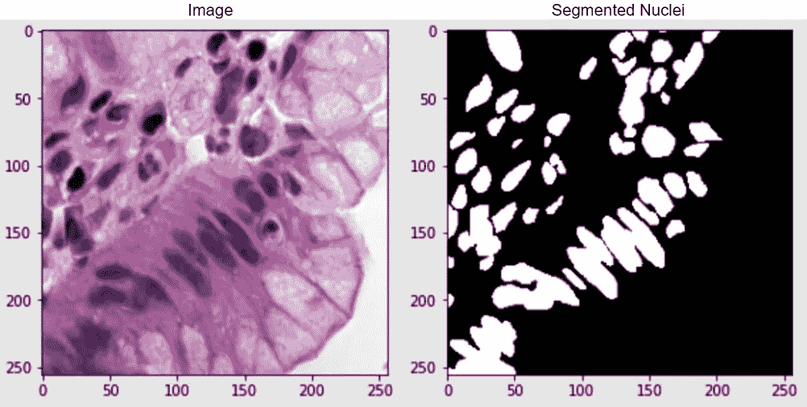

[https://www.kaggle.com/c/data-science-bowl-2018/](https://www.kaggle.com/c/data-science-bowl-2018/)

**现实世界的重要性:**我将尝试解决的任务是自动化细胞核检测。这有助于加快研究速度，治愈几乎所有疾病，从肺癌、心脏病到罕见疾病。这是因为识别细胞核是大多数分析的起点，因为人体的 30 万亿个细胞中的大多数都含有一个充满 DNA 的细胞核，DNA 是为每个细胞编程的遗传密码。识别细胞核使研究人员能够识别样本中的每个单个细胞，通过测量细胞对各种处理的反应，研究人员可以了解潜在的生物过程在起作用[2]。

## 问题的 ML 公式

一般来说，图像分割也可以作为一个多类分类问题，其中图像中的每个像素都必须被分配一个类。注意，这里的输入和输出都是图像。这里，我的输入数据点将是细胞的图像，输出数据点将是其分割的细胞核掩模。输出图像由该领域的专家标记。对于我们的问题，输出图像是二值图像，背景为黑色，细胞核为白色。

因此，现在给定输入图像(比如形状 HxWx3)，任务是产生分割的细胞核的输出二进制图像(形状 HxWx1)，即将二进制数 0 或 1 分配给输出二进制图像的每个像素。

## 现实世界的约束

在现实世界中，生物医学图像的分割被认为对于诊断目的非常重要。在许多情况下，一个小小的错误就可能导致错误的诊断，这可能会给病人的健康带来巨大的风险。然而，在我们的情况下，由于分割的细胞核将更多地用于一般治疗，因此小的误差应该不是大问题。

就等待时间而言，细胞核的分割图像不需要在毫秒内产生。在大多数情况下，几秒钟，甚至几分钟都不会造成伤害。

## 使用的度量

所用的度量是平均 IoU，即并集上的平均交集。

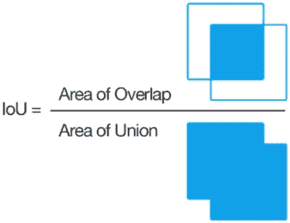

[https://en.wikipedia.org/wiki/Jaccard_index](https://en.wikipedia.org/wiki/Jaccard_index)

这是一个非常常用的指标以及骰子系数。两个对象的平均 IOU 可以定义为它们之间的交集面积除以并集面积。在图像分割中，这两个对象是待分割部分的真实区域和预测区域。

为了更好地解释这一点，假设我们要分割的对象是一个足球。这里，第一个对象是真实图像中的足球区域。第二个对象将是预测图像中的足球区域。

那么“意思是”在“意思是借据”中意味着什么呢？“Mean IoU”中的“Mean”代表所有待分割类别的平均值。因此，假设在一项任务中，我们需要从背景中分割出所有的猫。所以这个任务可以解释为一个二元分类任务，两个类分别是猫和背景。因此，平均 IoU 的计算方法是 IoU(cat) + IoU(background) / 2

类似地，对于多类分类，
意味着 IoU = (IoU(class1) + IoU(class2) …..+ IoU(classN)) / N

取所有类别的平均值有助于减少数据不平衡的影响。关于借据的详细解释可以在[这里](https://towardsdatascience.com/metrics-to-evaluate-your-semantic-segmentation-model-6bcb99639aa2)找到。

# 文献评论

## 医学图像分割面临的挑战

图像分割的任务本身对于深度学习方法来说是一个挑战，因为网络的输出也必须是图像。典型的 CNN 接收一幅图像作为输入，输出一个数字。这里，我们必须输出一个图像。最重要的是，在医学图像分割中，由于训练图像的数量非常少，这个问题变得更加棘手。因此，在数据稀缺的情况下，这项任务相当具有挑战性。

解决这一任务的传统方法包括阈值和基于聚类的方法。在过去的几年里，针对医学图像分割的深度学习领域已经取得了很多进展。

## 滑动窗口法

在这种方法中，输出图像中的每个像素都是单独预测的。为每个像素提供的输入是围绕该像素的周围网格(比如 64x64)的裁剪图像。因此，对于每个图像(HxWx3)，我们总共有 HxW 个单独的输出和一个 64×64×3 的输入图像面片作为每个输出的输入。这种方法在当时是非常简单的，但是有很多缺点。1)该方法在运行时非常耗时，并且由于重叠的补丁而存在大量冗余。2)当使用较大的补丁来保持全局结构时，大量的最大池被使用，这在保持局部结构方面失败，并且对于较小的补丁，尽管本地化更好，但是全局上下文丢失。

## 优信网

这一领域的先驱论文之一为这个问题引入了一个非常独特的架构，叫做 U-Net。U-Net 的架构如下所示。

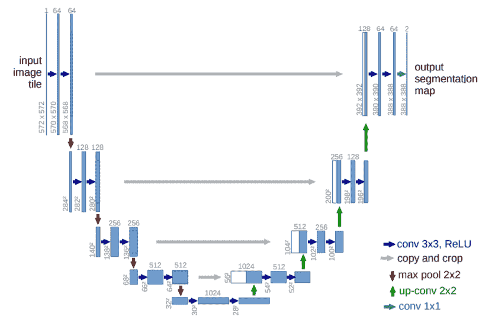

[U-Net:用于生物医学图像分割的卷积网络](https://arxiv.org/pdf/1505.04597v1.pdf)

U-Net 是一个编码器-解码器类型的模型，确保输入和输出都是图像。该架构的编码器部分是普通卷积+最大池，我们最终得到一个非常小的特征映射。网络的这一部分试图在小特征尺寸的地图中捕获关于图像的所有信息。现在，这个映射被馈送到解码器部分，解码器部分试图解开信息，然后得到期望的输出。这里，为了接近输出图像，需要增大特征图的大小，同时减小其深度。为此，我们使用上 conv(上采样+ conv)。当使用 max pool 时，本地信息丢失了，up-conv 没有帮助检索该信息，因此我们使用 crop + copy 在相同的水平级别上从以前的地图中复制该信息。最终输出包含两个地图。一个用于背景，一个用于薄膜。论文中没有使用任何填充材料。

U-Net 在来自 [EM 分割挑战](http://brainiac2.mit.edu/isbi_challenge/)的非常少的训练图像(30)下做得非常好。它从两个方面改进了滑动窗口:跳过连接和上采样。通过上采样，我们不再需要进行逐像素分割，也不再需要牺牲全局环境(如在滑动窗口中)。跳过连接有助于在最大化池化的同时保留丢失的本地上下文。

自从引入 U-Net 以来，已经提出了许多成功的架构，它们都是以此为基础构建的。在这个案例研究中，我比较了三个模型的性能:U-Net、 [U-Net++和](https://arxiv.org/pdf/1807.10165v1.pdf) [HRNet](https://arxiv.org/pdf/1908.07919v2.pdf) 。后两者的架构在“使用的深度学习架构”一节中解释。

# 探索性数据分析

数据集由不同背景中的细胞的图像和它们对应的来自背景的分割细胞核的掩模组成。比赛分两个阶段。为了训练，总共提供了 670 幅图像和相应的掩模。阶段 1 测试集包含 65 幅图像，阶段 2 测试包含 3019 幅图像。为阶段 1 测试图像而不是阶段 2 测试提供了掩模。因此，在本案例研究中，我使用 670 幅第 1 阶段训练图像进行训练，并使用 65 幅第 1 阶段测试图像作为验证图像。没有提供阶段 2 测试的掩码，因此我们只能使用它们来手动分析我们的模型如何处理看不见的数据。

总而言之，在这个例子中，我使用 670 张图片进行训练，65 张图片进行验证。3019 测试图像(无遮罩)，将仅用于一些手动分析。下面显示了一些由图像及其遮罩组成的示例。

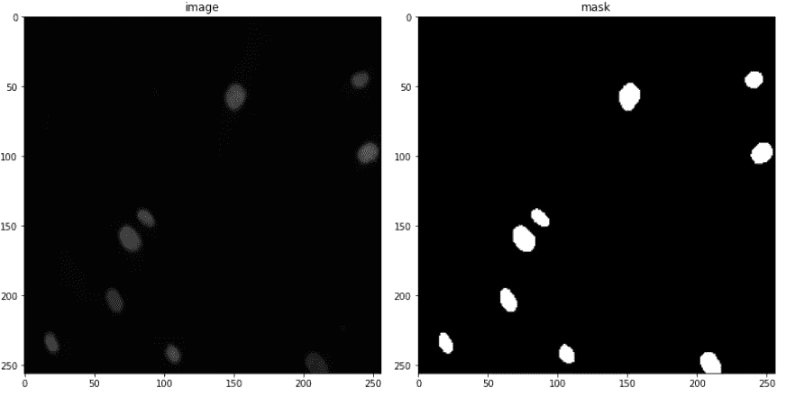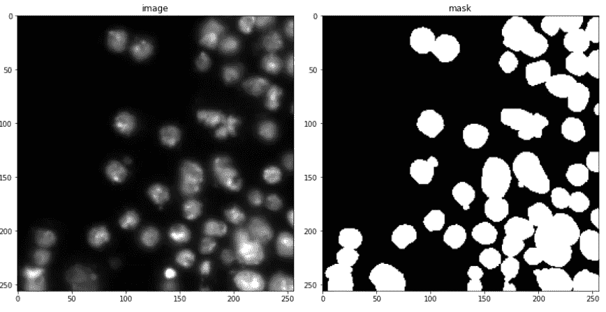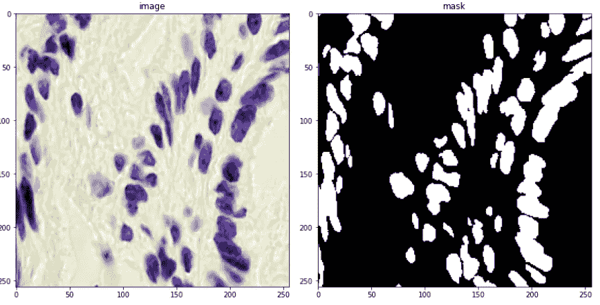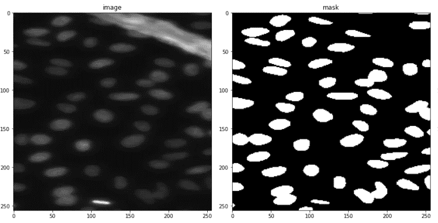

只看前两张图像，你可能会认为，这可以通过简单的阈值处理很容易地解决，但事实并非如此，因为图像包含许多不同的背景。这在接下来的两个例子中显而易见。这是比赛中最具挑战性的部分。更有趣的是，验证图像比训练图像有更多的变化。因此，必须设计一个模型，既能很好地概括，又不会过度适应训练集。

## 数据集详细信息

在对一些基本数据进行分析后，发现了以下观察结果:

*   这些图像有不同的形状，最常见的是 256x256
*   在 train 和 Val 数据中有两种类型的图像:RGB 和 RGBA (4 通道)。最后一个通道称为 alpha 通道，它决定透明度(255 表示不透明，0 表示透明)。移除此通道会将我们的图像转换为 RGB 图像。
*   在仔细检查测试数据时，我发现只有一个图像是罕见的灰度图像。其余所有其他图像不是 RGB 就是 RGBA。
*   图像有不同的大小。
*   所有图像的比例都是 0-255。没有图像显示在 0-1 的范围内。

**列车图片示例:**

*   在训练数据中，大多数图像是黑白的。有些是有色的。黑白图像看起来很容易从人眼中分离出来。彩色图像通常是紫色的。火车图像没有太多的变化。

下面是一些火车图片的例子，左边是图片，右边是蒙版。

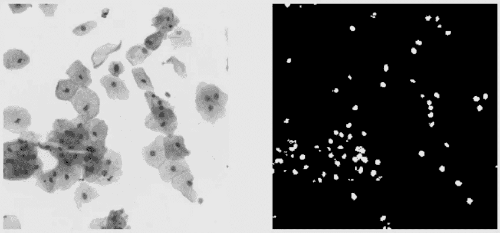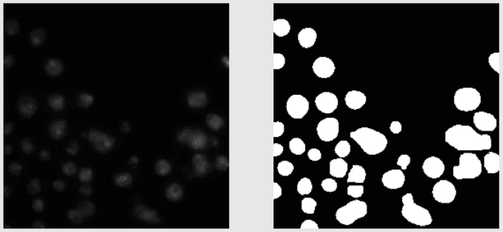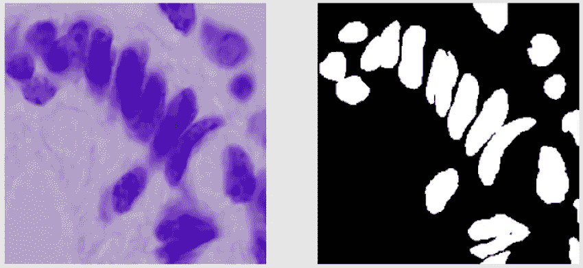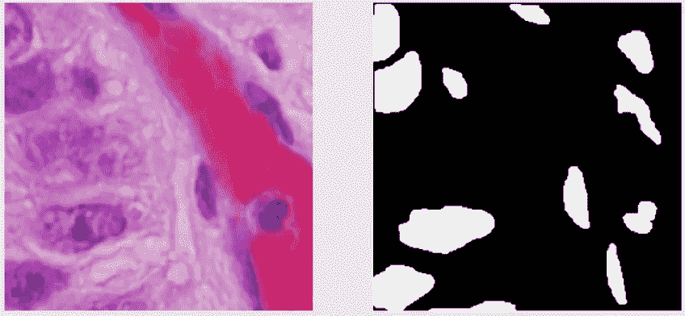

列车图像示例

**验证图片示例:**

*   与训练图像相比，验证图像似乎更难分割。一些图像类似于来自训练数据的图像，而一些图像非常不同，如下所示。

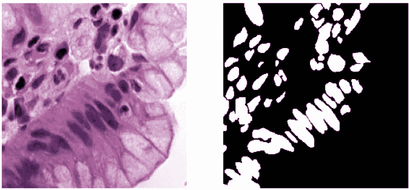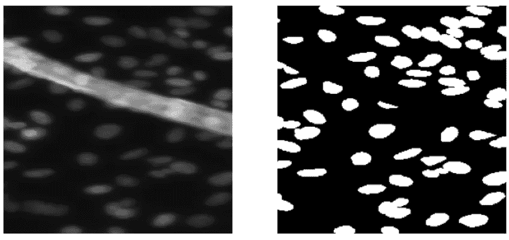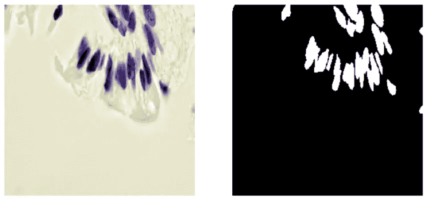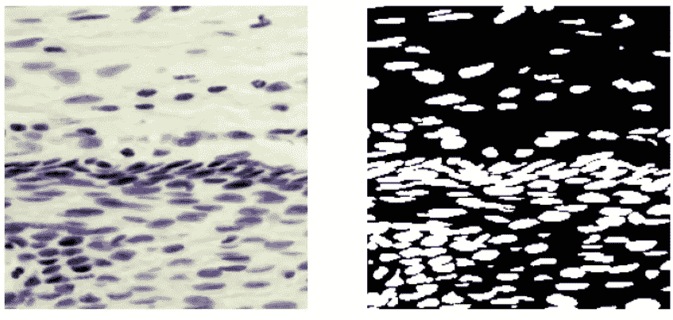

验证图像示例

**验证图片示例:**

*   另一方面，测试图像包含更多的变化。下面显示了一些测试图像的示例(无遮罩)。

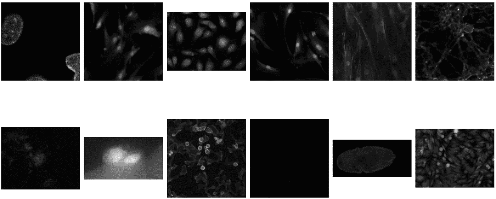

测试图像的示例

*   因此，一般的观察是，从训练到验证到测试，图像的变化增加。因此，过度拟合的机会更高，因此模型的概括能力是模型构建的一个非常重要的部分。

# 使用深度学习架构

我比较了三种型号的性能:U-Net、U-Net++和 HRNet。我将图像的输入和输出形状设为 256x256，因为这是最常见的形状，也是最先进的 CNN 网络中非常标准的输入形状。

## 优信网

该模型的架构已经在“文献综述”部分进行了解释。与每个都有四个编码器和解码器模块的标准 U-Net 不同，我每个都有三个。对于上采样，我使用了 Conv2DTranspose 层。整个代码都是用 Keras 写的，有 Tensorflow 后端。下面给出了带有模型图像的 U-Net 的代码。

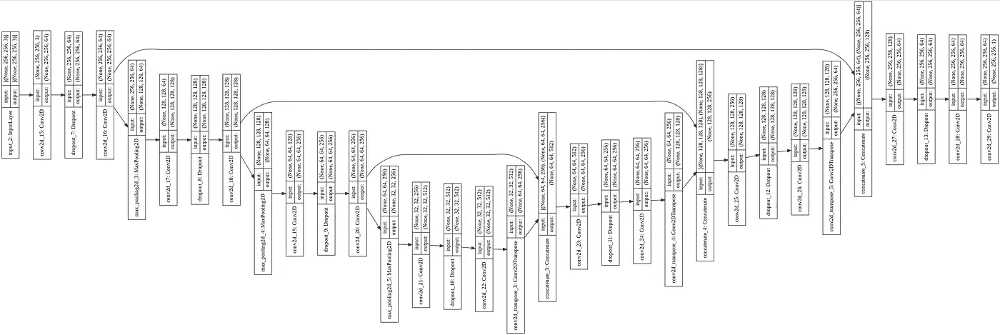

基于形状的 U-Net 架构(图片由作者提供)

## **U-Net++**

在 U-Net 中，两个主要思想是跳过连接和上采样。通过上采样，我们不再需要进行逐像素分割，也不再需要牺牲全局上下文(如在滑动窗口中)。而跳过连接有助于在最大化池化的同时保留丢失的本地上下文。在医学分割中，尽可能少的错误和尽可能多的细节是非常重要的。据观察，跳过连接对于恢复目标对象的细粒度细节非常有帮助；即使在复杂背景下也能生成细节清晰的分割蒙版。这是因为细粒度的低级信息存在于实际图像中，当我们由于最大池而向下和向右移动网络时，这些信息变得更粗糙。并且当解码器试图重建图像时，跳过连接试图将该信息提供回解码器部分。如果没有跳过连接，解码器实际上对图像没有直接的概念，而只有最终的编码图。通过跳过连接，解码器可以了解实际图像和细节。

[U-Net ++](https://arxiv.org/pdf/1807.10165v1.pdf) 以此为基础，尝试提炼这些跳跃连接。U-Net 将来自解码器子网络的深层、语义、粗粒度特征映射与来自编码器子网络的浅层、低级、细粒度特征映射相结合。并且它直接将它们结合起来(裁剪和复制)。U-Net2+努力在将编码器映射与解码器映射组合之前丰富它们，即在组合之前使它们在语义上(逻辑上)更加相似。

这个建筑的灵感来自于[的密集网络](https://towardsdatascience.com/review-densenet-image-classification-b6631a8ef803)。密集网络的优点是 1)强梯度流 2)更少的参数和计算效率(网络更复杂，因此网络不需要那么深)3)多样化的特征，因为每个特征从不同的层获得特征。

下面给出了 U-Net++的架构。(节点大写 X 表示 conv 操作，箭头表示特征地图的移动。小 x1，j 表示节点 x1，j 的输出)

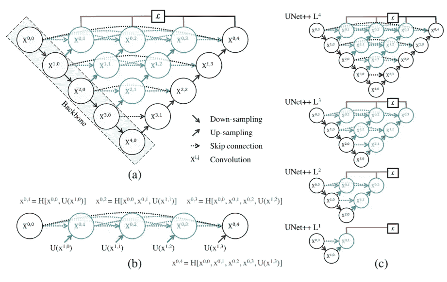

[UNet++:一种用于医学图像分割的嵌套 U-Net 架构](https://arxiv.org/pdf/1807.10165v1.pdf)

这里引入了两个新概念:密集跳跃路径和深度监督

**密集跳跃连接**:设 x i，j 表示节点 X i，j 的输出，其中 I 索引下采样层以及编码器，j 索引沿着跳跃路径的密集块的卷积层。由 x i，j 表示的特征地图的堆叠计算如下:

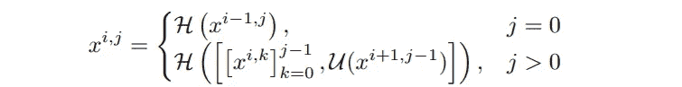

[UNet++:一种用于医学图像分割的嵌套 U-Net 架构](https://arxiv.org/pdf/1807.10165v1.pdf)

其中函数 H()是卷积运算，后面是激活函数，U()表示上采样层，而[ ]表示连接层。

请注意，这不仅在编码器和解码器层之间使用密集连接的方式上有所不同，而且我们使用卷积而不是简单地复制跳过连接。在最初的 U-Net 中，他们只是复制。除此之外，本文还使用了**深度监督**，其中对所有顶级语义层的输出进行了平均。

对于它的实现，我将编码器和解码器模块中的卷积数减少了一层。相同的代码和模型图像如下所示。

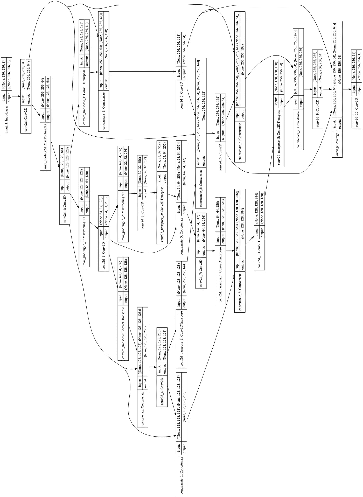

基于 U-Net++的形状架构(图片由作者提供)

**HRNet** 该网络的灵感来自[这篇](https://arxiv.org/pdf/1908.07919v2.pdf)论文介绍了一种更密集连接的分割架构，其想法是提取不同分辨率特征的深度表示，然后将它们组合在一起。因为代码和图像都很大，所以我没有在这里包含它们。你可以在我的 GitHub 页面上找到代码。

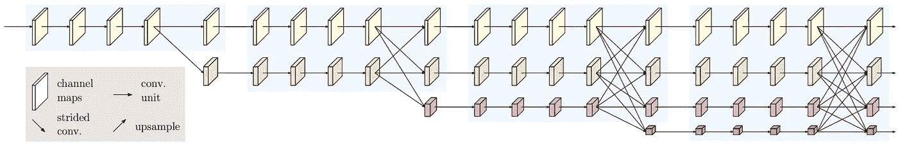

[用于视觉识别的深度高分辨率表征学习](https://arxiv.org/pdf/1908.07919v2.pdf)

# 结果和讨论

所有模型都用二元交叉熵作为损失函数进行训练。使用 Adam 优化器，学习率为 1e-3。我用 20 个纪元的耐心来监控验证损失。对于度量，我使用了 Mean IoU 的自定义实现。

验证损失和平均 IoU 的图表如下所示

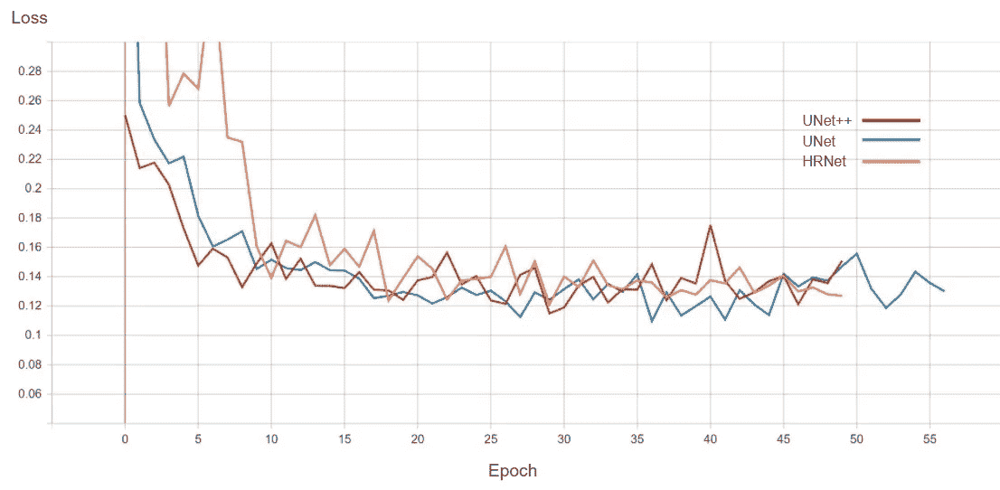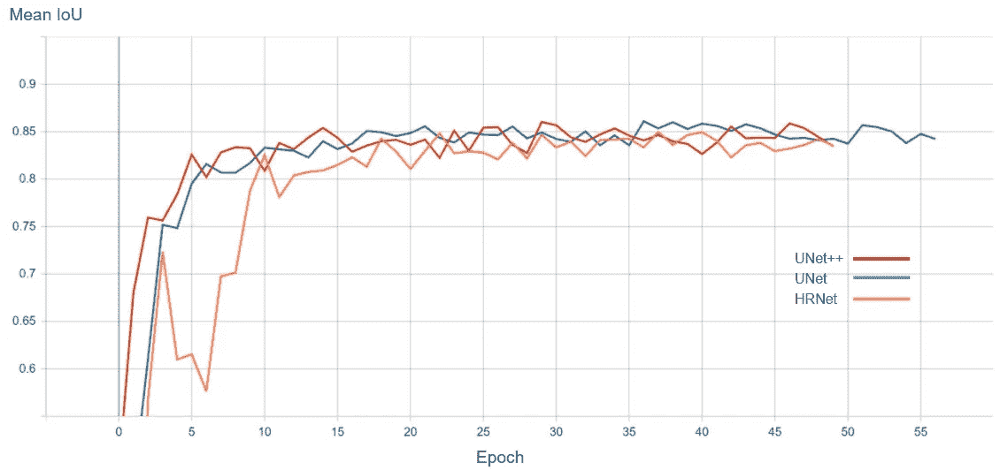

在训练之后，对于每个模型，选择在该时期具有最佳平均 IoU 的模型实例。所有型号的对比如下所示。

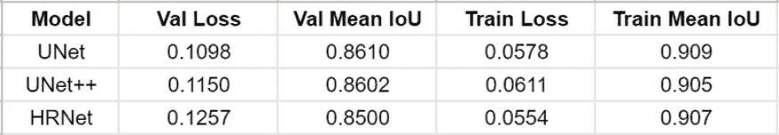

三个型号的性能都不相上下。每个模型的训练都在第 50 个纪元标记附近停止，这意味着所有模型都在第 30-35 个纪元标记附近达到收敛。表现最好的是 U-Net，验证损失为 0.1098，平均 IoU 为 0.861。U-Net++以 0.8602 的分数相差不远。HRNet 的性能最低，平均 IoU 为 0.85。

*除此之外，我还尝试增加 U-Net 和 U-Net++的编码器-解码器模块的数量，但模型开始过度拟合，没有给出任何更好的结果，因此我没有在这里包括它们。*

## 预测掩码

下面显示了所有具有平均 IoU 分数的模型的预测掩码。每行包含一个图像和一个真实遮罩，后面依次是 UNet、UNet++和 HRNet 的预测遮罩。

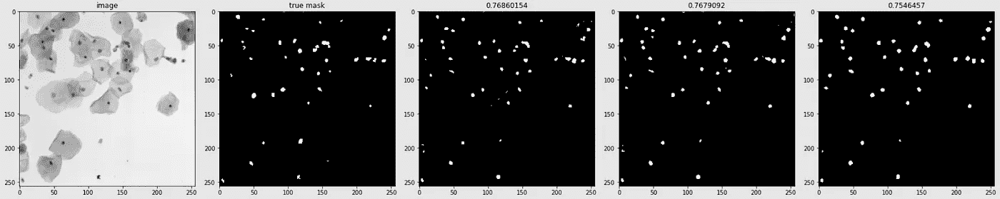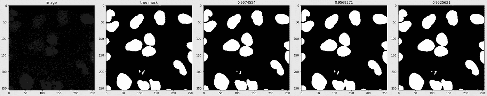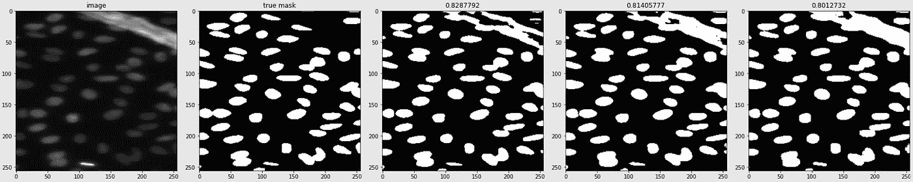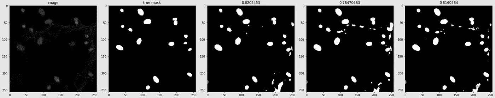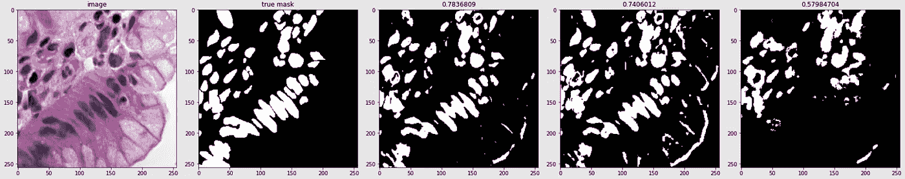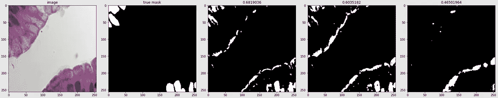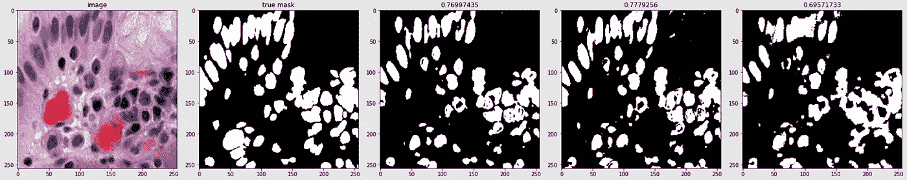

以下是对测试图像的一些预测(没有真正的面具，因此没有分数)

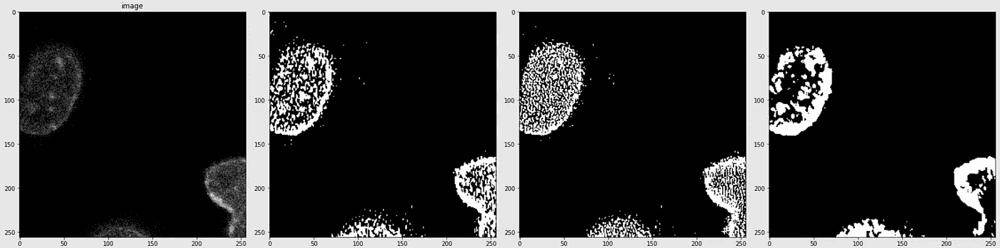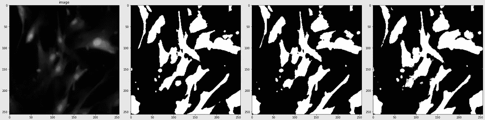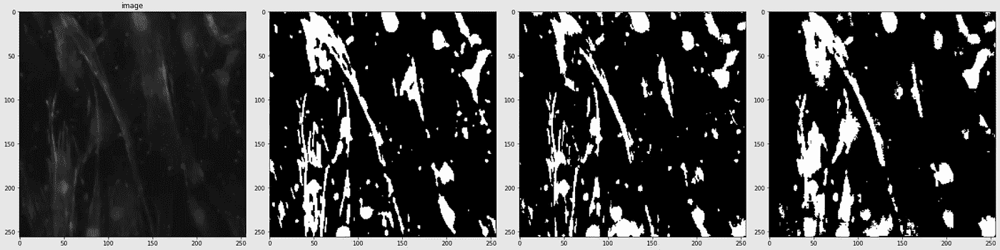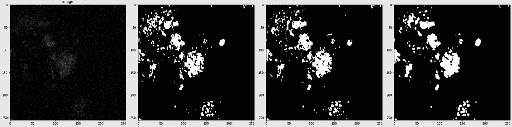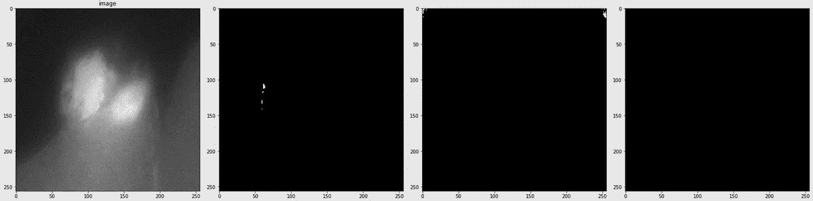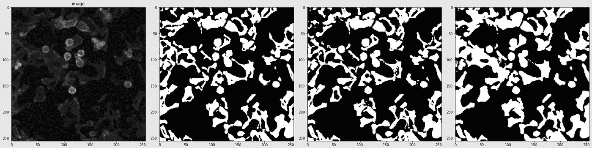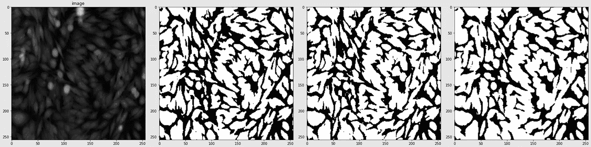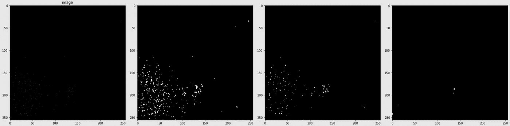

对于验证图像，模型的性能相当不错，但是测试预测并不令人满意。对于如此少的训练图像，仍然存在一般化的问题。

最后，我选择了最好的模型作为 UNet。该模型的**平均推理时间**为 **0.964 秒**，而**模型大小**为 **28 MB** 。

# 训练后量化

> 训练后量化是一种转换技术，可以减少模型大小，同时还可以改善 CPU 和硬件加速器延迟，而模型准确性几乎不会下降
> - TensorFlow 官方文档

有不同的量化方法。对于我的模型，我使用了 Float16 量化，其中所有的权重都转换为 16 位浮点数。这将模型大小减少了一半:从 28 MB 减少到 14 MB。

一个重要的检入量化是看它是否不降低模型的性能。这正是我不能使用动态范围量化等其他方法的原因，因为我的机箱中的 CPU 不支持这些方法，因此获得输出需要花费大量时间。因此，不可能检查性能是否有任何下降。我可以检查 Float16 量化，预测性能没有下降**(量化模型的平均 IoU 分数也是 0.861)，所以我继续使用它。**

所以，最后，**型号尺寸**为 **14 MB** 。推断时间从 **0.964** 秒增加到 **1.261** 秒，这很好，因为模型尺寸减小了。

# Web 应用程序

我为这个项目构建了一个 web 应用程序，并通过 streamlit 进行了部署:
[https://share.streamlit.io/kriz17/mdt_app](https://share.streamlit.io/kriz17/mdt_app)

# 总结和未来工作

在这个案例研究中，我设计了基于深度 CNN 的模型，用于在各种条件下自动检测图像中的细胞核。比较了基于 U-Net、U-Net++和 HRNet 的总共三个模型的性能。表现最好的模型是基于 U-Net 的模型，IoU 平均得分为 0.861。此外，我使用 Float16 量化将模型大小从 28 MB 减少到 14 MB。该模型的平均推理时间为每个样本 0.126 秒，这对于手头的任务来说是相当不错的。最后，我使用 streamlit 部署了这个模型。

所有三个模型都做得相当不错，每个模型都获得了大于 0.85 的平均 IoU 分数。它们可以用于具有标准背景的图像，如在训练数据中，但是没有很大的变化。主要的挑战是小的训练数据集和验证图像背景的高度变化。模型的传统架构导致过度拟合，因此我不得不减小模型的大小。在未来的工作中，我想尝试使用弹性变形进行数据扩充，就像最初的 U-Net 论文中实现的那样。我还想探索基于注意力机制的变压器模型，因为它们已经被证明对小数据集非常有效[3]。

# 感谢

我要感谢整个应用人工智能课程团队，特别是 Ramana Sir 在整个案例研究中对我的指导。

# 参考

[1][https://www.appliedaicourse.com/](https://www.appliedaicourse.com/)

[2][https://www.kaggle.com/c/data-science-bowl-2018/](https://www.kaggle.com/c/data-science-bowl-2018/)

[3]https://arxiv.org/pdf/2102.10662v2.pdf

[4]https://arxiv.org/pdf/2009.13120.pdf

[5][https://medium . com/swlh/image-segmentation-using-deep-learning-a-survey-e 37 E0 f 0a 1489](https://medium.com/swlh/image-segmentation-using-deep-learning-a-survey-e37e0f0a1489)

[https://paperswithcode.com/task/medical-image-segmentation](https://paperswithcode.com/task/medical-image-segmentation)

[7]https://en.wikipedia.org/wiki/Image_segmentatio

[https://arxiv.org/pdf/1505.04597v1.pdf](https://arxiv.org/pdf/1505.04597v1.pdf)

[9][https://towards data science . com/review-u-net-biomedical-image-segmentation-d 02 BF 06 ca 760](https://towardsdatascience.com/review-u-net-biomedical-image-segmentation-d02bf06ca760)

[10][https://drive . Google . com/file/d/1U-set D5 nexw 86 Bau 7 mow 9 LZ 9f 1n 7 LPF 3/view](https://drive.google.com/file/d/1U-SEtD5NExw86Bau7mOW9Lz9F1n7LpF3/view)

[11][https://arxiv.org/ftp/arxiv/papers/1802/1802.06955.pdf](https://arxiv.org/ftp/arxiv/papers/1802/1802.06955.pdf)

[https://arxiv.org/pdf/1802.02427.pdf](https://arxiv.org/pdf/1802.02427.pdf)

[https://arxiv.org/pdf/1807.10165v1.pdf](https://arxiv.org/pdf/1807.10165v1.pdf)

[https://arxiv.org/ftp/arxiv/papers/2004/2004.08790.pdf](https://arxiv.org/ftp/arxiv/papers/2004/2004.08790.pdf)

[15][https://sh-tsang . medium . com/reading-unet-3-a-full-scale-connected-unet-medical-image-segmentation-ebb 5 e 7 f 53 CAA](https://sh-tsang.medium.com/reading-unet-3-a-full-scale-connected-unet-medical-image-segmentation-ebb5e7f53caa)

[https://arxiv.org/pdf/1908.07919v2.pdf](https://arxiv.org/pdf/1908.07919v2.pdf)

完整的代码可以在我的 GitHub 档案中找到:

 [## GitHub-kriz 17/医学图像分割

### 使用基于深度 CNN 的模型自动检测发散图像中的细胞核。请找到关于这个案例的详细博客…

github.com](https://github.com/kriz17/Medical-Image-Segmentation) 

在 LinkedIn 上与我联系:

 [## 印度中央邦克里兹·摩西-IIT·印多尔-印多尔| LinkedIn

### 在全球最大的职业社区 LinkedIn 上查看 Kriz Moses 的个人资料。Kriz 的教育列在他们的…

www.linkedin.com](https://www.linkedin.com/in/kriz-moses/) 

PS :如果你认为他们可以改进项目/博客，请随时提供意见/批评。我一定会努力做出必要的改变。