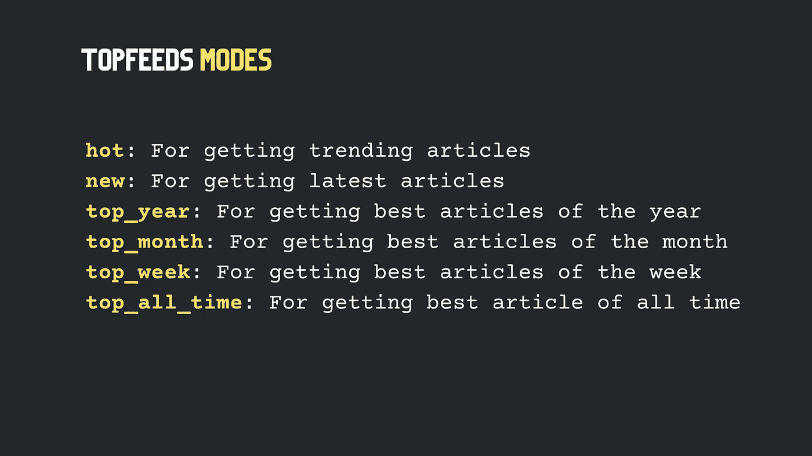

# 中型 API:使用 Python 获取帖子

> 原文：<https://pub.towardsai.net/medium-api-get-posts-using-python-126d6d859ca8?source=collection_archive---------4----------------------->

## 用户撰写的文章、发布文章和顶级订阅源


作者图片

嘿伙计们！

欢迎回到另一个中级 API 教程。今天我将教你如何使用 Python 编程语言从 Medium 获取帖子。

到本文结束时，您将能够提取任何用户编写的文章、出版物发布的任何故事以及带有特定标签的帖子。

因为我们使用的是 REST API，所以您可以在这里使用您选择的任何编程语言。但是在这里，我将只关注 Python，因为我们已经准备好了 SDK，这将使我们的生活更容易。

如果你正在用其他语言编写代码，比如 Javascript、PHP、C/C++，或者类似的语言，请查阅这个 [**swagger 文档**](https://docs.mediumapi.com) 。

对于所有的 python 程序员，请耐心等待，让我们直接跳到代码。

作者的视频——如果你不想看😜

# 使用中型 API 获取帖子

为了简化 Medium API 的使用，我们将安装`medium-api` python 包。

首先，打开你最喜欢的 IDE，启动终端。

键入***“pip 安装介质-API”***并点击回车。

```
**pip install medium-api**
```

这将在您的 python 环境中安装`**medium-api**`包，因此您可以将它导入到您的项目中。

## 获取用户的帖子

现在，创建一个新的 python 文件，命名为***“get _ user _ articles . py”***

作者代码

从`**medium_api**`模块导入`**Medium**`类对象。并使用你的 ***API_KEY*** 进行初始化。

```
💡 **Note:** To get your API_KEY, [**Subscribe to Medium API**](http://hub.mediumapi.com). And don't worry, you can start by choosing the **FREE plan**.
```

现在，通过传递你的 ***用户名*** (这里是 *nishu-jain* )创建一个中等的`**User**`对象。然后调用`**fetch_articles()**`函数，利用多线程将文章信息快速提取出来。

最后，您可以遍历用户文章对象并打印其标题。

就是这样！

## 获取出版物的帖子

现在我们再创建一个名为***“get _ publication _ articles . py”***的文件。

作者代码

首先导入`Medium`对象，并使用您的 ***"API_KEY"*** 初始化它。

```
💡 **Note:** To get your API_KEY, [**Subscribe to Medium API**](http://hub.mediumapi.com). And don't worry, you can start by choosing the **FREE plan**.
```

通过传递***publication _ id***定义一个`Publication`对象。在这里，我用一本名为**【走向 AI】**的出版物作为例子。

> 如何获取 ***publication_id*** ？
> 
> 要获取发布 ID，最简单的方法之一是从一个`***Articles***`对象获取它。
> 
> 1.打开该出版物下发表的任何文章，并复制其 URL。
> 
> 2.获取 URL 末尾的散列，并使用它创建一个 Articles 对象。
> 
> 3.打印文章 dot 出版物 ID 并将其保存在其他地方，以便可以重复使用。


作者图片

现在，使用 publication 对象的`**get_articles_between()**` 函数，获取上周发表的所有文章。为此，您必须传递两个日期时间参数，`**_from**`和，`**_to**`。

最后，遍历上周文章对象的列表，并打印它们的*标题*和*发布日期*。

## 获取热门文章。

现在让我们创建另一个名为***“get _ top feeds . py”***的文件。

作者代码

像往常一样，首先导入`Medium`对象，并使用 ***API_KEY*** 对其进行初始化。

```
💡 **Note:** To get your API_KEY, [**Subscribe to Medium API**](http://hub.mediumapi.com). And don't worry, you can start by choosing the **FREE plan**.
```

通过传递 ***标签*** 和 ***模式*** 定义一个`**TopFeeds**`对象。

这里我们可以以*区块链*为例标签，以*【新】*的方式，获取最新的区块链文章。



作者图片

现在，调用`**fetch_articles()**`函数使用多线程快速获取帖子。

最后，循环浏览顶部提要文章并打印其标题*。*

# *最后的想法—*

*一旦获得了`**Articles**`对象，就可以访问它的几个属性，比如它的— ***标题、副标题、作者详细信息、出版物详细信息、掌声、投票者、字数、阅读时间、标签、主题、文本内容、响应、响应计数、发布日期、最后修改日期、封面图片 URL、语言、文章 URL，并且还可以以 markdown 格式获得整篇文章。****

**

*作者图片*

# *重要资源💡*

*   ***首页:**[https://mediumapi.com](https://mediumapi.com)*
*   ***GitHub:**https://github.com/weeping-angel/medium-api*
*   ***ReadTheDocs:**[https://medium-API . rtfd . io](https://medium-api.rtfd.io)*
*   ***霸气文档:**[https://docs.mediumapi.com](https://docs.mediumapi.com)*
*   ***RapidAPI:**[http://hub.mediumapi.com](http://hub.mediumapi.com)*

***PS:** 我们发布与 Medium 和 Medium API 相关的教程、视频、代码片段和见解。所以一定要跟着我们*

*   *推特:[**twitter.com/medium_api**](https://twitter.com/medium_api)*
*   *领英:[www.linkedin.com/company/medium-api](https://www.linkedin.com/company/medium-api)*

*如果你喜欢阅读这些故事，那么我相信你会很乐意成为一名中等付费会员。每月只需 5 美元，你就可以无限制地接触成千上万的故事和作家。你可以通过 [***使用这个链接***](https://nishu-jain.medium.com/membership)*注册来支持我，我将赚取一点佣金，这将帮助我成长并出版更多像这样的故事。**

*感谢您的阅读，祝您愉快！*

***🔗相关文章—***

*[](https://medium.com/geekculture/medium-api-documentation-90a01549d8db) [## 中等 API —文档

### 中型 API 入门

medium.com](https://medium.com/geekculture/medium-api-documentation-90a01549d8db) [](https://towardsdev.com/medium-api-get-posts-using-node-js-a43894efaeab) [## 中型 API:使用 Node.js 获取帖子

### 使用“Axios”库…

towardsdev.com](https://towardsdev.com/medium-api-get-posts-using-node-js-a43894efaeab) [](https://medium.datadriveninvestor.com/how-to-leverage-medium-for-crypto-trading-deedea890da1) [## 如何利用媒体进行加密交易

### 监控媒体标签和博客，寻找加密空间的投资机会

medium.datadriveninvestor.com](https://medium.datadriveninvestor.com/how-to-leverage-medium-for-crypto-trading-deedea890da1) [](https://betterprogramming.pub/how-to-find-the-top-readers-of-a-medium-publication-using-python-5862946047c0) [## 如何使用 Python 找到中型出版物的顶级读者

### 谁对你的出版物的文章评论最多？

better 编程. pub](https://betterprogramming.pub/how-to-find-the-top-readers-of-a-medium-publication-using-python-5862946047c0)*