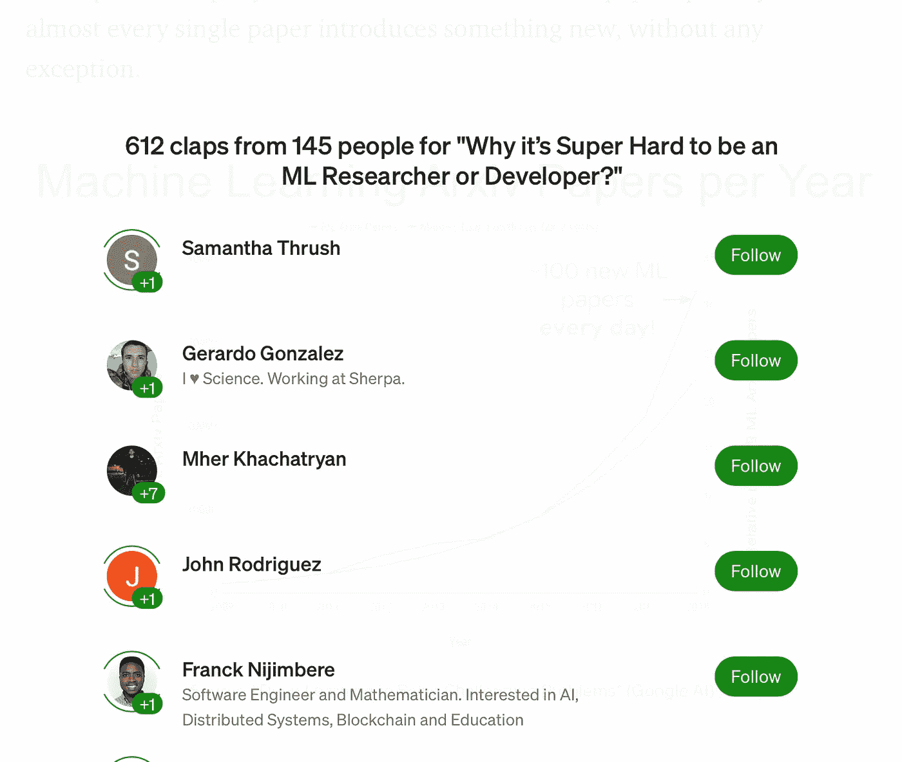

# 判断一篇中型文章受欢迎程度的最佳标准

> 原文：<https://pub.towardsai.net/medium-articles-popularity-metric-cac577609bd4?source=collection_archive---------4----------------------->

## [统计数据](https://towardsai.net/p/category/statistics)

## 如何量化一篇中等文章的质量

作者图片

判断一篇中型文章的质量是一件主观的事情，就像世界上任何其他艺术品一样——它的价值在于旁观者的眼中。但是我们，作为程序员，不能致力于这样的思考，不是吗？我们喜欢逻辑和结构——我们寻找疯狂的方法。

*但是为什么“媒介”会想这样做呢？*

很简单——改善他们的平台，增强他们的用户体验。能够量化(至少在某种程度上)一篇文章的质量是至关重要的。

量化一段内容的质量是像 Medium 这样的博客平台在编码时面临的最大挑战之一。它有助于改善其推荐页面、分发系统、监管机制和排名算法。

有一堆标准，通过这些标准，媒介可以实现这一点。就像—

*   文章的投票人数，
*   每个投票者的平均鼓掌次数或鼓掌总数，
*   文章的评论/回复数量，
*   社交媒体分享的数量，
*   平均阅读时间，
*   一些反向链接等…

但是对于我们这些凡人来说，只有一些公开的指标，比如投票人数和每个投票人鼓掌的次数。

# F 演员要考虑—

你一定注意到了，在每一个中型故事的结尾，都有一个拍手图标，它告诉我们有多少人已经欣赏了那篇文章，有多少，从 1 到 50。

该媒体允许每个用户鼓掌近 50 次，这从理论上表明他/她有多“喜欢”那篇文章。

示例—作者提供的图片

一篇文章的总点击数(**总鼓掌数**)和鼓掌的总人数(**投票者数**)是两个极好的标准，表明该文章在一定程度上的受欢迎程度。

***但两者都不能单独使用。***

*为什么？*

因为 ***单独的鼓掌总数*** 可能会产生误导，因为一个人可能鼓掌 50 次，人们可能会利用这个漏洞来生成错误的统计数据。

比如说—

> 来自 500 个不同的人的 500 个掌声远比来自 10 个人的 500 个掌声好。

而如果我们只考虑 ***的投票人数*** ，那么同样，如果数字完全相同，我们也无法计算出它的受欢迎程度。所以我们也不能忽视掌声。

让我们说—

> 有 2 篇文章，每篇有 4 个投票者。如果第一篇文章得到 100 个掌声，而另一篇文章得到 50 个掌声，那么很明显，第一篇文章质量更好。

# 结合这两个因素—

我们知道，将两个标准—*&***选民计数*** —考虑在内就解决了我们的问题。*

*但是我们应该如何把这些结合起来呢？*

**

*作者图片*

**以下是我的推理…**

***由于按下鼓掌按钮的心理阻力大于它被按下的次数，我们可以给投票人的计数更多的权重，并简单地将鼓掌总数加到上面。***

*导致:—*

> *受欢迎程度= 50*(选民人数)+(鼓掌总数)*

*这个稍微高级一点的指标可以给我们一个更好的、没有偏见的想法，那就是这篇文章有多少人喜欢。*

# *结论—*

*显然，我们应该考虑其他标准，正如本文开头提到的，但是这些标准并没有公开。所以我们现在必须解决这个问题*

*将来，我会尝试将参与度(评论或回复的数量)也包含在这个指标中。但在此之前，我必须想好如何从中减去漏洞。*

*在那之前，我会用这个工作。这已经是一个很好的指标了！*

*希望你能从中学到一些东西。*

**感谢阅读&祝你有美好的一天！**

**如果你喜欢阅读这些故事，那么我相信你一定很乐意成为* [***中等付费会员***](https://nishu-jain.medium.com/membership) ***。每月只需 5 美元，你就可以无限制地接触成千上万的故事和作家。你可以通过* [***使用此链接***](https://nishu-jain.medium.com/membership)*注册来支持我，我将赚取一点佣金，这将帮助我成长并出版更多像这样的故事。****

***您可能喜欢的其他文章—***

* [## 如何使用 API 检索用户的媒体故事？

### 废弃任何用户使用中型 API 编写的中型文章的最简单方法

pub.towardsai.net](/how-to-retrieve-medium-stories-of-a-user-using-apis-fcdb1576558a)  [## 中型 API:使用 Python 获取帖子

### 仅带有“请求”库！

blog.devgenius.io](https://blog.devgenius.io/medium-api-get-posts-using-python-e8ca4331845e)  [## 中等 API —文档

### 中型 API 入门

nishu-jain.medium.com](https://nishu-jain.medium.com/medium-api-documentation-90a01549d8db)*