# 使用 Python 中的 Spacy 和 Seaborn 进行媒体读者和作者行为分析

> 原文：<https://pub.towardsai.net/medium-reader-and-author-behavioural-analysis-using-spacy-and-seaborn-in-python-24f9a6d4950b?source=collection_archive---------1----------------------->

因此，在我的 Pyspark 系列之后，我在考虑下一步该写什么，退格之后，我想，为什么不让我们创建一些关于介质本身的东西呢…我开始浏览关于介质的可用数据集，并最终找到了一个，在其上我可以使用 Spacy 和 Seaborn 进行探索性数据分析。

本文使用的数据集可以在这里 **找到 [**。**与我之前使用 Pyspark 数据框架的文章不同，在本文中，我将主要使用 pandas，因为它对大多数读者都有帮助。要在 Pyspark 中实现，参考我以前的文章。](https://github.com/muttinenisairohith/Encoding-Categorical-Data/blob/90590e0bf4aa759f4ed10bf7d573d2df4a03cf71/data/medium_data.csv)**

**数据和目标:**

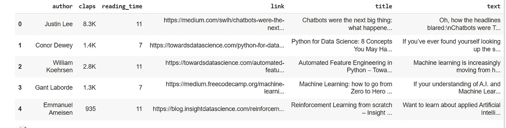

抽样资料

这是数据的快照示例。我们有作者、掌声、阅读时间、链接、标题和文本栏。当我想将机器学习应用于这些数据时，我想到了两个想法——1。读者和作者行为分析，2。根据写作模式和使用的主题来预测鼓掌和阅读时间。我剔除了后者，因为它们主要取决于作者的受欢迎程度——他有多少追随者，以及发表在哪个出版物上。所以让我们从第一个开始，试着在这个数据集上做读者和作者行为分析。

**加载数据**

我将使用 Pandas，上面提供了数据集链接:-

```
import pandas as pddf = pd.read_csv("medium_data.csv")
df.head(5)
```

**结构化数据:**

我在这里说结构化，而不是预处理或清理，因为我要从数据中提取一些有用的信息，删除一个冗余列，并对一个列进行类型转换。

```
df["len_title_words"] = pd.DataFrame([len(i.split(" ")) for i in df["title"].values])df["len_text_words"] = pd.DataFrame([len(i.split(" ")) for i in df["text"].values])
```

我一直认为文章的长度和标题对吸引读者起着一定的作用，我终于有机会检验一下了。所以我们首先提取了这些信息。

```
df.head(5)
```

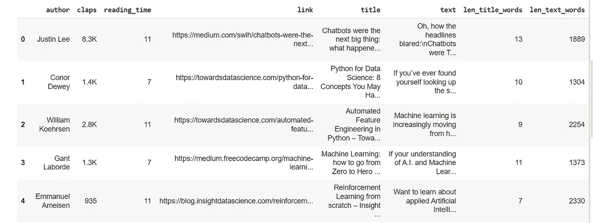

这里我们可以看到 claps 列是字符串格式的，其中千用“K”表示。让我们把它转换成 int 格式。

```
def convert_claps(clap_values): if "K" in clap_values:
        return int((float(clap_values[:-1])*1000))
    else:
        return int(clap_values)df["claps"] = df["claps"].apply(lambda i: convert_claps(i))
```

我在 Pandas 中使用了 apply 方法，并将 claps 列转换为 int。

在我们的数据中，我们有一个链接列，我认为，继续前进，它不会为我们的任务添加任何信息。所以让我们放弃吧。

```
df.drop('link', axis = 1, inplace=True)
```

最后，我已经组织好了我的数据，准备好了。

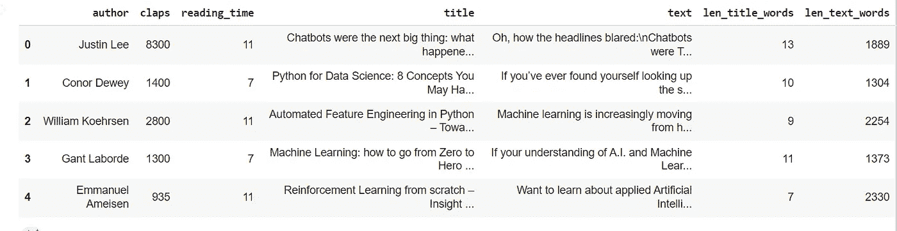

**文章分析**

我将我的探索性数据分析分为 3 部分，第一部分是*文章分析*。我将使用 **Seaborn** 因为 Seaborn 是 EDA 的一个很好的库，它提供了各种图形来可视化来自数据的有用信息。

```
import matplotlib.pyplot as plt
import seaborn as snssns.set_theme()
```

让我们先想象一下文章的长度——

```
sns.displot(df['len_text_words'], color="g", legend="True", height=4, aspect=2, kde=True)
sns.rugplot(df["len_text_words"], color="r")plt.show()
```

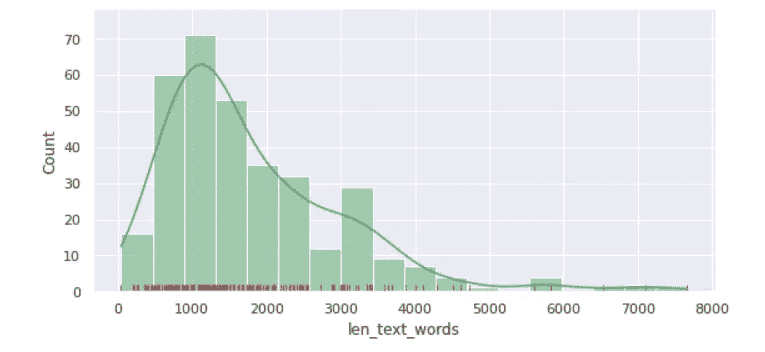

绘制文章的长度

在这里我们可以看到大多数文章的字数在 500 到 3000 之间。

```
sns.displot(df['len_title_words'], color="g", legend="True", height=4, aspect=2, kde=True)
sns.rugplot(df["len_title_words"], color="r")plt.show()
```

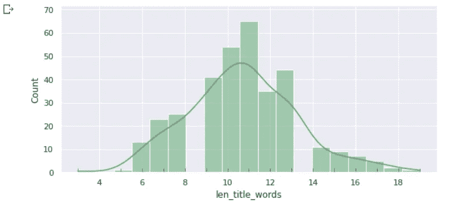

绘制标题的长度

我们有一个本地最大值，范围在 9 到 13 个单词之间，这意味着大多数人写的标题范围在 9 到 13 个单词之间，显然，你可以看到我的标题，我属于同一组。

```
sns.displot(df['claps'], color="g", legend="True", height=4, aspect=3, kde=True)
sns.rugplot(df["claps"], color="r")plt.show()
```

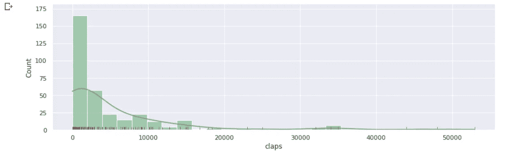

为文章策划鼓掌

我们可以看到掌声的分布在右侧高度倾斜，这清楚地表明只有少数作者获得了大量的掌声。显然，著名的作者会有更多的掌声。

> 从这部分分析中，我们发现—
> 
> 大多数情况下，标题的长度在 9 到 13 个字之间，而文章的长度在 500 到 3000 个字之间

**媒介读者分析**

我们单独分析了数据，现在让我们尝试将我们的数据与阅读时间联系起来，以找到读者的兴趣。

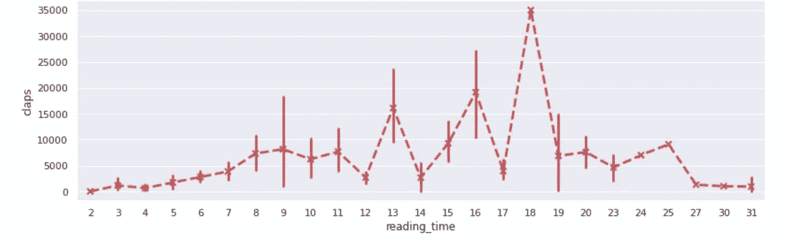

绘图阅读 _ 时间与鼓掌

现在让我们也使用 seaborn 中可用的*regplot*——它将绘制数据和线性回归线。

```
sns.regplot(x = 'reading_time',y = 'claps', data=df, order=3, color="r")plt.show()
```

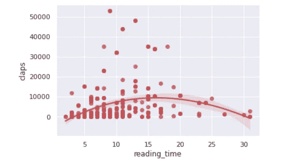

绘制阅读时间与掌声

我们可以看到，阅读次数在 10 到 18 之间的文章有更多的掌声。因此，观众有兴趣阅读不太短的文章——这意味着它们应该包含有用的信息，而不要太长——这会降低兴趣。

```
sns.regplot(x = 'len_text_words',y = 'claps', data=df, order=3, color="r")plt.show()
```

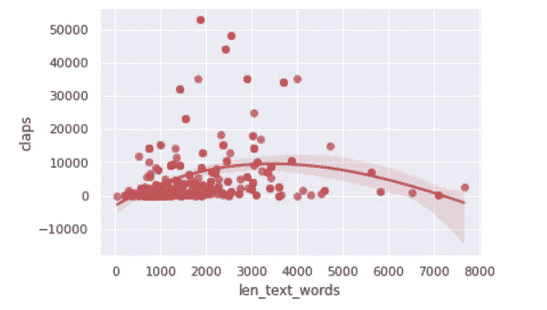

绘制 len_text_words 与鼓掌

正如我们所看到的，文章的长度和文章获得的掌声数量之间也有轻微的关系。当文章的字数在 1500 到 4000 之间时，就有获得更多掌声的空间。在写下一篇文章时，请记住这一点。

```
sns.heatmap(df[['claps', 'len_text_words', 'len_title_words', 'reading_time']].corr(),annot=True, cmap='BrBG')plt.show()
```

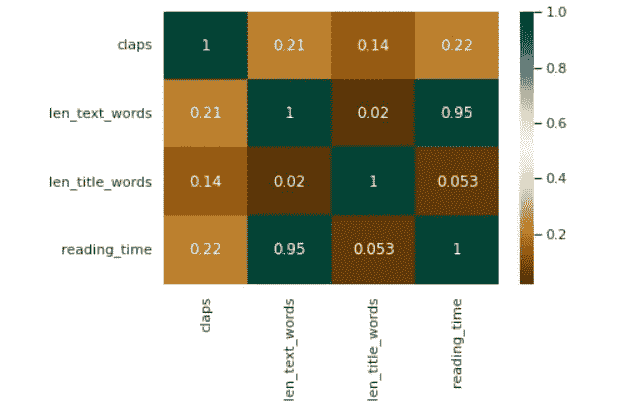

热图

从热图中可以明显看出，字数越多，阅读时间越长，标题的长度与阅读时间和掌声无关。

所以从我们对有限数据的分析中，我们明白了—

> 阅读时间从 10 到 18 的文章有更多的机会获得更多的掌声。
> 当文章字数在 1500 到 4000 之间时，就有获得更多掌声的空间。
> 标题和鼓掌次数没有关系。很明显，为了吸引注意力，标题应该吸引人，引人注目，然后是冗长的。

我认为这篇文章变得冗长，也许我可以写另一篇关于第三部分的文章，但我发现我只用了 950 个单词，不像上面的例子。所以让我们进行第三部分

**媒介作者分析**

在本文中，我将结合使用 Spacy 和 nltk，进行标记化，并根据作者文章中最常用的词来预测作者的兴趣。要获得更多关于 nltk 的信息，请参考我下面的文章，在那里我使用 nltk 进行了情感分析。

[](https://medium.com/analytics-vidhya/sentiment-analyzer-on-opinrank-dataset-4e961dcaecbc) [## OpinRank 数据集上的情感分析

### 今天生成的大量数据是非结构化的，需要经过处理才能产生洞察力。一些…

medium.com](https://medium.com/analytics-vidhya/sentiment-analyzer-on-opinrank-dataset-4e961dcaecbc) 

```
from collections import Counterdf['author'].value_counts()
```

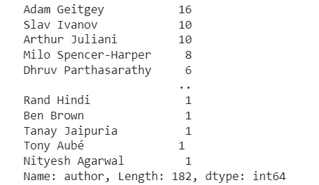

数据集中的作者列表

在这里，我们可以看到作者在我们拥有的数据中包含了大多数文章，让我们挑选前 3 位作者，并尝试根据他们的文章内容来预测他们的写作兴趣。

```
# importing librariesimport spacy
import string
from nltk.corpus import stopwords
import nltknlp = spacy.load("en_core_web_sm")nltk.download('stopwords')
```

这里，我们正在导入 nltk 和 spacy 库。从 spacy，我们正在加载“en _ core _ web _ sm”——这是一个在 OntoNotes 上训练的英语多任务 CNN。

```
stopwords = stopwords.words('english')
punctuations = string.punctuation
```

我们将通过删除停用词和标点来清理数据。停用词——是一个常用词(如“the”、“a”、“an”、“in”)，搜索引擎会将其忽略，而标点符号，如我们所知，是符号。

```
def cleanup_text(docs):
    texts = []
    for doc in docs:
        doc = nlp(doc, disable=['parser', 'ner'])
        tokens = [tok.lemma_.lower().strip() for tok in doc if tok.lemma_ != '-PRON-']
        tokens = [tok for tok in tokens if tok not in stopwords and tok not in punctuations]
        tokens = ' '.join(tokens)
        texts.append(tokens)
    return pd.Series(texts)
```

此方法用于删除文本中的停用词和标点符号。

```
def make_barplot_for_author(Author): author_text = [text for text in df.loc[df['author'] == Author]['text']]
    author_clean = cleanup_text(author_text)
    author_clean = ' '.join(author_clean).split()
    author_clean = [word for word in author_clean if word not in '\'s']
    author_counts = Counter(author_clean)
    NUM_WORDS = 25 author_common_words = [word[0] for word in author_counts.most_common(NUM_WORDS)] author_common_counts = [word[1] for word in author_counts.most_common(NUM_WORDS)] plt.figure(figsize=(15, 12))
    sns.barplot(x=author_common_counts, y=author_common_words)
    plt.title('Words that {} use frequently'.format(Author), fontsize=20)
    plt.show()
```

该方法用于清理数据，方法是调用第一个方法，然后绘制最常用的单词与其出现频率的关系。

我们已经准备好代码，现在让我们集中预测三位作者对他们文章中最常用的词的写作兴趣:

[**亚当·盖特吉**](https://medium.com/@ageitgey)

```
Author = 'Adam Geitgey'make_barplot_for_author(Author)
```

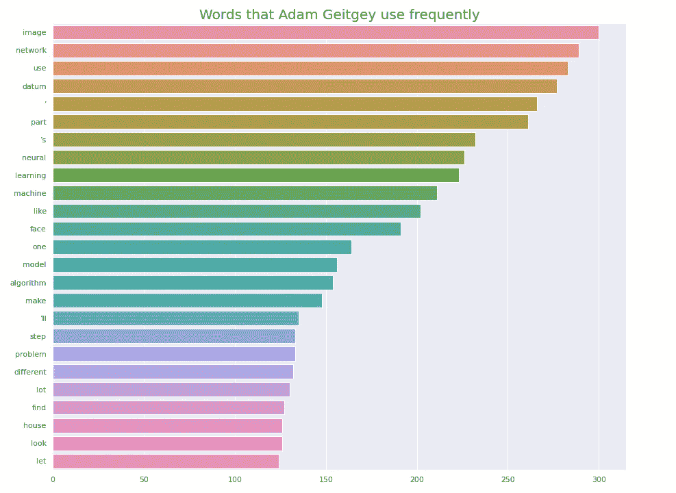

Adam Geitgey 的最常用单词条形图

我们可以看到，最常见的词是图像、网络、神经、学习和脸。他是否经常写关于使用神经网络(深度学习)的图像(人脸)的文章？

让我们检查一下

```
for title in df.loc[df['author'] == 'Adam Geitgey']['title']:
    print(title)
```


亚当·盖特吉的头衔

我们可以看到，他写了很多关于深度学习和人脸识别的文章

[**斯拉夫伊万诺夫**](https://medium.com/@slavivanov)

```
Author = 'Slav Ivanov'make_barplot_for_author(Author)
```

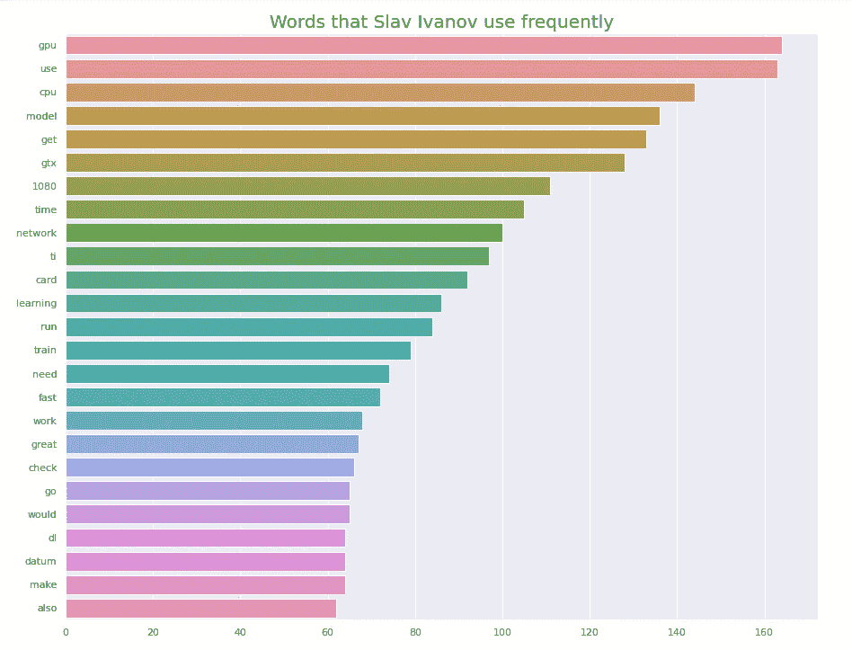

斯拉夫·伊万诺夫最常用词柱状图

使用频率最高的词是 GPU、use、CPU。最常用的词也有，网络，模型，学习，那么他有没有在 GPU 上写过一些关于深度学习/神经网络的文章？

```
for title in df.loc[df['author'] == 'Slav Ivanov']['title']:print(title)
```

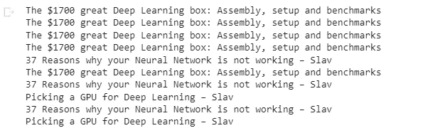

斯拉夫·伊万诺夫的头衔

正如猜测的那样，他对深度学习/神经网络更感兴趣，写了两篇关于 GPU 的文章。

[**亚瑟·朱利安尼**](https://awjuliani.medium.com/)

```
Author = 'Arthur Juliani'make_barplot_for_author(Author)
```

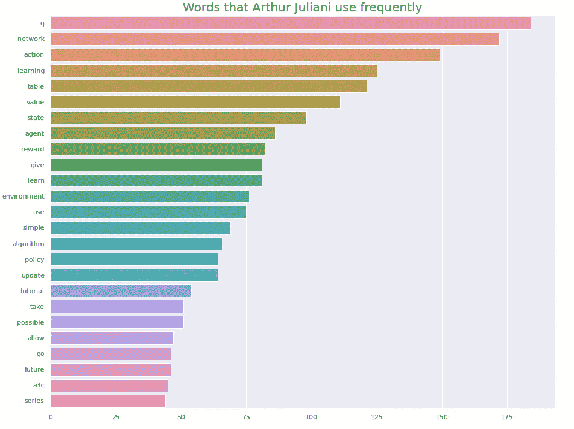

Arthur Juliani 的最常用单词条形图

最常用的词是 q，网络，行动，状态，代理，奖励，学习…作为一个在强化学习领域工作了 3 年的人，我很容易猜到他说的是强化学习。

让我们检查一下:

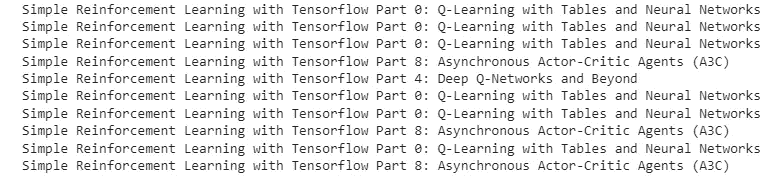

亚瑟·朱利安尼的头衔

抓住你了…

因此，我们能够根据作者使用的最常见的单词来预测作者的兴趣。

而我现在也属于字数在 1500 到 4000 之间的作者一类。

请继续关注我即将发表的文章…

快乐编码…