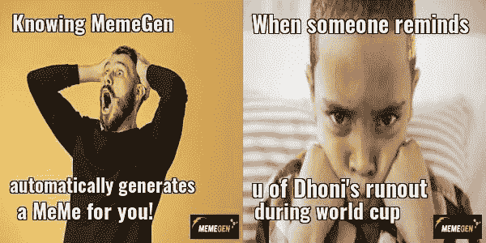
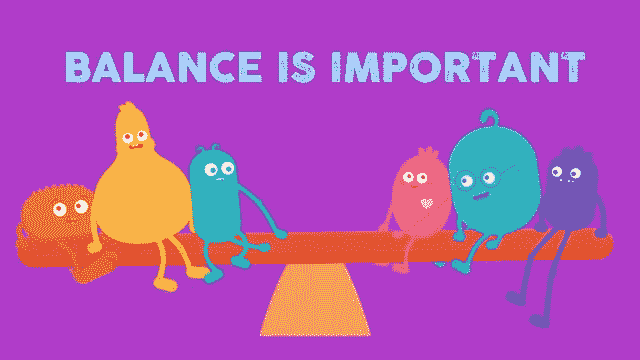
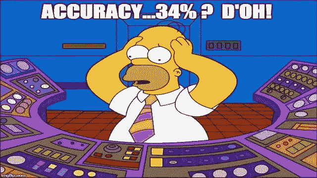
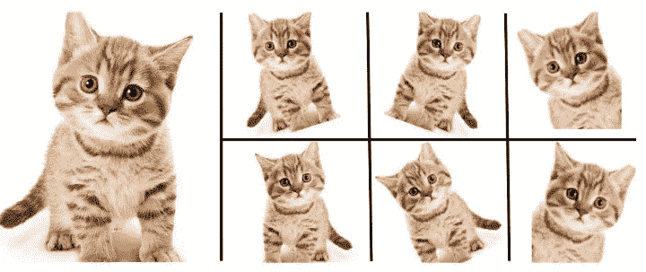
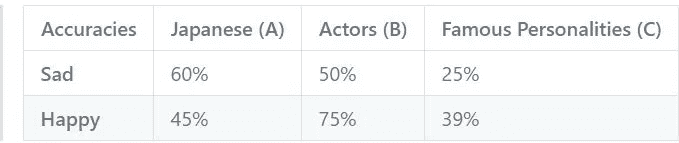

# 使用深度学习的迷因生成器(MemeGen)

> 原文：<https://pub.towardsai.net/meme-generator-memegen-using-deep-learning-d133e6fc363f?source=collection_archive---------1----------------------->

## 深度学习

MemeGen 是一个 web 应用程序，它根据给定图像中人脸的表情自动生成迷因。用户只需上传一张清晰的照片，应用程序就会分析照片中人的表情，产生有趣的迷因。要使用网络应用程序，[点击此处。](https://bit.ly/developerscosmos-memegenerator)

## 这里有一些由 MemeGen 生成的图片:



## 工作原理:

要理解这个项目的运作，你需要理解几个奇特的术语，例如:

*   欠采样
*   过采样
*   图像增强
*   卷积神经网络
*   自动 ML

难怪有一个庞大的图像数据集在幕后发挥作用。图像数据集带来了 CNN 的重要性。如果你不熟悉这个术语，请继续阅读！

## 平衡数据:

首先，让我们理解好数据的重要性，更重要的是，平衡的数据。简单来说，平衡数据是指所有可用类别的数据相等或几乎相等的情况。



这是平衡数据的动画版本

## 那么如果它们不相等会发生什么呢？

这个问题的可能答案是，你的模型最终会是蹩脚的，归功于数据集！这是因为，当你用 1000 张 A 类图片和 300 张 B 类图片训练一个模型时，很明显，这个模型看到了更多的 A 类图片，当你给它看一张 B 类图片并让它预测时，很有可能，它会预测这个图片是一个显而易见的原因。如果这看起来不太可能，想象一个模型试图在 10 个类之间取得平衡，每个类的数据变化很大(10000，800，350，500…)。



我打赌你不想让你的模特代替他！

## 现在的问题是，我们如何克服这个问题？

> *所以有两种可行的解决方案，过采样和欠采样！简单来说，*

*   如果我们减少多数类的数据以匹配少数类的数据量并减少样本，该过程将被称为*欠采样*。
*   如果我们不想错过已经掌握的高质量数据，并设法增加另一个数据较少的类的样本，我们最终会增加样本总数，这被称为*过采样*。

这个故事的寓意是，数据分析中的过采样和欠采样是用来调整数据集类别分布的技术。

## 图像增强:

图像增强是一种用于人工扩展数据集的技术。当我们得到一个只有很少数据样本的数据集时，这是很有帮助的。它可以被认为是一种过采样的方法，主要的区别是，当你没有足够的数据时(对于所有类的组合)进行扩充，而过采样是当你在一个类中没有足够的数据时使用的一种技术。



从一张照片中获得 6 张不同的照片

现在我们已经有了足够的数据，并准备好建立一个模型，你认为哪一个过程会给我们最好的输出？深度学习和图像的结合立即在我们的脑海中响起了熟悉的铃声，绝对是卷积神经网络！

> CNN 是一种人工神经网络，其他类型有 MLP、RNN、浅层神经网络、序列对序列模型等。ANN 的灵感来自于生物神经系统处理信息的方式。它由大量高度互联的处理元件(神经元)组成，这些元件协同工作以解决特定的问题。MemeGen 的模型是基于 CNN 算法的，所以让我们简单看看它到底是做什么的。

## 卷积神经网络(CNN):

顾名思义，CNN 的工作方式与人类大脑神经元的工作方式非常相似。你是否曾经密切关注过我们的大脑是如何识别人、物体和奇异的事物的？它发生得如此之快，以至于我们大多数人都没有再去想它。当我们看到一幅图像时，我们扫描图像以理解图像的不同特征。然后，我们的大脑将扫描到的不同局部特征结合起来，对图像进行分类。这正是 CNN 的工作方式。它获取一幅图像，将其分解成几个相等的部分，并对其进行分析，然后将每个这样的部分的理解结果进行重叠。


CNN 可以通过清楚地将它与两个关键元素联系起来来理解:

```
1\. Convolutional Layer
2\. Kernel K
```

卷积层是 CNN 的核心构建模块，它有助于特征检测。核 K 是一组可学习的过滤器，并且与图像相比在空间上较小，但是贯穿输入图像的整个深度。

下面是我们在互联网上找到的一个非常令人满意的关于 CNN 工作方式的比喻:

如果你是一名侦探，你在黑暗中看到一幅很大的图像或一张照片，你会如何辨认？你将使用手电筒扫描整个图像。这正是我们在卷积层所做的。Kernel K 是一个特征检测器，相当于图像 I 上的手电筒，我们正在尝试检测特征，并创建多个特征图来帮助我们识别或分类图像。我们有多种特征检测器来帮助边缘检测，识别不同的形状、弯曲或不同的颜色等。

> *与传统的图像分类方法相比，CNN 有几个优点，其中之一是平移不变性，这通常意味着即使物体发生平移、旋转或轻微变形，它也能识别出物体。*

这只是 CNN 的一个简报。看似简单，实则涉及大量的数学计算和对神经网络的理解。如果你想了解更多关于 CNN，[点击这里。](https://towardsdatascience.com/simple-introduction-to-convolutional-neural-networks-cdf8d3077bac)

## 自动 ML:

正如你所猜测的，Auto ML 是自动训练机器学习模型并在提供数据集时找到最佳可能模型的过程。


描述了模型如何自动试验数百万个参数以找到最佳值

在我们的例子中，我们使用了 3 个不同的数据集来获得最佳结果。

*   *第一个数据集:*日本面孔
*   *第二个数据集:*印度演员的脸部照片
*   *第三数据集:*名人的脸部图像

下面是它如何工作的一个例子:



这里要注意的一点是，模型 A 对于悲伤表情给出了很好的精度，并且 60%的时间是正确的，而模型 C 对于悲伤表情给出了不充分的精度，并且预测它是某个其他表情，预测大约 25%的时间正确。因此，我们为每个类别(表达式)的模型分配权重，以获得最佳结果。

> *例如，对于 sad 表达式，模型 A 的权重将是 0.8，而 B 和 C 的权重将分别是 0.3 和 0.1。*

这确保了所有现有的模型适当地发挥它们的作用，并提供最准确的结果。

## MemeGen 中使用的其他技术堆栈:

除了上述内容，我们还在构建 MemeGen 时使用了以下内容:

```
1\. Flask as a framework 
2\. Chef as Configuration Management tool
3\. Google Cloud Platform as Cloud Service
```

要了解上述术语的含义和作用，请访问我们的 GitHub 资源库[“covid 19 反馈应用”，](https://developers-cosmos.github.io/COVID19-FeedbackApplication/)，我们在这里已经详细解释清楚了。

完整的代码可以在 GitHub [这里找到。](https://github.com/developers-cosmos/Meme-Generator)

## 结论:

因此，该应用程序是使用多种技术堆栈开发的。做这个项目背后的核心原因之一就是为了了解深度学习、云服务、厨师、图像增强等不同方面。希望你喜欢阅读 Meme Generator 中使用的所有技术栈的简化版本。如果你发现有改进的地方，请随时提出修改建议。如果你想联系，**在**[**LinkedIn**](https://www.linkedin.com/in/ritheesh-baradwaj-yellenki-8a6988173/)**上联系我。**我会很快再赶上你的。在那之前，呆在家里，注意安全！