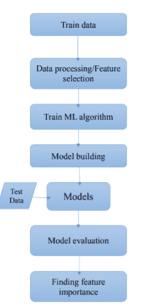
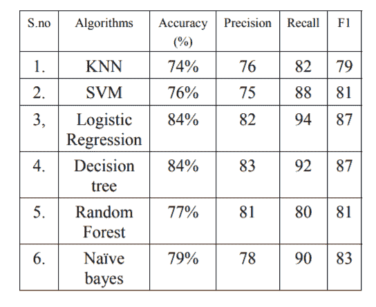
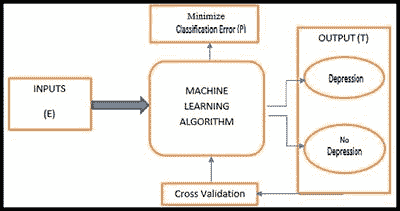

# 公司中的心理健康和机器学习

> 原文：<https://pub.towardsai.net/mental-health-and-machine-learning-in-companies-53800724f281?source=collection_archive---------6----------------------->

## [机器学习](https://towardsai.net/p/category/machine-learning)

## 机器学习对于预测员工的心理健康有怎样的帮助，是如何实现的？

参考:[乔纳森·道尔顿](https://www.jonathondalton.com/)

## 心理健康介绍

心理健康包括我们的情绪、心理和社会福祉。它影响着我们的思考、感受和行动。它也有助于决定我们如何处理压力，如何与他人相处，以及如何在生活中做出选择。它在人生的每个阶段都是至关重要和具有挑战性的，从童年和青春期到成年，尤其是对职业人士而言。随着时间的推移，现代化(忙碌)的生活方式和工作量对人们产生了影响，使他们更容易患精神障碍，如情绪障碍和焦虑症。因此，职业人士出现心理健康问题的风险会增加。为了解决这个问题，企业向员工提供心理健康激励，但这还不足以解决问题。

## 机器学习和心理健康

机器学习(ML)作为最新一代的人工智能技术之一，已经在从计算机视觉到医疗保健的许多现实应用中表现出优异的性能。世界各地的神经科学家和临床医生正在使用机器学习来为患者制定治疗计划，并在精神健康障碍发生之前识别出一些关键标志。其中一个好处是，机器学习有助于临床医生预测谁可能面临特定疾病的风险。

## 职业人士的心理健康

在职场人士中，许多员工遭受精神创伤、抑郁和焦虑，有时会导致自杀等极端行为。已经有各种各样的精神疾病影响到员工，缺乏意识会在后期导致严重的问题。关于如何实现机器学习来预测不同行业员工的心理健康，有许多调查、评论和研究论文都有坚实的基础。

## 文章的背景

论文链接:[https://ieeexplore.ieee.org/document/9368923](https://ieeexplore.ieee.org/document/9368923)

在本文中，我将对一篇论文进行评论，该论文利用 2019 年心理健康调查的数据实施了许多机器学习算法，该调查包含科技和非科技公司员工的工作专业人士的数据。在该技术中，数据被处理以发现影响雇员精神健康的特征或可以帮助预测雇员精神健康的特征。该特征可以是个人的或职业的。

在现代化的世界里，职业人士由于诸如同辈压力、期限短、竞争等原因而承受着巨大的压力。所有这些都有助于建立精神压力，从而慢慢导致心理健康障碍。在美国，18%的工作人口，即 4000 万人患有精神健康疾病。

## 员工的疾病类型

精神健康障碍分为两种类型，第一种是情绪障碍，第二种是焦虑障碍。情绪障碍是情绪的严重变化，表现为情绪不一致或某些特定情绪的突然变化/放大，可能会感到极度悲伤或易怒。当他们开始干扰或破坏正常的生活活动时，我们称之为情绪障碍，对于职业人士来说，这种干扰表现在工作表现上，比如很难完成最后期限。焦虑是一种正常的情绪，但焦虑症是完全不同的情况。在这种情况下，我们会莫名其妙地感到过度的恐惧和焦虑，过度的焦虑会让人不去开会，不去社交，等等。

## 使用的机器学习技术

监督学习算法用于该应用，例如支持向量机(SVMs)、逻辑回归、k 近邻(kNN)、决策树、随机森林和朴素贝叶斯。

## 数据流程图

参考:[https://ieeexplore.ieee.org/document/9368923](https://ieeexplore.ieee.org/document/9368923)

## 结果

各个机器学习算法的精度如下:

参考:【https://ieeexplore.ieee.org/document/9368923 

经过分析，我们发现决策树分类器的性能最好。因为它具有最好的准确度和精确度，准确度为 84%，精确度为 83%，其次是逻辑回归，准确度为 84%，精确度为 82%，其次是朴素贝叶斯，准确度为 79%，精确度为 78%，随机森林，准确度为 77%，精确度为 81%，SVM，准确度为 76%，精确度为 75%，KNN 表现最差，准确度为 74%，精确度为 76%。

因此，影响具有选定属性的精神健康障碍的特征，

> *1。不管这家公司是不是科技公司。*
> 
> *2。员工的年龄。*
> 
> *3。员工的性别。*
> 
> *4。精神健康疾病家族史(如有)。*
> 
> *5。精神健康障碍的个人史。*
> 
> *6。雇主提供的精神健康福利或护理。*
> 
> *7。与雇主讨论心理健康状况。*

此外，所选特征的特征重要性表明，精神健康疾病史在疾病预测中贡献最大，其次是家族史。我们还发现，其余的特征对预测的贡献最小，性别是最重要的特征，包括雇主提供的精神健康福利或护理、年龄，以及与雇主讨论精神健康状况对精神健康障碍的预测几乎没有任何贡献。

## 其他相关研究

参考:[https://www . frontier sin . org/articles/10.3389/fdata . 2020.00015/full](https://www.frontiersin.org/articles/10.3389/fdata.2020.00015/full)

*   在[的论文](https://ieeexplore.ieee.org/document/8537258)中，为了预测焦虑症，作者提出了基于个人工作地点(家庭或办公室)和其他一些个人因素的规则，并使用逻辑模型树进行预测。该模型是基于逻辑回归和决策树的混合模型，并提供更好的准确性。
*   在[的论文](https://ieeexplore.ieee.org/document/6866115)中，作者使用了一种基于智能手机的传感器系统来监测或发现双相情感障碍患者的状态变化。还有，开发一个召回率和准确率在 97%左右的预警系统。
*   在[论文](https://ieeexplore.ieee.org/document/7373691/)中，作者提出了一种用于多模态应力监测和检测的可穿戴式头带。
*   在[研究](https://ieeexplore.ieee.org/document/7783185)中，作者预测了女性中的广泛性焦虑症，并提出女性比男性更容易患 GAD(广泛性焦虑症)几乎两倍；作者能够用随机森林以 90%的准确度预测 GAD。
*   在[研究](https://pubmed.ncbi.nlm.nih.gov/24240031/)中，作者使用可穿戴传感器，通过心率变异性进行基于双极的预测。
*   在[论文](http://ieeexplore.ieee.org/document/8782395/)中，作者使用 ML 算法来检测工作员工的压力，并发现了导致精神压力的特征。随机森林的精确度和准确度最高，为 75.13%。
*   在[研究](https://ieeexplore.ieee.org/document/8925142)中，作者使用 HRV 检测压力，并使用多种最大似然算法预测压力。
*   在[论文](https://www.researchgate.net/publication/313802835_A_study_on_the_stress_identification_using_observed_heart_beat_data)中，作者使用心跳数据来识别压力，并使用 ML 算法进行分类，以 5 分钟的间隔收集数据，这样在 5 分钟的心跳数据收集后，用户有 5 分钟的放松间隔。

## 结合机器学习对员工心理健康的研究成果进行总结

近年来，人们对 ML 在精神健康方面的潜在应用越来越感兴趣，探索性研究也越来越多。本文试图提供这一研究领域的概述，并强调当前的趋势和挑战。为了塑造未来的工作方向，我们讨论了当前的方法和潜在的步骤，以实现精神卫生保健有效和可实施的 ML 系统。

具体而言，本文研究了获取大规模、高质量数据的限制和要求如何对研究设计构成挑战，并敦促研究人员努力更深入地了解 MHPS 和有精神健康经历的人所面临的具体需求或挑战。对设计空间更深入和更有创造性的探索可以为 ML 未来的研究问题和问题场景提供有意义的信息，以确保该领域能够真正受益于新的数据工具。这可能会超越更明显的精神健康的 ML 应用。与数据访问密切相关的是需要更好地帮助人们评估数据共享的潜在好处，以及潜在好处如何减轻或超过潜在风险(例如*)。*干预措施的有效性)，以便他们能够对数据使用做出更明智的选择，并帮助他们信任和接受数据应用*。*

此外，虽然在文献中经常争论新的 ML 模型比现有的研究和临床方法有优势，但建议将这些视为知识生成的补充方法。此外，未来的研究还有更大的空间来扩展对 ML 干预如何成为有价值的工具的探索，不仅解决精神卫生保健接受者的需求，而且支持精神卫生保健专家的实践。在应用多元智能方法获取和评估丰富的人类需求和经验时，研究人员还应该注意在数据分析、解释和表示中不要从个人及其独特的背景中翻译和抽象出太多东西。

## 参考

*   [https://www.mentalhealth.gov/basics/what-is-mental-health](https://www.mentalhealth.gov/basics/what-is-mental-health)
*   [https://ieeexplore.ieee.org/document/9368923](https://ieeexplore.ieee.org/document/9368923)
*   [https://towards data science . com/machine-learning-and-mental-health-7981 a 6001 BD 5](https://towardsdatascience.com/machine-learning-and-mental-health-7981a6001bd5)
*   【https://dl.acm.org/doi/fullHtml/10.1145/3398069 