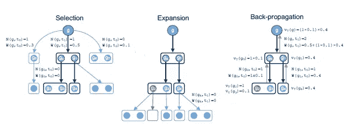
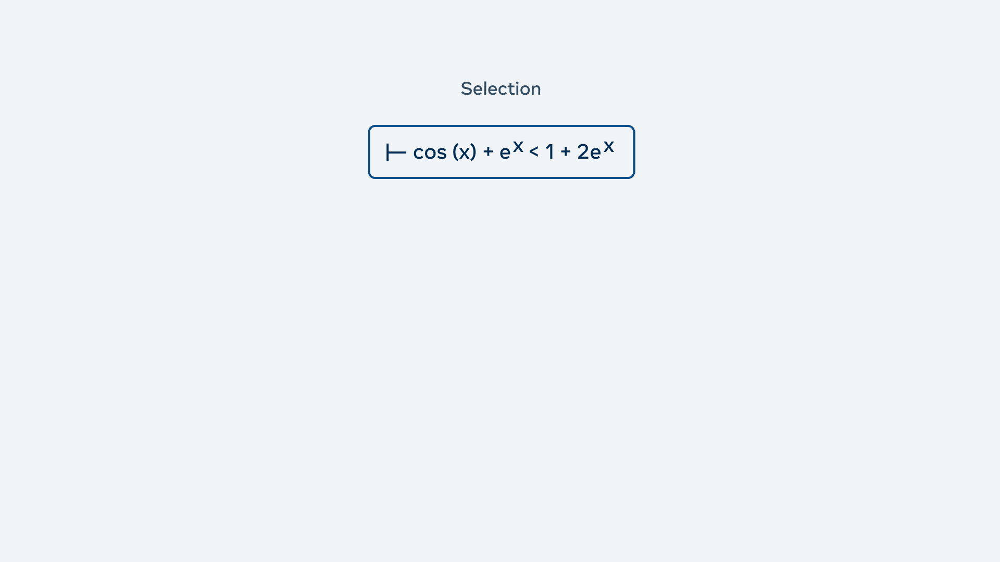
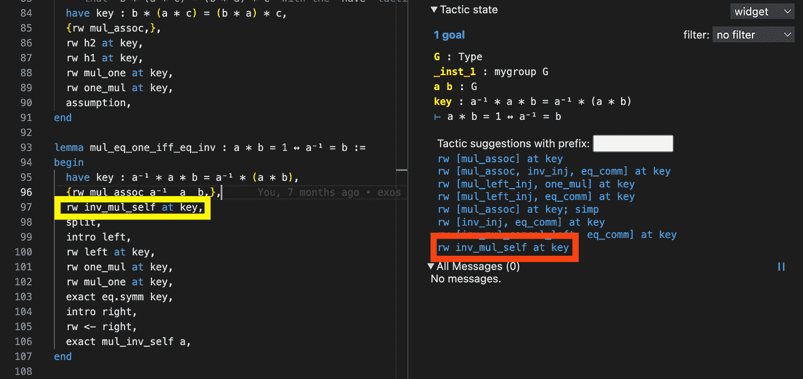

# Meta AI 新模型可以解决国际奥数水平问题

> 原文：<https://pub.towardsai.net/meta-ai-new-model-can-solve-international-math-olympiad-level-problems-673dfb94f526?source=collection_archive---------1----------------------->

## 新算法结合了强化学习和蒙特卡罗树搜索，以显示独特的数学推理水平。

来源:[https://then extweb . com/news/human-intuition-machine-reasoning-ais-helping-us-solve-giant-math-puzzles-syndication](https://thenextweb.com/news/human-intuition-machine-reasoning-ais-helping-us-solve-giant-math-puzzles-syndication)

> 我最近创办了一份专注于人工智能的教育时事通讯，已经有超过 15 万名订户。《序列》是一份无废话(意思是没有炒作，没有新闻等)的 ML 导向时事通讯，需要 5 分钟阅读。目标是让你与机器学习项目、研究论文和概念保持同步。请通过订阅以下内容来尝试一下:

 [## 序列

### 与机器学习、人工智能和数据发展保持同步的最佳资源…

thesequence.substack.com](https://thesequence.substack.com/) 

数学推理是新一代人工智能(AI)方法最雄心勃勃的目标之一。最近几个月，OpenAI 在这个领域迈出了重要的一步，在[发布了一个模型，作为精益数学环境的定理证明器](https://openai.com/blog/formal-math/)。同样， [DeepMind 的 AlphaTensor](https://www.deepmind.com/blog/discovering-novel-algorithms-with-alphatensor) 能够发现新的矩阵乘法算法。就在几天前，Meta AI 展示了它对深度学习这一具有挑战性的领域的贡献，推出了 HyperTree Proof Search (HTPS)，这是一个能够解决几个国际数学奥林匹克(IMO)问题的深度学习模型。这种方法展示了重要的能力，表明数学推理肯定是可能的深度神经网络。

# 数学推理和 IMO 问题对人工智能的挑战

德国天才数学家卡尔·弗里德里希·高斯称数学为“科学女王”，指的是它对其他学科的影响。形式数学是一种通用语言，用来表达许多科学发现的基础。从深度学习的角度来看，数学推理提出了一些基本挑战:

**一、无限行动空间:**深度神经网络在围棋或多人游戏等搜索空间较大的问题上取得了巨大进展。然而，形式数学定理经常处理无限搜索空间。在数学定理证明中，我们看到的不是一组有限的、很好理解的动作，而是需要创建无限组数学结构才能得到最终证明。

**二。缺乏自我游戏:**强化学习模型形式的自我游戏已经成为在具有大搜索空间的环境中取得显著进展的技术之一。然而，这种技术在数学定理证明中是不切实际的。给定一个数学陈述，并不总是有一个显而易见的方法来将其重构为更简单的中间步骤，这些步骤可用于构建正式的策略。

在数学推理领域，IMO 问题被认为是人工智能领域的一个主要障碍。世界上几个顶尖的人工智能实验室合作举办了一场[大挑战](https://imo-grand-challenge.github.io/)来建立可以解决 IMO 级数学问题的深度学习模型。IMO 问题被认为是高中数学竞赛的顶级问题，不仅涉及高级数学知识，还涉及复杂的多步推理。

# 超树证明搜索(HTPS)

顾名思义，Meta AI 的 HTPS 的核心思想是基于类似于搜索引擎中使用的树搜索模型。然而，HTPS 用非常先进的深度学习方法补充了树搜索技术。根据定义，数学定理证明在不完整的环境中运行，因为在大多数步骤中，解决方案的最终序列是不可见的。因此，HTPS 需要将定理证明的当前“状态”与对问题的“不完全”理解联系起来。HTPS 依赖于与三个主要证明助手相关的强化学习模型:

一.**精益:**数学定理证明的完整编程语言。

二。 **Metamath:** 可以表达数学定理和可验证证明的语言。

三。方程:一个更简单和更有表现力的数学环境，也是由 Meta 创建的。

使用证明助手允许强化学习模型建立逐步推理知识。最终，该模型构建了一个推理图，其中当前状态代表一个节点，每个可能的下一步代表一条边。根据这个图表，HTPS 使用了一个三步算法:

*I .使用搜索策略选择具有扩展节点层的超树。*

*二。用新的战术扩展选择的节点。*

*三。使用反向传播模型来优化超树的节点。*

图片来源:Meta AI

你可以看到这个算法在方程中的作用:cos(x)+ex< 1 + 2ex in the following tree.

Image Credit: Meta AI

HTPS was able to solve several IMO problems with incredible levels of efficiency. Meta AI also enabled HTPS through the [Lean Visual Studio Code(vs Code)插件](https://marketplace.visualstudio.com/items?itemName=jroesch.lean)，它允许数据科学家直接与模型交互。

图片来源:Meta AI