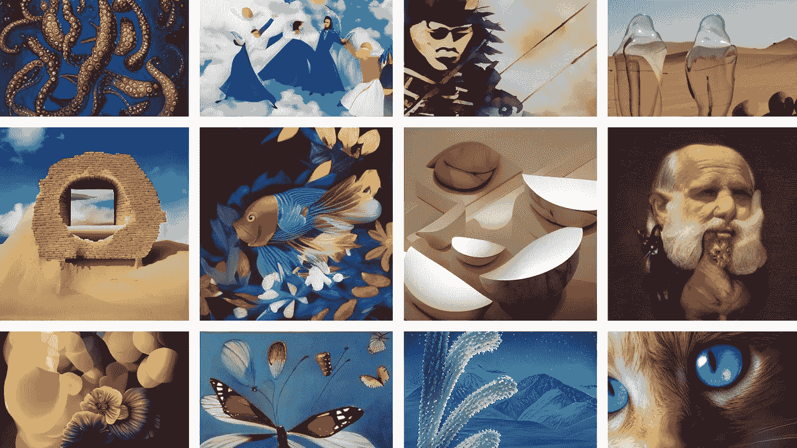
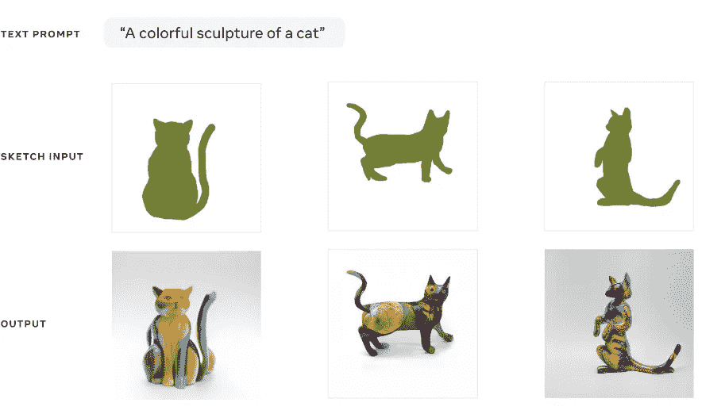
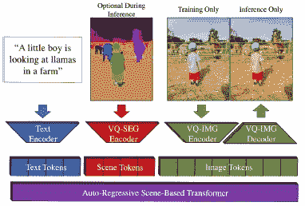
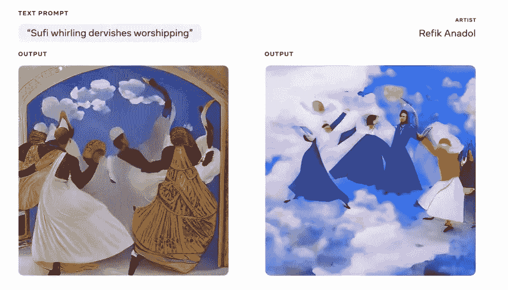
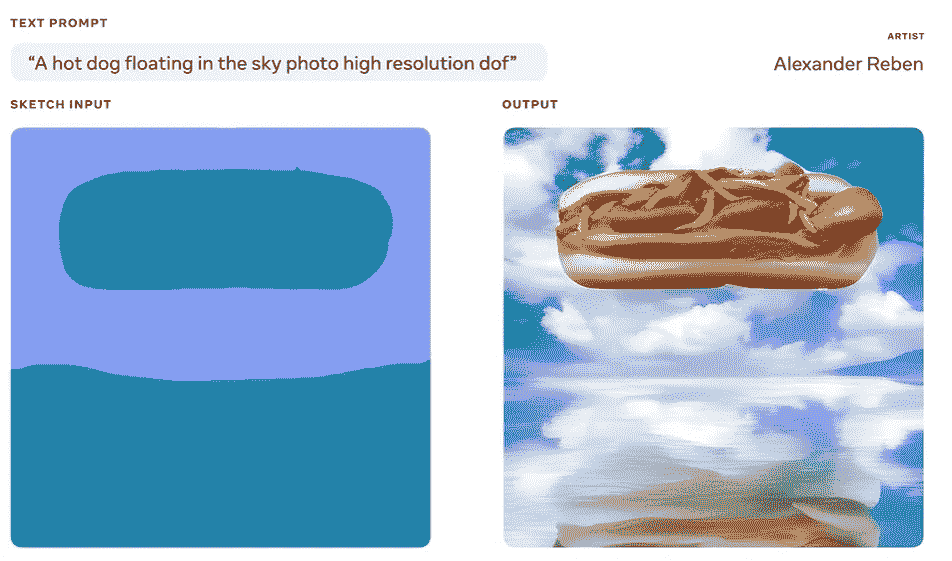
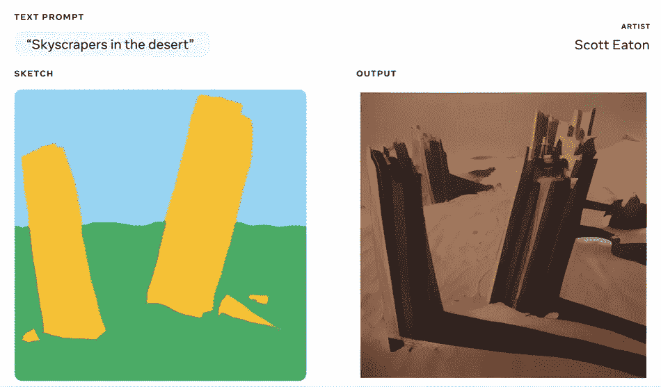
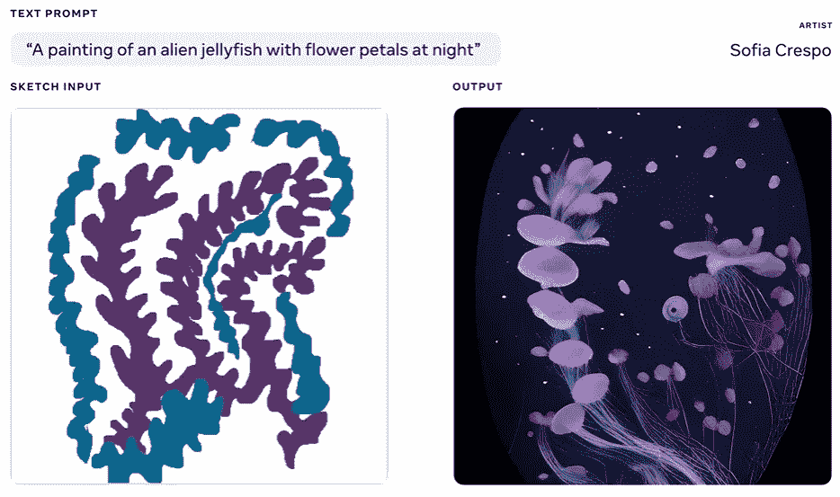

# Meta AI 的制作场景推动了人工智能艺术合成的边界

> 原文：<https://pub.towardsai.net/meta-ais-make-a-scene-pushes-the-boundaries-of-ai-art-synthesis-4792c94b2d3f?source=collection_archive---------2----------------------->

## 新的模式使用文本到图像和图像到图像的生成来产生惊人的艺术输出。

图片来源:Meta AI

> 我最近创办了一份专注于人工智能的教育时事通讯，已经有超过 125，000 名订户。《序列》是一份无废话(意思是没有炒作，没有新闻等)的 ML 导向时事通讯，需要 5 分钟阅读。目标是让你与机器学习项目、研究论文和概念保持同步。请通过订阅以下内容来尝试一下:

 [## 序列

### 与机器学习、人工智能和数据发展保持同步的最佳资源…

thesequence.substack.com](https://thesequence.substack.com/) 

最近几个月，人工智能(AI)在文本到图像合成方面的研究已经脱离了图表。像 OpenAI 的 DALL-E 2、GLIDE 或谷歌的 Parti 或 Imagen 这样的模型已经显示了使用深度学习模拟创造性表达的可能性。尽管取得了进展，但这些模型在生成捕捉文本输入的完整语义的图像方面仍有非常明显的局限性。最近，Meta AI 公布了一种叫做[制作场景](https://arxiv.org/abs/2203.13131)的新方法，该方法使用一些聪明的技术来解决文本到图像合成中的一些基本挑战。

使用文本到图像合成来模拟人类创造性表达的过程目前面临各种障碍:

**可控性:**使用文本作为唯一的输入，很难捕捉物体、表情、形状和图像的其他基本方面之间的空间关系。

**质量和分辨率:**如今大多数文本到图像模型都被限制为 256x256 图像。

**人类感知:**由文本到图像合成方法产生的图像通常不强调与人类注意力和感知自然相关的特定对象。

# 大闹一场

Meta AI 的 Make-A-Scene 通过在一个高度可扩展的模型中结合文本到图像和图像到图像的生成，解决了上述一些挑战。使用草图形式的图像输入有助于提高产生的输出的准确性，细化位置、对象之间的关系、表情等方面。

图片来源:Meta AI

Make-A-Scene 的架构由一个使用文本和图像标记作为输入的自回归转换器组成。此外，变压器使用有条件控制的场景 tokes 使用分割地图。在推断阶段，从输入图像或直接从变换器生成分割标记。为了有效地管理损失，Make-A-Scene 使用矢量量化的变分自动编码器(VQVAE)来编码和解码图像和场景令牌，其中显式损失针对与人类感知和注意力相关的特定图像区域。

图片来源:Meta AI

结果是一个模型，它可以从文本输入输出高分辨率图像，同时提高生成输出的可控性和人类感知。

# 在实践中大闹一场

为了验证 Make-A-Scene 的功能，Meta AI 为 ofia Crespo、Scott Eaton、Alexander Reben 和 Refik Anadol 等知名人工智能艺术家提供了一个版本。他们的一些测试产生了惊人的发明:

图片来源:Meta AI

图片来源:Meta AI

图片来源:Meta AI

图片来源:Meta AI

制作一个场景代表了文本到图像合成的一个有趣的发展。Meta AI 没有开源实现，但已经有一些尝试来重现论文中概述的模型。