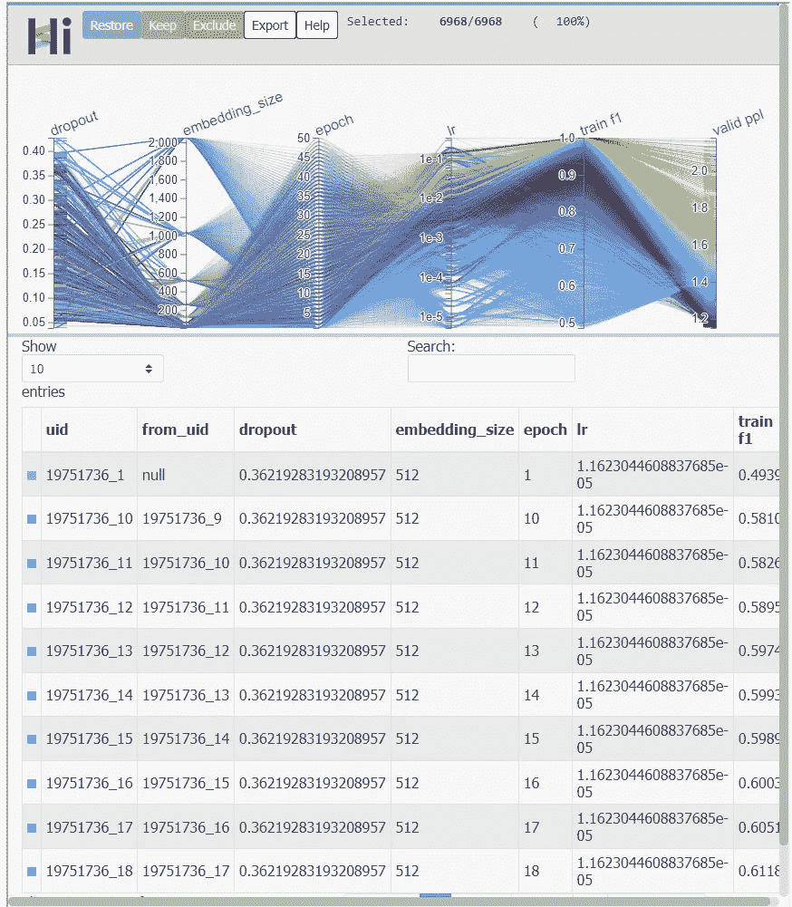

# Meta(脸书)HiPlot 是一个高维数据探索工具

> 原文：<https://pub.towardsai.net/meta-facebook-hiplot-is-a-tool-for-high-dimensional-data-exploration-d5b61459a6fe?source=collection_archive---------1----------------------->

## [机器学习](https://towardsai.net/p/category/machine-learning)

## 确定多维数据集中关系的最有用的开源堆栈之一。

来源:https://github.com/facebookresearch/hiplot

> 我最近创办了一份专注于人工智能的教育时事通讯，已经有超过 10 万名订户。《序列》是一份无废话(意思是没有炒作，没有新闻等)的 ML 导向时事通讯，需要 5 分钟阅读。目标是让你与机器学习项目、研究论文和概念保持同步。请通过订阅以下内容来尝试一下:

 [## 序列

### 订阅人工智能世界中最相关的项目和研究论文。受到 120，000+的信任…

thesequence.substack.com](https://thesequence.substack.com/?r=2g8vk) 

探索高维数据是深度学习应用的挑战之一。一年多前，Meta(脸书)开源了 [HiPlot](https://github.com/facebookresearch/hiplot) ，这是一款交互式可视化工具，旨在帮助人工智能研究人员使用平行图和其他图形方式来表示信息，从而发现高维数据中的相关性和模式。HiPlot 使用一种称为[平行图](https://en.wikipedia.org/wiki/Parallel_coordinates)的技术，这是一种可视化和过滤高维数据的便捷方式。

从功能的角度来看，HiPlot 提供了其他可视化工具的几个优势:

**交互性**。在 HiPlot 中，平行图是交互式的，这使得为不同的用例改变可视化变得容易。例如，您可以专注于沿一个或多个轴取范围或值的实验，根据另一个轴设置配色方案，重新排序或删除轴，或者提取特定的数据选择。

**简单性**:使用 HiPlots 只需要几行代码。通过带有“hiplot”命令的服务器。然后，您可以通过给定的 URL 访问它，并使用它来可视化、管理和共享您的实验。。

**基于群体的训练的可视化** : HiPlot 提供了一种简单的方法，通过不同数据点之间的边缘在 XY 图中可视化基于群体的训练实验。这种类型的可视化在深度学习实验中非常常见。

HiPlot 可用作独立的 CLI，嵌入 Jupyter 笔记本电脑或 web 服务器模型中。HiPlot [的当前版本在 GitHub](https://github.com/facebookresearch/hiplot) 中可用，并且已经集成到许多深度学习框架中。