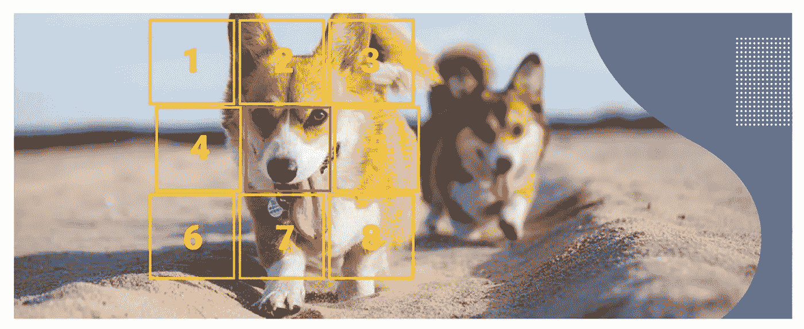
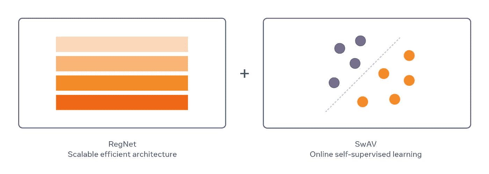
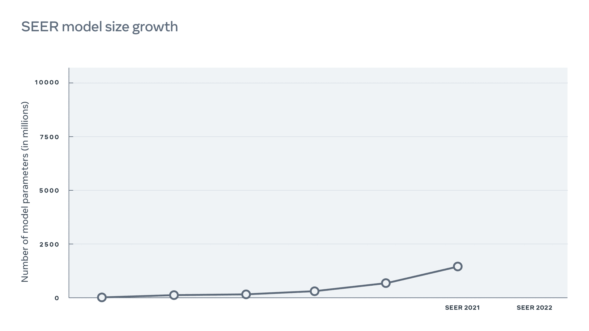
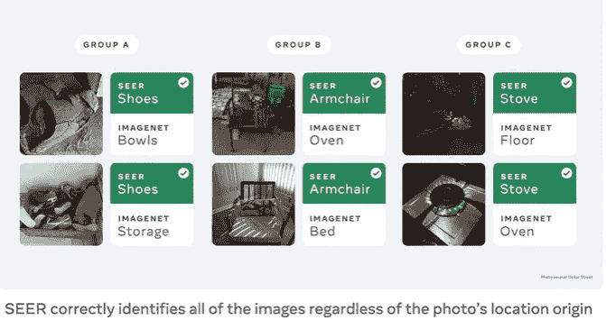

# Meta 刚刚更新了史上最大的计算机视觉模型

> 原文：<https://pub.towardsai.net/meta-just-updated-the-largest-computer-vision-model-in-history-133040810bf?source=collection_archive---------0----------------------->

## SEER v2 代表了自监督计算机视觉模型中最重要的发展之一。

来源:[https://analyticsindiamag . com/a-guide-to-self-supervised-learning-in-computer-vision/](https://analyticsindiamag.com/a-guide-to-self-supervised-learning-in-computer-vision/)

> 我最近创办了一份专注于人工智能的教育时事通讯，已经有超过 10 万名订户。《序列》是一份无废话(意思是没有炒作，没有新闻等)的 ML 导向时事通讯，需要 5 分钟阅读。目标是让你与机器学习项目、研究论文和概念保持同步。请通过订阅以下内容来尝试一下:

 [## 序列

### 订阅人工智能世界中最相关的项目和研究论文。受到 120，000+的信任…

thesequence.substack.com](https://thesequence.substack.com/?r=2g8vk) 

大约一年前，Meta(脸书)人工智能研究中心(FAIR)推出了一个大型的自我监督学习(SSL)模型。SEER(自我监督)是一个 SSL 模型，可以从大量随机图像中学习。SEER 的第一版被限制在惊人的 10 亿个参数。上周，FAIR 团队制作了 SEER 的更新版本，可扩展到 100 亿个参数，使其成为历史上最大的计算机视觉模型。

SEER 代表了有史以来最重要的 SSL 模型之一，它无疑拓展了计算机视觉的边界。

# SEER v1

SEER 的第一个版本是用惊人的 10 亿个参数构建的，SEER 利用了类似于 NLP 预训练模型的 SSL 技术。然而，SEER 是为计算机视觉任务设计的，正如我们所知，这对于 SSL 来说并不是最容易的任务。SEER 依靠两个基本构件来解决计算机视觉中 SSL 模型的局限性:

**算法:** SEER 需要一种可以从大量无监督图像中学习的算法。

**神经网络:** SEER 还需要一个足够大的卷积神经网络架构，以便从庞大的数据集中归纳出知识。

SSL 算法构建块基于 SwAV，它使用在线聚类来根据相似的概念对未标记的图像进行分组。事实证明，SwAV 的可扩展性明显优于其他替代方案，实现了一流的性能，而训练时间却缩短了 6 倍。对于神经网络架构，SEER 依赖于著名的 RegNets，这是一种可以扩展到数十亿个参数的 ConvNets 架构。此外，RegNets 可以针对不同的计算和内存需求进行高度优化。

图片来源:Meta AI

# SEER v2

SEER 的第二个版本被扩展到 100 亿个参数，使其成为同类中最大的计算机视觉模型。SEER v2 能够从超过 1 万亿张未标记图像的数据集中扩展高质量的要素。

图片来源:Meta AI

FAIR 评估了 SEER 在 50 个不同基准上的性能，包括不同的功能，如公平性、鲁棒性、细粒度识别以及不同的图像分类任务。除了超过其前身之外，SEER v2 在 70%的基准测试中超过了 SSL 和 supervised alternatives，并在其余测试中获得了相同的分数。

图片来源:Meta AI

SEER v2 代表了计算机视觉 SSL 模型的一次重大发展。结果不仅在性能方面令人印象深刻，而且在公平性和健壮性等相关领域也令人印象深刻。