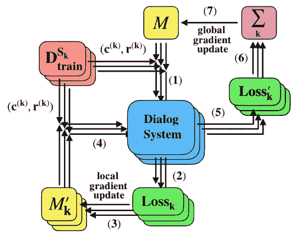
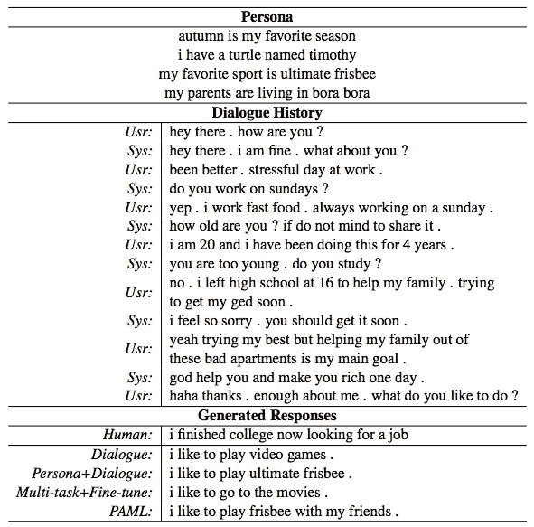
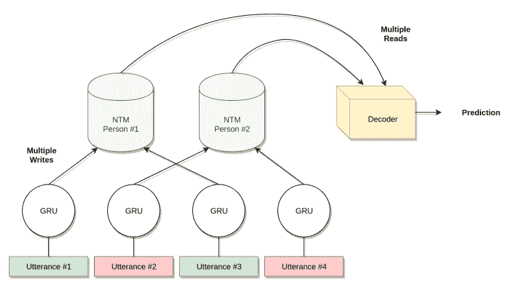
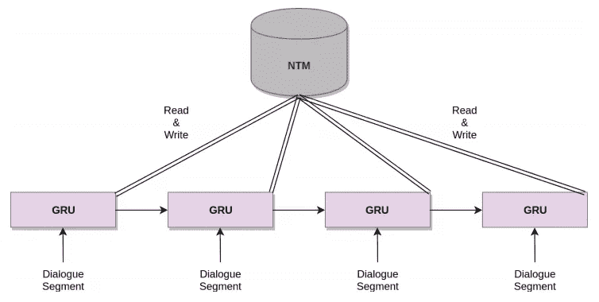
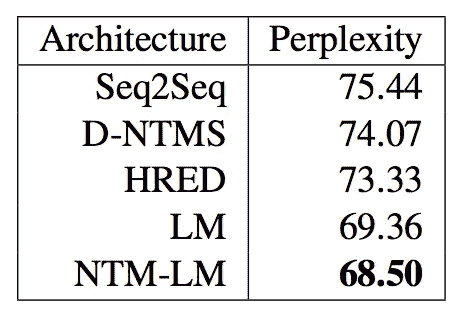

# 对话生成中的元学习

> 原文：<https://pub.towardsai.net/meta-learning-in-dialog-generation-41367e397086?source=collection_archive---------0----------------------->

## 学会学习

> 与众所周知的数据集不同，我们现实生活中的问题域总是只有很小的标记数据集，而我们可能无法在这种情况下训练出一个好的模型。[数据扩充](https://towardsdatascience.com/data-augmentation-library-for-text-9661736b13ff)是生成语法数据的方法之一，而元学习是解决这个问题的另一种方法。
> 
> 在这一系列的故事中，我们将经历不同的元学习方法。这项任务的动机之一是，即使是孩子也可以通过举一个例子来识别一个物体。模型不学习对特定类别进行分类，而是学习区分输入的模式。这一系列的元学习将涵盖 NLP 中的零镜头学习、一镜头学习、少镜头学习、元学习。

由[卢卡·布拉沃](https://unsplash.com/@lucabravo?utm_source=medium&utm_medium=referral)在 [Unsplash](https://unsplash.com?utm_source=medium&utm_medium=referral) 上拍摄的照片

在这个故事中，我们将介绍两种在对话生成中应用元学习的方法。在客户服务领域，公司需要雇用一名客户服务代表来支持客户的需求。随着业务的增长，CS 部门需要线性扩展。因此，对话系统被引入来解决这个问题。怎样才能建立一个对话系统，让它能自动和客户“聊天”？

作为元学习系列之一，我们将讨论元学习在对话生成中的应用。本文将介绍几种方法，包括`Domain Adaptive Dialog Generation via Meta Learning`(钱、于，2019) `Personalizing Dialogue Agents via Meta-Learning`(林等，2019)`Memory-Augmented Recurrent Networks for Dialogue Coherence`(多纳休等，2019)

# `Domain Adaptive Dialog Generation via Meta Learning`

钱和于提出了基于元学习的领域自适应对话生成方法(`DAML`)，扩展了模式不可知元学习`(MAML)` (Finn et al .，2017)。`DAML`它是通过利用多个单域对话数据，仅用少量训练样本就适应一个新的域来训练的。

> `*Model-Agnostic Meta-Learning (MAML)*`由 Finn 等人在 2017 年提出。这是一个与模型无关的框架。模型不可知意味着它不是特定于模型的。Finn 等人在回归、分类和强化学习问题上对该框架进行了评估，结果令人满意。如果你不熟悉这个故事，你可以看看它的更多细节。

为了设置实验，作者使用 3 个领域数据(即，“餐馆”、“天气”和“公共汽车信息搜索”)来训练初始化模型并针对目标领域(即“电影信息搜索”)进行微调

训练程序遵循`MAML`的做法(Finn et al .，2017)。首先，计算损失(#2)并更新临时模型的局部梯度(#3)。对于每一批数据，它将计算损失并一次又一次地更新局部梯度。完成一批数据后，将计算最终损失(#5)以更新全局梯度(#7)。

训练程序(钱，于，2019)

# 通过元学习个性化对话代理

林等(2019)提出将`MAML` (Finn 等，2017)应用于个性化对话代理问题。人物角色不可知的元学习(PAML)通过利用来自同一用户的少量对话样本来适应新的人物角色。

模型输入是人物角色描述(每人几个句子)和对话(一组话语)，输出是回应。设置类似于 DAML 除了 PAML 包括人物描述。

输入(人物和对话)和输出(生成的响应)的例子(林等，2019)

训练程序遵循`MAML` (Finn et al .，2017)的惯例。`MAML` (Finn et al .，2017)和正常训练的主要区别是第 4 步到第 8 步。该模型评估该批数据，并随后更新优化器(即步骤 9)。

训练程序(林等，2019)

# 对话连贯性的记忆增强递归网络

Donahue 等人在应用记忆增强元学习来解决对话系统问题时，没有扩展 MAML (Charles 等人，2017)的方法。他们提出了两种架构，分别是`Memory-augmented dialogue with dual NTMs (D-NTMS)`和`Single-NTM language model dialogue system (NTM-LM)`。

> [神经图灵机](https://arxiv.org/pdf/1410.5401.pdf) (NTM)是 Graves 等人在 2014 年提出的。一个快速的总结是，模型的回复既取决于内部记忆(即 RNN 隐藏状态)又取决于外部记忆(即神经网络之外的记忆库)来决定输出。如果你不熟悉这个故事，你可以看看它的更多细节。

直觉上，我们应该分开处理发言者，因为我们认为发言者应该有不同的角色、背景和其他属性。由于这种差异，如果在单个模型(在这种情况下是单个神经调音器)中处理所有扬声器，模型可能会受到影响并导致性能降级。因此，双重 NTM 建筑的灵感。不同的说话者的话语馈入特定的 NTM 以读取和更新外部记忆。

采用双 ntm 的记忆增强对话架构(D-NTMS) (Donahue 等人，2019 年)

然而，Donahue 等人发现，前述模型可能难以交换对话，并导致糟糕的性能。因此，提出了第二种方法。它利用 GRU 来处理多个序列问题，并且只使用一个 NTM 来进行外部存储器操作。

单一 NTM 语言模型对话系统(NTM-LM)架构(多纳休等人，2019 年)

从实验结果来看，NTM-LM 的性能优于传统的 Seq2Seq 和 D-NTMS 结构。

Ubuntu 对话语料库数据集上的性能比较(Donahue et al .，2019)

# 拿走

*   DAML 通过多种丰富的资源数据进行训练，有针对性地快速学习新领域。
*   PAML 通过人物角色数据和目标来快速学习新的人物角色。
*   单独处理发言者的发言可能不会产生好的结果。您可以在目标数据集上执行进一步的实验。

# 喜欢学习？

我是湾区的数据科学家。关注数据科学的最新发展，尤其是 NLP、数据扩充和平台相关领域。在 [LinkedIn](https://www.linkedin.com/in/edwardma1026) 或 [Github](https://github.com/makcedward) 上随时联系 [me](https://makcedward.github.io/) 。

# 延伸阅读

*   模型不可知的元学习解释
*   记忆增强的元学习解释
*   DAML 实现( [PyTorch](https://github.com/qbetterk/DAML) )
*   PAML 实现( [PyTorch](https://github.com/HLTCHKUST/PAML) )

# 参考

*   C.芬恩、p .阿贝耳和 s .莱文。[用于深度网络快速适应的模型不可知元学习](https://arxiv.org/pdf/1703.03400.pdf)。2017.
*   K.钱与俞正声。[通过元学习的领域自适应对话生成](https://arxiv.org/pdf/1906.03520.pdf)。2019.
*   Z.林，马多托，吴春生，冯佩凤。[通过元学习个性化对话代理](https://arxiv.org/pdf/1905.10033.pdf)。2019.
*   D.多纳休、y .孟和 a .拉姆斯基。[用于对话连贯性的记忆增强递归网络](https://arxiv.org/pdf/1910.10487.pdf)。2019