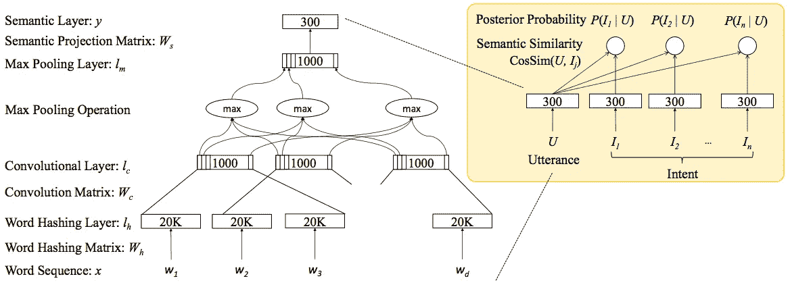
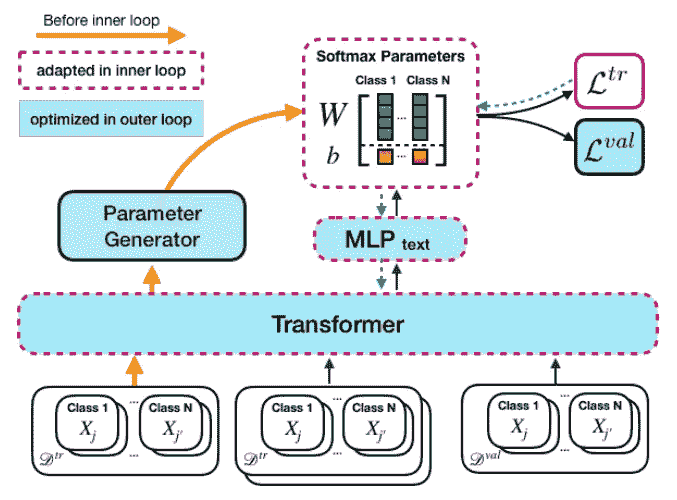

# 自然语言处理分类中的元学习

> 原文：<https://pub.towardsai.net/meta-learning-in-nlp-classification-db78fbcdf15c?source=collection_archive---------1----------------------->

## 学会学习

> 与众所周知的数据集不同，我们现实生活中的问题域总是只有很小的带标签的数据集，而我们可能无法在这种情况下训练出一个好的模型。[数据扩充](https://towardsdatascience.com/data-augmentation-library-for-text-9661736b13ff)是生成句法数据的方法之一，而元学习是解决这个问题的另一种方法。
> 
> 在这一系列的故事中，我们将经历不同的元学习方法。这项任务的动机之一是，即使是孩子也可以通过举一个例子来识别一个物体。模型不学习对特定类别进行分类，而是学习区分输入的模式。这一系列的元学习将涵盖 NLP 中的零镜头学习、一镜头学习、少镜头学习、元学习。

照片由[凯尔·格伦](https://unsplash.com/@kylejglenn?utm_source=medium&utm_medium=referral)在 [Unsplash](https://unsplash.com?utm_source=medium&utm_medium=referral) 拍摄

在几个关于元学习的故事之后，我将谈论我们如何在 NLP 的分类问题中使用元学习，因为分类是 NLP 中最常见的问题之一。

# 意图嵌入的零距离学习

Chen 等人将零触发学习应用于将文本输入和标签转移到嵌入中，使得它可以处理看不见的标签。

开发虚拟代理(例如苹果 Siri、谷歌助手、亚马逊 Alexa)的挑战之一是无限的意图。处理不可见标签的经典方法是为不可见标签准备大量训练数据，以便模型可以对其进行分类。但是，新的训练和标记这些数据可能需要更长的时间。因此，陈等人提出使用零短学习方法来动态地学习话语嵌入和意图嵌入。

零射击学习的意图嵌入架构(陈等，2016)

## `Subword`

为了解决词汇外(OOV)问题，引入了子词来处理所有的文本输入。所有的单词将分裂成三元组，这样我们可以限制嵌入的大小。例如，输入单词“email”将被拆分为“#em”、“ema”、“mai”、“ail”和“il#”，而#表示单词的开始和结束。

## 网络神经

在对单词序列进行标记后，它将进入嵌入层、CNN、最大池层和最终生成语义层。最后，使用余弦相似度来比较输入(即话语)和标签(例如，看到的标签或看不到的标签)。

# 跨不同自然语言分类任务少量学习

Bansal 等人将元学习应用于多自然语言处理(NLP)分类任务。这种方法的目标不是解决一个分类任务，而是解决多个分类任务，例如关系分类和自然语言推理。这种模型被命名为 LEOPARD(**L**earning to g**e**generate s**o**ft max**pa**parameters for**r**diverse class ),结合了迁移学习和元学习。

## 文本编码器

利用最先进的迁移学习技能，text encoder 利用 [BERT](https://towardsdatascience.com/how-bert-leverage-attention-mechanism-and-transformer-to-learn-word-contextual-relations-5bbee1b6dbdb) 将输入文本数据转换为嵌入数据。

## Softmax 参数

支持多个分类任务的一个挑战是许多标签在任务之间是不同的。因此，引入了用于特定任务分类的 softmax 参数来解决这个问题。

为了初始化 softmax 参数，LEOPARD 挑选第一个小批量数据来形成标签。换句话说，它使用 BERT (Devlin et al .，2017)，多层感知器(MLP)和 tanh 将文本转换为嵌入来表示类。

## 元学习

MAML (Finn et al .，2017)是一种著名的元学习方法。它包括训练模型的内环和外环。对于内环，在相同的训练集上需要多个训练步骤来获得更好的训练损失。要了解更多的 MAML，你可以访问这个网页获取更多信息。

由于 BERT 中有大量的参数，Bansal 等人将这些参数分成特定于任务和与任务无关的参数。BERT 的前 n 层被认为是任务不可知的参数，并且跨任务生成良好的特征表示。

LEOPARD 模型的架构(Bansal 等人，2019 年)

# 拿走

# 延伸阅读

*   了解[伯特](https://towardsdatascience.com/how-bert-leverage-attention-mechanism-and-transformer-to-learn-word-contextual-relations-5bbee1b6dbdb)
*   了解 [MAML](https://medium.com/towards-artificial-intelligence/meta-learning-in-dialog-generation-41367e397086)
*   理解[原型网络](https://medium.com/towards-artificial-intelligence/a-gentle-introduction-to-meta-learning-8e36f3d93f61)

# 关于我

我是湾区的数据科学家。专注于数据科学、人工智能，尤其是 NLP 和平台相关领域的最新发展。你可以通过[媒体博客](http://medium.com/@makcedward/)、 [LinkedIn](https://www.linkedin.com/in/edwardma1026) 或 [Github](https://github.com/makcedward) 联系我。

# 参考

*   Y.陈，杜德辉，和何。[通过卷积深度结构化语义模型进行扩展的意图嵌入的零次学习](https://www.csie.ntu.edu.tw/~yvchen/doc/ICASSP16_ZeroShot.pdf)。2016
*   T.班萨尔、r .贾和 a .麦卡勒姆。[学习跨不同自然语言分类任务的少量学习](https://arxiv.org/pdf/1911.03863.pdf)。2019