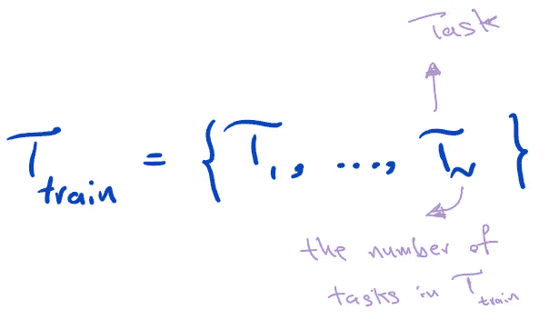
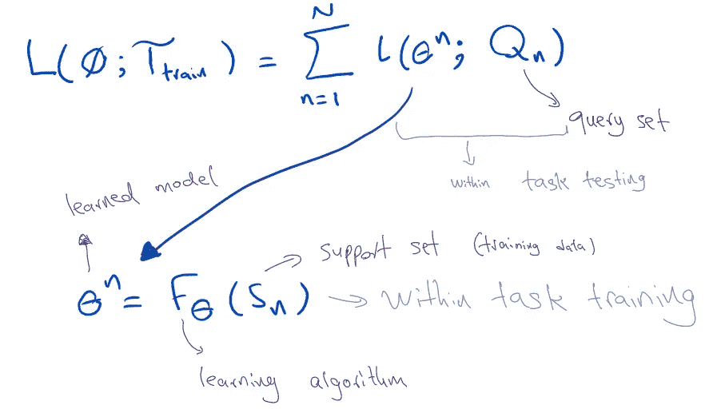
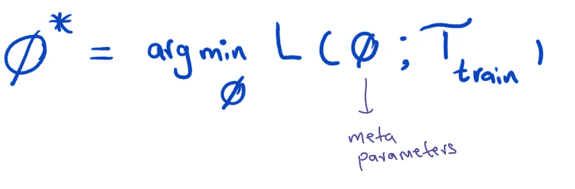
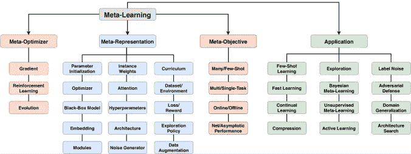

# 元学习简介

> 原文：<https://pub.towardsai.net/meta-learning-introduction-569bd144ee65?source=collection_archive---------2----------------------->

我们每天都会听到很多关于深度学习的新进展。我们希望我们的模型越来越好，在安全的决策过程中选择合适的基础学习者的风险最小。本文是对元学习的简要介绍。毫无疑问，在时序、自然语言等序列数据集上工作。需要大量的工作，外部因素会带来高度的不确定性。元学习就是学习学习我们用它来学习更好的学习算法的地方，例如，参数初始化，优化策略，网络架构等。近年来，我们已经看到对元学习兴趣的上升，因为它试图改进其学习算法。

[来源](https://giphy.com/gifs/lanlancat-mochidad-5266-5vlqsvkApaFjtvL6CZ)

# 为什么是元学习

元学习看起来很有前景的主要原因是它与当前机器学习算法的不同。它说我们通常从零开始用特定的目标训练我们的模型，用学习**新概念**的**限制**；然而，这不是我们在这种情况下的倾向，而/这是大的预训练模型等的主要原因。方法。因此，元学习可以被认为是一种从几个学习阶段的经验中学习的策略，然后利用这些经验来提高将来的表现。换句话说，它打算“**学习学习**”。

> 好吧，好吧！！！我不会说太多(好孩子👦🏻🙂).所以，让我们来看看它的工作方式。

# 元学习

## 整个等效过程(与机器学习相比)

在 ***机器学习*** 中，我们经常要在我们的大部分数据集(**训练数据**)上训练一个模型(实际上是**模型参数**，然后在**分类**和**回归任务中计算**模型的输出(预测)**和**真实数据** (loo 函数)之间的**距离**。**

在 ***元学习*** 中，我们考虑 fφ(。)作为**学习算法**其中它的输入是训练数据，输出是我们学习的模型参数。φ是元学习中我们喜欢学习的**元参数**。

定义 1

我们需要一个**任务**来**学习元参数**(**φ**)，这个被命名为 ***T_train (* 元训练任务 *):***

Eq 1。培训任务

## 元学习中的训练和测试数据集等价

每个任务包含两个集合，包括 1。 ***一个支持集(序号*** ) 2。 ***一个查询集合(Qn*** )其中这两个构造**对**的例子( ***D*** )。

**问)**这些套的作用是什么？

**A)** **支持**集合和**查询集合**是机器学习项目中**训练**和**测试数据**的等价物。

> *支持集=训练数据*
> 
> *查询集=测试数据*

*   请注意，这些是一样的，只要想象我们在元学习的宇宙中。

## 元学习中的损失函数等价

好的，那么我们是否以不同的方式定义损失函数？？

a)不完全是，这里的损失是说一个学习算法是如何“坏”或“好”地被在**训练任务** (T_training)上的**元参数(**φ)参数化；看等式 2:

等式 2

定义 2 指出:

首先，我们使用我们的**支持集** ( ***Sn*** )(训练数据)来**训练**我们的模型并实现**学习模型**。(称为 ***任务内培训*** )

第二，**在**查询集** ( ***Qn*** )(测试数据)上对学习到的模型进行评估。(称为 ***任务内测试*** )**

最后，总结所有任务的任务内测试结果。

每个 ***任务内训练*** 和 ***任务内测试*** 的组合称为一个 ***集*** *。*

## 元学习中的优化函数等价

它被称为优化任务，用于学习元参数φ，参见等式 3:

等式 3

现在我们进退两难，不知道这里用什么函数 L:

1.  如果**φ**是**可微的** — — →我们可以利用**梯度下降(GD)**
2.  否则，我们可以利用**强化学习算法**或**进化算法**。

*   解方程 3 被称为**跨任务训练**，它包括在任务上运行许多片段。
*   同样，我们有与**相同的术语跨任务测试**来评估**上的φ**元测试任务* T_test** (通过一个**插曲**对**每个 T_test** 进行 ***参数化模型*评估**)。

## 任务构建

测试和训练(T_test 和 T_train)都有几种元学习任务构造的设置:

1.  **跨域名转让**
2.  **跨语言迁移**
3.  **交叉问题训练**
4.  **领域泛化(DG)**
5.  **任务增强**

> 我没有举例说明这些结构，以防止文章变长，但如果你感兴趣，你可以让我知道要写它们，或者只是谷歌一下。

元学习有着广阔的前景，如下图所示:

图 1 [ [来源](https://csdl-downloads.ieeecomputer.org/trans/tp/2022/09/09428530.pdf?Expires=1669107021&Policy=eyJTdGF0ZW1lbnQiOlt7IlJlc291cmNlIjoiaHR0cHM6Ly9jc2RsLWRvd25sb2Fkcy5pZWVlY29tcHV0ZXIub3JnL3RyYW5zL3RwLzIwMjIvMDkvMDk0Mjg1MzAucGRmIiwiQ29uZGl0aW9uIjp7IkRhdGVMZXNzVGhhbiI6eyJBV1M6RXBvY2hUaW1lIjoxNjY5MTA3MDIxfX19XX0_&Signature=BJzy49NEOtsUAdXHFLnUuQm4-zQORN8L1uWf9tDD~XPTyPFcCLgaQgzgvMi4hrlSOxMWSY3gG31XnyNdcxmkv4XlSP50FUvQ8nCP8ycv-EOsasfx0k63dslfZ~X-DHUheyfgpZObB0nB1G-JTJgAIiO02ls32xJz-9cuDazC47qPvNZTIdmkVim8GFoOuXpyC80vVWYqSkEE2yUNOZ1zv1eQJPQdD0QvaYSOpTh1wSCzPoZ1raFYDxy1DhKeK-h4OAHDggzxrY3zZv-cHDcQ7gHa3dMFayX5Wrx3fDvR1OUa6VBpExJOvUHUagNbzz0eBYKJQgAjVfibS5W6m7~IKw__&Key-Pair-Id=K12PMWTCQBDMDT)

> 这是元学习术语的简要介绍。下一篇文章，我将发表关于元学习在时间序列中的应用，之后我将发表关于如何为时间序列预测提出一个元学习模型。

如果你有任何想法或问题，你可以告诉我🙂。怎么会？？你可以通过 [LinkedIn](http://www.linkedin.com/in/rezayazdanfar) 轻松联系我。

我希望这篇文章对你的工作有用，如果你发现有什么错误，让我知道，或者如果你认为有什么遗漏，让我知道添加到文章中。