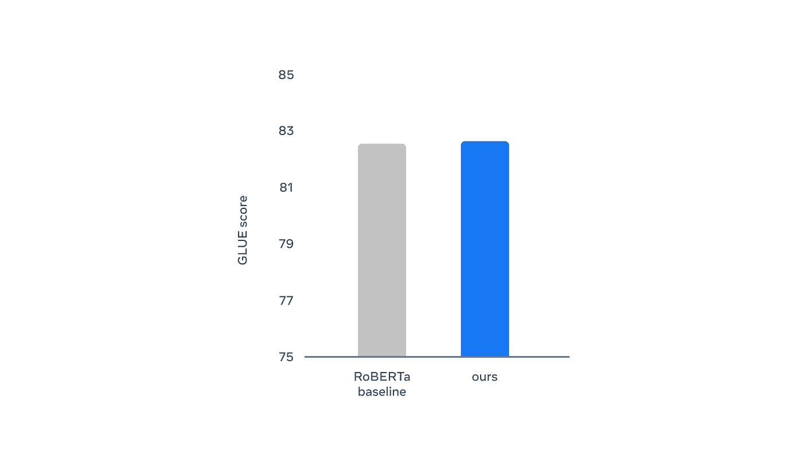
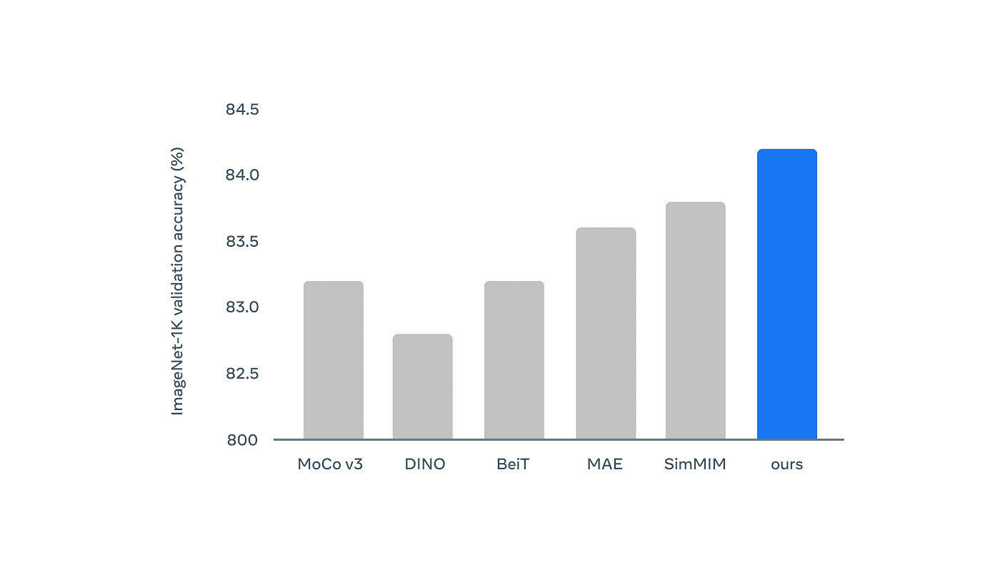
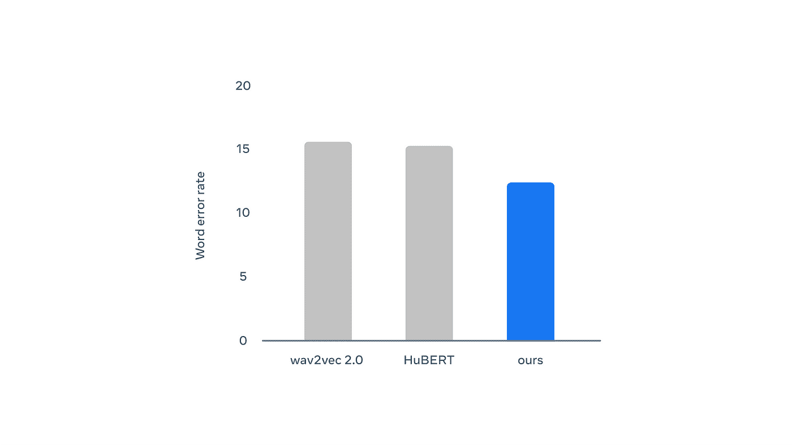

# Meta 的 Data2vec 是一个新的自我监督模型，适用于语音、视觉和文本

> 原文：<https://pub.towardsai.net/metas-data2vec-is-a-new-self-supervised-model-that-works-for-speech-vision-and-text-7a12bba0d01f?source=collection_archive---------1----------------------->

## [自然语言处理](https://towardsai.net/p/category/nlp)

## 这是第一个可以跨不同领域工作的 SSL 模型，是空间领域最大的突破之一。

来源:[https://www . tech slang . com/definition/what-is-self-supervised-learning/](https://www.techslang.com/definition/what-is-self-supervised-learning/)

> 我最近创办了一份专注于人工智能的教育时事通讯，已经有超过 10 万名订户。《序列》是一份无废话(意思是没有炒作，没有新闻等)的 ML 导向时事通讯，需要 5 分钟阅读。目标是让你与机器学习项目、研究论文和概念保持同步。请通过订阅以下内容来尝试一下:

 [## 序列

### 订阅人工智能世界中最相关的项目和研究论文。受到 110，000+的信任…

thesequence.substack.com](https://thesequence.substack.com/) 

自我监督学习(SSL)是深度学习中最令人兴奋的领域之一。SSL 的核心思想是开发通过观察进行学习的模型，而不依赖于大型标记数据集。这些学习动力非常类似于婴儿如何开始发展他们周围世界的表征。尽管令人兴奋，但 SSL 的大多数进步都局限于在非常特定的领域中掌握一项任务。这主要是因为 SSL 技术在计算机视觉、语音或语言等领域看起来非常不同。最近，Meta(脸书)AI Research(FAIR)推出了 data2vec，这是一个 SSL 模型，在多个领域实现了最先进的性能。

到目前为止，绝大多数 SSL 方法都集中在预测每个模态的特定单元上。例如，SSL 语言模型针对预测句子中的下一个单词进行了优化，而 SSL 计算机视觉模型则专注于预测给定向量空间中的像素。结果是 SSL 模型已经发展成为每个特定领域的高度专门化的方法。这与人类固有的多领域认知形成强烈对比。

# Data2vec 方法

Data2vec 试图通过训练模型来消除专门化的级别，这些模型预测它们自己的数据表示，而不是预测特定的标记。通过关注表示，data2vec 消除了对特定领域学习目标的依赖。

公平 SSL 方法使用基于学生和教师网络的双重网络架构。教师网络计算文本、图像或语音的表示。学生网络获取该输出，并试图预测潜在的表示反馈给老师。这两个神经网络几乎相同。

来源:元人工智能研究

FAIR 团队在不同的基准上测试了 data2vec。在语言领域，data2vec 胜过 RoBERTa 等已建立的模型。

来源:元人工智能研究

在计算机视觉领域，data2vec 的表现优于各种最先进的模型。

来源:元人工智能研究

在语音领域，data2vec 胜过了诸如 [wav2vec 2.0](https://ai.facebook.com/blog/wav2vec-20-learning-the-structure-of-speech-from-raw-audio/) 或[休伯特](https://ai.facebook.com/blog/hubert-self-supervised-representation-learning-for-speech-recognition-generation-and-compression/)等技术。

来源:元人工智能研究

Data2vec 是 SSL 中最令人兴奋的新发展之一，它使我们更接近它最初的承诺。人类的认知不仅是自我监督的，而且是多感官的。Data2vec 是第一个跨不同域验证 SSL 能力的模型。