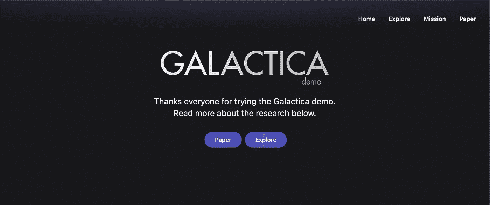
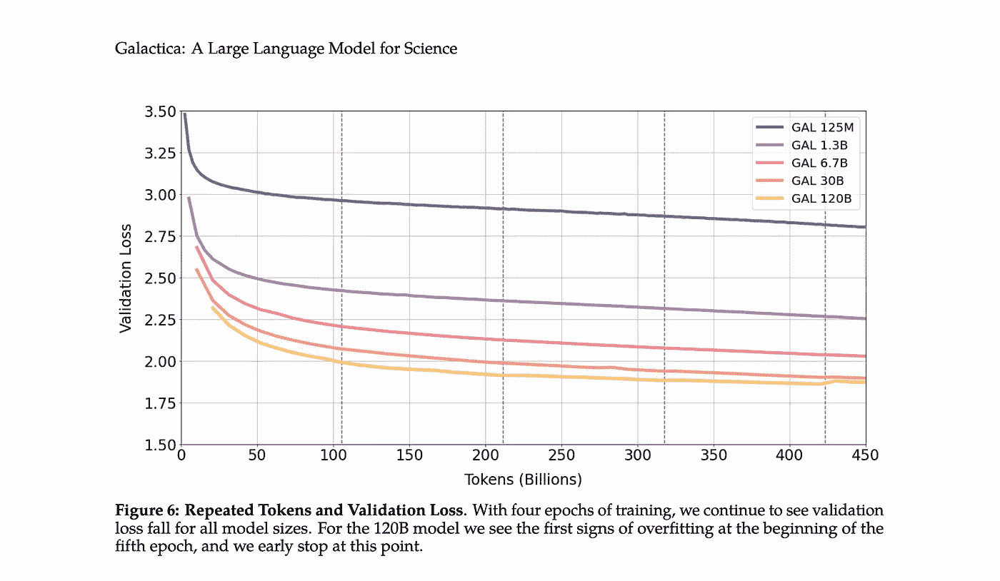
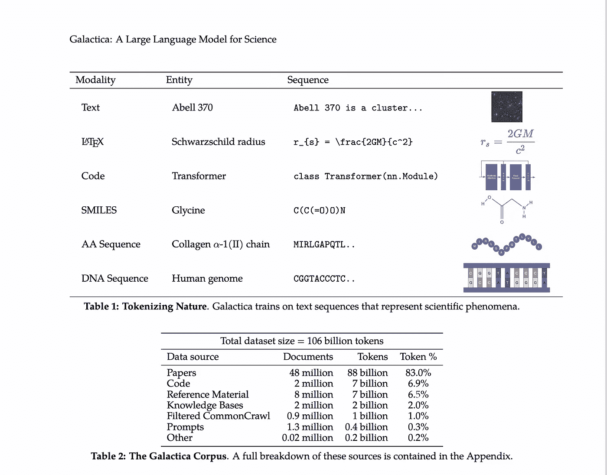

# 脸书/梅塔的卡拉狄加 NLP 将在 48 小时后关闭！

> 原文：<https://pub.towardsai.net/metas-galactica-shuts-down-in-48-hrs-76178054f41a?source=collection_archive---------0----------------------->

资料来源:Galactica.org

以下是关于卡拉狄加的论文摘要。Galactica 是 NLP 模型，它本应是科学文献的一种新的开源大型语言模型。这种语言模型专门研究数学和科学，能够总结科学论文、生成 wiki 文章、回答问题等等。它也是完全开源的，可以下载不同型号的重量和在你自己的硬件上运行的说明。

> 信息过载是科学进步的主要障碍。科学文献和数据的爆炸式增长使得在大量信息中发现有用的见解变得更加困难。今天，科学知识可以通过搜索引擎获得，但他们无法独自组织科学知识。在本文中，我们介绍了 Galactica:一个可以存储、组合和推理科学知识的大型语言模型。我们在大量的论文、参考资料、知识库和其他资源上进行训练。我们在一系列科学任务上超越了现有的模型。在乳胶方程等技术知识调查中，卡拉狄加以 68.2%比 49.0%的优势胜过最新的 GPT-3。Galactica 在推理方面也表现出色，在数学 MMLU 上以 41.3%比 35.7%的成绩超过 Chinchilla，在数学上以 20.4%比 8.8%的成绩超过 PaLM 540B。它还为 PubMedQA 和 MedMCQA dev 等下游任务设定了 77.6%和 52.9%的新水平。尽管没有在通用语料库上训练，卡拉狄加在大板凳上的表现优于布鲁姆和 OPT-175B。我们相信这些结果展示了语言模型作为科学新界面的潜力。为了科学界的利益，我们开源了这个模型。

演职员表:【https://unsplash.com/@ilumire 

# 卡拉狄加是什么

卡拉狄加的科学理解来自于大量符号化信息的数据集。确保各种形态的最佳学习(如自然语言、数学公式、分子序列等)。)，采取了特殊的标记化步骤，包括识别数学运算字符或标记不同类型序列的开始和结束。

卡拉狄加有一招妙计。实现了一个额外的特殊标记来识别逐步推理的部分，这鼓励卡拉狄加应用各种内部工作记忆，否则它将无法做到这一点。

来源:卡拉狄加出版物

卡拉狄加有 5 种尺寸，从 2.5 亿个参数到 1200 亿个参数。在测试过程中，研究人员发现他们的模型在许多基准测试中表现优于可比模型( [OPT](https://huggingface.co/docs/transformers/model_doc/opt) 、 [BLOOM](https://huggingface.co/docs/transformers/model_doc/bloom) 、 [GPT-3](https://huggingface.co/docs/transformers/model_doc/openai-gpt) 和其他，取决于任务)，并接近匹配不是最佳表现者的最佳模型。

来源:卡拉狄加研究论文

关于 Galactica 的符号化方法如何用于科学理解的更多细节，以及它的其他比较和基准，请查看这里的完整研究论文:[https://galactica.org/static/paper.pdf](https://galactica.org/static/paper.pdf)和 GitHub 知识库这里:[https://github.com/paperswithcode/galai](https://github.com/paperswithcode/galai)

演职员表:[https://unsplash.com/@candrawes](https://unsplash.com/@candrawes)

# 失败了！

对于一家专注于生产虚拟现实/真相的公司来说，Meta 与真相的斗争似乎仍在继续。令人不安的是，卡拉狄加以优异的成绩通过了基准测试，但真正的演示只持续了 2 天。这个模型无法区分真实和谎言。

卡拉狄加本应帮助科学家浏览大量已发表的科学信息。它的开发者将其描述为能够查找引文、总结学术文献、解决数学问题以及执行其他任务，以帮助科学家进行研究和撰写论文。对于一个被描述为“科学的大型语言模型”的模型来说，在现实生活测试中的失败是一个沉重的打击。大型语言模型(LLM)的科学空间现在只有 OpenAI 的 GPT-4 可以期待了。

值得称赞的是，Meta 和带有代码的论文在 Galactica 的网站上明确表示，“语言模型的输出不能保证真实或可靠，即使是像 Galactica 这样经过高质量数据训练的大型模型。”大型语言模型非常复杂。当涉及到理解、推理、计划和常识等主题时，科学家们对如何评估 LLM 存在分歧。他们还承认，卡拉狄加在用于产生关于广为引用的概念的内容时表现最佳。他们警告说，在某些情况下，卡拉狄加可能会生成看似真实但不准确的文本。可以理解的是，模型最终产生的“输出”可能不是可与人脑相比的智能输出，而是随机漫谈的概率下一个单词。

 [## OpenAI 正在给 GPT 加水印:不再抄袭

### 知识产权保护通常被称为人工智能模型的“水印”，对于人工智能的未来用例至关重要。这是被…

ithinkbot.com](https://ithinkbot.com/human-vs-gpt-methods-to-watermark-gpt-models-e23aefc63db8) 

# 这是什么意思？

1.  对新模型进行基准测试是不明确的，可能需要改进
2.  LLM 可以产生看起来真实的输出(但实际上不是)

卡拉狄加是实现新事物的一次有价值的尝试！我们从每次失败的实验中学到了有价值的见解。这不是一个痛击深度学习的机会，而是一个回到绘图板、调整和卷起袖子的呼吁。每一次失败的实验都让我们离成功更近一步。

如果这篇文章对你有帮助，请按下“喜欢”按钮来分享你的爱。

请 [***成为会员***](https://ithinkbot.com/membership)*[***订阅***](https://ithinkbot.com/subscribe) 获取更多*