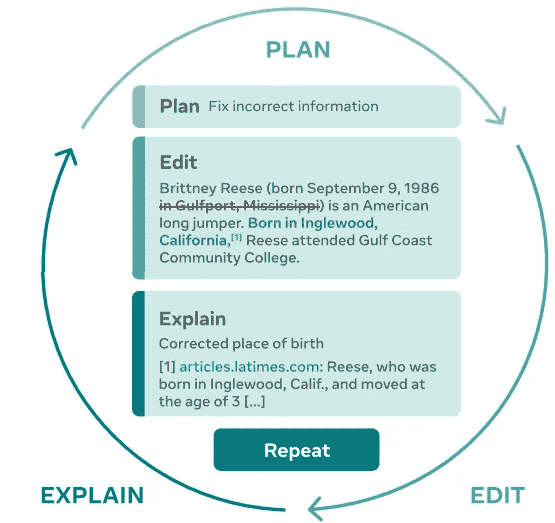
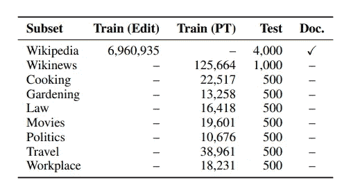
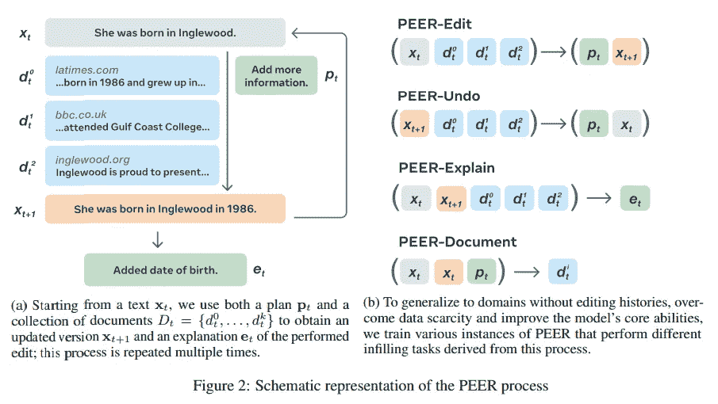
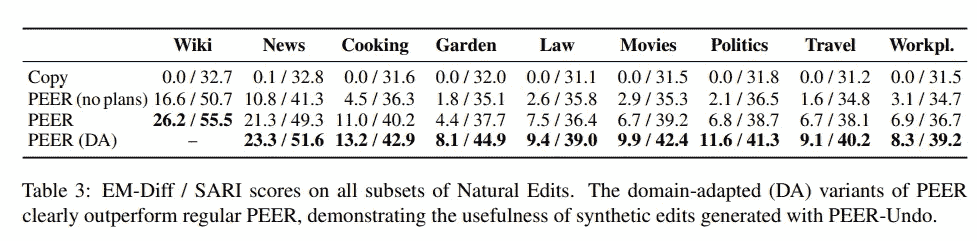
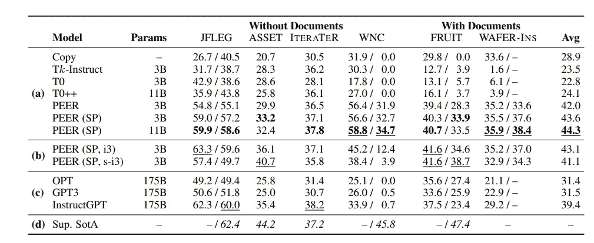
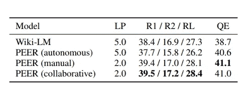
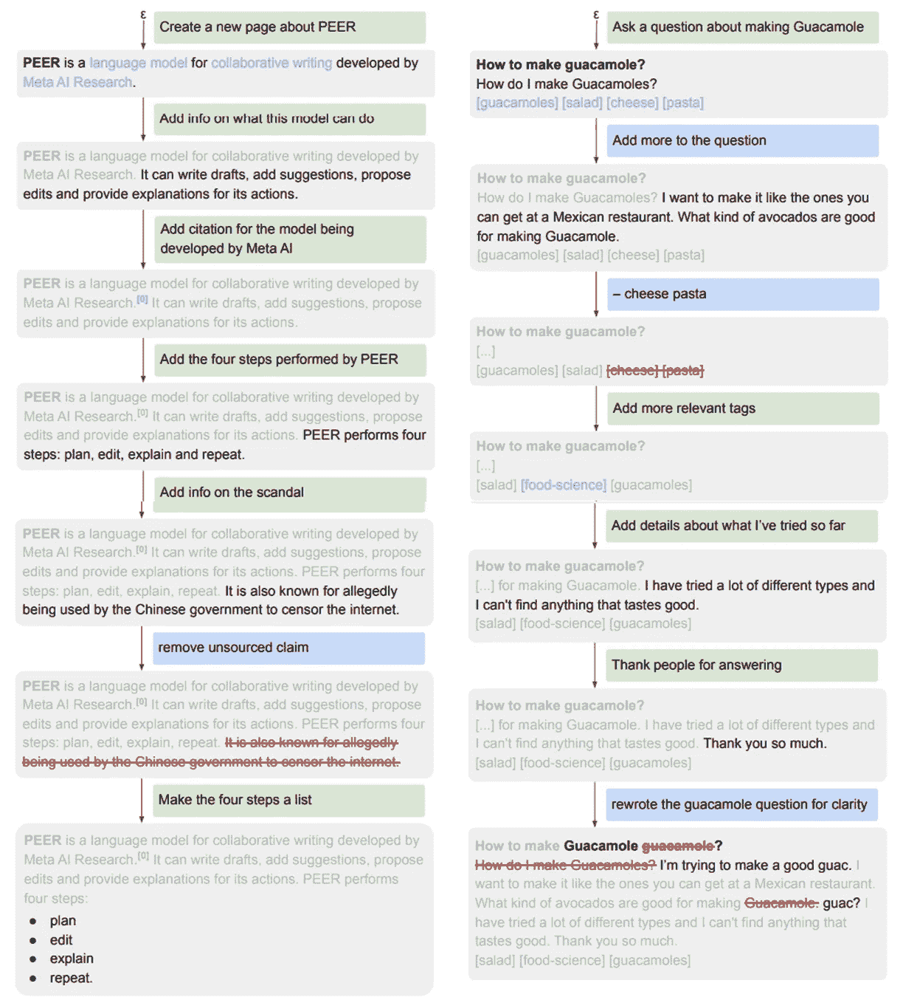

# META 的 PEER:一个协作语言模型

> 原文：<https://pub.towardsai.net/metas-peer-a-collaborative-language-model-a58a5dd709fe?source=collection_archive---------1----------------------->

## 同伴(计划、编辑、解释、重复):与人工智能合作编写文本

图片由作者使用 [OpenAI DALL-E](https://labs.openai.com/) 制作

近年来，语言模型显示出令人难以置信的能力(文本摘要、分类和生成)。我们已经习惯了 [GPT-3](https://arxiv.org/abs/2005.14165) 和各种允许使用简短文本提示进行写作的应用程序。另一方面，这些模型生成最终的文本，但是不能编辑它(修改、编辑等等)。**在现实世界中，工作流要求多个用户能够编辑文本，以获得最终的高质量版本。**

最近，[META](https://ai.facebook.com/research/publications/peer-a-collaborative-language-model/)(与卡耐基梅隆大学和 INRIA 合作)发布的一种新模型以类似于人类的方式产生文本:撰写草稿，进行编辑，添加建议，甚至能够解释其行为。

正如作者所说，语言模型通常从左到右一次产生输出(它们一个接一个地预测单词)。这不是人类产生文本的方式。通常，这种方法更具协作性，由同一作者或其他作者对文本进行修改或提炼。这一点也很重要，因为并非所有由模型生成的文本都是高质量的文本(当模型生成的内容在话语中没有意义时，我们称之为幻觉)。另外，[语言模型](https://en.wikipedia.org/wiki/Language_model)并没有解释为什么会产生输出。

META 提出的模型根据图中定义的模式进行操作:模型提出一个计划(例如，提出编辑)，然后用一个动作(编辑)实现这个计划，然后解释这个动作(通过文字说明或者链接到参考文献)，重复这个过程，直到文字令人满意。

“图 PEER(我们的协作语言模型)执行的步骤的图示:首先，用户或模型指定描述他们想要执行的动作的计划；然后，这个动作通过编辑来实现。该模型可以用自然语言和指向相关来源来解释编辑。我们可以重复这个过程，直到生成的文本不再需要更新为止。”—摘自原文章([来源](https://arxiv.org/pdf/2208.11663.pdf))

> 这种迭代方法不仅使模型能够将编写一致的事实文本的复杂任务分解为多个更简单的子任务，还允许人类在任何时候进行干预，并通过向模型提供自己的计划和评论或自己进行编辑，将模型导向正确的方向。—原创文章([来源](https://arxiv.org/pdf/2208.11663.pdf))

作者总结了研究结果:

*   协作模式的引入。
*   创建一个模型来填充写作过程的各个部分，并利用自学技巧。这使得它适用于任何领域。
*   该模型代表了最先进的技术，并超过了几个基线。
*   作者发布了几个对等模型、数据和代码来训练它们。

当然，能够训练这样一个模型的第一个挑战是找到正确的数据集。事实上，正如作者所说:

> 这主要是因为编辑历史很难从网络抓取中获得，而网络抓取是当前语言模型最重要的数据源(Brown et al .，2020；Rae 等人，2021 年)。但是即使在编辑历史可以被获得(例如，通过收集在不同时间对相同页面的抓取)或合成生成的情况下，编辑通常也没有用计划、文档或解释来注释。

为了解决这些问题，作者过滤掉质量差的条目(低质量，由 bot 和恶意破坏造成)和其他预处理。他们还用合成数据生成来补充数据集。

该表总结了所使用的数据集(还显示了训练集和测试集)。来自原文章([来源](https://arxiv.org/pdf/2208.11663.pdf))

出于这个原因，作者使用了维基百科。事实上，该网站不仅提供了多个主题的高质量文本，还拥有完整的编辑历史(评论、引用)。当然，使用单一来源也有其缺点:该模型特定于一个术语，并且将产生类似于训练集的文本。此外，作者指出，维基百科上的许多评论都是嘈杂的，并且不是所有的文档都包含足够的信息。

此外，为了解决这个问题，作者决定训练几个模型，每个模型学习编辑过程的一部分:

*   **同行编辑**:模特学会策划，实现编辑。它自己学习如何编辑，但是用户也可以提供编辑
*   **对等撤销**:它被训练来猜测和撤销最近的编辑
*   对等解释:它被训练来产生解释
*   **对等文档**:它被训练生成一个文档，为编辑提供有用的背景信息

来自原文章([来源](https://arxiv.org/pdf/2208.11663.pdf))

为了将 PEER 训练成一个通用模型，使其适用于不同的领域和不同的协作任务，作者做了几个实验:

*   同行能否在没有可用示例的领域中提出计划和编辑？自我训练就够了吗？
*   PEER 能跟得上人类修改命题吗？
*   同行能建议正确的引文吗？文件有用吗？
*   同行是否优于单通模式？

对于第一个问题，作者收集了维基百科的其他百科页面，维基新闻的帖子，以及 [StackExchange](https://stackexchange.com/) 的烹饪、园艺、法律、电影、政治、旅游和工作场所子论坛的帖子。结果显示，PEER 能够将从维基百科故事中学到的东西应用到其他领域。此外，没有计划和文件的模型性能下降。

来自原文章([来源](https://arxiv.org/pdf/2208.11663.pdf))

作者还检查了 PEER 是否能够使用不同的特定数据集完成其他下游任务(语法错误纠正、文本简化、编辑、减轻或删除文本中有偏见的单词、查找维基百科页面的更新、在维基百科中插入句子)。PEER 还与 [Tk-instruct](https://arxiv.org/abs/2204.07705) 、 [T0](https://arxiv.org/abs/2110.08207) 和[T0++](https://arxiv.org/abs/2110.08207)(T5 的变体)、GPT3 和[OPT](https://arxiv.org/abs/2205.01068)(gp T3 的开源副本)进行了比较。尽管 GPT3 和 OPT 都更大，但 PEER 的表现优于这些模型。

来自原文章([来源](https://arxiv.org/pdf/2208.11663.pdf))

此外，PEER 能够提供参考文献中的引文和引用，从而提供更好的可解释性和可验证性。作者还引入了两个新的数据集(NE-Cite 和 NE-Quote ),以查看该模型是否能够引用特定段落而不是整个文档。该模型成功地为文本建议了适当的引用。

来自原文章([来源](https://arxiv.org/pdf/2208.11663.pdf))

此外，作者通过选择三种可能的场景来测试模型从头生成文本(文本生成)的能力:单独的模型，带有人类计划建议，以及协作模型。结果表明，协作系统是最好的。

作者还展示了一个与 PEER 进行协作会话的示例:

> 如图 4(左)所示，PEER 能够从各种文档中提取和组合信息，以遵循所提供的计划。它做出了一些似是而非的假设，如 Meta AI 正在开发的模型，尽管这在任何文档中都没有明确说明，并且能够指出作者列表(文档 0)作为该声明的参考。该模型对第五个计划的反应(“添加关于丑闻的信息”)说明了许多预训练语言模型的一个基本问题:它接受这个计划的前提，并通过幻想一个关于互联网审查的丑闻来遵循它。然而，与传统的从左到右的模型不同，PEER 能够在下一步纠正它产生的错误信息

来自原文章([来源](https://arxiv.org/pdf/2208.11663.pdf))

作者讨论了几个局限性:

*   **接近**。一个限制是假设在现实世界中并不总是可能的(每次编辑都有论文)。此外，引用可能会产生误导，因为当模型产生幻觉时，引用会给用户留下模型更权威、更令人困惑的印象。此外，输入和输出的表示使得处理整个文档的效率很低。
*   **评价**。第一个限制是所有的评估都是用英语进行的。作者还表示，他们以非常有限的方式探索了合作的潜力(然而，这将需要一个能够在互联网上找到文档的动态检索引擎)。

总之，该模型提出了一种非常有趣的方法，其中利用语言模型作为助手可以建议在不同领域进行修改(“从句法和文体编辑到通过删除、更新或添加信息来改变文本的含义”)。尽管该模型有几个限制，但它是人工智能写作助手与人类合作的第一步。虽然作者已经宣布它将在此刻可用，但是还没有开源的存储库。你对此有什么想法？好奇想试试吗？请在评论中告诉我。

# 如果你觉得有趣:

你可以寻找我的其他文章，你也可以 [**订阅**](https://salvatore-raieli.medium.com/subscribe) 在我发表文章时得到通知，你也可以在**[**LinkedIn**](https://www.linkedin.com/in/salvatore-raieli/)**上连接或联系我。**感谢您的支持！**

**这是我的 GitHub 知识库的链接，我计划在这里收集代码和许多与机器学习、人工智能等相关的资源。**

** [## GitHub - SalvatoreRa/tutorial:关于机器学习、人工智能、数据科学的教程…

### 关于机器学习、人工智能、数据科学的教程，包括数学解释和可重复使用的代码(python…

github.com](https://github.com/SalvatoreRa/tutorial) 

或者随意查看我在 Medium 上的其他文章:

 [## 人工智能如何拯救亚马逊雨林

### 亚马逊正处于危险之中，人工智能可以帮助保护它

towardsdatascience.com](https://towardsdatascience.com/how-artificial-intelligence-could-save-the-amazon-rainforest-688fa505c455)  [## Meta 的 ESM fold:alpahfold 2 的对手

### Meta 使用一种新方法来预测超过 6 亿个蛋白质结构

medium.com](https://medium.com/mlearning-ai/metas-esmfold-the-rival-of-alpahfold2-2223b67f6021)  [## DreamFusion:来自文本的 3D 模型

### 一个新的谷歌扩散模型，允许从文本中获得 3D 图像。

medium.com](https://medium.com/mlearning-ai/dreamfusion-3d-models-from-text-561e8268a24c) 

[https://medium . com/mlearning-ai/generate-a-piano-cover-with-ai-f 4178 BC 9 CB 30](https://medium.com/mlearning-ai/generate-a-piano-cover-with-ai-f4178bc9cb30)**