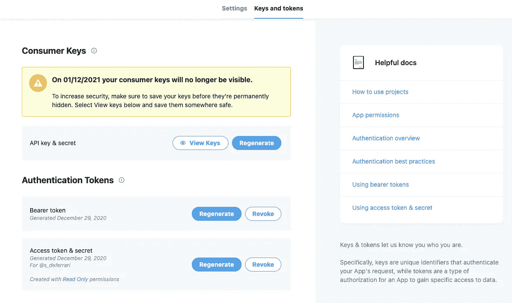
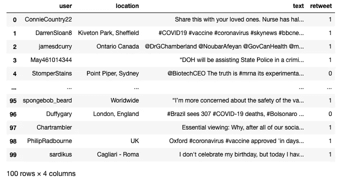
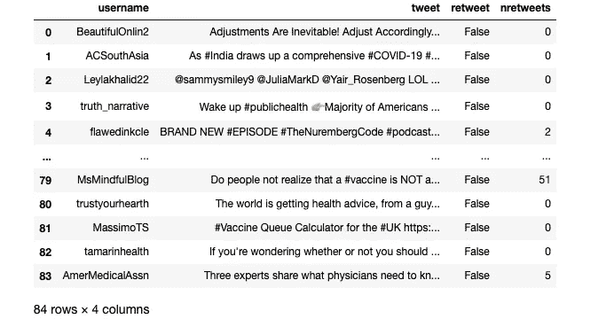
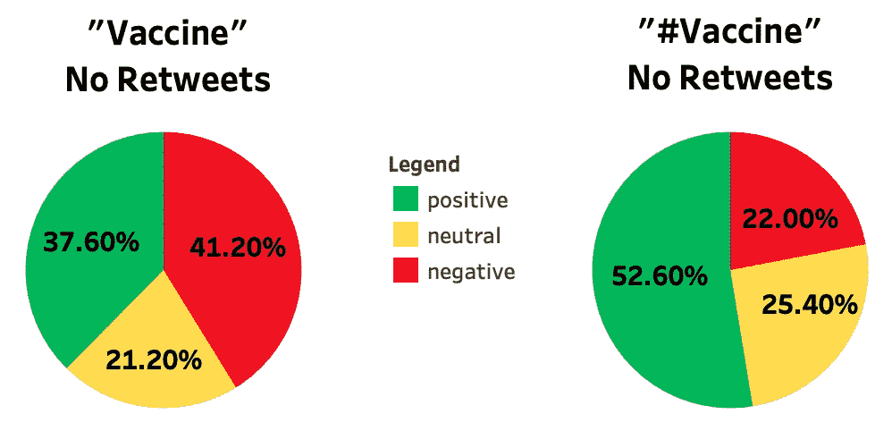
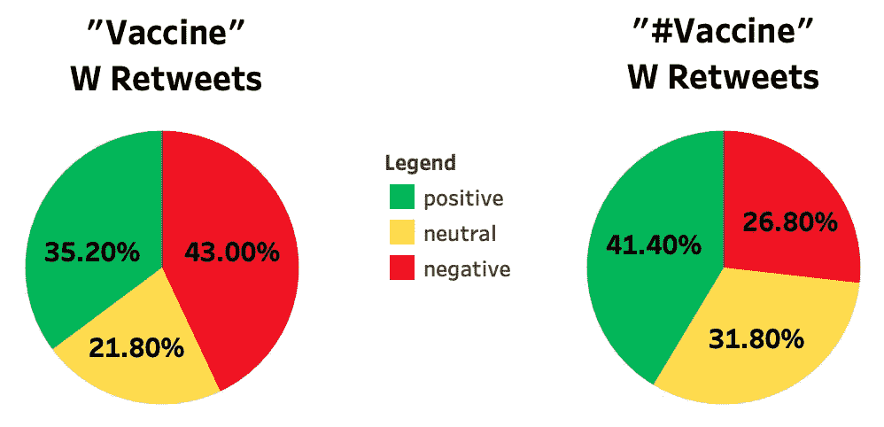

# 收集推文的方法、挑战和危险

> 原文：<https://pub.towardsai.net/methods-challenges-and-hazards-of-collecting-tweets-9e3e7805095a?source=collection_archive---------2----------------------->

## [自然语言处理](https://towardsai.net/p/category/nlp)，[网页抓取](https://towardsai.net/p/category/web-scraping)

## 每天有 5 亿条推文被发送，在你的项目中正确使用它们不仅仅是写一个 API 请求


照片由[克里斯蒂安·卢](https://unsplash.com/@christianlue?utm_source=medium&utm_medium=referral)在 [Unsplash](https://unsplash.com?utm_source=medium&utm_medium=referral) 上拍摄

***免责声明:*** *本文仅出于教育目的。我们不鼓励任何人抓取网站，尤其是那些可能有条款和条件反对此类行为的网站。*

在完成了一个关于 Covid 疫苗相关推文的情绪分析项目后，我感觉自己只看到了画面的一小部分。我利用别人好心收集并发布在 Kaggle 上的推特建立了这个项目。收集的标准是过滤掉带有转发的标签“#CovidVaccine”。

使用别人的数据很方便，但在如此严格的标准下，很多推文肯定会丢失。更糟糕的是，我的许多推文似乎都被截掉了；句中以“…”结尾。我开始自己收集，看看是否能做得更好。我原本期望的调整一些参数和重写一些代码的简单过程变成了解决 3 个问题的考验:

*   我要怎么收集推特信息呢？
*   我的查询究竟如何影响我的项目结果？
*   Twitter 对于捕捉“全民对话”有多大用处？

本文分为三个部分，每个部分都致力于其中一个问题。请将本文视为部分教程、部分实验和部分思考。所有代码都将使用 Python，但如果这不是你的选择语言，这里仍然有课程给任何对在他们的下一个项目中使用 tweets 感兴趣的人。随意跳到你最感兴趣的部分；我不会太介意。

# 第一部分:收集推文的不同方法

无论有没有 Twitter 的 API，都可以收集推文。我将介绍每种方法，并给出它们的优缺点。

## 通过 Tweepy 收集 Twitter API

Tweepy 是一个 Python 库，允许轻松访问 Twitter 的 API。在写第一行代码之前，你需要申请一个[开发者账户](https://developer.twitter.com/en/apply-for-access)。不要被吓倒，这是免费的(基本访问，稍后会有更多)，你应该在申请的几个小时内被接受。

被接受后，您需要创建自己的项目来生成访问 API 所需的密钥、令牌和密码。您可以在项目的“密钥和令牌”部分找到它们。



作者图片

一旦有了它们，通过导入 Tweepy 和 Pandas 并保存您的密钥、令牌和秘密作为变量来开始您的代码。然后验证您帐户的凭证，这样我们就可以开始访问 API 了！

当我们成功通过身份验证后，我们可以使用 Tweepy 的 Cursor 对象根据特定标准搜索和收集 Tweepy。对于这个例子，我们将收集 2020 年 12 月 25 日至 2020 年 12 月 26 日之间包含标签“#vaccine”的 100 条英文推文。Tweepy 还支持更复杂的搜索，包括使用地理编码。对于那些感兴趣的人，我强烈推荐阅读 Tweepy 的[文档](https://tweepy.readthedocs.io/en/latest/api.html)以及 Twitter 自己的[搜索操作符](https://developer.twitter.com/en/docs/twitter-api/v1/rules-and-filtering/search-operators)文档，以便更好地了解什么是可能的。

```
tweets = tw.Cursor(api.search,
              q="#vaccine",
              tweet_mode='extended',
              lang="en",
              since="2020-12-25",
              until="2020-12-28").items(100)
```

这将返回一个包含所有 100 条 tweet 的新对象，但是访问 tweet 的文本并不像遍历和运行“print”那么简单。`tweets`中的每条推文包含大量信息，包括发布时间、文本、位置等。我们需要问正确的问题来从他们那里得到我们想要的。下面是我写的一个函数，用于检索每条推文的用户名、位置、全文，并告诉我它是否是转发。

您可能已经注意到，Cursor 对象将 tweet_mode 设置为“extended”。这与 Twitter 2017 年决定将推文的字符限制从 140 增加到 280 有关。如果没有它，我们最终会得到长度超过 140 的推文，并被“…”截断，这是我在原始数据集时遇到的问题。

简单地将我们的搜索设置为 extended 并请求 full_text 属性仍然是不完美的，因为转发被切断了。这就是函数底部的“try”语句的用武之地。相反，询问原始推文的全文是可行的。Tweepy 的[文档](https://tweepy.readthedocs.io/en/latest/extended_tweets.html)更详细地介绍了这个问题。

设置好`full_text_rt()`之后，我们现在需要做的就是理解 tweets 对象上的列表。通过函数运行每条 tweet，然后将列表列表转换为 Pandas 数据帧。

```
final_tweet_list = [full_text_rt(tweet) for tweet in tweets]tweets_df = pd.DataFrame(data=final_tweet_list, 
                    columns=['user', "location", "text", "retweet"])
```

这是一个数据框架，包含了通过 Tweepy 从 Twitter 的 API 收集的所有信息。



作者图片

## 通过 Twint 进行非 API 收集

尽管 Tweepy 的过程很顺利，但我们只能使用一个免费的 Twitter 开发者账户。我们的搜索只能追溯到 7 天前，我们一个月收到 50 个请求。对于那些不想每月支付 99 到 1899 美元购买[高级](https://developer.twitter.com/en/pricing/search-fullarchive)访问的人来说，有 [Twint](https://github.com/twintproject/twint) 。

Twint 是一个 OSINT(开源智能)聚焦的 Twitter scraper，它允许我们通过 Twitter 自己的搜索功能收集 tweets，从而绕过 API 的限制。

我们可以通过命令行使用 Twint，但我将向您展示如何从笔记本电脑上使用它。Twint 使用的是 [asyncio](https://docs.python.org/3/library/asyncio.html) ，它有着与笔记本不兼容的历史，所以在我们做任何事情之前，我们需要确保我们已经安装、导入并应用了 [nest-asyncio](https://pypi.org/project/nest-asyncio/) 。

```
import nest_asyncio
nest_asyncio.apply()
```

由于 Twint 的 Pandas 兼容性，实际上导入 Twint、运行它并将其结果转换成数据帧都可以在一个单元中完成。

经过更少的努力(但是多了一点处理时间)，我们现在应该有了自己的数据框架，用 Twint 抓取 tweets。



作者图片

## 比较 Tweepy 和 Twint

尽管 Twint 很简单也很免费，但它也有缺点。你可能已经注意到，我们在 Twint 数据帧中没有位置，但在 Tweepy 数据帧中有。由于 Twint 通过 Twitter 的搜索功能收集位置的方法，收集位置实际上要困难得多，也更耗时，与 Tweepy 相比，Twint 已经很慢了。

你可能也注意到了，当我们请求 100 条推文时，我的数据框架只返回了 84 条。如果你在你的终端运行这段代码，尽管使用了相同的搜索标准，你很可能会得到 80 到 120 条 tweets。同样，由于 Twint 的刮擦方法，它在[一致性](https://github.com/twintproject/twint/issues/604)方面存在问题。

然后是转发的问题。尽管将 c.Filter_Retweets 设置为 false，但没有返回一个 retweet。这是另一个从使用 Twitter 的搜索功能继承而来的问题，Twint 的开发者并不热衷于解决这个问题，因为图书馆专注于 OSINT 收藏。

对比文档和教程，Tweepy 和 API 比 Twint 更容易理解和学习。我是通过阅读 Tweepy 的文档和在线指南来学习 Twint 的，而我是通过浏览 Github 上的“问题”部分来学习 Twint 的，那里的开发人员非常积极地帮助人们解决问题。

与其选择一个而不是另一个，不如想想它们如何一起使用。有了 Tweepy 和 API，您就拥有了试验和校准查询以满足需求所需的一致性和健壮性。有了 Twint，你可以不受 API 的限制，收集大量的 tweets。

一个想法是从 Tweepy 中提取你的初始推文库，建立你的处理管道，并创建一个最小可行的产品。如果您不满意，请检查您的搜索标准，然后重试。如果结果对你有用，那么使用 Twint，使用你在 Tweepy 上完善的标准，拉一个更大的 tweets 库，并通过相同的管道运行它们，以获得你的最终产品。

# 第 2 节:编写“正确”查询的挑战

既然我们已经建立了如何收集推文，我们需要看看我们的查询如何改变我们的结果。在上一节的例子中，我搜索了包含“#vaccine”标签的 tweet，但是如果我去掉标签，只搜索包含“vaccine”的 tweet 呢？我的 Tweepy 搜索也包括转发，而我的 Twint 搜索则没有；这种差异有多大意义？

与其坐在那里思考，不如让我们做一个实验，根据我们是否使用标签，以及我们是否通过相同的 [VADER](https://github.com/cjhutto/vaderSentiment) 情感分析管道使用转发来运行四个不同的搜索结果，并分析其差异。管道将根据 VADER 的[文件](https://github.com/cjhutto/vaderSentiment#about-the-scoring)中建议的阈值，为每条推文创建一个新列，分类为“正面”、“中性”或“负面”。

以下是我们将使用的 3 个功能:

有了这些功能，我们需要做的就是导入情感分析器，并通过它运行我们的搜索结果。这是我获取 2020 年 12 月 25 日至 2020 年 12 月 16 日之间发布的 500 条包含“疫苗”一词的推文的完整代码块，并过滤了转发。我在这里使用“疫苗”而不是更长的“Covid 疫苗”，以包括那些在推文中使用“电晕”而不是“Covid”的用户。此外,“疫苗”一词在对话中几乎无处不在，指的是新冠肺炎疫苗。

我又运行了 3 次这段代码，只调整了“search_words”变量和 dataframe 名称，以覆盖 hashtags 和 no hashtags，以及 retweets 和 no retweets。之后，我将得到的情绪列导入 Tableau，将它们转换成百分比饼图。

让我们从比较“疫苗”和不带转发的“#疫苗”开始:



作者用画面制作的图像

这些图表描绘了两幅截然不同的画面。如果我们坚持只使用“#vaccine”进行搜索，我们会得出结论，大多数人对接种疫苗的前景持积极态度，这与“vaccine”搜索直接质疑的结果相反，它告诉我们疫苗的推出在 Twitter 上遇到了很多负面和不确定性。

为什么结果会有差距？了解人们在推文中使用标签的频率很重要。谷歌和帕洛阿尔托研究中心的研究人员在 2010 年发表了一篇题为“推特中的语言问题:大规模研究”的论文，发现只有 14%的英语推特包含标签。稍微乐观一点的是，品牌参与公司在 2018 年的一份报告[2]中提到，40%的推文包含标签。当我们把自己限制在带有哈希标签的推文中时，我们可能已经从一个更小和不同的推文中提取了信息。

转发呢？如果我们允许在搜索中包含转发，让我们比较一下这些结果:



作者用画面制作的图像

有趣的是，在两次搜索中，大多数推文都被转发，但结果与我们排除转发后得到的结果惊人地相似。最大的区别是哈希标签搜索的积极度下降了 11 个百分点，但仍有最大比例的推文保持积极。

回想一下，Twint 的一个问题是它不能抓取转发。有了这些结果，我们可能会觉得使用 Twint 抓取包含“疫苗”的推文更安全，因为情感比率将与包含转发的搜索足够相似。

# 第三部分:分析使用推特的危害

在你点燃笔记本开始下一个项目之前，了解 Twitter 在普通人群中的代表性是很重要的，毕竟，我们还有最后一个问题要回答:Twitter 对于捕捉“全国性对话”有多大用处？


[Unsplash](https://unsplash.com?utm_source=medium&utm_medium=referral) 上[视觉](https://unsplash.com/@visuals?utm_source=medium&utm_medium=referral)的照片

当我们从人们那里收集信息和关于他们的信息时，选择偏见应该一直存在于我们的头脑中。了解使用 Twitter 时存在哪些偏见可能不会帮助我们减轻这些偏见，但它可以提醒我们在从我们的结果中得出结论时要考虑的问题。

根据 2019 年皮尤研究中心的一项研究，只有 22%的美国人实际使用 Twitter [3]。因此，我们与几乎四分之一的人口一起工作，但是这种用法有多统一呢？事实证明完全不一致，另一项专门关注 Twitter 使用的皮尤研究[4]发现，10%的美国 Twitter 用户负责美国 80%的推文。

同一项研究发现，与普通大众相比，美国 Twitter 用户通常更年轻，受教育程度更高，更有可能成为民主党人。当放大前 10%的美国推特用户时，研究人员发现他们更愿意发布关于政治的帖子，69%的多产推特用户表示他们发布关于政治的帖子，相比之下，美国推特用户中只有 39%的人这样做。虽然在底层 90%的美国推特用户中，性别差异基本上是均等的，但女性占了高产推特用户的大多数。

将所有这些放在一起，我们可以看到，收集的美国推文来自一个比我们想象的更小、更不具代表性的群体。

这些研究仅适用于美国推特用户。请记住，我们的查询是针对英语推特，一种世界各地的人们都说的语言，谁知道其他国家在推特使用方面存在什么偏见！

# 结论

我希望这篇文章能让你对在下一个项目中使用 Twitter 数据有更多的了解。在回顾中，我们了解到以下内容:

*   如何使用 Tweepy 和 Twitter 的 API 以及 Twint 收集推文
*   测试多个查询并比较结果的重要性
*   你在使用基于使用统计的推文时可能会遇到的偏见

像任何数据来源一样，Twitter 有它的优点和缺点，但是不要让缺点阻止你去尝试。我的建议是，如果你对一个项目或一个有趣的查询有想法，使用我今天提供的代码，看看你会得到什么结果。只要记住实验的重要性，得出结论时要注意什么，以及最后一个提示:不是每个人都把 Twitter 当回事。

# 参考资料:

[1] E. Chi，G. Convertino 和 L. Hong，[推特中的语言问题:大规模研究](https://www.aaai.org/ocs/index.php/ICWSM/ICWSM11/paper/view/2856/3250) (2010)，第五届网络博客和社交媒体国际 AAAI 会议

[2]提一下， [2018 Twitter 参与度报告](https://mention.com/en/reports/twitter/) (2018)

[3] A. Perron，M. Anderson，[社交媒体使用调查](https://www.pewresearch.org/fact-tank/2019/04/10/share-of-u-s-adults-using-social-media-including-facebook-is-mostly-unchanged-since-2018/) (2019)，皮尤研究中心

[4] A. Hughes，S. Wojcik，[评估推特用户](https://www.pewresearch.org/internet/wp-content/uploads/sites/9/2019/04/twitter_opinions_4_18_final_clean.pdf) (2019)，皮尤研究中心