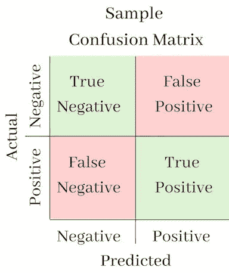
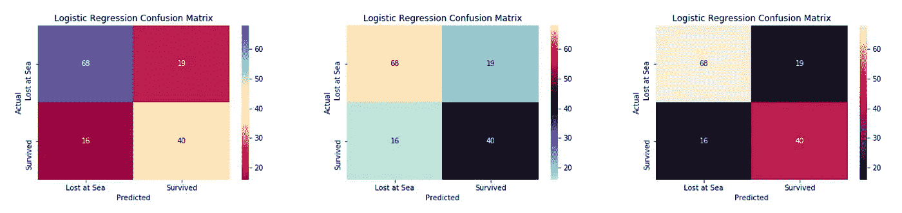
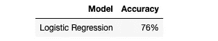
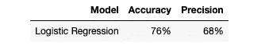
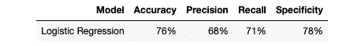
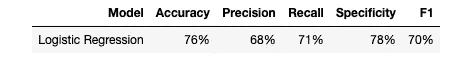
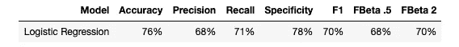
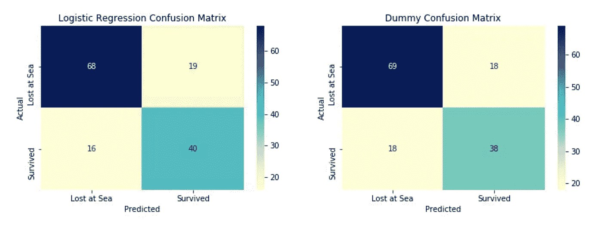
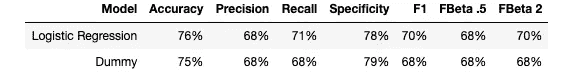

# 评估分类模型的度量标准

> 原文：<https://pub.towardsai.net/metrics-for-evaluating-classification-models-6c1e01293b7f?source=collection_archive---------2----------------------->

## [机器学习](https://towardsai.net/p/category/machine-learning)

从准确度到 f 分数，这里有 8 个指标来探究你的分类器的优点和缺点，以及如何在 Python 中实现它们


由谢恩·奥尔登多夫在 [Unsplash](https://unsplash.com?utm_source=medium&utm_medium=referral) 上拍摄的照片

# 介绍

经过许多个漫长的白天和不眠之夜，你终于建立了你认为是有史以来最好的分类模型，并准备好向你的客户展示它。当您创建演示文稿时，您会试图想出最好的方法来展示您的模型相对于测试数据表现得非常好。

当你调用它的`.score()`方法时，你试图说它有一个“高分”,但这只是让它听起来像一个视频游戏。你盯着屏幕，意识到甚至你都不完全理解这个方法是如何给一个模型打分的。

分类模型有时比构建模型更难评分和呈现，但是不要害怕，我会在这里提供帮助。在这篇文章中，我将做以下工作:

*   为您提供 8 种不同的度量标准，以清晰简洁的方式评估您的分类模型
*   通过一个演示模型向您展示如何在 python 中导入或构建它们
*   为您提供每个指标的用例，以便您可以决定哪一个最适合您的需求

# 满足我们的演示模型和数据

为了简单起见，我们将在整篇文章中使用 Kaggle 的[泰坦尼克号比赛](https://www.kaggle.com/c/titanic)中的幸存者数据。本文绝不是关于如何为这种竞争建立最佳的分类模型。我的建议是，如果你不熟悉这个数据集，可以看看 Ken Jee 的视频。

下面我们将导入数据，并准备好进行处理:

我们今天只讨论一个模型:经典的逻辑回归。如果你不熟悉这个模型，我的建议是看看 Josh Starmer 在这个 StatQuest [视频](https://www.youtube.com/watch?v=yIYKR4sgzI8)中对这个主题的处理，记住，如果你能拟合一条线，你就能拟合一条曲线！

```
from sklearn.linear_model import LogisticRegression# Build a logistic regression object
log_reg = LogisticRegression()# Fit the training data to the model
log_reg.fit(X_train, y_train)# Make predictions for our test data
y_pred = log_reg.predict(X_test)
```

有一些模型被证明更擅长解决这种特定的分类问题，但判断结果是相同的，无论它是从 Scikit-learn 导入的逻辑回归模型的预测还是您自己构建的神经网络。

# 混淆矩阵

理解模型性能的最直观的方法是使用混淆矩阵。从 Scikit-learn 导入的混淆矩阵是一个简单的矩阵，它告诉您模型的预测属于 4 个不同的类别:

*   你的模型预测的条目是目标类中的**，并且是**正确的**，这些被称为**真阳性****
*   你的模型预测的条目是**而不是**目标类中的 **并且是**正确的**，它们被称为**真否定****
*   你的模型预测的条目在目标类的中**并且**不正确**，这些被称为**误报****
*   你的模型预测的条目是**不是**目标类中的 **并且是**不正确的**，这些被称为**假阴性****

对于泰坦尼克号数据，这四个术语的含义如下:

*   当我们的模型正确地预测到一个人会活下来时，就是真阳性
*   真正的否定是当我们的模型正确预测到一个人将会死亡
*   假阳性是当我们的模型错误地预测一个人会活下来
*   假阴性是指我们的模型错误地预测到一个人会死亡

```
from sklearn.metrics import confusion_matrix# This creates our matrix for plotting
con_mat = confusion_matrix(y_test, y_pred)
```

像这样的二进制问题总是会产生一个 2x2 的数组。Scikit-Learn 实际上有自己的内部方法来绘制混淆矩阵，但我们将从头开始做，并有以下警告:Scikit-Learn 的混淆矩阵将**始终**在 x 轴上有您的模型的预测，在 y 轴上有真实值，这是**不通用的**，其他程序/指南可能会以不同的方式放置它们。



作者图片

在查看我们的矩阵时，我们的目标是让尽可能多的预测落在左上角(真正的负数)或右下角(真正的正数)的方块中。这两者与我们模型的错误预测相比越高越好。下面让我们看看我们是如何构建这个情节的:

```
import seaborn as sns
import matplotlib.pyplot as plt
%matplotlib inline# Changing our dpi enables us to easily resize our image
plt.figure(dpi=100)# Build a heatmap using the con_mat array
sns.heatmap(con_mat, cmap="YlGnBu", annot=True,
       xticklabels=['Lost at Sea', 'Survived'],
       yticklabels=['Lost at Sea', 'Survived'])# Remember that our x-axis is always predictions in Scikit-Learn
plt.xlabel('Predicted')# Our y-axis is always the actual results
plt.ylabel('Actual')plt.title('Logistic Regression Confusion Matrix');
```

由此产生的图将被颜色编码和注释，以准确显示我们的每个模型的预测落在哪里。


作者图片

我们现在可以很容易地看到，我们的模型的大多数预测是正确的，当不正确时，它更容易出现假阳性而不是假阴性。

Seaborn 还支持许多不同的调色板，根据品味、可读性或客户的配色方案来选择。



光谱(左)，冰火(中)，火箭(右)

## 使用案例:

*   您希望轻松而精确地看到您的模型在哪里成功了，在哪里失败了
*   您正在构建演示文稿，并希望以一种清晰、可定制的方式直观地传达模型的结果

# 准确度、精密度、召回率和特异性

尽管我们的混淆矩阵看起来不错，但是很难用它来比较模型。如果我们试图找出逻辑回归、KNN、决策树或随机森林中的哪一个最适合我们的问题，那么必须整理和比较 4 个不同的地块，每个地块有 4 个不同的类别，这将是非常耗时的。

谢天谢地，根据我们的真实预测和错误预测之间的关系，我们可以计算出四个分数。每一个都强调我们结果的不同方面，我们选择哪一个可以基于几个不同的因素，包括客户的需求，我们的预测，以及我们数据中的任何不平衡。

## **准确率:**(真阳性+真阴性)/所有预测

一个平衡的指标，奖励正确预测正面和负面结果的模型。当您调用它的`.score()`方法时，这是许多模型的默认设置。

如果我们的目标类和非目标类之间的数据不平衡，这可能会产生误导，即如果在 100 个条目的数据集中有 5 个目标类，并且我们的模型预测一切都是负面的，它仍然会获得 95%的准确率。

准确性得分指标内置于 Scikit-Learn 中，只需将其导入，并将我们模型的预测与真实结果一起插入即可。

```
from sklearn.metrics import accuracy_score# Remember to place the true results first 
accuracy = accuracy_score(y_test, y_pred)
```



作者图片

## 精度:真阳性/(真阳性+假阳性)

一种衡量标准，优先考虑我们的模型做出的正面猜测，而忽略任何被归类为负面的猜测。

这个指标的主要关注点是，当你的模型预测一个数据点是正的，同时原谅它可能错过的任何正的时候，你的模型是正确的。思考这个问题的一个好方法是引用这句话:*“十个有罪的人逃脱总比一个无辜的人受苦要好。”*

当正面预测的后果远远超过负面预测的后果时，这是最好的选择。和准确性一样，精确度也可以从 Scikit-Learn 导入。

```
from sklearn.metrics import precision_scoreprecision = precision_score(y_test, y_pred)
```



作者图片

## 回忆:真阳性/(真阳性+假阴性)

把回忆想象成精确的反面。recall 优先考虑的不是正面预测，而是确保所有目标类都被正确识别，而不管有多少其他数据点被错误地归入其中。

回忆强调识别所有的目标类别，这一点最好用需要对一个人是否患有高度传染性疾病进行分类的模型的假设情况来描述。假阳性会导致一点恐慌，这个人会被隔离几个星期。假阴性意味着这个人可以自由传播疾病。

像准确度和精确度一样，召回可以从 Scikit-Learn 导入。

```
from sklearn.metrics import recall_scorerecall = recall_score(y_test, y_pred)
```


作者图片

## 特异性:真阴性/(真阴性+假阳性)

专一得不到很多爱，很容易看出为什么。当大多数人建立模型时，他们会想到如何最好地识别某些东西，无论是罕见的疾病、贷款违约，还是[热狗/非热狗](https://www.youtube.com/watch?v=ACmydtFDTGs)。特异性奖励正确预测数据点不在目标类中的模型，惩罚其误报，并忽略其任何正确预测！

特异性仍然是一个值得一提的指标。如果我们将模型的特异性分数视为对其精确度分数的补充，我们可以在考虑任何数据不平衡的情况下，一起使用这两者来查看模型是否更擅长返回真阴性或真阳性。

与其他指标不同，Scikit-Learn 中不包括特异性。我们可以通过创建一个通用函数来克服这个问题，因为由`confusion_matrix()`生成的所有混淆矩阵都有相同的索引。

```
def specificty_score(confusion_matrix):
    true_negatives = confusion_matrix[0][0]
    false_positives = confusion_matrix[0][1]

    return true_negatives / (true_negatives + false_positives)specificty = specificty_score(con_mat)
```



作者图片

## 使用案例:

*   您需要一种方法来快速轻松地比较不同的模型
*   您的客户对他们希望模型如何表现有明确的偏好，这可以转化为对这 4 个分数中的一个进行优先排序

# f 分数

当我们向客户提出精度和召回率这样的分数时，他们的反应可能是合乎逻辑的“这两个听起来不错，我们能确保模型在这两方面都很好吗？”虽然在分类中，鱼与熊掌兼得可能是一项艰巨的任务，但至少有一种方法可以根据模型的精度和召回率之间的关系对模型进行评分:F-Scores。

## F1 得分:2 *(精确度*召回率)/(精确度+召回率)

一个模型的 F1 分数是它在精确度和召回率之间的调和平均值。如果您希望您的模型在这两方面都同样出色，而不是偏爱其中一个，这就是您的度量标准。

F1 可以直接从 Scikit-Learn 导入。

```
from sklearn.metrics import f1_scoref1 = f1_score(y_test, y_pred)
```



作者图片

## **F** β **得分:(1 +** β **) *(精度*召回)/ (** β *精度+召回)

使用 F1 分数假设误分类或者假阴性或者假阳性导致相等的成本，这在现实生活中很难实现。对于我们倾向于精确或回忆，但仍然希望对方输入的情况，我们可以使用 Fβ分数。

与我们到目前为止看到的其他得分不同，计算我们的 Fβ得分除了我们的模型预测和正确的目标值之外，还需要一个额外的参数:β参数。考虑β参数的一个简单方法是我们对召回率的偏好是精确率的多少倍，即β为 0 . 5 意味着我们对召回率的偏好是精确率的一半，β为 1 意味着我们对两者的偏好相同，β为 2 意味着我们对召回率的偏好是精确率的两倍。

幸运的是，Sciki-Learn 有一个内置的 Fβ分数函数，我们可以导入它。

```
from sklearn.metrics import fbeta_score# Our score where we favor recall
fbeta_2 = fbeta_score(y_test, y_pred, 2)# Our score where we favor precision
fbeta_half = fbeta_score(y_test, y_pred, .5)
```



作者图片

## 使用案例:

*   你和你的客户谈过不同的分数，他们想要在回忆和精确之间取得平衡
*   你心中有一个清晰的比例，你有多喜欢其中一个

# “虚拟”模型

我要介绍的最后一个指标看似简单:与简单规则相比，我们的模型表现如何？在我们目前的状态下，我们可以自信地说，我们的模型胜于掷硬币，但如果我们只是预测一切都是负面的，或者预测所有女人都幸存，所有男人都死亡，会怎么样？这些被称为“虚拟”模型，对于衡量我们的模型实际上有多成功非常有帮助。

Scikit-Learn 实际上有它自己的[虚拟分类器](https://scikit-learn.org/stable/modules/generated/sklearn.dummy.DummyClassifier.html#sklearn.dummy.DummyClassifier)我们可以导入，但是在这种情况下，我们将基于上面提到的性别规则创建我们自己的预测数组。我们的目标是击败使用这个简单规则做出的预测。如果这不可能，那么我们需要返回并执行以下操作:

*   收集更好的数据(如果可能)
*   更好地设计我们的功能
*   尝试不同的模型和/或不同的模型参数

```
# A simple trick since Sex_female is already a binary array
dummy_y = X_test["Sex_female"]# Generate a dummy confustion matrix
dummy_con_mat = confusion_matrix(y_test, dummy_y)# Generate the dummy variant of each score
dummy_acc = accuracy_score(y_test, dummy_y)
dummy_prec = precision_score(y_test, dummy_y)
dummy_recall = recall_score(y_test, dummy_y)
dummy_spec = = specificty_score(dummy_con_mat)
dummy_f1 = f1_score(y_test, dummy_y)
dummy_fbeta_2 = fbeta_score(y_test, dummy_y, 2)
dummy_fbeta_half = fbeta_score(y_test, dummy_y, .5)
```



作者提供的图片

啊哦…看起来我们需要在这一个上回到制图板！

## 使用案例:

*   您想要对您的模型进行健全性检查，以确保与简单的经验法则相比，它确实值得使用
*   你希望你的模型能够超越一个初始基准

# 结论

我希望这篇文章让你对如何判断分类模型有更多的了解，而不仅仅是使用模型的内部评分方法。在回顾中，我们了解到以下内容:

*   评估您的分类模型的 8 个标准，包括它们背后的理论
*   如何在 python 中导入或构建它们
*   每个指标的用例可以帮助您决定哪一个最适合您的需求

本文并没有穷尽分类指标，如果没有一个适合您的情况，那么我的建议是先通读 Scikit-Learn 的[指标和评分](https://scikit-learn.org/stable/modules/model_evaluation.html)文档，然后从那里开始实验。狩猎愉快！