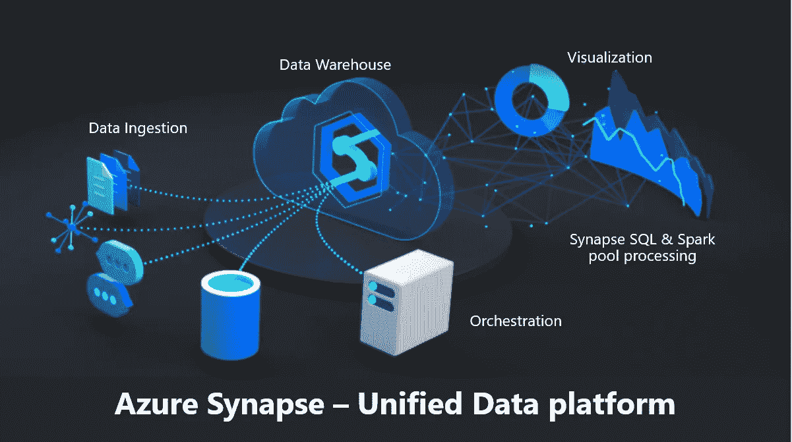
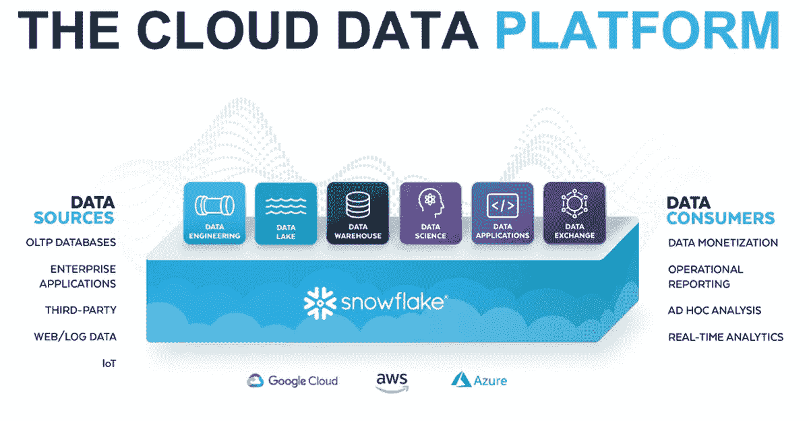
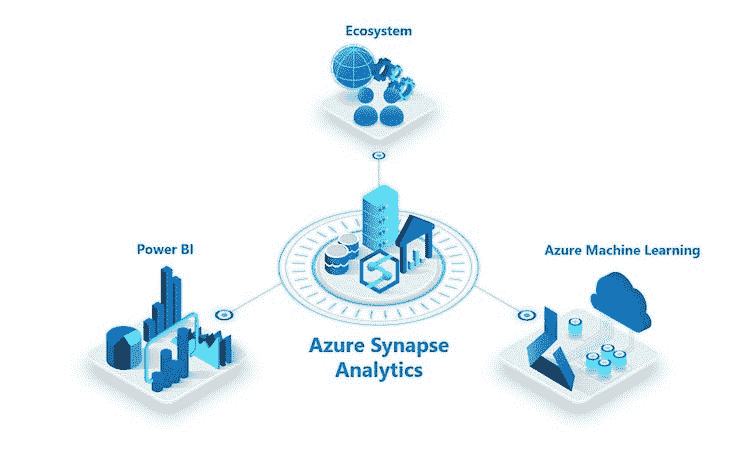
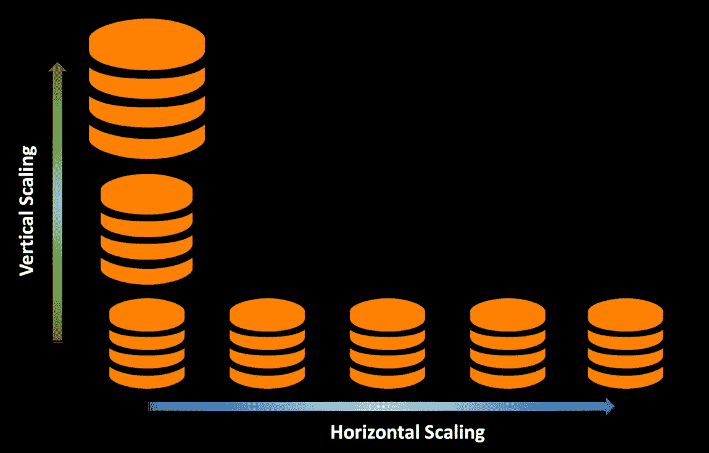
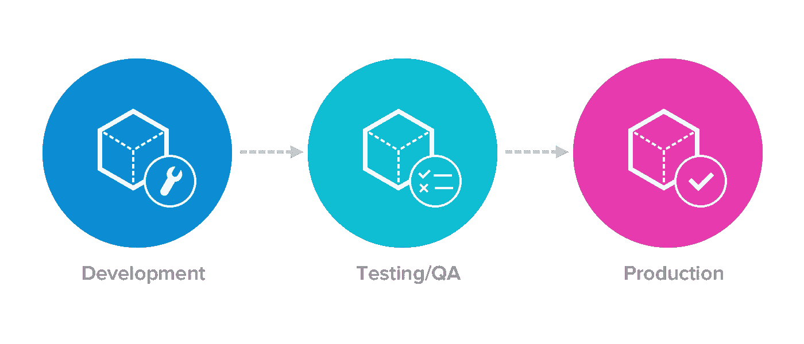
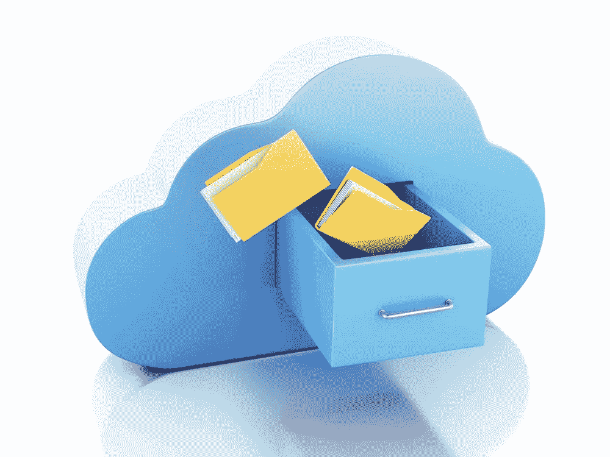
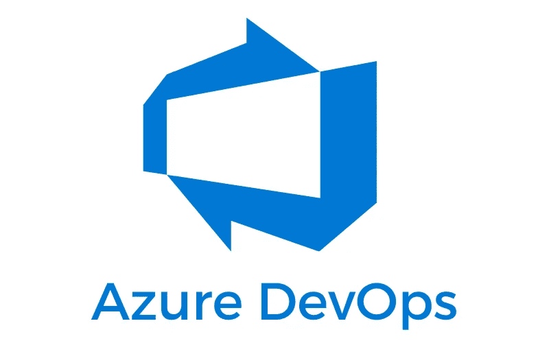
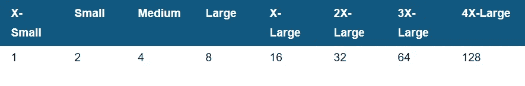
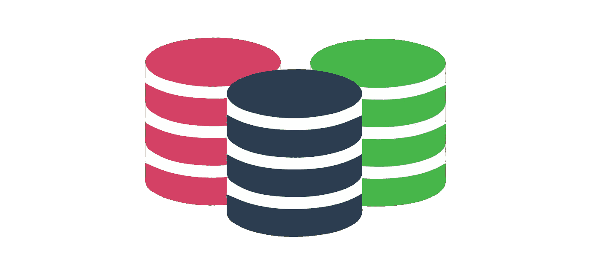
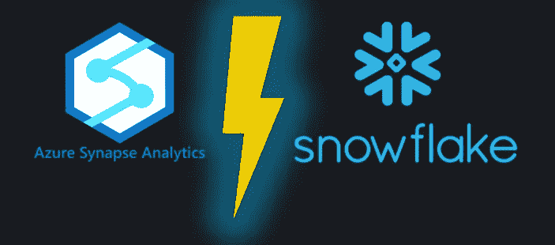

# Microsoft Azure Synapse 分析工作区与雪花数据云

> 原文：<https://pub.towardsai.net/microsoft-azure-synapse-analytics-workspace-vs-snowflake-data-cloud-53f282633b0d?source=collection_archive---------0----------------------->

## [云计算](https://towardsai.net/p/category/cloud-computing)

## 比较 Microsoft Azure Synapse 分析工作区和雪花数据云，在 Azure 云上构建企业数据仓库

O 作为数字化转型的一部分，组织开始转向数据驱动的业务决策。为了建立数据驱动的文化，数据移动对于检索可操作的见解至关重要。随着数据激增，有必要构建一个企业数据仓库或数据湖，以便在此基础上进行分析。为了创建企业数据的单一真实来源，企业往往更加关注在一个可以随着数据量增长而扩展的强大平台上存储和管理数据。

亚马逊 AWS、微软 Azure、谷歌云平台、雪花数据云都提供数据仓库即服务( *DWaaS* )。

## 本博客的目的

> 在本文中，我们将讨论在针对 Azure Synapse 和雪花数据云**在云中设置企业数据仓库之前需要评估的重要标准，以及这两个仓库与 Azure 云平台的集成情况**。

## 这个博客的主要焦点

> T 本文仅涵盖与构建企业数据仓库相关的不同类别的两个数据仓库之间的定性度量——可用性、安全性、集成、监控、可伸缩性、集群管理、数据管理/建模、成本、数据治理、持续集成&持续交付、备份/数据归档&保留。

## 什么将被跳过

> 本文没有比较两个仓库之间的查询性能。这不包括 Synapse 和雪花之间的任何定量测量。

非常感谢 [Arunkumar Ponnurangam](https://www.linkedin.com/in/arunkumar-ponnurangam-10110833/) 在各个方面帮助评估云数据仓库。

*本博客所有信息均为发布时相关(****2021 年 2 月*** *)。由于这两个仓库都发布了新功能并经常增强现有功能，因此列出的一些细节将来可能会有所不同。*

这两个仓库都是完全托管的服务，可以减轻客户的基础架构管理负担，让他们专注于数据。虽然这些解决方案都是为处理海量数据和支持繁重的分析处理工作而设计的，但它们的方法存在一些差异和相似之处。

在讨论这些标准之前，先简单介绍一下这两种云平台。

# Azure Synapse 分析工作区

图片提供:[https://azure . Microsoft . com/en-us/services/synapse-analytics/](https://azure.microsoft.com/en-us/services/synapse-analytics/)

[Azure Synapse](https://azure.microsoft.com/en-us/services/synapse-analytics/) (原名 SQL DW)提供统一的数据平台，开发端到端的数据管道。Synapse Analytics 是一项全面管理的服务，旨在为企业构建现代化的数据仓库。Synapse Analytics 将 SQL、Apache Spark、数据接收/编排(Azure Data Factory)和可视化(Power BI)整合到一个工作空间中，大大缩短了构建分析解决方案的时间。

# 雪花数据云

一个具有革命性架构的平台，提供近乎无限的数据机会。Snowflake 独特的架构在逻辑上分离，但在本地集成了存储、计算和服务。 [Snowflake](https://www.snowflake.com/) 专为云设计，目前可以托管在任何三个云平台(AWS、Azure、GCP)上。

图片提供:[https://resources . snow flake . com/solution-briefs/snow flake-cloud-data-platform-solution-brief](https://resources.snowflake.com/solution-briefs/snowflake-cloud-data-platform-solution-brief)

# 可用性、安全性和集成

## **与 Azure 数据工厂的集成**

`**Inference**` : **ADF 与 Synapse 的集成运行良好，**无需人工干预。然而，使用雪花，我们第一次需要手动创建表。

`**Synapse**`:第一次加载表格时，ADF 会在 Synapse 中自动创建表格。

对于 Synapse，使用 ADF 中的[存储过程活动](https://docs.microsoft.com/en-us/azure/data-factory/transform-data-using-stored-procedure)执行存储过程。

`**Snowflake**`:使用数据类型映射，我们需要在雪花中加载数据之前手动创建表格。雪花为大多数源系统提供了预定义的数据类型映射。此外，还可以使用雪花实用程序脚本为流行的数据源创建表 DDL。

对于雪花，不能使用 ADF 存储过程活动来执行存储过程，需要使用[查找活动](https://stackoverflow.com/questions/56416169/execute-snowflake-stored-procedure-with-azure-data-factory)来调用[雪花的存储过程](https://docs.microsoft.com/en-us/azure/data-factory/connector-snowflake)。

Azure 数据工厂只执行存储过程。无法从 ADF 调度 SnowSQL/Synapse SQL 脚本。很快，从 ADF 调用 Synapse SQL 脚本可能成为可能，但从 ADF 调度 SnowSQL 脚本/工作表是不可能的。

## **与 Azure Event Hub 集成，支持流数据**

`**Inference**` : **Azure Event Hub，Azure Stream Analytics 和 Synapse，原生集成在 Azure 内**。然而，它需要额外的一跳写入内容，以成为一个 blob 存储&与 Snowpipe(服务)与雪花集成。

`**Synapse**`:从 [Azure Stream Analytics 到 Synapse](https://docs.microsoft.com/en-us/azure/synapse-analytics/sql-data-warehouse/sql-data-warehouse-integrate-azure-stream-analytics) 的原生集成可以实现实时数据处理。由于它具有本地集成支持，监控实时事件及其处理状态将变得很容易。基于此信息，可以在作业意外停止时设置警报。

`**Snowflake**`:没有与 Azure Stream Analytics 到 Snowflake 的原生集成。数据需要从事件中心加载到 Blob 存储，然后使用 [Snowpipe](https://docs.snowflake.com/en/user-guide/data-load-snowpipe-auto-azure.html) 将数据复制到雪花中。需要额外的跳跃来暂存中间数据。

除了流分析和 SnowPipe 之外，Azure Databricks Spark 结构化流还可以用于进行实时处理，并从事件中心摄取到 [Synapse](https://docs.databricks.com/data/data-sources/azure/synapse-analytics.html) 和[雪花](https://docs.databricks.com/data/data-sources/snowflake.html)。

## **管理界面**

照片由[丹尼尔·科尔派](https://unsplash.com/@danielkorpai?utm_source=medium&utm_medium=referral)在 [Unsplash](https://unsplash.com?utm_source=medium&utm_medium=referral) 上拍摄

`**Inference**` : **雪花使管理员能够在一个地方直观地监控**所有查询执行、解释计划、计算利用率。然而，Azure Synapse 需要额外的查询存储设置或 DMV ( [动态管理视图](https://docs.microsoft.com/en-us/azure/synapse-analytics/sql-data-warehouse/sql-data-warehouse-manage-monitor))来查看过去在 Synapse 中运行的查询。

`**Synapse**`:监控 UI 仅显示 SQL 池最后一次恢复时的查询。要查看过去运行的查询，需要启用并查询[查询存储库](https://docs.microsoft.com/en-us/sql/relational-databases/performance/monitoring-performance-by-using-the-query-store?view=sql-server-ver15)。具有较大 SQL 文本(> 4000 个字符)的查询将被截断。它可以从查询存储中较大的 SQL 文本的查询计划(XML/string 格式)中提取。查询计划可以从门户网站下载，也可以从 SSMS 生成。查询计划只能由 SSMS 查看。当某些指标(例如数据库大小或 CPU 使用率)达到阈值时，可以使用警报来发送电子邮件或调用 webhook。

`**Snowflake**` : [监控 UI](https://docs.snowflake.com/en/user-guide/snowflake-manager.html) 显示活动的、排队的、已完成的查询，并提供更多信息，如查询配置文件的可视化表示、扫描的字节数、执行时间、编译和执行。有了雪花，你所有的查询历史将保留 1 年。计费&使用仪表板显示仓库级别计算资源的每日利用率。资源监视器可用于对仓库消耗的信用数量施加限制。当达到和/或接近这些限制时，资源监视器可以触发各种动作，例如发送警报通知和/或暂停仓库。

对于 Synapse 和 Snowflake，随着时间的推移，计算资源的利用率都有可视化的表示。

## **数据安全性—行/列级安全性**

照片由[弗兰克](https://unsplash.com/@franckinjapan?utm_source=medium&utm_medium=referral)在 [Unsplash](https://unsplash.com?utm_source=medium&utm_medium=referral) 上拍摄

`**Inference**`:**Synapse 和 Snowflake 都包含所有必需的数据安全选项**来配置认证& RBAC、行级安全、列级安全、动态数据屏蔽。

`**Synapse**`:限制列访问[，保护敏感数据](https://docs.microsoft.com/en-us/azure/synapse-analytics/sql-data-warehouse/column-level-security?view=sql-server-ver15)。截至今天，列级加密在 Azure Synapse 的[预览选项中。](https://docs.microsoft.com/en-us/sql/relational-databases/security/encryption/encrypt-a-column-of-data?view=sql-server-ver15)[动态数据屏蔽](https://docs.microsoft.com/en-us/sql/relational-databases/security/dynamic-data-masking?view=azure-sqldw-latest)功能可以在列级启用。

可以使用内联表函数限制行级访问控制，并将其应用于[过滤谓词](https://docs.microsoft.com/en-us/sql/relational-databases/security/row-level-security?toc=%2Fazure%2Fsynapse-analytics%2Fsql-data-warehouse%2Ftoc.json&bc=%2Fazure%2Fsynapse-analytics%2Fsql-data-warehouse%2Fbreadcrumb%2Ftoc.json&view=sql-server-ver15)。它检查存储在自定义表中的登录用户/角色的权限。

`**Snowflake**`:通过[创建安全视图](https://docs.snowflake.com/en/user-guide/views-secure.html)限制列访问以保护敏感数据。

通过创建安全策略，可以实现列级加密和[动态数据屏蔽](https://docs.snowflake.com/en/sql-reference/sql/create-masking-policy.html)。仅在[雪花—企业版](https://docs.snowflake.com/en/user-guide/intro-editions.html)中可用。

可以使用上下文函数 current_user()和 current_role()限制行级访问控制，并使用存储在自定义表中的权限进行联接。它使用[安全视图](https://docs.snowflake.com/en/user-guide/views-secure.html)。

## **统一工作区体验**

`**Inference**` : **Synapse workspace 提供了统一的体验**来构建端到端的数据管理活动，而 Snowflake 只涵盖了数据分析、转换和管理 UI 等几个方面。

`**Synapse**`:一个集成的[统一工作空间](https://azure.microsoft.com/en-us/services/synapse-analytics/)下的端到端数据管道阶段，如数据接收、数据转换、编排、数据分析、管理监控和源代码控制。

`**Snowflake**`:它需要多种工具，但却是可管理的，可以使用 [Azure Data Factory](https://azure.microsoft.com/en-us/services/data-factory/) 来执行数据接收和编排。雪花提供的数据转换、数据分析和管理监控。雪花 UI 工作表不支持直接与源代码控制系统连接的内置支持。它需要像 VS 代码一样的外部集成。

# 可量测性

`**Inference**` : **雪花提供自动伸缩**，而 Synapse 需要手动干预或者使用 Azure 资源的自定义管道。

`**Synapse**`:没有自动缩放功能。可以手动扩展，也可以使用 Azure [Automation](https://www.youtube.com/watch?v=_sWkIC97AZ4) 、Azure Functions 和 Webhook Activity 进行调度，以基于自定义工作负载分析调用 REST 端点。[缩放时，在后台，所有传入的查询都被**终止/取消**](https://docs.microsoft.com/en-us/azure/synapse-analytics/sql-data-warehouse/sql-data-warehouse-manage-compute-overview) ，并回滚所有正在运行的事务性查询，以确保状态一致。只有在事务回滚完成后，才会进行仓库缩放。

`**Snowflake**` : [自动缩放](https://docs.snowflake.com/en/user-guide/warehouses-multicluster.html)无需任何手动交互。通过调整仓库大小来实现纵向扩展(M 到 L)以提高性能，通过向仓库添加集群来实现横向扩展(M + M)以提高并发性。多集群仓库(需要雪花企业版或更高版本)是专门为处理与大量并发用户和/或查询相关的排队和性能问题而设计的。雪花支持在任何时候调整仓库的大小，甚至在运行的时候。[调整正在运行的仓库**的大小不会影响仓库已经在处理的查询**](https://docs.snowflake.com/en/user-guide/warehouses-considerations.html#how-does-query-composition-impact-warehouse-processing) ，*额外的服务器仅用于排队和新的查询*。

# 集群管理

`**Inference**` : **雪花支持自动恢复/暂停**。雪花的解耦存储和计算架构支持创建专用的“计算”仓库，以支持各种 EDW 工作负载。然而，在 Synapse 中，只需为所有 EDW 工作负载创建一个整合的 SQL 池。

`**Synapse**` : *自动暂停或恢复不可用*。明确需要使用 [Azure Automation](https://www.youtube.com/watch?v=_sWkIC97AZ4) 安排 SQL 池暂停/恢复。扩展或缩小 SQL 池集群遵循相同的方法。示例脚本在这里是。

工作负载[管理](https://docs.microsoft.com/en-us/azure/synapse-analytics/sql-data-warehouse/sql-data-warehouse-workload-management#workload-management-concepts)、[隔离](https://docs.microsoft.com/en-us/azure/synapse-analytics/sql-data-warehouse/sql-data-warehouse-workload-isolation)、[重要性](https://docs.microsoft.com/en-us/azure/synapse-analytics/sql-data-warehouse/sql-data-warehouse-workload-importance)只有在同一个专用 SQL 池内才有可能，不能有多个 SQL 池访问同一个数据。比如一个 ETL 工作负载需要 DW500c，分析工作负载需要 DW2000c 然后，我们需要使用 DW2000c 单元创建一个专用 SQL 池，并将其用于 ETL 和分析工作负载，即使 ETL 工作负载不需要这么大的 DWH 单元。所有工作负载的成本都是一样的&最终为不需要这么大的 DWH 单元的 ETL 工作负载支付更多的钱。

`**Snowflake**`:仓库可以设置为*在指定时间后没有活动时自动暂停。当自动提交新的查询时，可以将仓库设置为 [resume](https://docs.snowflake.com/en/user-guide/warehouses-considerations.html#automating-warehouse-resumption) 。*

*Snowflake 的独特架构通过使用多个并发运行的仓库，可以同时运行[多个工作负载，而不会影响性能](https://www.snowflake.com/blog/managing-snowflakes-compute-resources/)。每个工作负载(例如 ETL 和分析工作负载)都可以有自己独立的资源，即使每个工作负载都在相同的数据库和表上运行。这意味着 ETL 工作负载不会影响分析工作负载的性能，反之亦然。*

# *数据管理和建模*

## ***数据管理(开发、质量保证、生产)环境设置***

**

*`**Inference**` : **雪花零拷贝克隆跨越** [**Dev、QA 和 Prod**](https://www.snowflake.com/blog/saving-time-space-simplifying-devops-fast-cloning/) **有助于大幅降低成本**。而在 Synapse 中，数据需要复制到多个环境中，并且所有这些复制环境的存储成本都是独立的。*

*`**Synapse**`:为了维护开发、QA 和生产环境，需要创建三个独立的专用 SQL 池。较高的 DWH 单位用于生产，较低的单位用于开发和质量保证。*

*三种环境的存储和计算成本将是分开的，这增加了三种不同环境的存储成本和专用 SQL 池，带来了额外的计算成本。*

*`**Snowflake**` : Snowflake 的[零拷贝克隆](https://www.snowflake.com/blog/snowflake-fast-clone/)特性提供了一种便捷的方式来快速拍摄任何表、模式或数据库的“快照”,并创建该对象的派生副本，该副本最初共享底层存储。这不会产生任何额外的成本(直到对克隆对象进行了更改)。*

*例如，当从一个表创建克隆时，该克隆不利用任何数据存储，因为它在克隆时共享原始表的所有现有微分区。但是，可以独立于克隆对象的原始表添加、删除或更新行。对克隆对象的每次改变都会导致创建由克隆对象独占的新的微分区。存储成本将节省很多，环境维护将更容易。*

## ***存储数据时的设计考虑***

**

*`**Inference**` : **雪花**以自己专有的文件格式存储数据，**通过微分区在内部负责优化**。相比之下，Synapse 数据需要大量的调整和设计考虑。*

*`**Synapse**`:在 Synapse 中存储数据时，数据架构师/数据工程师需要决定[表分布的类型](https://docs.microsoft.com/en-us/azure/synapse-analytics/sql-data-warehouse/sql-data-warehouse-tables-overview)。有三种类型的表分布，I)散列分布(通常用于大容量事实表)，ii)复制分布(用于维度表或更小容量(< 2GB)以及 iii)循环分布(用于临时表或没有高基数分区键的表)。*

*Synapse 需要维护索引等辅助结构来提高查询性能。*

*`**Snowflake**`:易于存储数据，无需任何额外的手动考虑。Snowflake 以一种优化的格式存储数据——压缩的、[微分区的](https://docs.snowflake.com/en/user-guide/tables-clustering-micropartitions.html)，在查询数据时提供最佳性能。只有当表的数据量超过 1 TB 或者处理时间比预期的长时，才需要对表进行聚类。*

## ***数据保留&数据存档***

**

*`**Inference**` : **雪花**存储成本与 blob 存储相同，归档数据不会影响计算资源。而在 Synapse 中，如果数据没有卸载到 Blob 存储，就会影响计算资源。*

*`**Synapse**`:如果 synapse 中的陈旧数据与非历史数据驻留在同一个表中，它可能会影响计算资源—通过将数据从 Synapse 卸载到 Blob 存储来归档数据。例如，在每年归档的情况下，每年年底将数据卸载到 Blob 存储中。要访问存档的数据，请在临时查询的情况下使用 PolyBase，方法是创建一个外部表或开发一个恢复过程，以便在需要历史数据时将数据加载回专用的 SQL 池。*

*`**Snowflake**` : *使用零拷贝克隆归档数据库/模式/表*。*

*例如，如果有每年归档的需求，那么每年年底创建一个克隆的数据库/模式/表。克隆后，可以从主数据库中清除数据。存档数据库只能在需要历史数据时使用。在内部，数据以雪花专有文件格式压缩并存储在 Azure Blob 存储中。因此，当雪花自己维护数据时，存储成本更低。[不需要通过从 Snowflake](https://stackoverflow.com/questions/58359301/snowflake-as-an-archive-store) 卸载数据并将其保留在外部 Azure Blob 存储中来归档数据。不需要显式的恢复过程，因为数据由雪花归档和维护。*

*使用雪花标准版，您可以启用“时间旅行”表，并保留 1 天的数据，无论您如何删除或更新它。*企业版，时间旅行长达 90 天*。这仅仅是由于雪花独特的存储架构；它使用对象存储(Azure 中的 Blob)。每次数据发生变化时，它都会创建一个新的微分区文件，其中包含发生变化的数据和该分区中存在的其他数据。这导致创建新的版本化文件，并启动时间旅行功能。由于此功能，当您误删除了任何表格时，取消删除<表格>是可能的。该特性在任何 RDBMS 或 EDW 中都不可用。*

*而在 Synapse 中，[还原点](https://docs.microsoft.com/en-us/azure/synapse-analytics/sql-data-warehouse/backup-and-restore)需要在进行任何批量上传/删除之前显式创建，然后才可能恢复到之前的快照。还原点将创建表的完整快照。*

# *持续集成和持续部署*

**

*`**Inference**` : **Synapse 与 Azure DevOps、Azure Pipelines 很好地集成在一起**，这为 CI/CD 的集成提供了便利，而 Snowflake 需要额外的设置来利用 CI/CD 的优势。*

*`**Synapse**` : SQL 视图&存储过程(SQL 脚本)可以从 Synapse workspace 连接到源代码控制存储库。Azure 管道可以直接连接到 Azure DevOps 和代码库。它可以与 Azure 资源管理器模板(ARM 模板)和 [Azure 管道集成，实现持续集成和持续部署(CI/CD)](https://docs.microsoft.com/en-us/azure/synapse-analytics/cicd/continuous-integration-deployment) 。*

*`**Snowflake**`:雪花 UI 不直接连接任何源码控制系统。需要设置 Visual Studio 代码编辑器或任何其他外部工具，并安装雪花连接器扩展。SQL 视图&存储过程(SQL 脚本)代码需要使用 Visual studio 代码进行控制和维护。它可以与 Azure 资源管理器模板(ARM 模板)和 [Azure 管道集成，实现持续集成](https://medium.com/hashmapinc/doing-devops-for-snowflake-with-dbt-in-azure-db5c6249e721)和持续部署(CI/CD)。*

# *费用*

**

*下面提到的成本是 w.r.t **东南亚**地区和 **Azure 平台**用于[雪花部署](https://www.snowflake.com/pricing/)。对于雪花部署，不同的地区和不同的云提供商会有所不同。*

## ***仓储成本***

*`**Synapse**`:每月 1tb 23 美元*

*`**Snowflake**`:每月 1tb 23 美元(压缩后)。雪花内部使用 Azure Blob 存储，它存储压缩后的数据。*

## *计算成本*

*`**Synapse**`:计算成本是 Synapse 中每小时计费****。Synapse 计算资源从 DW100c 到 DW30000c 不等。以下是 Synapse 低端计算资源的价格:*****

*******DW100c** :每小时 1.8 美元*****

*****每小时 3.6 美元*****

*****`**Snowflake**`:计算费用是 [**秒计费**](https://www.snowflake.com/blog/how-usage-based-pricing-delivers-a-budget-friendly-cloud-data-warehouse/#:~:text=All%20charges%20are%20usage%2Dbased&text=Our%20Snowflake%20On%20Demand%20Enterprise,per%20second%2C%20per%20compute%20credit.) 在雪花。雪花计算资源从 XS 到 4 倍大的仓库不等。基于信用使用的雪花费用。超小型集群(XS)连续使用 1 小时会用完 1 个积分。以下是不同集群规模的配额使用情况:*****

**********

*****[https://docs . snow flake . com/en/user-guide/credits . html # virtual-warehouse-credit-usage](https://docs.snowflake.com/en/user-guide/credits.html#virtual-warehouse-credit-usage)*****

*****以下是雪花的低端计算资源成本:*****

*******雪花标准版**:每信用点 2.5 美元*****

*******雪花企业版**:每信用点 3.7 美元*****

# *****集群配置*****

**********

*****微软分享 Azure Synapse [集群节点的配置](https://docs.microsoft.com/en-us/azure/synapse-analytics/sql-data-warehouse/memory-concurrency-limits)——内核、内存和存储配置。**但是，雪花并没有透露集群配置细节。*******

> *****因此，只能将它们与群集容量方面的成本进行比较。*****

# *****数据沿袭和目录*****

**********

*****`**Inference**` : **Azure 内置了对数据治理的支持，**而 *Snowflake 需要额外的设置，但它是可管理的*。*****

*****`**Synapse**` : [Azure 权限](https://docs.microsoft.com/en-us/azure/synapse-analytics/catalog-and-governance/quickstart-connect-azure-purview)为 Synapse SQL 池中的数据提供数据沿袭和数据目录。*****

*****`**Snowflake**` : [DBT](https://www.getdbt.com/getting-started-tutorial/#!/overview) 将是一个完美的选择，当使用纯基于 SQL 的方法而不是使用 ADF 中的映射数据流来转换数据时。一个 [**开源 Python 项目——DBT**](https://pypi.org/project/dbt/)(数据构建工具)将是管理代码&转换规则的最佳框架。DBT 附带了内置的数据字典、数据血统和现代数据仓库所需的许多其他特性。*****

# *****半结构化数据支持*****

**********

*****`**Inference**` : **雪花** [原生支持半结构化数据](https://docs.snowflake.com/en/user-guide/semistructured-concepts.html)，内置多种函数。*****

*****`**Synapse**`:当 JSON 被加载到 Synapse 中时，它被分割成字符串，使得处理和查询它变得更加困难。可以使用几个内置函数解析 JSON 字符串来查询 JSON 字符串数据。*****

*****`**Snowflake**`:说到 JSON 存储，Snowflake 的提供了比 Synapse 更开箱即用的支持。有了 Snowflake，就可以用原生的内置函数存储和查询 JSON。雪花为 JSON 扫描和 JSON 数据的并发吞吐量提供了高性能。*****

# *****摘要*****

*****无论是雪花还是 Synapse，它们都是取决于业务需求的主要目的地。以上是一个重要的考虑因素，它有助于根据业务需求决定企业的数据仓库。不同的用例要求在上述度量的特定集合上有更大的权重，基于仓库的偏好。*****

**********

*****由[Pablo garcía saldaa](https://unsplash.com/@garciasaldana_?utm_source=medium&utm_medium=referral)在 [Unsplash](https://unsplash.com?utm_source=medium&utm_medium=referral) 拍摄的照片*****

*****我希望这篇文章有助于说明这两个仓库在各个方面的差异。下一次，在最终确定项目的企业数据仓库之前，使用这个清单来评估云仓库的特征。*****

**********

*******快乐标杆！*******