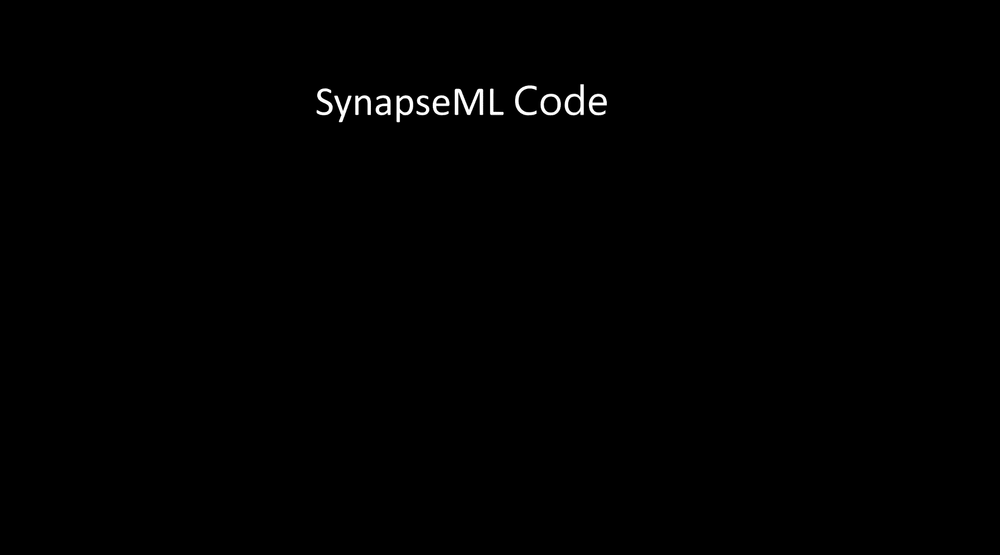

# 微软 Synapse ML 为构建大规模可扩展的机器学习管道提供了单一接口

> 原文：<https://pub.towardsai.net/microsoft-synapse-ml-provides-a-single-interface-for-building-massively-scalable-machine-learning-fa73a47f5fcd?source=collection_archive---------2----------------------->

## [机器学习](https://towardsai.net/p/category/machine-learning)

## 这个新平台提供了一个单一的 API 来抽象许多 ML 框架和数据库。

图片来源:微软研究院

> 我最近创办了一份专注于人工智能的教育时事通讯，已经有超过 10 万名订户。《序列》是一份无废话(意思是没有炒作，没有新闻等)的 ML 导向时事通讯，需要 5 分钟阅读。目标是让你与机器学习项目、研究论文和概念保持同步。请通过订阅以下内容来尝试一下:

 [## 序列

### 订阅人工智能世界中最相关的项目和研究论文。受到 110，000+的信任…

thesequence.substack.com](https://thesequence.substack.com/) 

构建大规模的 ML 解决方案无异于一场噩梦。即使您有完美的架构，高度可伸缩的 ML 管道通常需要组合许多基础设施平台和框架，这些平台和框架不是为无缝集成而精确设计的。即使对于最有经验的 ML 开发人员来说，编排不同 ML 工具的过程也是一个挑战。微软研究院刚刚开源了一个旨在应对这一挑战的新框架。

SynapseML 是 MMLSpark 的新版本，这是一个开源库，旨在实现大规模可伸缩的 ML 管道。在功能上，SynapseML 扩展了 Apache Spark 的功能，以更好地支持大规模可伸缩 ML 解决方案的需求。该平台使用分布式编程模型在数千台机器上分配给定的 ML 工作负载，同时确保 GPU-CPU 得到充分利用。更重要的是，SynapseML 设法使用一个 API 来实现这一点，该 API 在底层可以依赖于 LightGBM 或 XGBoost 等框架。

图片来源:微软研究院

SynapseML API 提供了一个与 ML 框架交互的数据、平台和语言无关的模型。这使得 ML 工程师可以快速编排不同的 ML 工具和框架，而不会牺牲开发人员的体验。API 的另一个重要方面是抽象底层文件和数据库交互。

微软将该框架添加到 Azure Synapse 分析平台，为 SynapseML 版本添加了一个不错的分发方式。这确保了该平台可以作为具有相应企业支持的原生 Azure 服务使用。SynapseML 是防止 ML 工具和框架市场日益分裂的最有趣的努力之一。跟踪 ML 社区如何接受和采用这个平台将会很有趣。