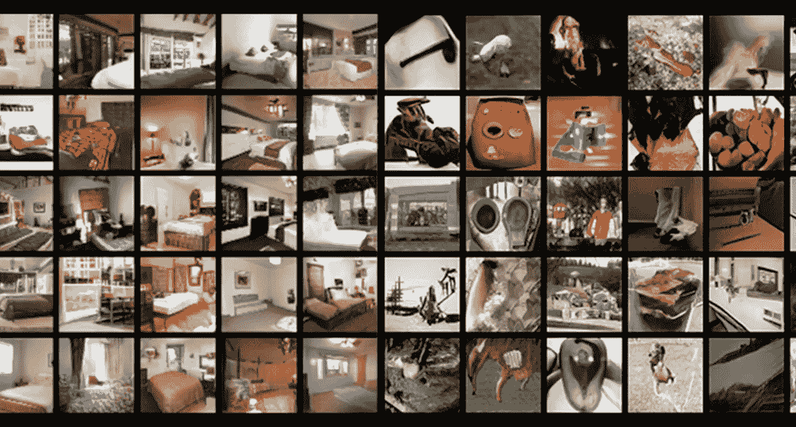
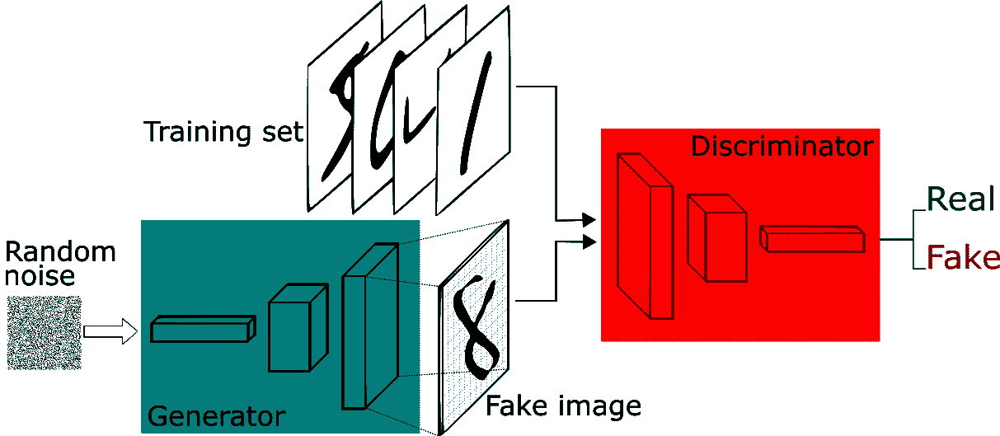
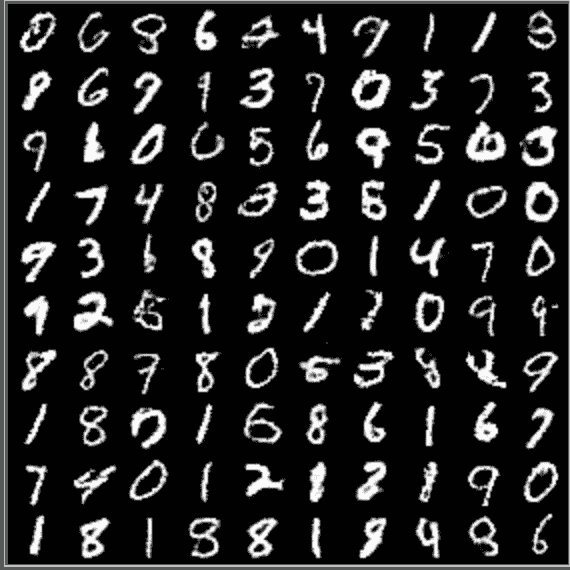
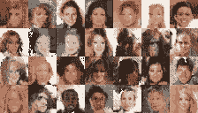
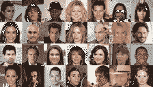

# 微软对离散数据使用 GANs

> 原文：<https://pub.towardsai.net/microsoft-uses-gans-with-discrete-data-c33ad16616e7?source=collection_archive---------1----------------------->

## [机器学习](https://towardsai.net/p/category/machine-learning)

## 边界搜索 GAN 是一种使用离散数据训练 GAN 模型的方法。

图片来源:微软

> 我最近创办了一份专注于人工智能的教育时事通讯，已经有超过 10 万名订户。《序列》是一份无废话(意思是没有炒作，没有新闻等)的 ML 导向时事通讯，需要 5 分钟阅读。目标是让你与机器学习项目、研究论文和概念保持同步。请通过订阅以下内容来尝试一下:

 [## 序列

### 订阅人工智能世界中最相关的项目和研究论文。受到 102，000 多人的信任…

thesequence.substack.com](https://thesequence.substack.com/) 

生成模型是深度学习的子学科，专注于静态精确目标数据的创建。在深度学习研究中，我们可以找到不同组的生成模型，如玻尔兹曼机器或定向生成网络。然而，在过去几年中，生成模型的最受欢迎奖无疑是生成对抗网络。在短短几年内，GANs 已经成为图像生成等关键任务深度学习场景的首选模型。

尽管它很受欢迎，但当今大多数 GAN 技术仅在处理连续数据时有效。这是因为 GAN 模型通常依赖于生成的样本是完全可微分的，因此对于离散数据不太适用。2018 年，来自微软的研究人员提出了一项名为[边界搜索 GAN](https://www.microsoft.com/en-us/research/publication/boundary-seeking-gans/)的新技术，可以使用离散数据训练 GAN 模型。

# 了解 GANs

对于围绕 GANs 的所有讨论，生成方法是一种相对较新的技术，由深度学习 Ian Goodfellow 在 2014 年的一篇[研究论文中提出。GANs 背后的主要思想是创建包含两个基本模型的网络:捕获数据分布的生成模型 G 和估计样本来自训练数据而不是 G 的概率的判别模型 D。G 的训练过程是使 D 出错的概率最大化。](https://arxiv.org/abs/1406.2661)

图片来源:微软

g an 在处理连续数据时非常有效，因为生成器和鉴别器的组成是完全可微分的，这意味着两个网络都可以使用反向传播等算法进行训练。然而，这在离散数据的情况下是不正确的，因为那些分布几乎在任何地方都具有零梯度(否则是无限的)，所以不可能单独使用反向传播来训练发生器。

# 为什么离散世代很重要？

既然我们已经了解了将 GAN 模型用于离散数据的挑战，那么下一个显而易见的问题是，这到底有什么关系？事实证明，离散 GAN 模型是大量自然语言处理场景的关键，如机器翻译或字幕生成。类似地，离散生成用于其他领域，例如图像分割，因为它应该避免传统模型的过拟合挑战。

# 什么是寻求边界的甘？

微软寻求边界的 GANs 背后的想法是引入一个新的政策梯度，有效地处理离散数据。如前所述，GANs 只有在价值函数完全可微时才起作用。对于离散数据，用于训练离散变量生成器的梯度几乎处处为零，因此不可能使用值函数直接训练生成器。然而，如果我们改变梯度会发生什么？

边界搜索 GANs 简单地引入了一种双梯度方法，它能有效地处理离散数据分布。最初，边界搜索型 gan 使用基于 KL-divergence 的策略梯度，该策略梯度使用重要性权重。然后，该技术将该梯度与一个较低方差的梯度相结合，该梯度为每个 z 定义了一个唯一的奖励信号，并证明这可以用于解决我们最初的问题。结果是一个 GAN 模型，其中鉴别器可用于制定为生成器提供策略梯度的重要性权重。

# 寻求边界的甘在行动

微软团队将边界搜索 GAN 方法用于测试不同的离散数据生成场景。其中一个实验使用了著名的 MNIST 和西里巴数据集。在 MNIST 实验的情况下，结果在数量上优于竞争方法，例如 WGAN-GP。下图显示了该算法如何能够生成逼真且高度可变的手写数字。

图片来源:微软

类似地，在 CelebA 实验中，被训练为 BGAN 的生成器产生了相当逼真的图像，这些图像很好地类似于原始数据集并且具有良好的多样性

Groundtruth 16 色(4 位)量化 CelebA 图像向下采样至 32 × 32。图片来源:微软

从发生器产生的样本被训练为在量化的 CelebA 上寻找 GAN 的边界 50 个时期。图片来源:微软