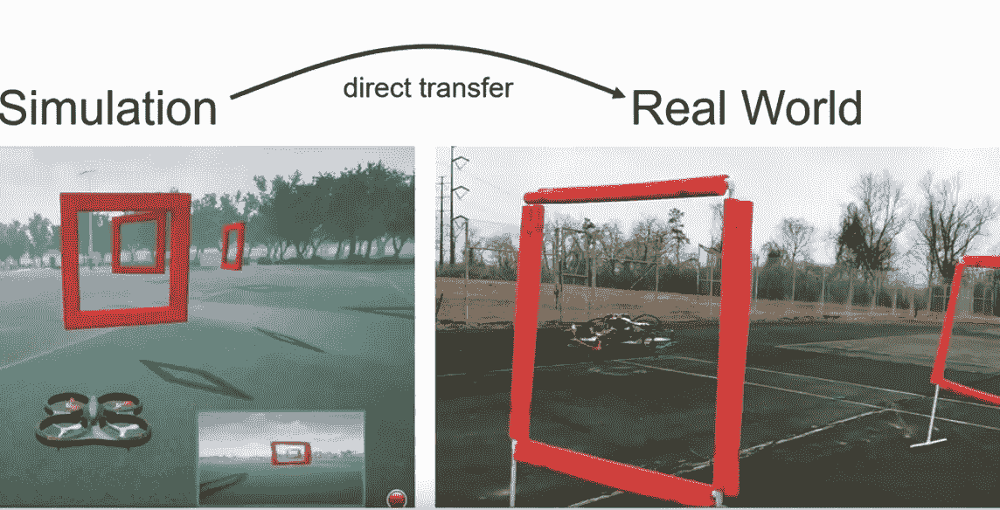
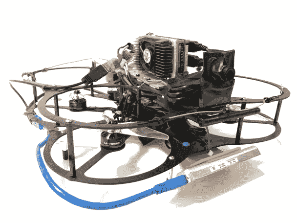
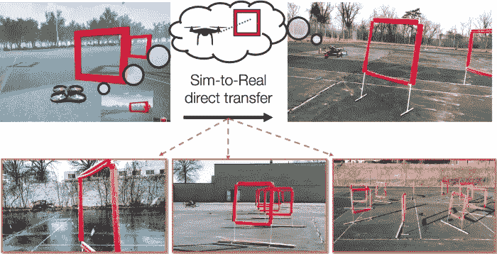
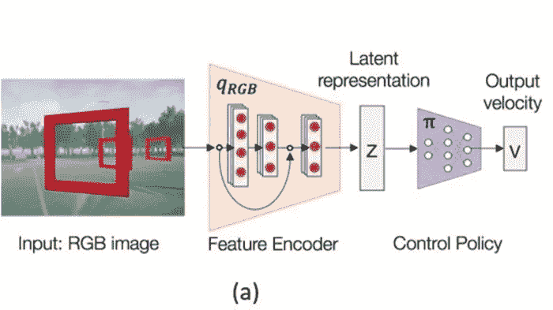
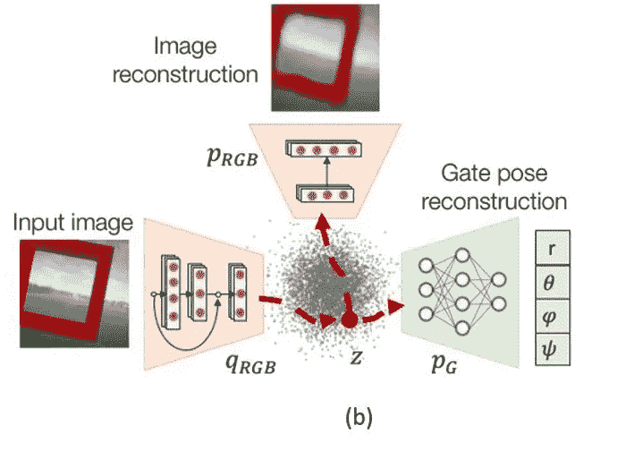
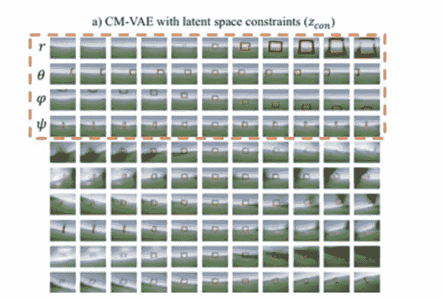

# 微软利用迁移学习来训练自主无人机

> 原文：<https://pub.towardsai.net/microsoft-uses-transfer-learning-to-train-autonomous-drones-50535e265a11?source=collection_archive---------0----------------------->

## 该模型能够在模拟环境和真实世界设置之间传递知识。

> 我最近创办了一份专注于人工智能的教育时事通讯，已经有超过 15 万名订户。《序列》是一份无废话(意思是没有炒作，没有新闻等)的 ML 导向时事通讯，需要 5 分钟阅读。目标是让你与机器学习项目、研究论文和概念保持同步。请通过订阅以下内容来尝试一下:

 [## 序列

### 与机器学习、人工智能和数据发展保持同步的最佳资源…

thesequence.substack.com](https://thesequence.substack.com/) 

感知-行动循环是我们大多数日常生活活动的核心。在潜意识里，我们的大脑使用感官输入实时触发特定的运动动作，这成为各种活动的连续活动，从体育运动到看电视。在人工智能(AI)的背景下，感知-动作循环是自动驾驶汽车等自主系统的基石。虽然模仿学习或强化学习等学科确实在这一领域取得了进展，但当前一代的自主系统在直接从视觉数据做出这些决定方面仍远未达到人类的水平。几年前，来自微软[的人工智能研究人员发表了一篇论文，提出了一种迁移学习方法，以在模拟环境中学习感知-行动策略，并将知识应用于驾驶自主无人机](https://arxiv.org/abs/1909.06993)。

学习基于感官输入采取何种行动的挑战与其说与理论有关，不如说与实际实现有关。近年来，强化学习和模仿学习等方法在该领域显示出巨大的前景，但它们仍然受到大量难以收集的标记真实世界数据的限制。另一方面，模拟数据很容易生成，但通常不会在各种现实生活场景中呈现安全行为。能够在模拟环境中学习策略并将知识推广到现实环境中仍然是自治系统的主要挑战之一。为了推进这一领域的研究，AI 社区为现实世界的自治系统创建了许多基准。其中最具挑战性的是第一人称视角无人机竞赛。

# FPV 挑战

在第一人称视角(FPV)比赛中，专业飞行员能够使用潜在的高噪音单目摄像头以高敏捷性规划和控制四旋翼飞行器，而不影响安全性。微软研究团队试图在 FPV 比赛中建立一个可以控制无人机的自主代理。

从深度学习的角度来看，导航任务中最大的挑战之一是输入图像数据的高维性和剧烈的可变性。成功地解决任务需要对视觉外观不变并且对模拟和现实之间的差异鲁棒的表示。从这个角度来看，可以在 FPV 赛车等环境中运行的自主智能体需要在模拟数据中接受训练，学习可以在现实世界环境中使用的政策。

许多解决挑战的研究，如 FPV 赛车，都专注于为无人机增加各种传感器，以帮助模拟周围环境。相反，微软研究团队旨在创造一种受人脑功能启发的计算结构，将视觉信息直接映射到正确的控制动作。为了证明这一点，微软研究院使用了一个非常基本的四旋翼飞行器和一个前置摄像头。所有处理都在 Nvidia TX2 计算机上完成，该计算机具有 6 个 CPU 内核和一个集成的 GPU。现成的英特尔 T265 跟踪摄像机使用 Tensorflow 框架提供里程计和图像处理。图像传感器是一个 830 水平 FOV 的 USB 摄像头，我们将原始图像缩小到 128 x 72 的尺寸。

鸣谢:微软研究院

# 代理人

微软研究团队的目标是在模拟环境中训练一个自主代理，并将学到的政策应用到现实世界的 FPV 赛车中。对于模拟数据，微软研究院依赖于 [AirSim](https://github.com/Microsoft/AirSim) ，这是一种用于无人机、汽车和其他交通工具的高保真模拟器。AirSim 生成的数据在训练阶段使用，然后在现实世界中部署学习到的策略，不做任何修改。

鸣谢:微软研究院

为了弥合模拟与现实之间的差距，微软研究院依赖于跨模式学习，该学习使用有标签和无标签的模拟数据以及真实世界的数据集。这种想法是在高维模拟数据中进行训练，并学习可以在现实世界场景中有效使用的低维策略表示。为了实现这一目标，微软研究院利用交叉--

模态变分自动编码器(CM-VAE)框架，它对每个数据模态使用一个编码器-解码器对，同时将所有输入和输出限制在一个单独的潜在空间。这种方法允许将标记的和未标记的数据模态结合到潜在变量的训练过程中。

将这种技术应用于 FPV 环境需要不同的数据形式。第一种数据形态考虑原始的未标记的传感器输入(FPV 图像)，而第二种表征的状态信息直接与手头的任务相关。在无人机竞速的情况下，第二模态对应于在无人机坐标框架中定义的下一个门的相对姿态。每个数据模态由编码器-解码器对使用 CM-VAE 框架进行处理，这允许学习低维策略。

自治 FPV 赛车代理的架构由两个主要步骤组成。第一步集中于学习潜在状态表示，而第二步的目标是学习在该潜在表示上操作的控制策略。控制系统架构的第一个组件接收单目摄像机图像作为输入，并将下一个可见门的相对姿态连同背景特征编码成低维潜在表示。然后，这个潜在的表示被输入到一个控制网络，该网络输出一个速度命令，该命令随后被 UAV 的飞行控制器转换成致动器命令。

鸣谢:微软研究院

降维是微软研究方法的重要组成部分。在 FPV 竞赛中，有效的降维技术应该是平滑的、连续的、一致的，并且对模拟图像和真实图像之间的视觉信息差异具有鲁棒性。为了实现这一点，该架构采用了一种 CM-VAE 方法，其中每个数据样本都被编码到一个单独的潜在空间中，该空间可以被解码回图像或转换为另一种数据形式，例如闸门相对于无人机的姿态。

鸣谢:微软研究院

由此产生的架构能够将基于 27，468 个变量的高维表示减少到最基本的 10 个变量。尽管只使用了 10 个变量来编码图像，但解码后的图像提供了无人机前方可以看到的丰富描述，包括所有可能的门大小和位置以及不同的背景信息。

鸣谢:微软研究院

微软研究院在各种 FPV 比赛环境中测试了无人驾驶飞机，包括一些极具视觉挑战的环境:a)室内，蓝色地板上有红色条纹，与盖茨的红色基调相同，图 8 b-c)大雪期间。下面的视频强调了自主无人机如何使用低维图像表示来完成所有挑战。

鸣谢:微软研究院

尽管微软的研究工作专门针对 FPV 赛车场景，但这些原则可以应用于许多其他的感知-动作场景。这种类型的技术有助于加速可以在模拟环境中训练的自主代理的开发。为了激励这项研究，微软[在 GitHub](https://github.com/microsoft/AirSim-Drone-Racing-VAE-Imitation) 中开源了 FPV 代理的代码。