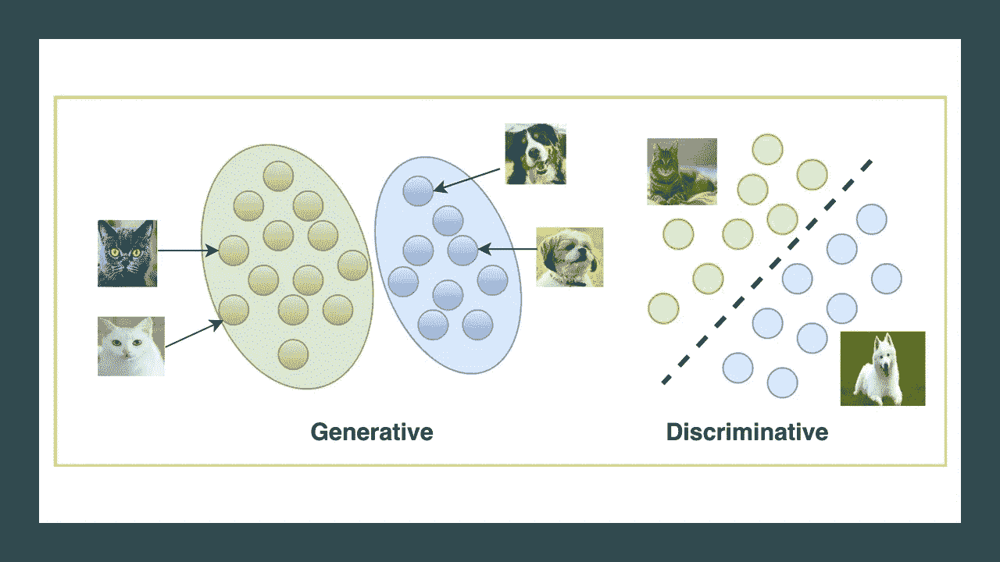
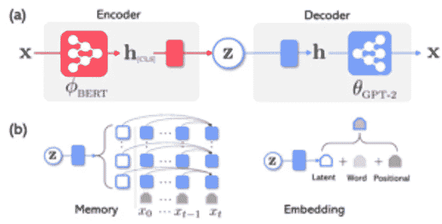
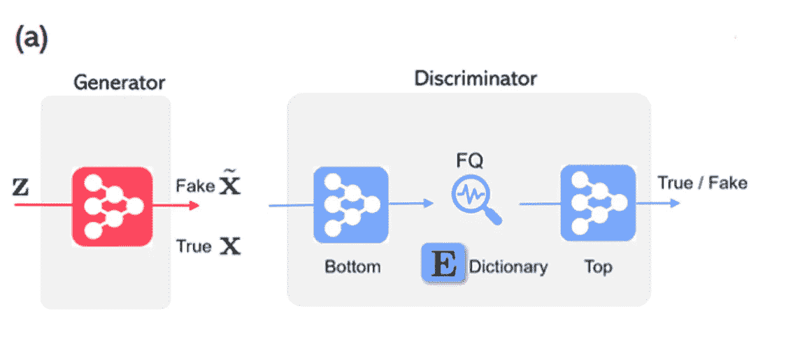
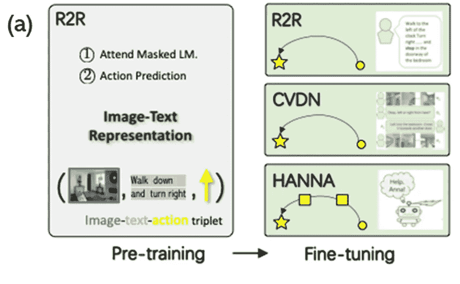

# 微软关于生成模型的新想法

> 原文：<https://pub.towardsai.net/microsofts-new-ideas-about-generative-models-b883070bef67?source=collection_archive---------2----------------------->

## [人工智能](https://towardsai.net/p/category/artificial-intelligence)

## 擎天柱、FQ-甘和流行为大规模应用生成模型带来了新的思路。

来源:[https://learnopencv . com/generative-and-discriminal-models/](https://learnopencv.com/generative-and-discriminative-models/)

> 我最近创办了一份专注于人工智能的教育时事通讯，已经有超过 10 万名订户。《序列》是一份无废话(意思是没有炒作，没有新闻等)的 ML 导向时事通讯，需要 5 分钟阅读。目标是让你与机器学习项目、研究论文和概念保持同步。请通过订阅以下内容来尝试一下:

 [## 序列

### 订阅人工智能世界中最相关的项目和研究论文。受到 102，000 多人的信任…

thesequence.substack.com](https://thesequence.substack.com/) 

在过去的几十年里，生成模型一直是机器学习的重要组成部分。随着深度学习的出现，生成模型开始与深度神经网络相结合，创建了深度生成模型(DGMs)领域。dgm 为深度学习领域带来了很多希望，因为它们有能力从观察中综合数据。该特征可以产生改善大规模模型的训练而不需要大量数据的关键。最近几个月，微软研究院公布了几个新项目，希望推进 DGMs 的研究。

围绕 dgm 的最大问题之一是它们是否可以应用于大规模数据集。近年来，我们看到了许多 DGMs 在相对较小的规模上应用的例子。然而，当谈到数据时，深度学习领域正朝着“越大越好”的理念发展，我们经常看到在难以理解的大数据集中训练新模型。可以在那个规模上运行的 dgm 的想法是该领域中最活跃的研究领域之一，也是微软研究项目的焦点。

# dgm 的类型

理解 dgm 的一个好方法是将它们与它们最著名的补充:判别模型进行对比。通常被描述为兄弟姐妹:生成模型和判别模型包含了我们了解世界的不同方式。从概念上讲，生成模型可以试图概括他们所看到的一切，无论辨别模型是否了解他们所看到的独特属性。判别模型和生成模型各有优缺点。判别算法往往在涉及高质量数据集的分类任务中表现得非常好。然而，生成模型具有独特的优势，可以创建与现有数据相似的新数据集，并在缺乏大量标记数据集的环境中非常有效地操作。

OpenAI 在 2016 年的一篇博客文章中出色地捕捉到了生成模型的本质，他们在文章中表示:

> *“为了生成数据，生成模型被迫发现并有效地内在化数据的本质。”*

在同一篇博文中，OpenAI 概述了对 dgm 进行分类的分类法，包括三个主要类别:

*I.* ***变型自动编码器:*** *一种编码器-解码器框架，允许在概率图形模型的框架中形式化这个问题，其中我们最大化数据的对数似然的下限。*

*二。* ***自回归模型:*** *此类模型将训练数据的分布分解为条件分布，从而有效地从以前的维度对数据集的每个维度进行建模。*

*三。* ***生成对抗网络:*** *一个生成器-鉴别器框架，使用对抗博弈来生成数据分布。*

近年来，我们已经看到了将 DGMs 应用于大规模模型的重大进展，如 [OpenAI GPT-2](https://openai.com/blog/better-language-models/) 或[微软的图灵-NLG](https://www.microsoft.com/en-us/research/blog/turing-nlg-a-17-billion-parameter-language-model-by-microsoft/) 。这些模型遵循相似的学习原则:自我监督的预训练，带有特定任务的微调。最大的问题仍然是 DGMs 是否可以系统化用于大规模的学习任务。在这方面，微软研究院最近公布了三大研究成果。

# 一款过程集成与优化设计平台

在论文[Optimus:Organizing sentences with pre-trained modeling of a universal latent space](https://www.microsoft.com/en-us/research/publication/optimus-organizing-sentences-via-pre-trained-modeling-of-a-latent-space/)中，微软研究院介绍了一种用于自然语言任务的大规模 VAE 模型。Optimus 提供了一个创新的 DGM，它既是一个强大的生成模型，也是一个有效的自然语言表示学习框架。

传统上，大规模预训练的自然语言模型已经被专门化为单一角色。GPT-2 或威震天等型号已被证明是强大的解码器，而伯特等型号则擅长于大规模编码器。Optimus 在一个新颖的架构中结合了这两种方法，如下所示:

Optimus 架构包括一个基于 BERT 的编码器和一个基于 GPT-2 的解码器。为了连接伯特和 GPT-2，擎天柱使用了两种不同的方法。在第一种方法中，潜在变量(z)被表示为解码器要关注的附加存储向量。或者，第二种方法将潜在变量(z)添加到解码器的底部嵌入层上，并直接用于每个解码步骤。

来源:[https://www . Microsoft . com/en-us/research/publication/Optimus-organizing-sentences-via-pre-trained-modeling-of-a-latent-space/](https://www.microsoft.com/en-us/research/publication/optimus-organizing-sentences-via-pre-trained-modeling-of-a-latent-space/)

Optimus 中的初始测试显示了优于现有预训练语言模型的关键优势:

1) **语言建模:**与现有的所有小型 VAEs 相比，Optimus 表现出了更好的表征学习性能，通过互信息和活跃单元来衡量。

2) **引导语言生成:** Optimus 展示了在语义层面引导语言生成的独特能力。

3) **低资源语言理解:**通过学习独特的特征模式，Optimus 表现出比替代模型更好的分类性能和更快的适应能力。

# FQ 甘

在论文[特征量化改进 GAN 训练](https://www.microsoft.com/en-us/research/publication/feature-quantization-improves-gan-training/)中，微软研究院提出了一种新的 DGM 图像生成方法。FQ-甘的创新依赖于在离散的空间而不是连续的空间中表现图像。

利用大数据集进行训练一直是生成对抗网络的主要挑战之一。这一挑战的部分原因是 GANs 依赖于非静态学习环境，这种学习环境依赖于小批量统计数据来匹配不同图像区域的特征。由于小批量只提供一个估计值，真正的底层分布只能在通过大量小批量后才能得知。

为了应对这一挑战，FQ-甘提出在鉴别器中使用特征量化(FQ)。首先通过真实和虚假数据样本的最近训练历史中的特征的移动平均总结来构建字典。这使得能够在运行中构建大且一致的字典，从而促进 GAN 训练的在线时尚。每个字典条目代表相似图像区域的唯一特征原型。通过将传统甘算法中的连续特征量化到这些字典项中，提出的 FQ-甘算法在鉴别器判断时，迫使真假图像从有限的值中构造它们的特征表示。这缓解了传统 gan 中小批量的不良估计问题。下图说明了 FQ-GAN 架构的主要组件:

来源:https://arxiv.org/abs/2004.02088

对 FQ-甘的初步测试表明，所提出的模型可以改善各种大规模任务的图像生成。事实证明，FQ 模块在匹配大型训练数据集中的要素时非常有效。FQ 氮化镓的原理可以很容易地结合到现有的氮化镓架构。

# 流行的

在《通过预训练学习视觉和语言导航的通用代理[一文中](https://www.microsoft.com/en-us/research/publication/towards-learning-a-generic-agent-for-vision-and-language-navigation-via-pre-training/)，微软研究院介绍了一个 DGM 代理，它可以根据语言指令在视觉环境中导航。普遍解决的挑战是一个经典的挑战:在多模态输入中训练深度学习代理无异于一场噩梦。

为了解决多模态输入的挑战，popular 提出预训练编码器对齐语言指令和视觉状态以用于联合表示。每个时间步的图像-文本-动作三元组被独立地输入到模型中，该模型被训练以预测屏蔽单词标记和下一个动作，从而形成自学习范例中的视觉和语言导航预训练。

为了对视觉和语言导航任务进行建模，popular 依赖于三个基本数据集:房间到房间(R2R)、合作视觉和对话导航(CVDN)以及“救命，安娜！”(汉娜)。R2R 是一个领域内的任务，语言指令在开始时给出，描述完整的导航路径。CVND 和汉娜是域外任务；前者是基于对话历史导航，后者是交互环境，导航中间给出中间指令。

流行的架构收集图像-文本-动作三元组从 R2R 数据集收集，并针对 R2R、CVDN 和汉娜环境中的任务进行微调。结果是一个智能体不仅能够掌握这三个环境，而且能够有效地概括未知环境和任务的知识。

来源:https://arxiv.org/abs/2002.10638

DGMs 是扩展深度学习模型的关键元素。微软与 Optimus、FQ-甘和 previous 的研究成果提出了可以纳入新一代 DGM 模型的新想法。微软研究院开源了与这项工作相关的代码和研究论文。