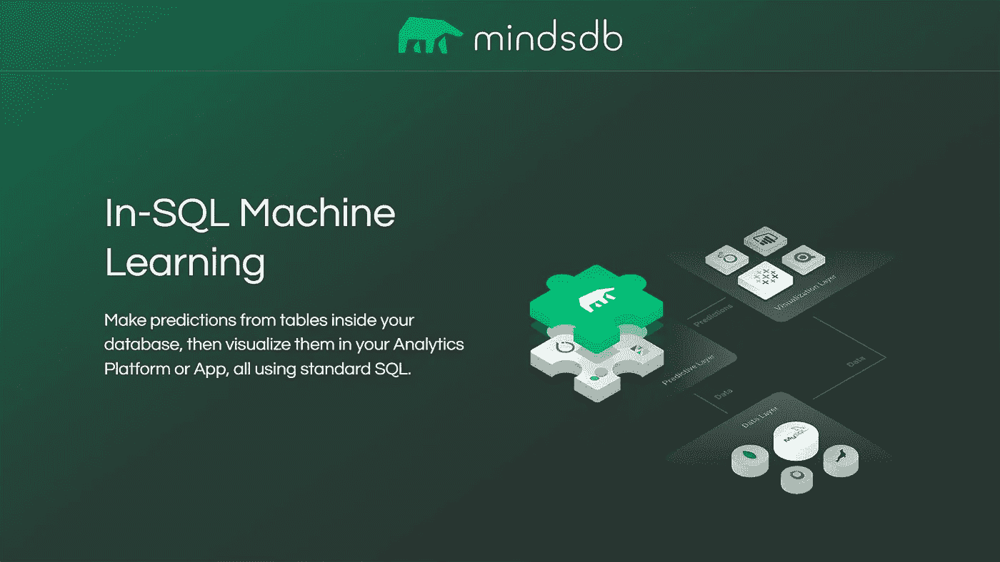

# MindsDB 获得了 760 万美元的种子资金，用于机器学习的民主化

> 原文：<https://pub.towardsai.net/mindsdb-scores-7-6m-seed-funding-to-democratize-machine-learning-e053e4019474?source=collection_archive---------2----------------------->

来源: [Unsplash](https://unsplash.com/photos/fIq0tET6llw)

## [新闻](https://towardsai.net/p/category/news)

## **明德银行宣布与雪花、单店&数据税**合作

**加利福尼亚州旧金山——2021 年 11 月 1 日——**[**MindsDB**](https://www.mindsdb.com/)，一家将机器学习(ML)引入数据库的开源机器学习(ML)初创公司，今天宣布了来自 Walden Catalyst Ventures 的投资，使 MindsDB 的种子轮总额达到 760 万美元。Walden Catalyst Ventures 加入了 YCombinator、OpenOcean(由 MySQL 和 MariaDB 的创始人发起的风险基金)、SpeedInvest 和加州大学伯克利分校 SkyDeck fund。MindsDB 的使命是通过给企业数据库"**一个大脑**"驱动更好的、数据驱动的商业决策，而企业不需要成为人工智能开发人员或专家，从而使 ML 民主化。

借助 MindsDB 的平台，企业可以利用标准 SQL 知识的机器学习能力，让企业在加速机器学习能力的同时降低开发成本。该平台已经被数千名开源开发者用于从预测心脏病风险到保险费预测的各种事情。

Walden Catalyst Ventures 的合伙人 Shankar Chandran 表示:“企业迫切需要将他们的数据库和记录系统与机器学习的最新创新连接起来，MindsDB 在其平台上的突破性创新意味着客户可以在几分钟内访问这些模型。”“将机器学习模型引入数据还会对运营、治理和合规性产生指数级影响，从而进一步推动企业价值。”

资料来源: [MindsDB](https://mindsdb.com/)

“我们非常兴奋和感激能够与 Walden Catalyst Ventures 合作，成为他们瞄准深度技术并专注于数据、云和人工智能的创始基金的一部分。”MindsDB 的联合创始人兼首席执行官若热·托雷斯说。“越来越多的企业利用机器学习模型进行影响其业务的实际应用，这是我们在开源社区看到的势头。”

此外，MindsDB 今天宣布与 Snowflake、SingleStore 和 DataStax(基于 Apache CassandraTM)建立合作伙伴关系，将其机器学习平台连接到这些数据库。通过这些合作关系，MindsDB 用户可以在这些平台内利用 MindsDB 的高级 ML，将他们的数据存储到预测引擎中。

“MindsDB 使组织能够显著加快和简化企业人工智能应用程序的开发，并使用标准 SQL 命令在多元时间序列数据上快速构建实时机器学习模型，”雪花技术联盟负责人 Tarik Dwiek 说。“作为我们合作伙伴关系的一部分，我们期待将这些优势扩展到雪花社区，以帮助 Snowpark 加快企业级数据管道、应用程序和机器学习工作流的构建。”

SingleStore 首席创新官 Oliver Schabenberger 表示:“使用 SingleStore 运行 MindsDB 可以显著提高性能，并降低训练机器学习模型的计算要求。“随着我们的客户大规模部署企业人工智能应用程序，与 MindsDB 和 SingleStore 的无缝集成将加速复杂人工智能和机器学习用例的开发和部署。”

“2021 年的数字交付意味着数据的低延迟全球可用性。开发人员希望这种按需提供的功能没有任何复杂性。“借助 Astra DB 和 MindsDB，各行各业的企业越来越能够利用基于开源的机器学习来加速决策和创新，减少责任和降低风险，并为用户提供更好的体验。”

 [## 帮助将人工智能和技术初创公司扩展到企业|走向人工智能

### 《走向人工智能》每月通过我们的定制软件为数百万科技读者提供服务。我们拥有成千上万的人工智能和…

sponsors.towardsai.net](https://sponsors.towardsai.net)  [## 加入我们吧↓ |面向人工智能成员|数据驱动的社区

### 向着 AI 加入。通过成为会员，你不仅将支持人工智能，但你将有机会…

members.towardsai.net](https://members.towardsai.net)  [## 店铺↓ |走向 AI

### 全球领先的 AI &科技新闻&媒体公司

towardsai.net](https://towardsai.net/shop)