# 采矿:互信息神经估计

> 原文：<https://pub.towardsai.net/mine-mutual-information-neural-estimation-26f6853febda?source=collection_archive---------0----------------------->

## [机器学习](https://towardsai.net/p/category/machine-learning)

## 利用任意神经网络估计互信息

资料来源:istock.com/ipopba

# 介绍

互信息，也称为信息增益，已经成功地用于深度学习(我们很快就会看到)和深度强化学习(例如， [VIME](https://arxiv.org/abs/1605.09674) ， [EMI](https://arxiv.org/abs/1810.01176) )的上下文中，来测量/增强两个表示之间的耦合。在这篇文章中，我们详细讨论了 Mohamed Ishmael Belghazi 等人在 ICML 2018 年发表的一个名为 [MINE](https://arxiv.org/pdf/1801.04062.pdf) (互信息神经估计)的神经估计器，它允许我们直接估计互信息。

本文由三部分组成:我们首先介绍互信息的概念，为更好地理解我们正在处理的事情建立一些直觉。然后我们介绍了挖掘算法，并讨论了它在深度学习中的一些应用。最后，我们会提供你需要的所有证据，让你明白我们在这里谈论的是什么。

注意，这是我们关于互信息系列的第一篇文章。未来几周还会有更多。希望你旅途愉快！

# 交互信息

数学上，两个变量 *X* 和 *Z* 之间的互信息定义为

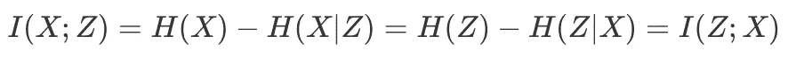

其中香农熵*H(X)=-E _ { p(X)}[log(p(X))]*量化了 *X* 中的不确定性，条件熵 *H(X|Z)=-E_{p(x，z)}[log(p(x|z))]* 度量了给定*Z*中的不确定性

对于相互信息有三种略有不同的解释:

1.  形式上，互信息捕捉随机变量之间的统计相关性。(相比之下，[相关系数](https://en.wikipedia.org/wiki/Correlation_coefficient)仅捕捉线性相关性)。
2.  直观地说， *X* 和 *Z* 之间的互信息描述了从关于 *X* 的 *Z* 的知识中学习到的信息量，反之亦然。
3.  直接的解释就是给定 *Z* 或者反过来就是 *X* 的不确定性的减少。

互信息也等价于联合概率 *P(X，Z)* 和余量 *P(X)* ⊗ *P(Z)* 的乘积之间的 KL-散度:

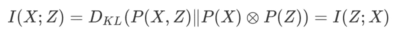

等式 1 .证明将在最后一节中给出

这种 KL-divergence 背后的直觉是，关节与边缘的乘积越不同， *X* 和 *Z* 之间的依赖性就越强。

# 挖掘算法

MINE 估计量给出了互信息*I(X；Z)* 通过计算

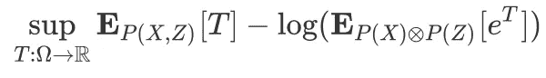

等式 2 .互信息 I(X；z)。证明将在最后一节给出

其中 *T* 可以是将 *x* 和 *z* 作为输入并输出实数的任何函数。这个最大的下限表明，我们可以自由地使用任何神经网络来近似互信息，并且由于神经网络的表达能力，这样的近似可以获得任意的精度。下面的算法正是我们刚刚描述过的，其中 *θ* 表示网络参数

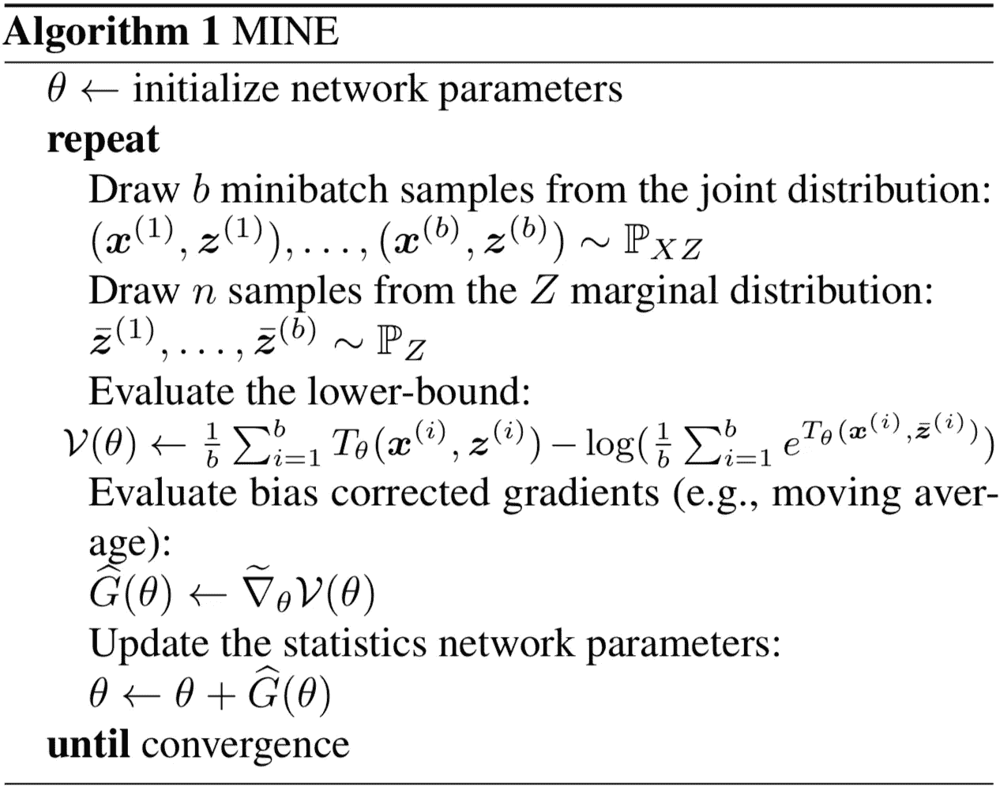

我的算法。来源:互信息神经估计

*V(θ)* 的梯度为

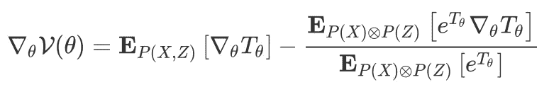

这是有偏差的，因为分母中的期望和小批梯度计算，作者建议用指数移动平均代替分母中的期望。对于小的学习率，这种改进的矿梯度估计器可以具有任意小的偏差。

## **公平性**

设 *Y=f(X)+σ⊙ϵ* ，其中 *f* 为确定性非线性变换，ϵ为随机噪声。互信息的属性*相等性*表示 *X* 与 *Y、*I(X；y)，对于噪声量 *σ⊙ϵ* 是不变的，并且应该仅取决于噪声量。即无论 *f(x)=x，f(x)=x* 还是别的什么，*I(X；只要σ⊙ϵ保持不变，就大致保持不变。下面的快照展示了我的捕获的公平性*

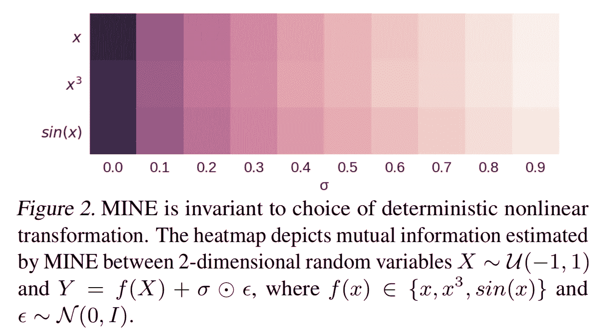

我的公平属性。来源:互信息神经估计

## 我的应用

**最大化互信息以改善 GANs**

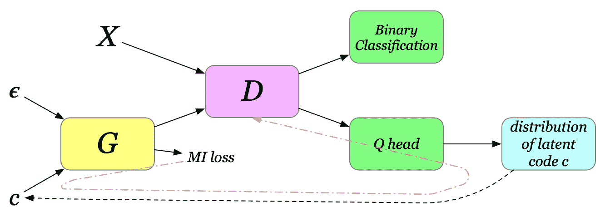

InfoGAN。通过红色虚线的互信息损失反向传播的梯度

GANs 通常面临模式崩溃问题，即生成器未能捕捉到训练数据的多样性。InfoGANs(Chen 等人[2])通过定义变量*、【c】*、噪声*、*和编码变量 *c* 的串联的潜在向量来缓解这个问题，如上图所示。噪声向量 *ϵ* 被视为不可压缩噪声源，而潜在代码 *c* 捕捉数据分布的显著结构化语义特征。在一个普通的 GAN 中，生成器可以忽略 *c* ,因为没有任何东西强制这种依赖性。为了加强这种依赖性，我们给发电机损耗增加了一个额外的互信息项，如下所示

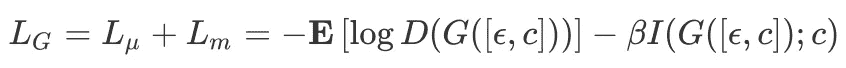

请注意，互信息是无界的，因此 *Lₘ* 可以压倒 *L_μ* ，导致算法的失败模式，其中生成器将其所有注意力放在最大化互信息上，而忽略了与鉴别器的对抗博弈。作者提出自适应地从互信息中剪切梯度，使得其 Frobenius 范数至多是来自鉴别器的梯度的范数:

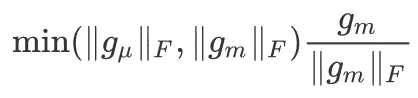

现在我们回到 *c.* *c* 是从一个辅助分布 *Q* ，一个被 *I(G([ϵ，c】优化的网络中取样的；c)* 到 *c* (如红色虚线所示)。在大多数实验中， *Q* 与鉴别器 *D* 共享所有卷积层，并且有一个附加的最终全连接层来输出条件分布 *Q(c|x)* 的参数，例如连续潜在码的正态分布的均值和方差。此外，由于 *c* 是从条件分布 *Q(c|x* 中采样的，我们可能还必须求助于重新参数化技巧，以便更新 *Q* 。

**最大化互信息以改善 BiGANs**

**BiGANs 简介**

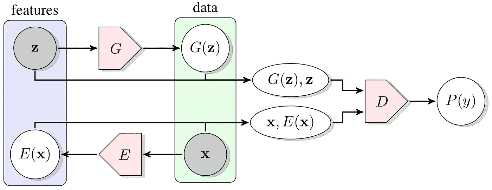

比根的建筑。来源:对抗性特征学习

双向生成对抗网络，BiGANs(Jeff Donahue 等人[3])，顾名思义，是双向的，因为真实数据在被传递到鉴别器之前被编码。鉴别器将特征表示( *z* 和 *E(x)* )和完全代表性数据( *G(z)* 和 *x* )作为输入，以区分它们。发生器和编码器协作，通过接近 *E(x)* 到 *z* 和 *G(z)* 到 *x* 来欺骗鉴别器。

**BiGANs 配合矿上**

为了减小重构误差，作者证明了重构误差 *R* 有界

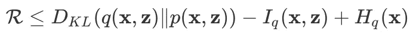

等式 3 重建误差的上限。证明将在最后展示

其中 *p* 表示发生器部分的联合概率，而 *q* 是编码器部分的联合概率。从上面的不等式我们不难看出，最大化 *x* 和 *E(x)* 之间的互信息可以最小化重构误差。因此，我们将额外的互信息添加到编码器损耗中，得到

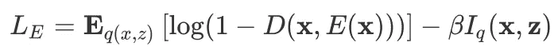

**信息瓶颈**

信息瓶颈的要旨是总结出一个随机变量 *X* 从而达到精度和复杂度的最佳权衡。也就是说，我们要提取出最简洁的表示*Z*来捕捉*X*与预测 *Y* 最相关的*的因素。因此，信息瓶颈方法的目标是最小化拉格朗日量*

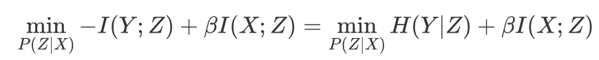

其中 *β* 是拉格朗日乘数。第一项最小化给定 *Z* 的 *Y* 的不确定性，而第二项最小化 *X* 和 *Z* 之间的依赖性。

# 补充材料

**公式 1 的证明**

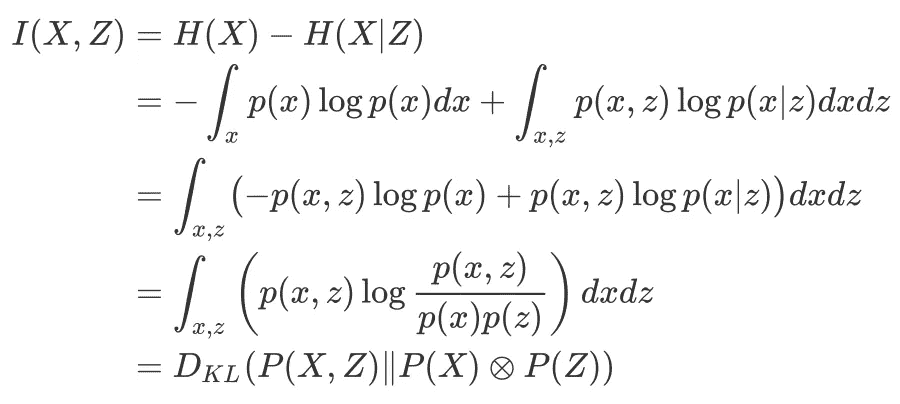

**证明方程 2 是*I(X；z)。***

为了说明等式 2 给出了*I(X；Z)* ，我们只需要证明下面的陈述

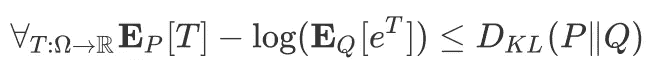

等式 4 .等式 2 的等效物

我们首先定义吉布斯分布

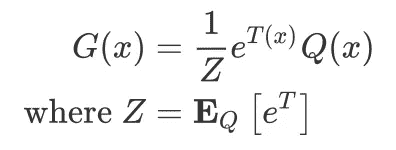

然后我们用我们刚刚定义的吉布斯分布 *G* 来表示等式 4 的左边

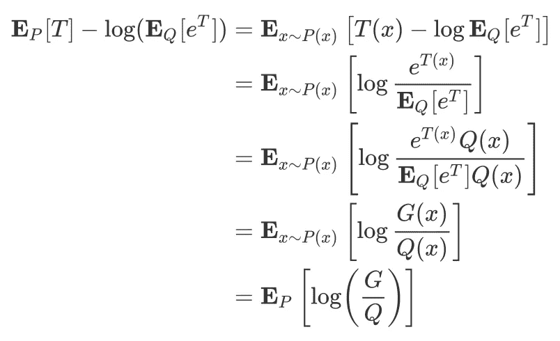

现在我们计算等式 4 左右两边的差值

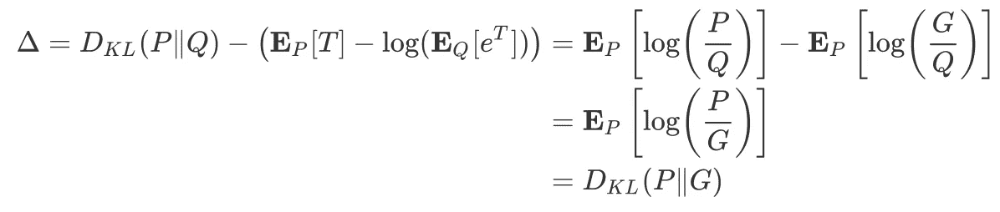

KL-散度的正定性确保δ≥0，因此等式 4 始终成立。

**公式 3 的证明**

重建误差定义为

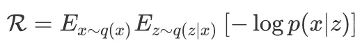

其中 *p* 是发电机， *q* 是编码器。这大致测量了发生器从编码器编码的 *z* 中恢复 *x* 的保真度损失。现在我们有了

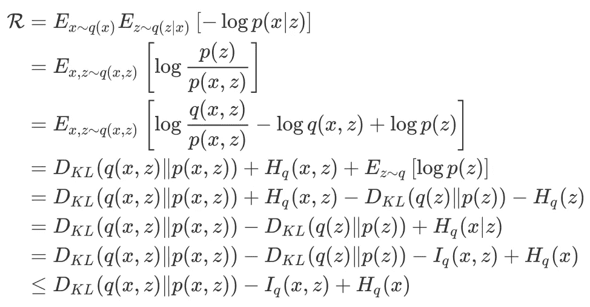

## 参考

1.  Mohamed Ishmael Belghazi 等.互信息神经估计
2.  信息最大化生成对抗网络的可解释表示学习
3.  杰夫·多纳休等,《对抗性特征学习》