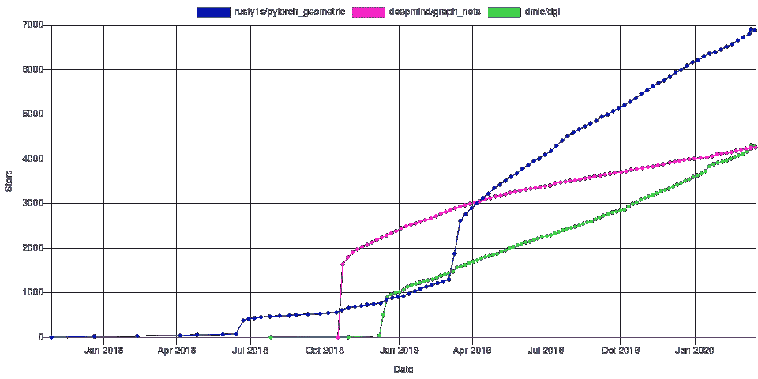

# 迷你 NLP 密码|迷你年度回顾

> 原文：<https://pub.towardsai.net/mini-nlp-cypher-mini-year-review-7917e12fb2e5?source=collection_archive---------5----------------------->

弗里德里希

## __init__。巴拉圭

## 👋👋2020 年——从未有过的一年

终于摆脱了 2020 年悲惨的 12 个月。我们一直戴着口罩，紧张地关注着疫苗更新的新闻。当地球静止了整整一个日历年，软件(和硬件)却在前进，而且从未停止。尽管这一年即将结束，一切都很平静，也许太平静了，但我们还是忍不住见证了微软和谷歌在永无止境的强力胶之战中再次正面交锋:

微软添加了 DeBERTa 来取代谷歌 T5 在基准测试中的地位，仅 12 小时后就被 T5 + Meena 的新部署取代(什么？).🤣

在 Quantum Stat，我们也在不断前进。除了 NLP 模型的数千个[推理代码片段](https://models.quantumstat.com/)之外，我们还在库存中添加了 [800+数据集](https://datasets.quantumstat.com/)和 [300+笔记本](https://notebooks.quantumstat.com/)。😵感谢所有促成此事的贡献者！

好，那么 2021 年的 NLP 是什么样子的？超大模型与较小压缩模型的分歧？或者预训练模型在稀疏性方面的进步如何？或者，模型小到足以自然地适应越来越接近现实的边缘又如何呢？

可能以上都有。此外，我们可能会看到图形和深度学习最终联姻。2021 年将是他们的蜜月。已经有几个库已经成熟了好几年，比如 [PyTorch Geometric](https://github.com/rusty1s/pytorch_geometric) 、 [DGL](https://github.com/dmlc/dgl) 和 DeepMind 的 [Graph Nets](https://github.com/deepmind/graph_nets) 。以下是他们 GitHub stars 这些年的成长轨迹:

via [paperspace 博客](https://blog.paperspace.com/geometric-deep-learning-framework-comparison/)

关于模型架构，我们也看到了一些节省内存、提高处理较长文本序列的能力和改进培训目标的替代方案。几个例子:

[龙前](https://github.com/allenai/longformer)

[重整器](https://github.com/google/trax/tree/master/trax/models/reformer)

[伊莱克特拉](https://github.com/google-research/electra)

此外，NLP 模型的领域特定的适应将继续激增。就领域而言，我指的是 3 个维度:语言、文本格式(Twitter 文本或正式文本等。)和部门(法律或医疗保健等。)

几个例子:

**以语言为主的** : [贝尔图克](https://github.com/stefan-it/turkish-bert)，[卡蒙贝尔](https://camembert-model.fr/)，[阿尔贝托](https://github.com/marcopoli/AlBERTo-it)，[姆贝尔](https://github.com/google-research/bert/blob/master/multilingual.md)

**文本聚焦** : [伯特威](https://github.com/VinAIResearch/BERTweet)，[夏伯特](https://github.com/wtma/CharBERT)

**部门聚焦** : [比奥伯特，](https://github.com/dmis-lab/biobert) [芬伯特](https://github.com/ProsusAI/finBERT)，[法-伯特](https://huggingface.co/nlpaueb/legal-bert-base-uncased)

随着几个库的发布，推理优化成为去年的大赢家。这一重点领域将有助于继续弥合研究和企业之间的绩效差距，因此，在即将到来的一年里，这一领域将会有更大的作为。以下是一些有助于优化变压器的库:

[快速成型器](https://github.com/microsoft/fastformers)

[涡轮变压器](https://github.com/Tencent/TurboTransformers)

[欣喜](https://github.com/sacmehta/delight)

[ONNX 变压器](https://github.com/patil-suraj/onnx_transformers)

BERT 现在看起来很遥远，有这么多新的模型架构和新颖的用例，使得 2020 年在这种情况下变得很奇怪。

但是 2021 年对我们所有人来说都是好的一年。所以在那之前…

新年快乐🎇🎆🎇，另一边见！✌✌ 2021

附注，常规 NLP 密码周日到达。