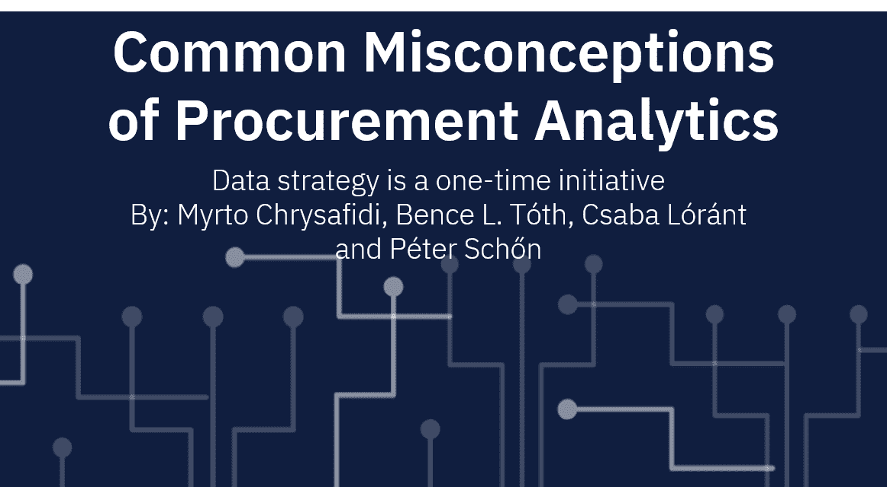

# 对采购分析的误解:数据策略是一次性的计划

> 原文：<https://pub.towardsai.net/misconceptions-of-procurement-analytics-data-strategy-is-a-one-time-initiative-2771b11f3948?source=collection_archive---------5----------------------->

## [数据分析](https://towardsai.net/p/category/data-analysis)

在过去几年中，IBM 采购分析即服务团队一直在处理来自 IBM 和各行各业客户的采购和应付账款数据，并从广泛的业务角度建立了一个数据战略框架。我们相信这个实用的框架可以被任何业务单位和行业所利用。

许多因素需要仔细考虑，以实现有效且精心设计的数据策略。本文概述了这些因素，并强调了 IT 之外的部门对于实现成功的数据治理计划至关重要。我们的框架是围绕数据生命周期构建的:从需求评估到消费。每个企业都可以找到应用这一方案的“面包屑”。

# 根据业务目标调整数据战略

越来越多的公司将数据视为战略资产，而不是业务活动的副产品。据[麦肯锡](https://www.mckinsey.com/business-functions/marketing-and-sales/our-insights/five-facts-how-customer-analytics-boosts-corporate-performance)称，数据驱动的组织获得客户的可能性是其 23 倍，留住客户的可能性是其 6 倍，盈利的可能性是其 19 倍。然而，根据 [2019 年 NewVantage 调查](https://c6abb8db-514c-4f5b-b5a1-fc710f1e464e.filesusr.com/ugd/e5361a_7e5120ecf1ab4d77a5c2a3d253663150.pdf)，77%的企业报告称，大数据和人工智能计划的“业务采用”仍然是他们面临的一大挑战。为什么？

一个重要的线索是 42%的公司[不评估、测量或监控数据治理](https://www.gartner.com/smarterwithgartner/how-data-and-analytics-leaders-can-master-governance)。数据治理整合了数据、角色、流程、通信、指标和工具，有助于组织正式管理和更好地控制数据资产。

数据活动通常被隔离在 IT 分支内，并且流程通常是重复的或冗余的，从而丧失了可扩展性并推高了成本。没有数据治理，公司就无法实现其数据的真正价值。缺乏确定优先级的客观标准会导致不一致的决策，从而推高成本并影响收入。当预算紧张时，没有明确业务价值的项目将经历资金和资源削减，进一步增加这种恶性循环的影响，影响 IT 和非 IT 部门。只有当业务目标与数据策略一致时，才能实现成功的企业范围的数据治理。

当业务目标和数据战略保持一致时，所有级别的员工都可以理解数据的重要性以及他们在日常工作中将数据视为重要资产的角色。成为数据管家成为公司文化的一部分，确保明确的角色和责任。这种一致性有助于发现运营中的原因和结果，并利用客户的洞察力，从而使数据项目能够获得适当资源的业务支持。

那么，我们如何将数据策略与业务目标联系起来呢？从自上而下的方法开始理解业务目标和优先级。然后，检查实现这些目标需要什么数据、为什么需要数据以及如何需要数据。你希望你的公司在 *x* 年后会怎样？数据如何帮助您实现这一目标？同时，自下而上，通过咨询部门领导来收集技术领域知识，以了解他们当前面临的问题、需求和挑战，有哪些数据可用，以及克服这些挑战需要什么。

在将您的数据战略与您的业务目标保持一致时，需要考虑一些想法:

*   从简单开始，迭代来精炼您的过程并定义用例。
*   了解您的客户和内部最终用户，以构建用户友好的，而不仅仅是“闪亮的”工具。
*   定义数据战略成功因素和 KPI。
*   修订和调整数据策略，以符合业务策略的变化。
*   分析当前的数据生态系统并发现其创新潜力，创建支持业务目标的“理想状态”。
*   找出您当前的生态系统与理想状态之间的差距，并制定路线图来释放数据的变革力量。

# 获取和处理数据

下一个关键的考虑是如何处理和存储数据，并使组织中的每个人都可以从中受益。多年来，企业一直依靠数据仓库和提取-转换-加载(ETL)流程来获得数据的整合视图。今天，集成来自多个来源的数据的 ETL 方法仍然是组织的数据集成工具箱的核心组件。然而，今天的数据速度需要一个[基础设施](https://www.ibm.com/blogs/journey-to-ai/2020/12/deploy-a-modern-data-and-ai-platform-on-the-infrastructure-of-your-choice/)，以无摩擦数据流为核心实现交换。端点(应用程序、流程、人员或算法)与数据中心交互，可能是实时交互，以便向数据中心提供数据或从数据中心接收数据。

数据中心旨在快速交换当今组织所需的信息。该中心捕获并协调任何类型的数据(元数据、主数据、运营数据、分析数据等)。).然后，它以多种期望的格式传递数据，而不必将数据物理地存储在一个中心位置。使用基于搜索的应用程序和 API 服务，数据消费者可以轻松发现并即时访问他们信任的数据。通过少量的技能提升，员工可以在日常工作中轻松利用数据中心。

# 丰富数据

一旦数据可用，就对其进行清理、分类，并与外部来源相结合。这些增强功能提供了背景信息，使公司能够做出明智的决策。

根据业务目标，可以追求不同类型的数据丰富，但在所有情况下，数据必须来自可信的来源。没有可靠的数据，领导者无法确信他们的决策是基于事实和现实的。

然而，保持数据一致和最新是一个持续的、高维护性的过程。超过 50%的企业[花在清理数据上的时间比使用数据的时间还要多](https://tdwi.org/research/2016/07/best-practices-report-improving-data-preparation-for-business-analytics.aspx)。定期更新对于保持数据最新至关重要，机器学习算法提供了一种简化这一过程的方法。

毕竟，如果业务决策者不能信任他们组织内的数据，那么利益相关者和客户又如何知道他们得到了可靠的处理呢？未正确维护和分发的信息可能会损害业务决策的完整性。

另一个重要因素是实施有效的采购分类。跟踪一个组织花掉的每一分钱似乎是一项不可能完成的任务。在业务专家的帮助下，建立这样的分类层次结构有助于对交易进行分类，使我们能够根据供应商类别交叉索引支出数据，并监控制定策略的进展。

在 IBM [的一份白皮书](https://www.ibm.com/downloads/cas/5KJ5AJQM)中，Marco Romano(时任 IBM S2P 首席数据&分析官)详细描述了可以满足认知引擎的有效分类法的三个特征:

1.  灵活—但全球化
2.  多维度—能够组合不同来源的元素
3.  视情况而定——或者，正如马可写道:“重要的不是你如何购买，而是你购买了什么。我会进一步指出，一个合适的分类法是关于识别你如何通过产品或服务来解决一个商业问题”

# 应用人工智能(AI)

近年来，机器学习(ML)驱动的人工智能的可访问性显著增加，但我们发现更好的数据继续击败更好的算法。因此，在人工智能计划中，大多数时间都花在设计和管理数据上，而不是开发算法。未能专注于提取相关字段或清理数据将降低计划的整体有效性，并显著增加出错的可能性。解决方案是让采购专家参与数据科学项目，以引入除技术专长之外的领域知识。

ML 模型被组织成复杂的人工智能系统，具有许多相互关联的数据组件。数据策略必须建立在可重用的、通用的组件上，这些组件具有易于理解的元素。将精力完全集中在技术需求上可能是该计划的另一个危险。相反，专注于数据需求将为 ML 注入的能力产生更好的结果。

# 分析数据消耗

许多组织无法支持决策，因为他们试图取悦组织中的每个人，而不是选择几个重点领域。

在设计数据策略时，您需要阐明一个清晰的目标，在此基础上进行分析。关注四种方法:

*   了解您的客户——客户概况、活动范围、行业趋势
*   创造更好的产品和服务—个性化的产品来击败竞争对手
*   改进流程
*   数据货币化——出售非敏感信息或许可

为数据定义分析目标后，选择要实施的业务案例，该案例反映了所选部分(采购、财务、制造等)中的流程。).

数据策略实施中的一个常见陷阱是假设员工能够使用数据可视化和仪表板。为了取得成功，你需要[让数据翻译](https://hbr.org/2018/02/you-dont-have-to-be-a-data-scientist-to-fill-this-must-have-analytics-role)加入你的战略团队，以弥合技术和运营团队之间的差距。

数据翻译的主要角色是将数据科学家、工程师和分析师的专业知识与业务职能联系起来。他们需要彻底了解他们的部门，包括他们正在运行的流程的战略目标，当然还有他们正在工作的行业。在他们的帮助下，您更有可能发现关键难点、潜在机会，并对解决后将带来最大价值的业务问题进行优先排序。数据翻译人员可以通过分析从您的数据中获得洞察力。他们也是转变公司文化的关键角色，因此每个人都参与到数据战略中，并将其视为自己的责任，而不仅仅是首席信息官。

浏览数据生态系统无疑是一项繁重的任务。业务和技术都在以前所未有的节奏变化，但同时，变化也为转型打开了大门。避免这些误解，承认各种挑战，并理解关键的成功因素，将有助于您规划一条路线，并在通往精心制作的可扩展数据策略的道路上做出任何必要的修正。