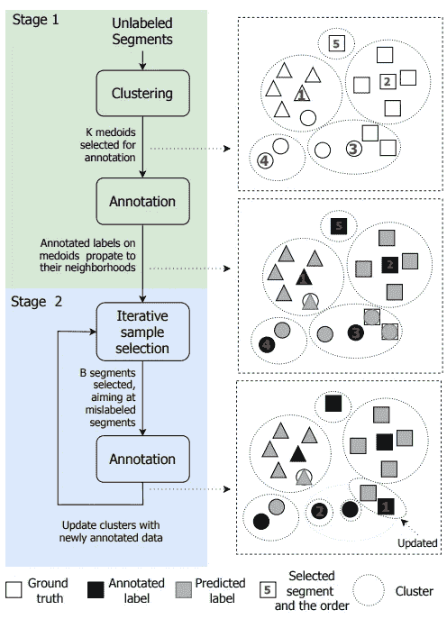

# 主动学习中的不匹配优先最远搜索

> 原文：<https://pub.towardsai.net/mismatch-first-farthest-search-in-active-learning-300233d7a4e3?source=collection_archive---------1----------------------->

## [机器学习](https://towardsai.net/p/category/machine-learning)

## 不匹配第一最远遍历方法


由[约翰-马克·史密斯](https://unsplash.com/@mrrrk_smith?utm_source=medium&utm_medium=referral)在 [Unsplash](https://unsplash.com?utm_source=medium&utm_medium=referral) 上拍摄

**主动学习**是一种让学习者(如学生)主动参与学习过程的教学策略。与传统的学习过程相比，学习者不仅仅是坐着听，而是与教师一起互动。学习进度可以根据学习者的反馈进行调整。所以，主动学习的周期很重要。如果你不熟悉主动学习，你可以访问这个[帖子](/active-learning-builds-a-valuable-dataset-from-scratch-cb4f66ff902c)。

# 整体架构

除了[主动学习中的半监督学习](http://Active Learning and Semi-supervised Learning)之外，我们将通过另一种方法来实现主动学习中的无监督学习和监督学习。Shuyang 等人(2018)提出使用 k -medoids(类似于 k-mean，但聚类中心必须是数据点之一)来识别聚类中心，然后估计来自同一聚类的最不可能的数据点以进行标注。



整体标签流程(Shuyang 等人，2018 年)

# 使聚集

采用 K-medoids 方法识别聚类质心。与 classic K-medoids 实现不同，它基于[最远优先遍历](https://www.cs.utexas.edu/~ml/papers/semi-sdm-04.pdf)。确定质心后，主题专家(SME)将处理注释。通常，我们会从一个小的集群开始，比如 4。Shuyang 等人(2018)通过中值邻域测试方法估计了聚类数。简言之，

# 首先是不匹配

在 SMEs 注释了一些数据点之后，它可以用于训练分类模型并预测剩余的未注释的数据点。最近邻分类器和基于模型(例如逻辑回归)的分类器被训练用于预测。如果预测的标注没有对齐，它们将被选为另一轮注记的候选标注。

# 最远搜索

有了一组不匹配的数据点，Shuyang 等人(2018)提出选择那些远离聚类质心的数据点。假设传播最大距离的标签很可能不属于特定类别。

# NLPatl 编写的 Python 代码

与主动学习一样，NLPatl 提供不匹配优先最远学习。它不是完全相同的实现，但遵循相似的架构和更大的灵活性。

你只需要让你的数据适合它，你就可以注释最有价值的数据点和自学的数据点。让我们准备好弄脏你的手。我将用几行代码演示如何在 NLP 中应用主动学习。你可以访问这个[笔记本](https://colab.research.google.com/drive/1dr1GY_vO_oOMixj4clzcMR7jLsNpbbvg#scrollTo=YCK94D1X7KBm)获取完整版本的代码。

```
learning = MismatchFarthestLearning(
  clustering_sampling='nearest_mean',
  embeddings='bert-base-uncased', embeddings_type='transformers',
  embeddings_model_config={'nn_fwk': 'pt', 'padding': True,
    'batch_size':8},
  clustering='kmeans', clustering_model_config={'n_clusters': 3},
  classification='logistic_regression')learning.explore_educate_in_notebook(train_texts)
```

# 参考

*   z 舒扬，T 海特托拉，T 维尔塔宁。[一种使用聚类和基于委员会的样本选择进行声音事件分类的主动学习方法](http://zhaoshuyang.com/static/documents/MAL2.pdf)。2018
*   [主动学习简介](/active-learning-and-semi-supervised-learning-turn-your-unlabeled-data-into-annotated-data-6e5c0f58c9f3)
*   [在主动学习中使用半监督学习](http://Active Learning and Semi-supervised Learning)

# 喜欢学习？

我是湾区的数据科学家。专注于数据科学、人工智能，尤其是 NLP 和平台相关领域的最新发展。在 [LinkedIn](https://www.linkedin.com/in/edwardma1026) 或 [Github](https://github.com/makcedward) 上随意联系 [me](https://makcedward.github.io/) 。