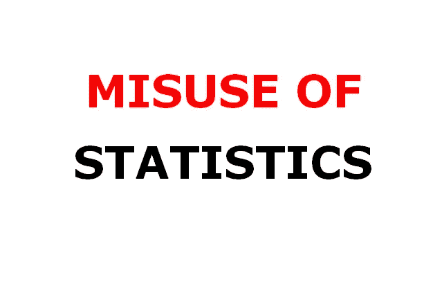

# 统计学的误用

> 原文：<https://pub.towardsai.net/misuse-of-statistics-c2b78b67a3c?source=collection_archive---------2----------------------->

## [意见](https://towardsai.net/p/category/opinion)，[统计](https://towardsai.net/p/category/statistics)

## 有些人会滥用统计数据，因为我们可以用统计数据撒谎

来源:作者图片

“政客们使用统计数据的方式就像一个醉汉用灯柱来支撑而不是照明”——A·朗

统计学是通过揭示无偏数据的潜在真相来评估关系和评价研究问题的主要工具。不幸的是，这些工具经常被滥用，要么是因为无知或缺乏计划而被无意中滥用，要么是为了实现某个特定的目标或结果而被明显和故意地滥用。在这个大数据时代，统计及其方法至关重要，因为它们不仅有助于总结或分析数据，还能提供解释和进一步的未来后果。这些后果(社会、经济等)。)是促使政治家(或政党)为了自己的成就而扭曲数据和统计分析的关键原因之一。在许多方面，某个事实或结论可以通过粗心或故意地使用一些统计技术而被改变。

让我们考虑一个地方，假设甲方曾经统治这个地方。在某次选举中，B 战胜了 A。此后，B 统治着 l 地区。现在，B 愿意表明他们的表现已经好于 A，因为选举即将到来，显然他们不想输。乙方希望 L 地区的居民在重要的选举之前对他们有一个好印象，因此他们会以某种方式使用有利于乙方的数据和统计数据。L 地区的居民被要求用 6 分制(在实线上)给甲方和乙方的表现打分。根据居民的满意程度，对双方各自的表现进行评分。假设，现在，乙方声称人们对他们更满意，并且乙方的整体满意度水平高于甲方。

下面是证明乙方提出的主张的统计数据。假设，X 表示随机选择的当地居民对甲方的满意度评分，Y 表示对乙方的满意度评分。在此背景下，很明显,( X，Y)生成了一个配对数据。两种标准检验，即 Fisher t 检验和配对 t 检验，可用于检验均值相等的假设。但是，当我们有双变量数据时，通常使用配对 t 检验，当两个感兴趣的变量独立时，使用 Fisher t 检验。因此，在这种情况下，为了检验假设(如上所述),配对 t 检验有望提供显著的结果。但是，如果使用 Fisher 的 t 检验，而不是在 X 和 Y 变量上使用 n 个数据点的配对 t 检验(样本大小为 n)，会发生什么呢？

假设，n=10，则给出(X，Y)上的十对数据:

X: 1.77，5.68，0.07，2.26，2.60，3.12，3.56，1.04，2.68，3.10

Y: 1.45，3.93，-0.03，1.01，3.20，2.02，1.57，-0.61，2.68，2.43

在这里，我们将测试 H0:μ1=μ2 对 H1:μ1>μ2(其中μ1，μ2 分别表示居民对甲方和乙方表现的平均满意度)

我们观察，

如果 T1>c1=1.833，则测试即配对 t-测试拒绝 h0。

因此，测试 I 在 5%的显著性水平上拒绝了 Ho(零假设)。

测试 II，即，如果 T2>c2=1.734，费希尔测试拒绝 h0

因此，测试 II 在 5%的显著性水平上接受 Ho(零假设)。

[T1 和 T2 分别表示配对 t 检验和费希尔 t 检验的检验统计值，T1=3.024135，T2=1.262702]

这一事实可能会诱使乙方仅仅因为费雪 t 检验没有足够的理由否定他们(乙方)的主张，而发表基于费雪 t 检验而非配对 t 检验的结论。因此，住在 L 区的人们将会消化一个错误的事实。

虽然上述交换或歪曲事实的伎俩并不涉及最糟糕的因素，即数据操纵，但现实世界数据的严酷事实是，即使在医疗部门、社会项目、环境项目等领域，数据也是被操纵的。为了某些政治和其他利益。有时技巧可以在图形图表中实现，如条形图、直方图、时间序列图等。

对于时间序列数据，时间间隔的选择对于理解感兴趣的变量的真实趋势是重要的。在捕捉就业率趋势时，数据必须进行季节性调整。有几个小小的扭曲因素可能会产生“高估”或“低估”，有些人总是准备使用那些通过统计错误手段获得的估计值。

因此，我们看到，当这一套科学方法、统计学以一种误导的方式被使用时，可能会欺骗漫不经心的观察者去相信一些与数据真正显示的不同的东西。这就引入了统计谬误，当一个统计论证断言一个谬误时就会出现这种谬误。在这个数据世纪，这种廉价的数据活动应该立即被废除，如果我们更加理解统计，这就可能发生。

“虚假的事实对科学的进步是非常有害的，因为它们往往长期存在；但是错误的观点如果得到一些证据的支持，不会有什么害处，因为每个人都从证明自己的错误中获得有益的快乐；当做到这一点，一条通往错误的道路就关闭了，通往真理的道路往往也同时打开了。”——查尔斯·达尔文，《血统》