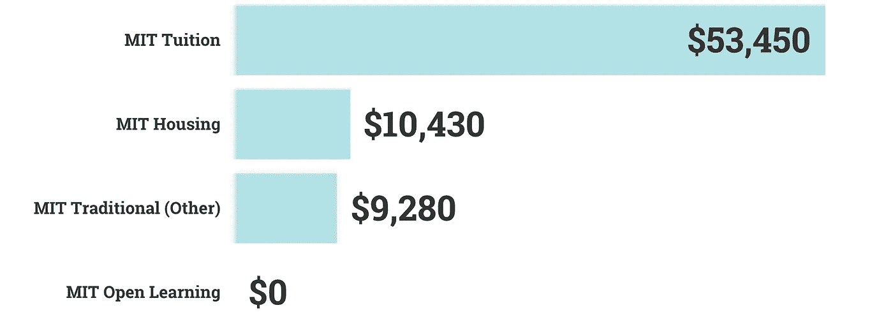

# 麻省理工学院发布了一门新的免费机器学习课程

> 原文：<https://pub.towardsai.net/mit-released-a-new-free-machine-learning-course-7f9527267250?source=collection_archive---------1----------------------->

## [教育](https://towardsai.net/p/category/education)，[新闻](https://towardsai.net/p/category/news)，[科技](https://towardsai.net/p/category/technology)

## 不要错过这个。🚋

迈克尔·魏德纳在 [Unsplash](https://unsplash.com?utm_source=medium&utm_medium=referral) 上的照片

麻省理工开放学习图书馆刚刚发布了一个[机器学习课程介绍](https://openlearninglibrary.mit.edu/courses/course-v1:MITx+6.036+1T2019/about)。*免费* 13 周课程涵盖机器学习算法、监督和强化学习等。

虽然你不需要这些技能来部署人工智能，但显然像[这样的无代码人工智能公司。AI](http://obviously.ai) ，如果你想在尖端领域工作并构建新的架构，它可以提供帮助。

# 为什么是麻省理工？

麻省理工学院是一个世界闻名的组织，这是有原因的。这所著名的大学拥有像巴兹·奥德林这样的毕业生，第二个在月球上行走的人(有趣的事实:巴斯光年是以巴兹·奥德林命名的)。

你将成为学习者社区的一员。梦想家。实干家。事实上，开放学习图书馆的部分使命是“将麻省理工学院的知识推广到全世界。”这一切都是免费的。

样本 2019–2020 麻省理工学院学年出勤成本对比麻省理工学院开放学习。由作者可视化。

这比麻省理工学院的标准价格低了不少。对于 2019-2020 学年，麻省理工学院给出了一个 73，160 美元的[样本](https://sfs.mit.edu/undergraduate-students/the-cost-of-attendance/annual-student-budget/) **。**

# 为什么是机器学习？

仅仅因为麻省理工学院是一所令人惊叹的学校，而且课程是免费的，并不意味着你应该不假思索地投入进去。

学习这门课程的一个更重要的原因是，机器学习是未来的。公司支付了大量的钱来成为这一现实的一部分。

根据 [Glassdoor](https://www.glassdoor.com/Salaries/data-scientist-salary-SRCH_KO0,14.htm) 的数据科学家平均工资。根据[美国消费者新闻与商业频道](https://www.cnbc.com/2017/08/24/how-much-americans-earn-at-every-age.html#:~:text=The%20median%20household%20income%20in,How%20does%20your%20salary%20compare%3F)的数据，家庭收入中值。由作者可视化。

机器学习几乎可以部署在任何有数据的地方。你可能用过 Google Analytics、Typeform、Hubspot 等工具。

事实上，机器学习可以用来使所有这些工具更加强大，无论是预测流量和转化率，预测[任何类型的数据](https://www.obviously.ai/post/how-to-make-data-predictions-from-your-typeform-responses)，甚至是[驱动增长黑客](https://www.obviously.ai/post/the-insanely-useful-guide-for-using-ml-to-growth-hack)。

 [## 如何用你的谷歌分析数据做出预测

### 上周，我们讨论了如何从你的表格回复中进行数据预测。我们想继续…的趋势

www . appearly . ai](https://www.obviously.ai/post/how-to-make-predictions-with-your-google-analytics-data) 

# 为什么要学呢？

如今，自动化工具似乎正在接管世界。如果你用谷歌搜索“没有代码的人工智能”，你会发现像用于创造性应用的 [RunwayML](https://runwayml.com/) 和[这样的工具。AI](https://www.obviously.ai/) 对于表格数据，除了更知名的 Google AutoML 工具(虽然，平心而论，Google 的版本相当难用)。

鉴于今天的人工智能比以往任何时候都容易，为什么还要费事去上这门课呢？答案是，AutoML 补充了创造性思维，但没有取代它。麻省理工学院的 ML 入门课程将帮助你理解该技术的良好用例，以及何时使用人工智能或其他东西。

通过奠定理解的基础，您可以使用 AutoML 工具极其快速地创建机器学习预测。通过快速、轻松地部署模型，您可以专注于创造力和直觉，而不是低级工作和处理代码错误。

# 你下一步应该做什么？

在线学习的很大一部分是执行。许多人参加在线课程，在个人资料上分享证书，然后继续前进。虽然让别人知道你在学习很好，但你想把课程作为垫脚石——作为旅程的一部分，而不是目的地。

我鼓励你不仅要报名参加这个课程，还要为你之后要做的事情做好计划。执行你所学的一个很好的方法是访问 [Kaggle 数据集](https://www.kaggle.com/datasets)并找到一些你想了解更多的有趣数据。然后，您可以尝试上述 AutoML 工具之一，并部署您的知识。

另一个很好的执行方式是更近距离地观察你的家庭，问问你能如何帮助你自己的组织。你有什么数据？您面临哪些业务挑战？您的数据中有可以分析的 KPI 吗？即使你还是一名学生，你也可以看看，问问，看看如何利用数据来提高你所在学院或大学的成绩。

# 结论

世界变化很快。为了跟上技术的发展，你需要成为一个终身学习者。

鉴于人工智能行业变化如此之快，参加几年前的课程可能不够，所以寻找新课程是保持领先的一个好方法。

最终，麻省理工学院是一个享有盛誉的著名组织，这是有充分理由的，他们的免费 ML 课程是显而易见的。只要确保你把你学到的东西用在好的地方就行了！

我已经报名了——你呢？