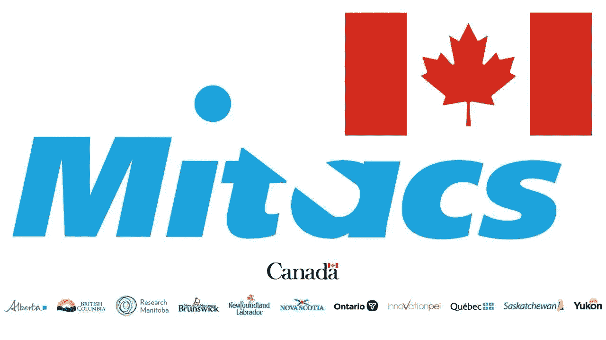

# MITACS Globalink 研究实习|如何获得一个？

> 原文：<https://pub.towardsai.net/mitacs-globalink-research-internship-how-to-get-one-681a1dcdc79?source=collection_archive---------0----------------------->

Mitacs Globalink 研究实习

让我先自我介绍一下。

大家好，我是 [**拉曼·贾**](https://www.linkedin.com/in/jhakrraman/) ，一名大三工程学士，就读于浦那的[萨维特里拜浦那大学](https://www.unipune.ac.in/)的帕蒂尔工程学院。我被选中参加 [**Mitacs Globalink 研究实习**](https://www.mitacs.ca/en/programs/globalink/globalink-research-internship)**【22】**参加 [**达尔豪西大学**](https://www.dal.ca/) ，加拿大新斯科舍省哈利法克斯。我将在安德鲁·鲁滕贝格教授的指导下工作。我的项目名为“使用机器学习，在衰老和死亡过程中，生物体的鳞片是如何相互作用的？”。在这个项目中，我们将从物理学的角度对衰老进行建模，以理解个体衰老轨迹的可变性、健康缺陷之间的相互作用以及观察到的衰老现象的机制。该项目目前正在使用动态联合可解释网络(DJIN)深度学习模型来研究模型生物的衰老或研究慢性病的影响。我将致力于**用多尺度数据训练 DJIN 模型，以确定这些尺度如何相互作用**。这个项目可以极大地促进**#老化、#机器学习、**和**#深度学习的研究。**

那么，现在让我们开始我的远航吧！！

这一切都始于 2021 年 5 月的最后一周，当时我偶然发现了伊马·阿胡佳的一个知识库，里面包含了几乎所有本科生的研究实习。通过这个知识库了解 Mitacs Globalink 研究实习后，我知道这是一个可以为我提供国际研究经验和对我来说前所未有的曝光率的实习。那时我没有很多东西来展示我的技能。六月份，我在勒克瑙的 IIIT 得到了一份**研究实习**，这真的帮助我为这次实习建立了个人档案。我致力于从 UCI 的数据中预测心脏病。在那之后，我还入选了**剧本奖学金 21** ，在那里我从事一个名为“Craftbrain”的机器学习项目。

现在，读完这篇文章后，你一定在想**这个实习到底是关于什么的？它会像一个暑期研究项目还是一个暑期学校？资金呢，我会因此得到资助吗？这将是一次现场实习还是一次远程实习？我将如何管理我的开支？这个清单还会继续下去，我完全可以理解，因为我也曾经有过这些疑问。**

所以，通过这个博客，我会尽我所能回答大多数关于这个惊人的机会的相关问题，这个机会肯定会改变你的生活，并为你提供一个在加拿大大学及其实验室工作的机会。这也将为你提供一个**机会，在你完成本科学业的同时，与一些最优秀的研究人员合作** **，而且还会有一份不错的薪水:**

加拿大——一片充满机遇的土地

现在我们应该从一些基本问题开始，通常每个求职者在听到这个实习机会时都会有这些问题。

1.  **什么是 Mitacs Gloabalink 研究实习？** 如[Mitacs](https://www.mitacs.ca/en/programs/globalink/globalink-research-internship)*官方网站所述，Mitacs Globalink 研究实习是一项面向来自以下国家和地区的国际本科生的竞争性计划:澳大利亚、巴西、中国、法国、德国、香港特别行政区、印度、墨西哥、突尼斯、英国和乌克兰。每年 5 月至 10 月，排名第一的申请人在加拿大大学教员的指导下参加为期 12 周的研究实习，涉及各种学科，从科学、工程、数学到人文和社会科学。*

换句话说，**对于像你这样的成长中的研究者来说，这是世界上最好的机会之一，可以获得国际视野，并与学术界一些最优秀的研究者合作**。这将为你提供一个机会，为一些有趣的和现实生活中的研究项目做出贡献。项目的持续时间为 12 周(5 月至 10 月)。**研究项目的独特之处在于，开始日期和结束日期取决于被选中的实习生是否有空。从 5 月 1 日到 7 月 31 日，你可以随时开始你的项目。你将被要求在你被选中的大学里，在一位加拿大教授的指导下每周工作 40 个小时。**

**2。为什么这个实习这么有声望？以下是让它享有盛名的几个关键点:**

> **1。国际曝光:**由于这是一次国际实习，所以许多实习生将来自世界各地。这个实习为实习生提供了一个接触多国人士的机会。这将有助于他们相互合作和学习。
> 
> **2。技术接触:** Miatcs Globalink 研究实习生将有机会进入世界上最好的研究实验室之一，他们将亲自动手进行研究，他们还将与许多最优秀的研究人员合作开展他们的研究项目。
> 
> **3。Globalink 研究生奖学金:**根据他们的官方[网站](https://www.mitacs.ca/en/programs/globalink/globalink-graduate-fellowship)“Globalink 研究生奖学金为**前** [**Globalink 研究实习生**](https://www.mitacs.ca/en/programs/globalink/globalink-research-internship) 提供 15，000 美元的财政支持，他们将返回加拿大攻读完整的硕士或博士课程，或在任何 Mitacs [合作机构](https://www.mitacs.ca/en/about/partners)获得博士后奖学金。Globalink 校友可以申请 Globalink 研究实习主办机构之外的其他大学的奖学金”。
> 
> **4。竞争激烈:在这个实习项目中，来自选定国家的申请人申请这个项目，这使得它对其他申请人来说极具竞争力。**
> 
> **5。津贴:** Mitacs 为此次 Gloabalink 研究实习的实习生提供了相当不错的津贴。此时，它正在线下发生，所以我可以向您确认，该金额足以管理支出并在加拿大停留 12 周。

说到资金，它包括你的**机票、签证、生活津贴、日常津贴，以及与 COVID 相关的费用津贴。(今年大概是 8500+加币)。**这一次实习是在两年后以面对面的方式进行的(感谢上帝，这次不是以虚拟的方式),津贴有时取决于津贴合作伙伴**这是 Mitacs + AICTE 或 Mitacs+sha stri-Indo Canadian institutes，请查看更多信息。看到这个数目，你一定想出这个数目足够你在加拿大进行为期 12 周的研究实习，而且如果你明智地使用它，你还可以在加拿大漫游和探索一些地方后节省很多钱。:)**

> 我敢肯定，阅读这些东西已经激励你参加这个研究实习项目。甚至你已经开始想象自己是一个神达 GRI'23。

所以在这之前，让我们来看看这次实习的技术部分。

Mitacs Globalink 研究实习的资格标准

2022 年这个项目的[资格要求](https://www.mitacs.ca/en/programs/globalink/globalink-research-internship)如下(很多年都差不多，不用担心来年):

> **1** 。申请时年满 18 岁
> 
> **2。**在符合条件的院校注册全日制本科或本科/硕士课程(参见按国家列出的符合条件的院校列表)
> 
> **3。到 2022 年秋季，他们的项目还有一到三个学期**
> 
> **4。**满足所在国家/地区的成绩要求(参见每个国际合作伙伴的 GPA 要求)
> 
> **5。**申请最少三个最多七个项目，并确保选择来自至少三个不同的加拿大省份
> 
> **6。**熟练掌握项目的口头和书面语言(英语和/或法语)
> 
> 7。可以在 5 月 1 日至 10 月 31 日期间完成连续 12 周的实习。

我希望你符合这个实习项目的所有要求。现在我们转到本次实习的**申请流程**。

**申请开始和截止日期:**

通常这个研究申请在八月的第二周开始，在九月的第三或第四周结束。(我的申请开始于 2021 年 8 月 10 日**，申请截止日期为 2021 年 9 月 22 日**)。由于您将有一个多月的时间用于您的 Mitacs GRI 应用程序，所以要好好利用它。不要想当然。从申请一开始就开始写你在**的研究经历**和**你的简介**(将在接下来的章节中详细阐述)，并获得你的朋友和亲戚对它的评论。正如我之前提到的，我对这个计划非常感兴趣，所以我订阅了他们的 [**简讯**](https://www.mitacs.ca/en/programs/globalink/globalink-research-internship) ，这帮助我了解了这个计划的申请开放日期。****

******申请流程:******

****对于这个 [**研究项目**](https://globalink.mitacs.ca/#/) ，Mitacs 有自己的应用入口。您需要在此门户网站上注册您的电子邮件 ID 和密码。在这一步之后，您将进入您的应用程序。现在实际的申请过程开始了。我会尽我所能在每一个板块回答你所有的疑惑和疑问。****

> ******个人详细信息**部分——在申请的这一部分，你应该填写你的个人详细信息，如**全名**(根据护照填写)、**出生日期、居住国、国籍、你的地址**以及一些其他类似的问题。****
> 
> ******教育详情**部分——该部分用于了解您当前的教育背景，如**大学名称**(如果您的大学名称不在此处，您也可以搜索您的大学名称)**第四学期的 GPA**、您所报读的课程、国家等。****
> 
> ****我看到在**Mitacs GRI’22、**之前，许多实习生都谈到过 **SOP** 和**研究原理**，而在我的案例**中却没有。有三个问题负责评估申请人的个人资料**。下面提到了三个问题:********
> 
> ****1-技能、背景、研究兴趣和经验的一般描述(100 字)**-这个问题旨在评估你在这次研究实习中的总体情况。它需要你所拥有的技术技能，你以前在你感兴趣的领域的背景，你感兴趣的特定研究领域，最后是你在那个特定研究领域的经验。请记住，字数限制在 100 字以内，所以要用词精确，根据你的个人资料来写。**
> 
> ****2-显著成就(100 字)**——在这个问题中，你需要提供你认为与你的申请相关的本科成就。你可以添加一些东西，比如你参加的任何**黑客马拉松、研讨会、编码挑战**等等。如果你愿意，你也可以在这里精确地描述你的**项目**。如果你在相关领域有任何技术写作经验，或者你在任何网站上发表过技术文章，那么也一定要提到它们。记住字数限制还是 100 个字。**
> 
> ****3-简要描述你已经完成的研究工作(100 字):**描述你在这个问题中已经完成或正在进行的任何研究工作。你相关研究经验将极大地帮助你在其他申请者中脱颖而出。你应该展示你是如何完成你的研究工作的，以及你是一个以研究为基础的人？(记得要精确)。**
> 
> ****基于 MCQ 的**部分——诚实回答一些基本问题。**
> 
> ****与 Mitacs 合作的经历** —在此，您需要具体说明您是如何从 Mitacs 官方网站、大学门户网站或 Mitacs GRI 校友那里获得关于此 Mitacs Goabalink Reaserch 实习项目的知识的。**
> 
> ****推荐信** — Mitacs 要求您最多提交 2 封(至少需要一封)推荐信。它为您提供了两个上传 lor 的选项:**要么您上传两个 lor 的合并 pdf，要么您提供推荐人的详细信息**(如**姓名和电子邮件 Id** )，然后他们会收到一封提交 lor 的邮件。您可以选择其中一个选项，也可以两个都选(**，**我选择两个都选，因为我的一个教授把他的 LoR 发给了我，所以我把它上传到了 Mitacs portal，而另一个教授自己上传了)。你应该让你的教授知道这封推荐信的来源，这样他们就能给你提供一封强有力的推荐信。如果你在教授手下工作过，或者积极听课，这是让你脱颖而出的一个重要因素。您还需要确保是否只允许基于行业或基于学术的 lor。**
> 
> **项目:这是你申请中最重要的部分。你被选中参加这次实习的主要机会取决于你的项目选择。我们将在下一节详细讨论这一点。**
> 
> ****文件**——最后，你需要提供你的简历和成绩单(你需要向你的家乡大学申请正式的成绩单，这是一个为期一周的程序，所以请确保在申请截止日期前尽快获得。你也可以用你的非正式证书申请。它也能完成工作。我已经证实了这一点与其他神达 GRI 校友以及来自神达。)**

**提交您的申请，现在您已经完成了您的 Mitacs Gloabalink 研究实习申请。你现在应该努力提高你的技能，这样它们会在你和教授的面试中对你有所帮助。**

****让我们来了解一下申请中最重要的部分:选择研究项目。****

****

**选择正确的研究项目是最重要的。**

**现在在这一部分，我将详细说明选择研究项目的方法，通过这些方法，选择研究项目将是一项更容易的任务，也将帮助你根据你的个人资料做出正确的决定。我也补充了我个人的小技巧，供大家参考。**

**您可以选择最少 **3 个研究项目，最多**7 个研究项目，但是有一个限制同一省份最多只能选择 3 个项目。(加拿大被分成几个省，如**艾伯塔、不列颠哥伦比亚、马尼托巴、新不伦瑞克、纽芬兰和拉布拉多、新斯科舍、安大略、爱德华王子岛、魁北克和萨斯喀彻温)**。所以你只能从上面提到的任何一个省中选择 3 个项目，但不能超过 3 个。**

****以下是选择研究项目时必须考虑的一些要点(在我的时代，Mitacs 门户网站上有 3000 多个研究项目):****

> **1.你应该选择一个与你感兴趣的领域相关或者你有经验的项目。这将表明你了解这个项目，你也有兴趣和技能。**
> 
> **2.你应该通过阅读项目细节中提供的描述、学生角色和所需技能来仔细评估项目。**
> 
> **3.Mitacs 提供了一个非常有用的平台，通过应用过滤器来选择项目，如关键字、省份、主办教授姓名、主办大学名称、语言(英语/法语)。(就我而言，我对机器学习感兴趣，所以我使用了像机器学习、深度学习和计算机视觉这样的过滤器)。**
> 
> **4.列出项目的优先顺序(2-雄心勃勃，4-目标明确，1-安全)。你将有机会根据你的喜好对你的项目进行排序。第一个项目是你最优先考虑的，第七个项目是你最不喜欢的。**
> 
> **5.你还应该检查你的项目的预期语言(英语/法语)。**

**为了选择最终的项目列表，我建议你列出一个项目列表，包括项目 id、项目细节和主办大学名称。这将有助于您筛选出那些与您的个人资料不相关的项目。**

****个人提示**:从我在神达公司的经历来看，我可以说早期的研究经验会有所帮助。因为这将有助于你写下你的研究兴趣和经历。这也会给你在和教授面谈时提供一些基础。**

**所以，我会建议你尝试在教授手下工作，或者做一个研究实习。如果你在相关领域有任何出版物，那么你的资料已经比其他申请人有优势了。如果你刚刚开始接触这些东西，我会建议你探索尽可能多的领域( **Web 开发、Android 开发、机器学习、网络安全、物联网等)。**)尽可能的多，这样才能知道自己感兴趣的领域。**

**如果你没有任何经验，那也完全没问题。你绝对可以用你的个人项目来弥补。你应该表明你做过相关的项目，这可以表明你也可以从事这些研究项目。所以你需要擅长其中任何一个。**

****你的申请手续已经完成！！！****

****完成申请后，接下来的程序是什么？****

**现在，您的个人资料将归入以下三个类别:**

> ****1。考虑中的候选人—** 您的申请被转交给您在填写申请时选择的 7 个项目的主持教授。现在，在他们的手中，他们将审查并决定面试和其他选择研究实习的程序。**
> 
> ****2。Waitlisted —** 你的申请仍然有效，但是还没有被转交给你申请的大学的教授。**
> 
> ****3。不再考虑**——要么你的申请存在一些问题，因此你的申请被拒绝，要么你因任何其他原因不符合实习资格。**

****审核流程开始！！****

****

**对教授的采访**

**在 Mitacs GRI 选拔过程的这个阶段，一些教授可能会要求你进行 Skype/Zoom 面试。一些教授也可以要求一份研究提案，或者给你一些需要在规定时间内完成的任务。**

****11 月 22 日**(面试的最后一天)我只接受了一位教授的面试，这让我被选中参加 Mitacs Gloabalink 研究实习(这个项目是我的目标项目)。在第一次面试中，他没有涉及很多技术细节，他告诉我，我将和另一名实习生在一个团队工作，他看起来对我的回答很满意。那天之后，他给我发来了三篇研究论文，都是他正在为同一个项目准备发表的。在 12 月 3 日**的复试中，**他给了我一些条件并问了一些相关的问题。他告诉我他希望通过这个项目在即将到来的 Mitacs GRI’22 夏季实现什么。那次会议之后，事情就很清楚了，他也向我详细解释了整个项目。第一次面试**20-30 分钟**，第二次面试**40-50 分钟**。**

**第一阶段的结果在**12 月-1 月**(我在第一阶段得到了我的结果)。您还可以选择对项目列表进行重新排序。第二阶段的结果出现在二月至三月。如果你被选中参加这次实习，你将会收到来自神达的录取通知书。**

****我从这个项目中得到的个人收获:****

> **1.完成 Mitacs GRI 的申请后，你应该专注于提高你的研究水平，不要等待结果。**
> 
> **2.把每一次拒绝都当成学习。如果你没有被选中参加这个研究实习，你可能会被选中参加其他的。**
> 
> **3.你应该在申请和面试过程中保持诚实。**
> 
> **4.你应该至少在你申请的 7 个研究项目中拓宽你的知识面。这将极大地帮助你的面试过程。**

## **我祝你在即将到来的 Mitacs Globalink 研究实习申请和即将到来的旅程中一切顺利。**

**请随时在 LinkedIn 上与我联系:[https://www.linkedin.com/in/jhakrraman/](https://www.linkedin.com/in/jhakrraman/)**

****参考文献:****

**[1][https://blog . coding blocks . com/2021/a-walk through-mitacs-globalink-research-实习/](https://blog.codingblocks.com/2021/a-walkthrough-mitacs-globalink-research-internship/)**

**[2][https://www . mitacs . ca/en/programs/globalink/globalink-research-实习](https://www.mitacs.ca/en/programs/globalink/globalink-research-internship)**

**[3][https://www . mitacs . ca/en/programs/globalink/globalink-graduate-fellowship](https://www.mitacs.ca/en/programs/globalink/globalink-graduate-fellowship)**

**[4][https://www . quora . com/What-stipend-do-MITACS-Globalink-interns-from-India-get](https://www.quora.com/What-stipend-do-MITACS-Globalink-interns-from-India-get)**

**[5][https://www . mitacs . ca/en/programs/globalink/globalink-research-实习](https://www.mitacs.ca/en/programs/globalink/globalink-research-internship)**

**[6]https://globalink.mitacs.ca/**