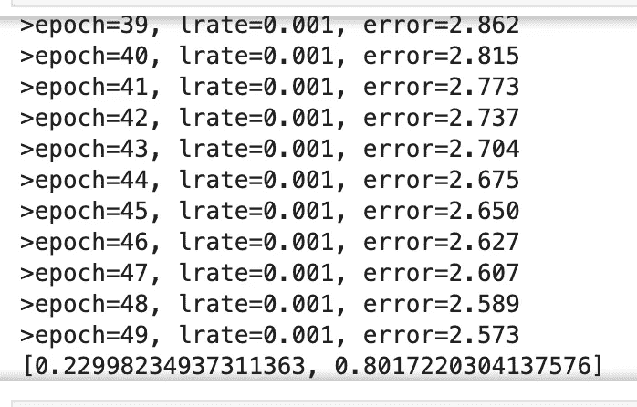
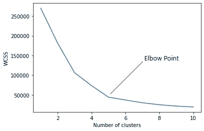
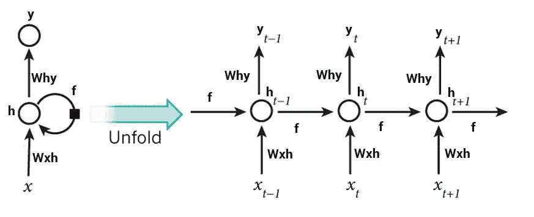
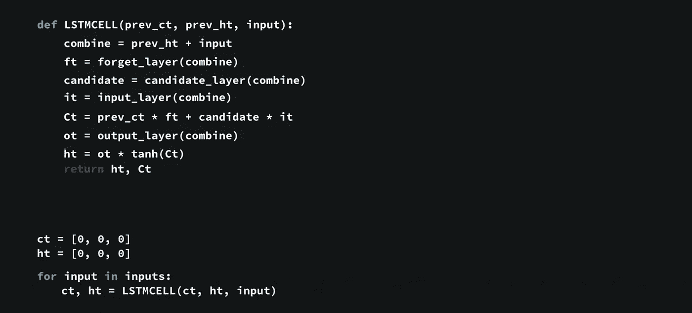

# Python 中从头开始的 ML 算法

> 原文：<https://pub.towardsai.net/ml-algorithms-from-scratch-in-python-5caac512eabc?source=collection_archive---------1----------------------->

## 幕后数学理解的自我注释

**目标:**在不使用任何 SKLearn 或 Tensorflow 之类的现成 ML 库的情况下，用 python 构建机器学习算法。打算涵盖线性回归、逻辑回归、KNN、K 均值聚类、决策树、随机森林、SVM、XGBoost、感知器、带反向传播的神经网络、DNN、RNN、LSTM、TF-IDF、单词袋、LDA 和 Word2Vec。

# 线性回归

梯度下降是通过遵循成本函数的梯度来最小化函数的过程。这包括知道成本和导数的形式，以便从给定点开始，你知道梯度并可以向那个方向移动，例如向最小值的下坡。

我们遵循梯度下降法来寻找 B0 和 B1，这将使这种情况下的损失函数(均方误差)最小化。
初始化:
B0=B1=0，学习率(lr)=0.01，次数=500

> 伪代码:
> 1。输入 Xs 和 Ys 通过初始值
> 2 输入系统。用 B0*X+B1
> 3 进行 Y 的预测。返回误差值用于系数修正
> 4。B0 = B0-lr *错误和 B1 = B1-lr * X *错误
> 5。在一个点之后，比如说 300 个历元，误差函数将开始收敛，即没有变化，这将是早期停止的点。



线性回归结果

# 逻辑回归(类似于线性回归)

[](https://machinelearningmastery.com/implement-logistic-regression-stochastic-gradient-descent-scratch-python/) [## 如何在 Python 中从头实现逻辑回归——机器学习精通

### 逻辑回归是两类问题的首选线性分类算法。这很容易实现，很容易…

machinelearningmastery.com](https://machinelearningmastery.com/implement-logistic-regression-stochastic-gradient-descent-scratch-python/) 

# KNN

[](https://machinelearningmastery.com/tutorial-to-implement-k-nearest-neighbors-in-python-from-scratch/) [## 从零开始用 Python 开发 k-最近邻-机器学习精通

### 在本教程中，您将学习 k-最近邻算法，包括它是如何工作的，以及如何…

machinelearningmastery.com](https://machinelearningmastery.com/tutorial-to-implement-k-nearest-neighbors-in-python-from-scratch/) 

对于分类问题，我们通过使用成对欧几里德距离和采取多数投票来找到最近的 k 个邻居。
伪代码:
**第一步**:计算欧氏距离。
**第二步**:获取最近邻居。
**第三步**:做预测。
**第四步:**通过交叉验证评估预测精度，通过改变 k 或距离度量优化度量

对于分类问题，我们使用成对欧几里德距离找到最近的 k 个邻居，并采取多数投票。
伪代码:
**第一步**:计算欧氏距离。
**第二步**:获取最近邻居。
**第三步**:做预测。
**步骤 4:** 通过交叉验证评估预测精度，并通过改变 k 或距离度量来优化度量

# k-表示:

## 最佳 K 用肘法计算

在肘方法中，我们实际上是在 1 到 10 之间改变聚类的数量(K)。对于 K 的每个值，我们正在计算 **WCSS(组内平方和)。WCSS 是聚类中每个点和质心之间距离的平方之和。**当我们用 K 值绘制 WCSS 时，该图看起来像一个弯头。随着集群数量的增加，WCSS 值将开始降低。当 K = 1 时，WCSS 值最大。当我们分析该图时，我们可以看到该图在某一点会快速变化，从而形成一个肘形。从这一点，图形开始几乎平行于 X 轴移动。对应于该点的 K 值是最佳 K 值或最佳聚类数。



我们可以通过在可能值的范围内改变聚类的数量来挑选聚类的数量，并在每次迭代中计算轮廓分数和失真。最佳数字是最大化第一个数字并最小化第二个数字。
下面介绍两种测量聚类质量的方法:

**惯性:**直觉上，惯性告诉我们一个星团内的点有多远。因此，小惯性是目标。惯性值的范围从零开始上升。

**轮廓分数:**轮廓分数表示一个聚类中的数据点与另一个聚类中的数据点之间的距离。轮廓分数的范围是从-1 到 1。比分应该更接近 1 而不是-1。
[肘方法](https://en.wikipedia.org/wiki/Elbow_method_(clustering))将方差百分比解释为聚类数的函数:人们应该选择多个聚类，以便添加另一个聚类不会给出更好的数据建模。更准确地说，如果绘制由聚类相对于聚类数量解释的方差的百分比，第一个聚类将增加很多信息(解释很多方差)，但是在某个点，边际增益将下降，在图中给出一个角度。在这一点上选择簇的数量，因此称为“肘形标准”。

Kmeans 将文档(NLP)分成不相交的簇。假设每个聚类属于单个主题。然而，描述实际上可能以主题的“混合”为特征。例如，让我们看一篇关于扎克伯格在国会前举行的听证会的文章:显然，你会根据关键词出现不同的话题:隐私、技术、脸书应用程序、数据等。 **LDA 有助于处理这个问题。**

输入是具有 **k** 簇的 **n** 个数据点，小的容差极限，例如 0.01 之后用于提前停止，n _ 迭代次数为 500。输出是一组“ *k* 聚类质心和数据集的标签，将每个数据点映射到一个唯一的聚类。

**第一步。随机选取 k 个数据点作为我们的初始质心。
**第二步。**用 k 个质心找出训练集中每个数据点之间的距离(我们的目的是欧几里德距离)。
**第三步。**现在根据找到的距离将每个数据点分配到最近的质心。
**第四步。**通过取每个聚类组中的点的平均值来更新质心位置。
**第五步。重复步骤 2 到 4，直到我们的质心不变。****

```
if np.sum((curr - original_centroid)/original_centroid * 100.0) > self.tolerance:
	isOptimal = False
#break out of the main loop if the results are optimal, ie. the centroids don't change their positions much(more than our tolerance)
if isOptimal:
		break
```

[](https://en.wikipedia.org/wiki/File:K-means_convergence.gif) [## K-means 收敛. gif

### 从维基百科，免费的百科全书点击一个日期/时间来查看当时出现的文件。日期/时间…

en.wikipedia.org](https://en.wikipedia.org/wiki/File:K-means_convergence.gif) 

# 感知器

感知器从训练数据的例子中接收输入信号，我们对这些数据进行加权并组合成一个称为激活的线性方程。它与以类似方式进行预测的线性回归和逻辑回归密切相关(例如，输入的加权和)。感知器算法的权重必须用随机梯度下降法从你的训练数据中估计出来。

权重和偏差被初始化为 0，并通过*激活= sum(weight_i * x_i) + bias 根据预测值与输出值的误差进行学习。* 权重矩阵等于输入矩阵或 num_neurons

感知器学习权重

# 反向传播神经网络

[](https://machinelearningmastery.com/implement-backpropagation-algorithm-scratch-python/) [## 如何用 Python 编写一个带反向传播的神经网络(从头开始)——机器学习…

### 经典的前向人工神经网络采用反向传播算法。这是技术…

machinelearningmastery.com](https://machinelearningmastery.com/implement-backpropagation-algorithm-scratch-python/) 

给定输入训练数据集以及随机权重和偏差，您能否构建一个具有隐藏图层和反向传播的 DNN？

> 伪代码
> 1。用#层(输入+输出+隐藏)和每个神经元的权重和偏差矩阵初始化网络
> 2。构建激活函数，该函数将通过(Wi*Xi)+Bias 计算输入的神经元激活。
> 3。通过 sigmoid、Relu 等激活函数传递激活的神经元
> 4。向前传播预测并计算总误差
> 5。将误差反向传播并将个别误差归咎于神经元并通过导数函数和 wi=wj+lr*ei
> 6 调整权重。继续训练网络以最小化误差，直到 n 个时期具有指定的学习速率(如果不使用动量)

反向传播神经网络

## 误差反向传播

第一步是计算每个输出神经元的误差，这将使我们的误差信号(输入)通过网络反向传播。给定神经元的误差可以计算如下

> 误差=(输出-预期)*传递导数(输出)

其中**预期**是神经元的预期输出值，**输出**是神经元的输出值，**传递导数()**计算神经元输出值的斜率
**消失梯度**意味着靠近输入层的层中的权重不会响应于在训练数据集上计算的误差而更新。具有许多层的训练网络(例如深度神经网络)的一个问题是，当梯度通过网络向后传播时，梯度急剧减小。当误差到达靠近模型输入的层时，误差可能非常小，以至于几乎没有影响。因此，这个问题被称为“*消失梯度*问题。消失梯度是递归神经网络的一个特殊问题，因为网络的更新包括为每个输入时间步长展开网络，实际上创建了一个非常深的网络，需要权重更新。
解决方案:*预训练、更好的随机初始缩放、更好的优化方法、特定架构、正交初始化等。*

**TF-IDF(词频-逆文档频率)**

**词频:**是单词在文档中出现的次数占该文档总字数的比率。
`tf(t,d) = count of t in d / number of words in d` 为文集——“拉维来了。罗汉在那里”，
tf(拉维)=1/6
tf(is)=2/6

逆文档频率:文档数与包含该词的文档数之比的 Log
语料库=[“Ravi 在这里”、“Rohan 在那里”、“好读 ML”、“坏读 ML”]
*IDF(t)= Log(N/(df+1))
IDF(Ravi)= Log(4/2)
IDF(ML)= Log(4/3)*

如果模型遇到除 vocab 之外的未知单词，它会给我们一个关键错误，因为我们没有考虑任何未知的标记。为这样的用例使用 word2vec 嵌入。

给定语料库的 TF-IDF 计算

其他技术，如计数矢量器、单词包(工作对生活和生活对工作是一样的)和散列矢量器是 TF-IDF 的前身，可用于其他功能。
TF-IDF 的缺点:
- TF-IDF 基于词袋(BoW)模型，因此它不能捕捉文本中的位置、语义、在不同文档中的共现等。
-无法捕获语义(例如，与主题模型、单词嵌入相比)

单词嵌入表示单词在受限空间中的矢量表示，例如 100 维空间，而不是字典中数百万个可能的世界(维度)。Skip-Gram 将输出作为输入层和隐藏层之间的权重，而对于 CBOW，它是隐藏层和输出层。
在监督学习中，权重可以如下重新训练:

> 1.用随机分数初始化一个一键编码矩阵
> 2。将它乘以代表单词的一维向量，例如“Nice”有[1，0，0，0]表示法
> 3。将单个样品组合成统一的重量矩阵，例如 12 个重量，每个重量有 4 个维度。小型评论使用填充。
> 4。将矩阵通过一个神经元，根据标记数据计算误差(伪问题)，并反向传播以更新输入权重。
> 5。使用 x LR 执行 n 个时期的迭代，以提高二进制交叉熵
> 6。将单个关键字的向量权重存储为嵌入权重。


监督学习中的嵌入计算

**递归神经网络(RNN)——**用于序列问题，如下一个单词预测、时间序列、语音识别等，其输出依赖于前一个序列。



RNN

RNN 白手起家的步骤:
1。以序列作为输入的数据准备，例如股票价格的 50 天跟踪
2。RNN 的建筑创作:输入为 LR、#Epochs、隐藏层、输入层和输出层，类似于 DNN，附加参数为 BPPT(通过时间的反向传播)、消失/爆炸渐变的 Min_Clip 和 Max_Clip。BPTT 与反向传播的核心区别在于，反向传播步骤是针对 RNN 层中的所有时间步长进行的。因此，如果我们的序列长度为 50，我们将反向传播当前时间步长之前的所有时间步长。
除了输入和输出权重矩阵之外，我们还有一个用于 RNN 层中共享权重的附加矩阵。
3。训练模型:正向传递、计算损失、开始训练、反向传递误差和更新权重
4。生成预测


RNN 的优点和缺点

**梯度削波**是一种技术，用于处理执行反向传播时有时会遇到的爆炸梯度问题。通过限制梯度的最大值，这种现象在实践中得到控制。
梯度更新规则，新权重=weight-LR*Gradient，
如果梯度较小，则没有消息到达更早的层。
如果梯度较大，网络不会收敛，出现 NaN 误差。

LSTM:他们有门来消除不必要的噪音。它有一个单元状态和门:遗忘门、输入门和输出门。
门包含 sigmoid 激活，即更新或遗忘[1，0]，不同于 Tanh[-1，1]。
**忘记门:**来自先前隐藏状态和当前状态的信息通过 sigmoid 函数传递。更接近 0 表示忘记，更接近 1 表示保留。
**输入门:**先前隐藏和当前输入通过 Tanh 功能。下一个状态的 Tanh 输出和 Sigmoid 输出相乘。
**输出门:**决定下一个隐藏状态应该是什么。



LSTM 的伪代码


LSTM 如何看待评论

**来源**

[](https://machinelearningmastery.com/implement-linear-regression-stochastic-gradient-descent-scratch-python/) [## 如何在 Python 中从头实现线性回归—机器学习精通

### 很多机器学习算法的核心是优化。机器学习使用优化算法…

machinelearningmastery.com](https://machinelearningmastery.com/implement-linear-regression-stochastic-gradient-descent-scratch-python/) [](https://machinelearningmastery.com/implement-backpropagation-algorithm-scratch-python/) [## 如何用 Python 编写一个带反向传播的神经网络(从头开始)——机器学习…

### 经典的前向人工神经网络采用反向传播算法。这是技术…

machinelearningmastery.com](https://machinelearningmastery.com/implement-backpropagation-algorithm-scratch-python/) [](https://www.askpython.com/python/examples/tf-idf-model-from-scratch) [## 用 Python-ask Python 从头开始创建 TF-IDF 模型

### TF-IDF 模型是一种用数值表示单词的方法。“你好，最近怎么样？”，您可以轻松地…

www.askpython.com](https://www.askpython.com/python/examples/tf-idf-model-from-scratch) [](https://www.analyticsvidhya.com/blog/2019/01/fundamentals-deep-learning-recurrent-neural-networks-scratch-python/) [## RNN 从零开始|用 Python 构建 RNN 模型

### 每当我们听到一个句子时，人类不会重新启动他们对语言的理解。给定一篇文章，我们掌握…

www.analyticsvidhya.com](https://www.analyticsvidhya.com/blog/2019/01/fundamentals-deep-learning-recurrent-neural-networks-scratch-python/)