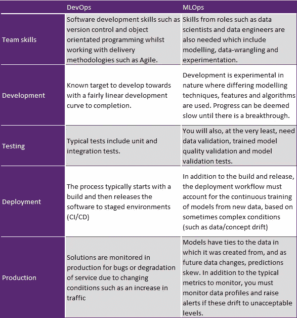
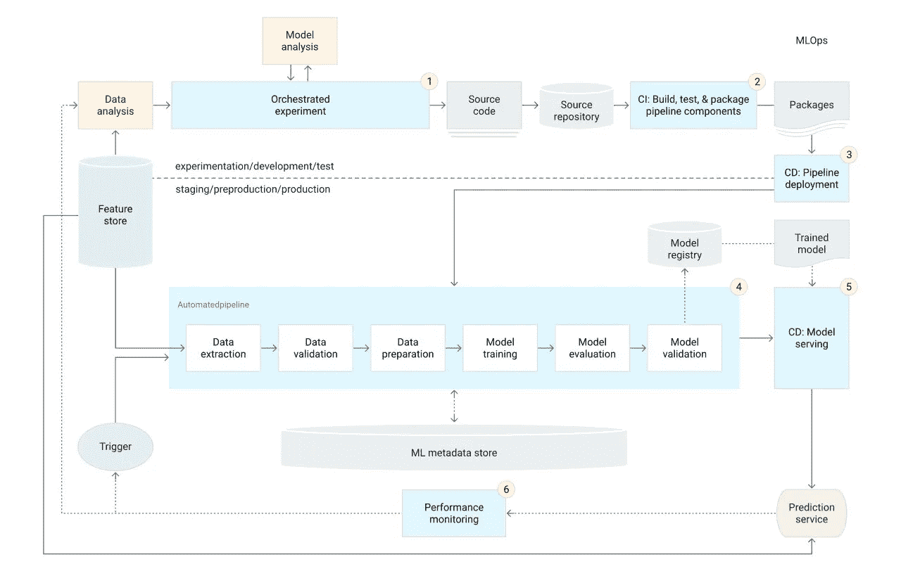

# ML-操作指南系列- 1

> 原文：<https://pub.towardsai.net/ml-ops-guide-series-1-db113a824ac1?source=collection_archive---------2----------------------->

## [机器学习](https://towardsai.net/p/category/machine-learning)

它是什么，为什么重要，它的重要性，以及更多…

简介:让我们开始吧，

**图一。**ML-Ops 的 ML 系统的基本要素。改编自[机器学习系统中隐藏的技术债务](https://papers.nips.cc/paper/5656-hidden-technical-debt-in-machine-learning-systems.pdf)。

什么是 MLops？

简而言之，MLOps 或 ML Ops 是一套实践，旨在在生产中可靠有效地部署和维护 ML 模型，从定义项目范围(问题陈述)到甚至在部署后进行监控，以确保一切按预期运行。

现在的问题可能是，DevOps VS MLOps 如何？

图 2——Google 的 5 个维度(DevOps 与 MLOps)

为什么它很重要&如何将 ML-Ops 应用于实践？

**ML-Ops 的重要性:**

在过去的十年中，我们见证了 ML 在日常生活应用中的采用。不仅仅是对于深奥的应用程序，如 **Dota** 或 **AlphaGo** ，ML 也已经进入了相当标准的应用程序，如机器翻译、图像处理和语音识别。

这种采用是由基础设施的发展推动的，特别是在计算能力的利用方面。它释放了深度学习和 ML 的潜力。

图 3:来源于 open ai:[https://openai.com/blog/ai-and-compute](https://openai.com/blog/ai-and-compute)

随着人工智能迅速扩展到新的应用和行业，研究正在取得巨大进展。然而，建设成功的项目仍然很困难。这些模型不能适应环境动态的变化或描述环境的数据的变化。因此，围绕设计、构建和部署模型建立有效的实践和过程的需求增加了。

因此，MLOps 在监视和执行对模型的依赖性、使用和性能的定期检查以确保它如预期的那样服务方面起着主要作用。MLOps 鼓励预先记录模型的预期行为，并将其用作基准，当模型表现不佳或不规则上升时，将采取必要的措施。

**使 ML-Ops 实用化的可行步骤，**

>在生产中不断监控模型的质量，以便让您检测性能下降，这反过来又是根据新数据重新训练模型的线索。

>使用最新数据捕捉演变和新兴模式。

>尝试新的实现方式，如特征工程、模型架构变化、超参数，以提高性能

上述三点需要大量手动流程，为了应对这些挑战，ML-Ops 帮助使用 CI/CD 和 CT 实现自动化。

这里，

CI 指的是持续集成:它不再仅仅是像 DevOps 那样测试和验证代码和组件，还包括测试和验证 ML 系统的数据、数据模式和模型。

CD 指的是连续交付:不仅仅是单个软件包或服务，而是一个 ML 培训管道，当有新的业务需求时，它应该自动部署另一个服务，如现有 ML 系统中的模型预测服务。

CT 指的是连续训练:这是一个新的特性，对于 ML 系统来说是独一无二的，它涉及到自动再训练和服务模型。

**更多…**

图 4:cloud.google.com

ML-Ops 系列将详细讨论自动化 ML 系统的每个数据科学步骤的实用性，例如数据提取、数据分析、数据准备、模型训练、模型评估、模型验证、模型服务和使用 ML 管道触发器的模型监控。ML 生命周期不同阶段的各种技术和用例，以及 ML-ops 的适用性，包括维护 ML 系统的各种健壮自动化(CI/CD)技术。

保持关注…