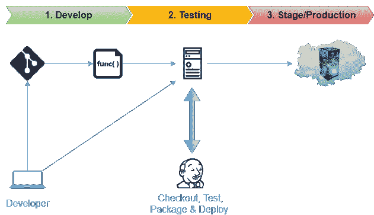
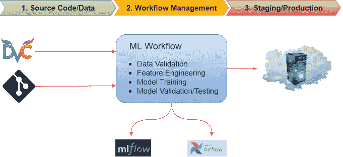
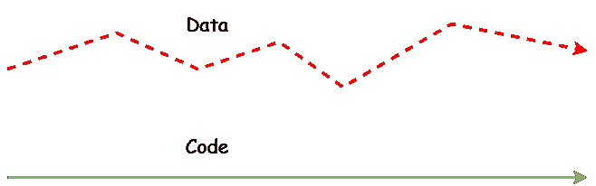
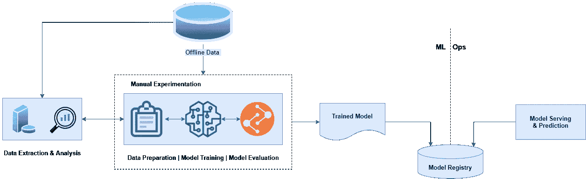
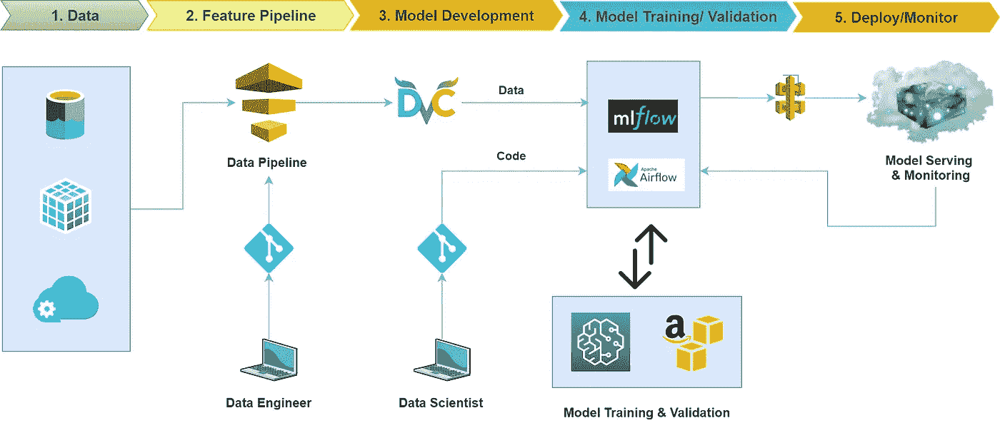
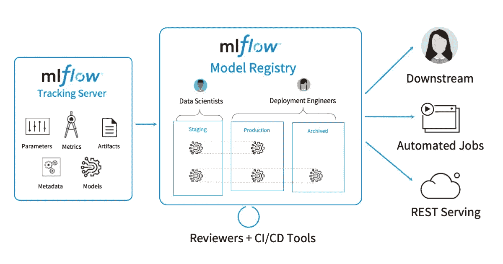
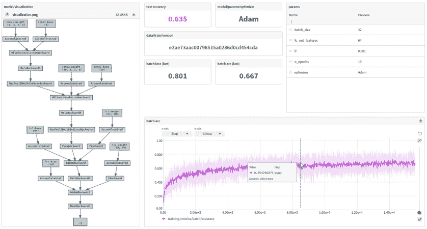
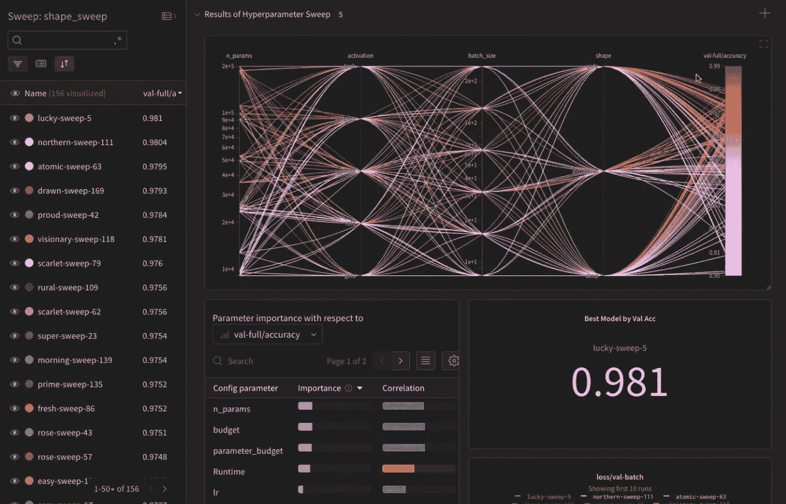

# MLOps 去神秘化…

> 原文：<https://pub.towardsai.net/mlops-demystified-6bee7a44ba9a?source=collection_archive---------0----------------------->

## [机器学习](https://towardsai.net/p/category/machine-learning)


效率就是把已经在做的事情做得更好— **彼得·德鲁克**

MLOps 基于现有的开发运维规程，即高效构建、部署和运行企业级应用的现代实践，以缩短系统开发生命周期，并在旅途中提供经过测试的高质量软件的连续交付/部署。

> 随着组织中的机器学习从研究成熟到应用企业解决方案，出现了对能够有效处理端到端 ML 生命周期的自动化机器学习操作的需求。

在技术产业发展的初始阶段，DevOps 过程为软件开发生命周期的有效管理铺平了道路。随着采用[人工智能优先解决方案成为全球最大企业的主流](https://www.oreilly.com/radar/ai-adoption-in-the-enterprise-2020/)，ML-Ops 成为了当务之急。

简单介绍之后，您可能会想，我们已经尝试并测试了开发运维实践，那么 ***我们为什么需要 MLOps？***

MLOps 是关于创新性地应用现有的 DevOps 实践来自动化大规模机器学习系统的构建、测试和部署。[连续交付基金会的 SIG-MLOps](https://github.com/cdfoundation/sig-mlops) 将 MLOps 定义为“DevOps 方法的扩展，将机器学习和数据科学资产作为 DevOps 生态中的一等公民”。



传统 DevOps 管道…

Git 是源代码版本控制系统的全球标准。它用于跟踪源代码随时间的变化，并支持不同版本的源代码。对版本控制的支持是持续集成(CI)解决方案的先决条件，因为它支持以完全自动化的方式对任何环境进行可重复的配置。在大多数标准 DevOps 设置中，Jenkins 与 git 协作使用，以便在受控环境中高效地构建、测试和部署版本化代码。



最先进的 MLOps 管道…

在 MLOps 的情况下，CI/CD 工作流由源代码或数据的变化触发。它引入了数据版本控制(DVC)的概念，对此没有像 git 这样的标准系统，但是许多数据组织和开源社区提出了各种解决方案。

## 为什么 DVC 具有挑战性？

虽然代码是在受控的开发环境中精心制作的，并且可以通过 git 等版本控制系统轻松管理，但数据是一个不断发展的参数，它来自称为“真实世界”的无尽熵源。它在不断变化，没有办法预测它将来会是什么样子。考虑数据和代码之间关系的一个有用的方法是，它们都生活在完全独立的平面上，但仍然共享时间维度。



数据和代码就像灵魂和身体，两者独立进化，但仍然相互联系

> DevOps 和 MLOps 之间的关键区别是对 ML 系统中的数据版本以及源代码的要求。

## MLOps 级别 0:手动流程



人工机器学习生命周期(端到端)

今天，许多组织都有数据科学家和 ML 研究人员，他们可以构建最先进的机器学习模型，但他们构建和部署 ML 模型的过程完全是手动的。这被认为是成熟度的基本水平或 0 级。以下是手动机器学习或 MLOps 级的典型挑战:

*   它包括手动的、脚本驱动的每个步骤的执行，并不断要求人的接触(离零接触的目标还很远)。
*   ML 开发和运营之间存在巨大的不连续性。它将数据科学家与为模型提供预测服务的工程师分离开来，从而增加了依赖性。双方之间的切换会导致[训练-服务偏差](https://developers.google.com/machine-learning/guides/rules-of-ml/#training-serving_skew)。
*   由于模型再训练或者数据的变化，手工过程没有被设计成包含频繁的发布迭代。人们认为，一个模型一旦经过训练，将会为这个目的服务多年。
*   它没有考虑对模型预测和每个预测的度量的跟踪和记录，这导致了数据团队内部缺乏协作和透明度。

## MLOps 级别 1:自动化 ML 生命周期



自动化机器学习生命周期(端到端)

1 级 MLOps 的目标是通过自动化整个机器学习管道来执行模型的连续训练，这进而导致预测服务的连续交付。支持连续模型训练的基本概念是进行数据版本控制以及有效跟踪训练/评估事件的能力。以下是 MLOps level-1 的典型特征，这些特征赋予了整个机器学习生命周期:

*   它通过有效地编排机器学习工作流程中的所有步骤，为我们提供了执行快速实验的能力。步骤之间的转换是完全自动化的，这导致了实验的快速迭代和更好地准备将整个流水线转移到生产。
*   它为我们提供了在生产中根据新数据自动重新训练模型的便利，从而使系统在预测方面更加稳健和准确。
*   它为我们提供了开发和生产环境之间的对称性，使数据团队能够顺利地从开发过渡到生产。
*   它允许我们创建一个 ML 管道，能够持续地向基于新数据训练的新模型提供最新的预测服务。

## 贸易工具

根据最新的行业标准，目前一些最常用的 MLOps 工具如下:

**1。库伯流**

KubeFlow 建立在 Kubernetes 之上，致力于使机器学习工作流在 Kubernetes 上的部署变得简单、可移植和可扩展。它提供了一种简单的方法来将 ML 的最佳开源系统部署到不同的基础设施上。无论你在哪里运行 Kubernetes，你都应该能够运行 Kubeflow。


库伯流建筑

以下是 KubeFlow 提供的服务:

*   **笔记本:** Kubeflow 包括在 Jupyter 环境中创建和管理交互式笔记本的服务。它允许您定制笔记本电脑部署和计算资源，以满足您组织的数据科学需求。它允许您在本地试验您的工作流，然后在您准备好的时候将它们部署到云中。
*   **TensorFlow 模型训练:** Kubeflow 为我们提供了一个定制的 TensorFlow 训练作业操作符，可以用来训练 ML 模型。特别是，Kubeflow 的作业操作符能够使用可配置的训练控制器处理分布式 TensorFlow 训练作业，以使用 CPU 或 GPU 并适应各种集群规模。
*   **模型服务:** Kubeflow 支持一个 TensorFlow 服务容器，将训练好的 TensorFlow 模型导出到 Kubernetes。它还与 Seldon Core(一个用于在 Kubernetes 上部署机器学习模型的开源平台)和 NVIDIA Triton Inference Server 集成，以便在大规模部署 ML/DL 模型时最大化 GPU 利用率。
*   **Pipelines:**kube flow Pipelines 是部署和管理端到端 ML 工作流的综合解决方案。它可以用于快速和可靠的实验。它允许我们计划和比较运行，并检查每次运行的详细报告。

**2。MLflow**

MLflow 是一个管理 ML 生命周期的开源平台，包括实验、可复制性、部署和中央模型注册。



MLflow 架构

以下是 MLflow 提供的服务:

*   **ml flow Tracking:**ml flow Tracking 组件是一个 API，它提供了一个用户界面，用于在运行机器学习代码时记录参数、代码版本、指标和输出文件，并用于以后可视化结果。MLflow Tracking 还允许使用 [Python](https://mlflow.org/docs/latest/python_api/index.html#python-api) 、 [REST](https://mlflow.org/docs/latest/rest-api.html#rest-api) 、 [R API](https://mlflow.org/docs/latest/R-api.html#r-api) 和[Java API](https://mlflow.org/docs/latest/java_api/index.html#java-api)API 进行日志记录和查询实验。
*   **MLflow 项目:**ml flow 项目是一种以可重用和可复制的方式包装数据科学代码的格式，主要基于约定。此外，项目组件包括用于运行项目的 API 和命令行工具，使得将项目链接到工作流中成为可能。
*   **MLflow 模型:**ml flow 模型是打包机器学习模型的标准格式，可以用在各种下游工具中——例如，通过 REST API 的实时服务或 Apache Spark 上的批处理推理。
*   **MLflow Registry:**ml flow 模型注册组件是一个集中式模型存储、一组 API 和一个用户界面，用于协作管理 ml flow 模型的整个生命周期。它提供了模型沿袭、模型版本化、阶段转换和注释。

**3。海王星**

Neptune 是任何 [MLOps](https://neptune.ai/blog/mlops-what-it-is-why-it-matters-and-how-to-implement-it-from-a-data-scientist-perspective) 工作流的**元数据存储库**。它是为进行大量实验的研究和生产团队设计的。它可以让你在一个地方监控、可视化和比较数以千计的 ML 模型。Neptune 支持实验跟踪、模型注册和模型监控，它的设计方式使协作变得容易。



Neptune 中的仪表板示例

用户可以在应用程序中创建项目，一起工作，并且[彼此共享 UI 链接](https://docs.neptune.ai/you-should-know/collaboration-in-neptune)(甚至与外部利益相关者共享)。所有这些功能使得 Neptune 成为 ML 团队所有成员之间的纽带。

Neptune 有云版本，可以在内部部署。它还集成了 25 个以上的其他工具和库，包括多模型训练和超参数优化工具。

以下是 Neptune 平台的主要特性:

*   可以记录和显示所有元数据类型，包括参数、模型权重、图像、HTML、音频、视频等。；
*   灵活的元数据结构，允许您以自己喜欢的方式组织培训和生产元数据；
*   易于导航的网络用户界面，允许您比较实验和创建定制的仪表板。

**4。彗星**

Comet 为我们提供了一个自托管和基于云的元机器学习平台，允许数据团队跟踪、比较、解释和优化实验和模型。


彗星仪表板

*   **快速集成:**只需在笔记本或脚本中添加一行代码，你就可以随时跟踪实验。无论你在哪里运行你的代码，它都适用于任何机器学习库，适用于任何机器学习任务。

```
@app.post("/")
**async** def endpoint():   
# ...    
# call async functions here with `await`    
# ...    
return {"msg": "FastAPI is awesome!"}
```

*   **实验比较:**它让我们能够轻松地比较实验，即代码、超参数、度量、预测、依赖、系统度量等，以了解模型性能的差异并选择最佳模型。
*   模型调试:它允许我们查看、分析并从您的模型预测中获得洞察力。它可以通过视觉、音频、文本和表格数据的专用模块轻松可视化样本，以检测过度拟合并轻松识别数据集的问题。
*   **Meta ML:** 它通过使用最先进的超参数优化技术和监督早期停止，帮助数据团队更快地构建更好的模型。

**5。权重&偏差(W & B)**

Weights & Biases 是一个机器学习平台，设计用于实验跟踪、数据集版本化和模型管理。该工具的实验跟踪部分侧重于帮助数据科学家跟踪模型训练的每个步骤、可视化模型以及比较实验。

W&B 还提供基于云的工具和内部工具。Weights & Biases 集成了各种其他框架和库，包括 Keras、PyTorch、TensorFlow、Fastai、Scikit-learn 等等。



W & B 仪表板

以下是 W&B 平台的主要功能:

*   所有实验都集中在应用程序的仪表板中，易于使用和交互。用户可以使用该工具可视化和组织他们的模型训练过程的结果。
*   它使用 W&B 扫描进行超参数搜索和模型优化。
*   日志数据的重复数据删除和差异。

## 参考

*   [https://neptune.ai/blog/best-ml-experiment-tracking-tools](https://neptune.ai/blog/best-ml-experiment-tracking-tools)
*   [https://www.kubeflow.org](https://www.kubeflow.org/)
*   [https://mlflow.org](https://mlflow.org/)
*   [https://www.comet.ml/site](https://www.comet.ml/site/)
*   [https://wandb.ai](https://wandb.ai/)

如果你想了解更多，或者想让我写更多关于这个主题的东西，请随时联系…

我的社交链接:[LinkedIn](https://www.linkedin.com/in/shubhamsaboo/)|[Twitter](https://twitter.com/Saboo_Shubham_)|[Github](https://github.com/Shubhamsaboo)


*如果你喜欢这篇文章或觉得它有帮助，请花一分钟按一下拍手按钮，它增加了文章对其他媒体用户的可见性。*