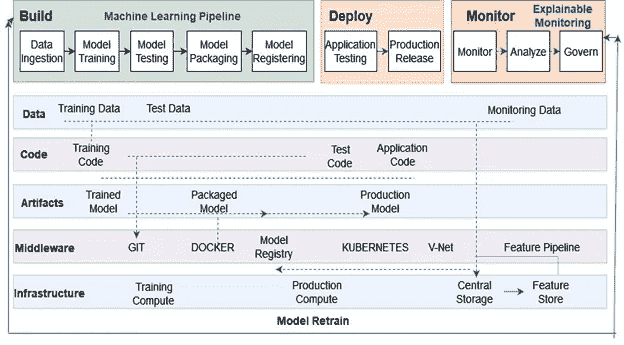
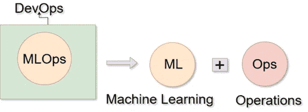
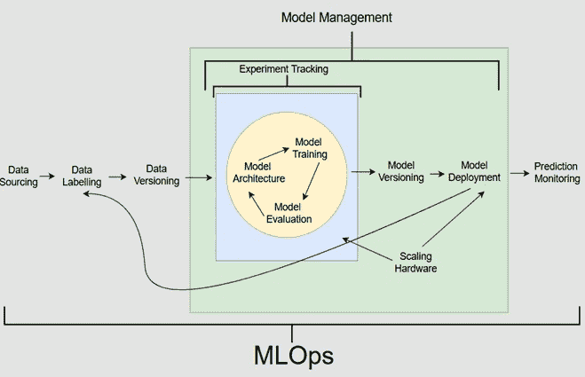
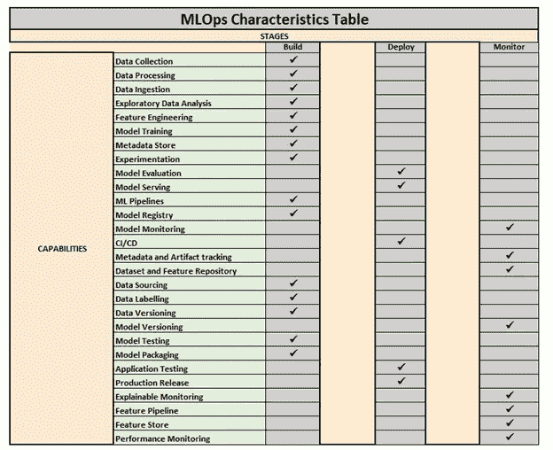

# MLOps——统治基础和少数实际使用案例

> 原文：<https://pub.towardsai.net/mlops-ruling-fundamentals-and-few-practical-use-cases-641f0a2f88c9?source=collection_archive---------0----------------------->

## [机器学习](https://towardsai.net/p/category/machine-learning)

# MLOps 工作流程

作者图片

在我直接跳到 MLOps 的实际用例之前，让我先写下 MLOps 的一些基础。

**为什么会出现 MLOps？**

全球各地的工程师和研究人员通过结合机器学习和人工智能知识和技术开发了许多高级模型，但部署这些模型并在大规模范围内获得最大效益正变得越来越复杂和具有挑战性。因此，为了找到所有这些问题的解决方案，MLOps 应运而生。

MLOps 是一种超级方法或一组实践，用于管理大规模生产环境中深度学习和机器学习模型的部署，并确保根据业务需要从开发到部署和重新部署的快速周转。

随着时间的推移，它越来越受欢迎，吸引了越来越多的组织的注意，这些组织希望在运营中利用机器学习的优势。

**什么是 MLOps？**

作者图片

**MLOps 被认为是 DevOps 的孩子，已经与运营部门、** **结合在一起，并得到数据工程**的全力支持，因此共同创造的术语是

**MLOps = ML(机器学习)+ Ops(运算)**

MLOps 将模型开发、部署、监控和质量控制、模型治理、模型再培训和管道流程自动化到一个平台中。

另一方面，它将数据科学家、机器学习工程师、开发人员和运营专业人员聚集在一起，使他们的协作和沟通更容易，以便通过内置的监控和治理有效地自动化和管理 ML 和 AI 模型及其生命周期。

## MLOps 做什么？

让我再重复一遍，机器学习模型需要能够在生产中运行，以提高效率，并在商业应用中做出更好的决策。因此，组织通过自动化流程、验证、测试和创建在动态环境中管理 ML 的可重复流程，采用 MLOps 来扩展 ML 操作和应用的数量。

此外，MLOps 使工程师和开发人员能够在生产中承担机器学习的全部责任和所有权，同时解放数据科学家来进行研究和处理其他相关任务。

作者图片

就像传统的 DevOps 一样，其目标是简化软件到生产的交付，MLOps 也旨在简化模型和软件的交付，并增加了基于数据的机器学习模式进行预测的功能。

因此，MLOps 鼓励自动化和持续部署，就像 DevOps 一样，并且还添加了独特的 ML 功能，如模型验证，以便能够在环境中进行高质量的预测。如果没有这样一个高效的部署管道，这些解决方案注定会停留在研究实验室中，并在用于商业之前消亡。

它为具有 ML 和 AI 能力的组织提供了一个基础，以通过其可行的解决方案实现投资最大化，并获得巨大的影响和价值。

这是通过加速大规模连续生产 ML 模型来实现的，大大减少了在几天甚至几小时内部署这种智能应用程序的时间。

MLOps 还将可重复性和可听度注入到部署管道中，如果 ML 模型表现不佳，或者需要在部署后进行审计，这可能是有益的。拥有一个合适的部署管道可以更容易地重新生成模型，并在必要时追溯步骤。

组织应该采取什么样的 MLOps 方法？

1.第一步是创建一种跨职能团队的协作文化，努力实现组织的业务目标。

2.它必须得到适当的底层技术的支持，以帮助团队成员一起工作并实现这些目标。

3.每个团队成员都应该在生产流程中扮演明确的角色。例如，数据科学家准备数据，应用 ML 算法，并调整模型以使其更具性能。开发人员将这些模型作为其应用程序的一部分，而运营部门确保模型在生产中得到批准和监控。

4.团队应该朝着与他们组织的主要目标一致的共同目标努力。

5.根据组织的不同，目标可以以他们的用例为中心。

6.目标不应该是优化特定的工程指标，而是 MLOps 团队被认为要达到的战略性组织目标。

7.理想的平台应该支持跨团队的信息共享，并支持敏捷开发过程。

8.最后，组织的最高管理层应该用技术支持这些文化和战略计划，帮助 MLOps 团队轻松地构建和部署 ML 和 AI 驱动的应用程序。

# **MLOps 使用案例**

## 1.试点项目/研究项目

每当我们为 ML 测试概念验证或执行研究或试点项目时，我们的重点主要是数据准备、特征工程、模型原型和验证。但是所有这些任务都需要多次迭代才能得到一个可靠的模型。数据科学家通常希望跟踪和比较这些迭代，并快速轻松地进行实验，以获得最终解决方案。

在这里，MLOps 通过为 ML 元数据存储、工件跟踪功能创建管道来扩展其支持，以便调试、提供可跟踪性矩阵、共享和跟踪实验配置，并通过与应用集成的配置管理和版本控制系统来管理所有相关的 ML 工件。

## 2.语音或声音识别系统

MLOps 方法可以应用于语音或声音识别应用。

通常，语音识别应用程序通过利用上下文来识别个人如何说话的情绪和音调，并相应地训练模型。但随着时间的推移，它可能会出错，特别是当个人在说话时引入新的短语并改变他们通常的风格。这可能导致模型衰退，并且必须由团队通过持续的手动监控来识别，这有时可能是令人厌倦和耗费精力的。

MLOps 可以帮助实现这一点，方法是自动持续监控语音识别模型的预测性能，每当性能低于或接近定义的阈值时，系统就会触发警报。这立即引起了负责团队的注意，他们使用新数据训练新模型，然后部署它来替换旧的生产模型。

## 3.包装机器/机器人

通常，制造公司在装配线的末端使用机器或机器人来包装他们的产品。这些机器人使用由机器学习驱动的计算机视觉来分析和包装产品。例如，如果 ML 模型被训练以识别特定尺寸的三角形和圆形盒子，但是为了迎合未来的需求，公司决定引入新的包装尺寸和形状，那么这导致需要在包装系统出现故障之前尽快解决的问题。

在这里，MLOps 帮助工程师和科学家使用持续集成和持续部署(CI/CD)进行合作，在新包装尺寸或形状引入装配线之前，使用定义的 ML 管道在最短的时间内创建和部署新的 ML 模型。

**4。** **一个推荐系统**

推荐系统通常遵循批量预测，因为不需要实时评分。分数可以预先计算并存储以备后用，因此延迟不是大问题。但是，由于一次要处理大量数据，因此吞吐量很重要。

MLOps 以其强大的成熟的数据处理能力技术和 ML 流水线以及模型注册来支持这一点，以向这种批量服务过程提供最新的经验证的模型来用于评分，而不是因为不希望的人为错误而使用任何旧版本。

## 5.股票市场中突然出现的异常值

以股票交易为例，假设 ML 模型被训练成基于医药产品进行预测，但是仅具有正价格，即价格增长。并且突然注意到药物产品开始遵循负面趋势，即价格下降。毫无疑问，在遇到这种突然的负价格/下降趋势时，模型将不会完美地运行。在这种情况下，需要做的是开发人员和数据科学家团队必须立即采取行动，培训和重新部署新的 ML 模型。

在这里，MLOps 提供了大量培训和部署已经自动化的新模型的渠道。在这种情况下，工程师和科学家甚至不需要开发商的帮助来处理管道。他们可以很容易地利用已经自动化的系统来立即更新、培训和部署新的模型，以避免进一步的负面影响。

## 6.每天或每周训练一次的欺诈检测模型，用于捕获最近的欺诈模式。

欺诈检测模型是一种频繁的再训练系统，其中模型性能严重依赖于训练数据的变化。这种再培训可以基于时间间隔(例如，每天或每周)，或者可以基于新的培训数据变得可用的实例来触发。

这种系统需要具有良好设置的 ML 管道的 MLOps 来连接多个步骤，如数据提取、预处理、模型训练和模型评估能力，以确保新训练的模型的准确性满足业务需求。随着训练模型数量的增长，模型注册、元数据和工件跟踪对于跟踪训练活动和模型版本变得非常重要。

7 .**。** **转化率最大化的推广模式**

这种系统通常需要频繁的实现更新，这可能涉及对 ML 框架本身的改变，这可能导致模型架构的改变或者训练管道中数据处理步骤的改变。这种改变导致 ML 工作流的改变，并且需要控制以确保新代码是功能性的，并且新模型如预期的那样执行。

在这里，MLOps 通过加快 ML 实验到生产的速度和减少人为错误的可能性，支持高效和完整的 CI/CD(持续集成/持续部署)过程。由于变化很大，在线实验和模型评估支持确保新版本按预期执行。此外，模型注册、元数据和工件跟踪操作化并跟踪频繁的实现更新。

作者图片

## 最后的想法

组织中规划良好的 MLOps 可以提高效率和生产力，从而为企业带来最佳投资回报。此外，它们还是团结开发人员和数据科学家的跨职能团队进行协作和交流的好方法。所有需要做的就是系统地利用其释放的潜力，并与生产环境保持一致。

感谢阅读！！！

我打算再写一篇分享一些关于 MLOps 的更有趣的信息。

你可以在媒体上跟踪我

LinkedIn: [Supriya Ghosh](https://www.linkedin.com/in/supriya-ghosh)

还有推特: [@isupriyaghosh](https://twitter.com/isupriyaghosh)