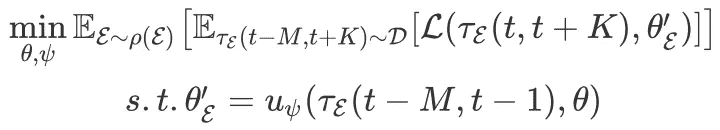
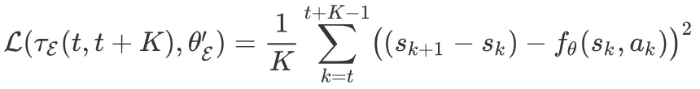
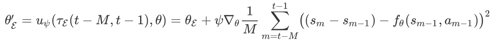
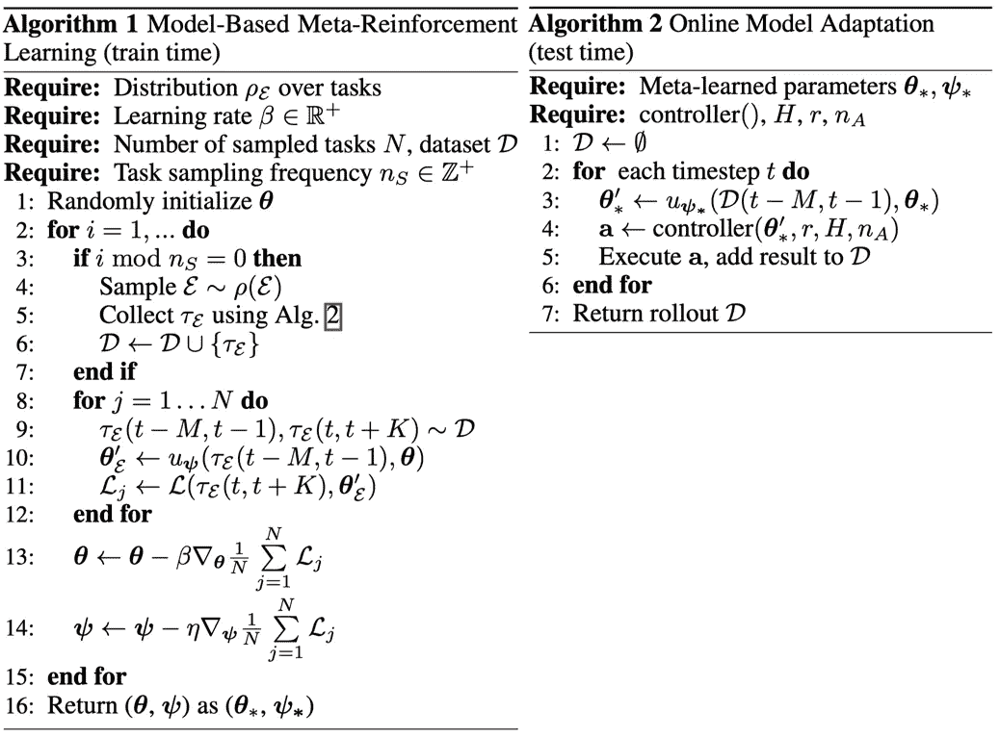

# 基于模型的元强化学习

> 原文：<https://pub.towardsai.net/model-based-meta-reinforcement-learning-71f0e1b52593?source=collection_archive---------0----------------------->

## 使用基于模型的 Meta-RL | [实现对 AI](https://towardsai.net) 的快速适应

## 深入研究基于模型的 meta-RL 算法，实现快速自适应

图片来自 Pixabay 的 mrthoif0

# 介绍

在[的上一篇文章](https://medium.com/towards-artificial-intelligence/pearl-probabilistic-embeddings-for-actor-critic-rl-42a5cbe05bfb?source=friends_link&sk=27f49e0ec95092933d99bdb6997f9619)中，关于无模型的 meta-RL 已经洒了很多墨水。在本文中，我们提出了一个基于模型的 meta-RL 框架，该框架由 Nagabandi & Clavera 等人提出，能够快速适应环境动态的变化。长话短说，这种方法学习一个能快速适应环境变化的动态模型，并利用这个模型做模型预测控制( [MPC](https://en.wikipedia.org/wiki/Model_predictive_control#targetText=Model%20predictive%20control%20(MPC)%20is,oil%20refineries%20since%20the%201980s.) )采取行动。值得注意的是，学习的动态模型的自适应性质不仅在元学习中特别重要，而且在基于模型的 RL 中也特别重要，因为它减轻了对全局精确模型的要求，这在基于模型的 RL 中起着重要作用。

# 环境假设

我们将环境分布 *ɛ* 定义为*𝜌(ɛ*。我们放弃了 MAML-RL 采用的情节框架，在该框架中，任务被预先定义为不同的奖励或环境，并且任务只存在于轨迹层面。相反，我们认为每个时间步都可能是一个新的“任务”，其中任何细节或设置都可能在任何时间步发生变化。例如，一个真正的有腿毫机器人在向前移动时意外地失去了一条腿，如下图所示

一个真正有腿的毫机器人在第二帧意外地失去了一条腿。来源:通过元强化学习学习适应动态的真实世界环境

我们进一步假设环境是局部一致的，因为长度为 *i-j* 的每个片段具有相同的环境。尽管这种假设并不总是正确的，但它允许我们在不知道环境何时发生变化的情况下，学会根据数据进行调整。由于适应的快速本质(不到一秒)，这个假设很少被违反。

# 问题设置

我们将适应问题公式化为优化𝜓𝜃的学习过程的参数，如下所示:

情商。(1)适应问题的客观方面，如果你对这个客观方面感到不舒服，请查看我们[以前关于 MAML 的文章](https://medium.com/towards-artificial-intelligence/how-to-train-maml-model-agnostic-meta-learning-90aa093f8e46)

其中 *𝜏_ɛ(t-M，t+K)* 对应于从以前的经验中采样的轨迹段， *u_𝜓* 是我们后面要定义的适应过程， *L* 表示动力学损失函数，它是状态变化的均方误差(见官方实现[此处](https://github.com/iclavera/learning_to_adapt/blob/bd7d99ba402521c96631e7d09714128f549db0f1/learning_to_adapt/dynamics/meta_mlp_dynamics.py#L133)):

动态模型的损失函数

直观来说，通过优化 Eq。(1)，我们期望代理在根据过去的 m 个变迁适应模型之后，在接下来的 k 个步骤中做得很好( *L(𝜏_ɛ(t，t+K))被最小化*。认识到什么是情商至关重要。(1)是为了理解这个算法而做的。如果你仍然对它感到不舒服，请在继续之前阅读本文的[MAML 部分。](https://medium.com/towards-artificial-intelligence/how-to-train-maml-model-agnostic-meta-learning-90aa093f8e46?source=friends_link&sk=7352308d22be5367cffc17377a0e3b1e)

此外，请注意，在等式。(1)我们将所有数据放在单个数据集𝐷中，而不是为每个任务维护一个数据集，因为我们想要进行快速适应，而不是这里的轨迹级元学习。

# 基于模型的元强化学习

Nagabandi&Clavera 等人介绍了两种求解方程的方法。(1).一种是基于梯度的元学习，另一种是基于递归模型。两者共享相同的框架，仅在网络架构和优化程序上有所不同。事实上，由于它们正交地强调了框架的不同部分，它们最终可能被组合起来形成一个更强大的方法。

## 基于梯度的自适应学习器

基于梯度的自适应学习器(GrBAL)使用基于梯度的元学习来执行在线自适应；更新规则由梯度下降规定:

动态模型的适应步骤

这里，可学习参数𝜓表示自适应时的步长。这种方法与非常相似，只是改进了李等人[4]提出的学习步长的方法。

## 基于递归的自适应学习器

基于递归的自适应学习器(ReBAL)利用递归模型，通过其内部结构学习自己的更新规则。在这种情况下，𝜓和 u_𝜓对应于更新其隐藏状态的递归模型的权重。更多信息，请参考 [RL](https://arxiv.org/abs/1611.02779) 。

# 算法

算法伪代码。来源:通过元强化学习学习适应动态的真实世界环境

如果你已经熟悉模型不可知的元学习( [MAML](https://medium.com/towards-artificial-intelligence/how-to-train-maml-model-agnostic-meta-learning-90aa093f8e46?source=friends_link&sk=7352308d22be5367cffc17377a0e3b1e) )和模型预测控制(MPC)，这里没有什么新的东西。我们通过算法 1(第 8–14 行)学习自适应动态模型，然后在每个环境步骤中，代理首先调整模型(算法 2 中的第 3 行)，然后执行 MPC(算法 2 中的第 4 行)以采取算法 2 中所示的行动。

# 实验结果

以下视频演示了该算法的有效性

实验结果。来源:https://sites.google.com/berkeley.edu/metaadaptivecontrol

# 参考

1.  A.Nagabandi，I. Clavera，S. Liu，R. S. Fearing，P. Abbeel，S. Levine 和 C. Finn，“通过元强化学习学习适应动态的真实世界环境”，*，第 1–17 页，2019 年。*
2.  *C.Finn，P. Abbeel 和 S. Levine，“用于深度网络快速适应的模型不可知元学习”，*第 34 期。糖膏剂马赫。学习。ICML 2017* ，第 3 卷，第 1856–1868 页，2017。*
3.  *Y.段、j .舒尔曼、x .陈、P. L. Bartlett、I. Sutskever、P. Abbeel，“RL:通过慢速强化学习实现快速强化学习”，*、*，第 1–14 页，2017。*
4.  *Z.李，周芳芳，陈芳芳，李。Meta-SGD:学会快速学习*