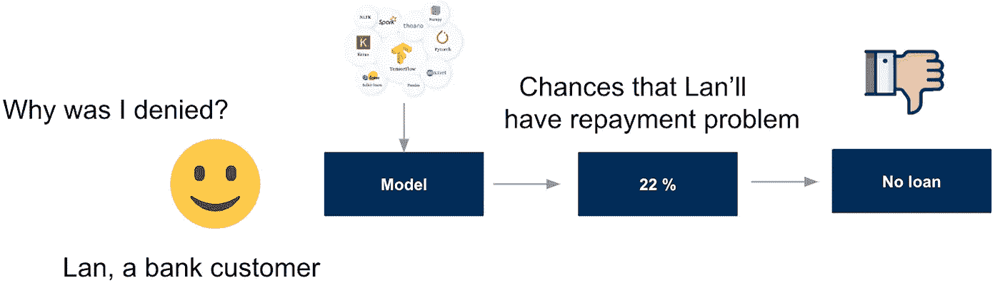
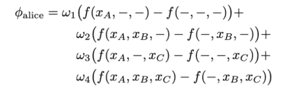
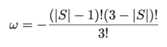
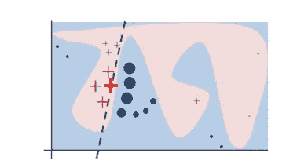

# 模型可解释性——SHAP 对莱姆对置换特征的重要性

> 原文：<https://pub.towardsai.net/model-explainability-shap-vs-lime-vs-permutation-feature-importance-98484efba066?source=collection_archive---------0----------------------->

## *解释的方式我希望有人给我解释一下。我 90 岁的奶奶会懂这个*

[Hồ Ngọc Hải](https://unsplash.com/@hongochai10?utm_source=medium&utm_medium=referral) 在 [Unsplash](https://unsplash.com?utm_source=medium&utm_medium=referral) 上拍照

解释复杂的模型有助于我们理解模型如何以及为什么做出决策，以及哪些特征在得出该结论时是重要的，这将有助于克服在决策中使用机器学习的信任和道德问题。选择期望的模型解释通常取决于以下三个问题的答案:(I)模型是否足够简单以提供内在的解释，(ii)可解释的模型应该是模型特定的还是模型不可知的？以及(iii)我们想要本地的还是全球的解释？

图片作者。

在本文中，我们将了解一些用于模型可解释性的事后的、局部的和模型不可知的技术。这类方法的几个例子是 PFI 排列特征重要性(费希尔，a .等人，2018 年)，石灰局部可解释模型不可知解释(里贝罗等人，2016 年)，和 SHAP 沙普利加法解释(伦德伯格，S. M .，&李，S. I .，2017 年)。该员额将分为以下几个部分:

**A .数据介绍**

**B .解释 3 种技术背后的直觉:SHAP、莱姆和排列特征重要性**

**C .潜在的陷阱**

得到💬任何数据科学或编程问题的 GPT 式答案。为成千上万的人生成摘要和学习笔记📚只需一次点击即可获得学习资源。👉

 [## 面向数据科学家和开发人员的免费学习资源。精选的博客、教程、书籍和…

### 机器学习和人工智能工程师的培训课程、黑客马拉松、活动和工作

aigents.co](https://aigents.co/learn) 

# A.数据介绍

在整篇文章中，模型和技术应用于实时系列数据集，包括:(I)2018-2022 年期间荷兰的电力消耗数据，这是非公开数据，以及(ii)荷兰的天气数据，这是荷兰皇家气象研究所的公开数据，可在此处访问。

# B.直觉

## **1。SHAP**

SHAP-代表 Shapley Additive exPlanations，是一种算法，首次发表于 2017 年[1]，是对任何黑盒模型的输出进行逆向工程的一种很好的方式。SHAP 是一个框架，它提供了计算 Shapley 值的高效工具，Shapley 值是合作博弈论中的一个概念，可以追溯到 1950 年。

## 博弈论和机器学习的可解释性

博弈论和机器学习可解释性有什么联系？我们不再有一个机器学习问题，即我们训练一个使用多个特征来创建预测的模型，我们现在想象一个游戏，其中每个特征(“玩家”)合作来获得一个预测(“得分”)。解释机器学习现在变成了问这样一个问题:每个玩家(特征)如何有助于获得那个分数(预测)[2]？答案是**每个特性的贡献由 Shapley 值给出，它告诉我们如果我们在没有那个特性**的情况下玩那个游戏，我们会赢或输多少分。换句话说，Shapley 值有助于我们解释如何在特征之间分配预测。

## 沙普利值

更准确地说，计算 Shapley 值需要知道所有玩家组合的博弈结果。一个独特的组合被称为联盟[2]。例如，如果我们有一个有三个玩家的游戏，Alice，Bob & Cheryl，一些有效的联盟是(Alice)和(Bob，Cheryl)。可能的联盟总数将是 2 × 2 × 2 = 2^3 = 8，因为每个玩家都可以在游戏中或出局。在与所有可能的联盟博弈之后，我们准备计算每个玩家的 Shapley 值。让我们首先考虑爱丽丝。【Alice 的 Shapley 值是她在场的游戏和她不在场的游戏得分差异的加权和:

等式 1。图片作者。基于 [SHAP 的论文](https://arxiv.org/abs/1705.07874)

其中ωi 是权重，将在下面进一步解释，表示该游戏中缺席的玩家。例如，f (xA，-，xC)是 Bob 缺席的博弈，f()是所有参与者都不参与的博弈。
权重由下式给出:

等式 2。图片作者。基于 [SHAP 论文](https://arxiv.org/abs/1705.07874)

其中|S|是联盟中玩家的数量，包括爱丽丝。对于等式 1 中的
四行，我们有|S| = 1，2，2，3，相应地ω1，2，3，4 = 1/3，1/6，1/6，1/3。

回到解释机器学习模型，我们希望
使用等式(1)来计算特征在创建预测中的贡献。通常一个模型有一个固定的输入，我们都知道如果我们删除/添加一个特性，模型就会改变。因此，通过搜索所有可能的特征组合来计算 Shapley 值将意味着对每个可能的特征子集重新训练模型，这在计算上是昂贵的，并且在现实世界中可能毫无意义。然而，我们可以像 SHAP 的作者建议的那样做一个**近似:从模型中移除一个或多个特征大约等于计算被移除特征的所有可能值的预测期望值**。让我们看一个例子来说明这是如何实现的。

假设我们有一个具有三个特征 A、B 和 c 的模型。我们试图解释的预测是，例如，f(5，3，10) = 7。例如，获取每个特性的 Shapley 值的步骤之一是计算 f (5，3)。用期望值代替它等于问我们自己这个问题:给定 xA = 5 和 xB = 3，我们期望预测是什么？我们可以从训练集中取出 xC 的所有可能值，并使用它们来计算期望值。换句话说，为来自训练集的每个值 xC 计算预测 f(5，3，xC ),然后取平均整体预测。如果遗漏了一个以上的特性，我们必须付出更多的努力，但是原则是一样的。计算 f(10)时，我们会问:当 xC = 10 时，我们期望模型预测值是多少？我们再次从训练集中获取 xA 和 xB 的所有可能值，但是现在在创建所有预测和计算平均值之前创建所有可能的(xA，xB)对。如果训练集由 100 行数据组成，我们将有 100 × 100 = 10.000 对值来进行预测。最后，f()以类似方式计算。如果我们不知道哪些值进入模型，我们期望模型预测什么？和以前一样，我们从训练集中取出所有可能的值 xA，xB，xC，创建所有可能的三元组，生成 100 × 100 × 100 = 1.000.000 个预测，并计算平均值。现在，我们已经对每个联盟的模型预测进行了近似，我们可以将这些数字代入等式 1，并获得每个特征的 Shapley 值。

## SHAP 解释的例子

最后一个例子表明，即使对于一个小的训练集和少量的特征，也需要计算…百万次预测。幸运的是，有一些方法可以有效地逼近期望值，这就是 SHAP 的作用。如前所述，SHAP 是一个框架，提供了有效的计算工具来计算沙普利值。 [SHAP 论文](https://arxiv.org/abs/1705.07874)的作者提出了 KernelSHAP，一种受局部代理模型启发的基于核的 Shapley 值估计方法。他们后来还提出了 TreeSHAP，这是一种基于树的模型的有效估计方法。

回到我们的真实数据集，我们尝试使用历史/滞后能耗、历史/滞后日照时间和邻近地区的地理位置来解释 Xgboost 模型对不同邻近地区第二天能耗的预测。下图显示了 TreeSHAP 中 XGBOOST 模型的功能重要性，该模型按功能重要性递减排序。水平条的颜色显示了与特定实例(在本例中为实例 1)的预期预测值相比，某个特征对预测的影响是积极的(绿色)还是消极的(红色)。

图一。数据集中实例 1 的 SHAP 解释。将鼠标悬停在地图上以查看互动数字。水平条-重要分数显示每个特征值的 Shapley 值。例如，对于此实例，要素 sunshine _ lag 7(7 天前的日照持续时间)的值为 11.3。该特征值对模型预测的边际贡献为-72.84。图片作者。

***加入*** [***中等会员***](https://huonglanchu.medium.com/membership) ***计划继续无限制学习。如果你使用下面的链接，我会收到你的一部分会员费，不需要你额外付费。*** *如果你决定这样做，多谢！*

 [## 通过我的推荐链接加入媒体——蓝初

### 阅读兰楚的每一个故事(以及媒体上成千上万的其他作家)。你的会员费直接支持兰初…

huonglanchu.medium.com](https://huonglanchu.medium.com/membership) 

# **2。石灰**

除了 SHAP，莱姆是解释黑盒模型的一个流行选择。在之前的[帖子](https://medium.com/towards-data-science/opening-black-box-models-with-lime-beauty-and-the-beast-9daaf02f584a)中，我彻底解释了石灰是什么，它是如何工作的，以及它潜在的陷阱。

## 局部线性假设

本质上，LIME 试图理解影响感兴趣的单个实例周围的黑盒模型的预测的特征。在实践中，黑盒模型的决策边界可能看起来非常复杂，例如图 2 中的蓝粉色背景。然而，研究(Baehrens、David 等人(2010 年)、Laugel 等人(2018 年)等。)已经表明，当你放大并观察一个足够小的邻域时，无论模型在全局水平上有多复杂，局部邻域上的决策边界可以简单得多，事实上甚至可以是线性的。

图二。蓝粉色背景代表黑盒模型的决策边界。加粗的红叉是正在解释的例子。LIME 将通过对所选实例周围的邻域进行采样，并对该邻域应用黑盒模型来生成相应的预测，从而生成新的实例(未加框的红色实例)。最后，用一个线性模型来解释黑箱模型的预测。虚线是黑盒模型在特定位置的行为。[来源](https://arxiv.org/pdf/1602.04938.pdf)

也就是说，LIME 所做的是在一个非常局部的水平上前进，并到达一个点，在这个点上，它变得如此局部，以至于一个**线性模型足够强大，可以解释黑箱模型在该位置的行为**【4】。你选择一个实例 X0 来解释，LIME 会在这个实例 X0 周围生成新的伪实例，通过对这个选定实例周围的邻域进行采样。接下来，它将原始黑盒模型应用于置换实例以生成相应的预测，并根据这些生成的实例到被解释实例的距离对它们进行加权。权重由核函数确定，该函数将欧几里德距离和核宽度作为输入，并输出每个生成实例的重要性分数(权重)。

在这个获得的数据集中(包括生成的实例、相应的预测和权重)，LIME 训练一个可解释的模型(例如，线性模型)，该模型捕捉该邻域中复杂模型的行为。该局部线性模型的系数将告诉我们哪些特征以这种或那种方式驱动预测，最重要的是，在该位置。

## 石灰说明示例

与 SHAP 类似，LIME 的输出是一个解释列表，反映了每个特征值对模型预测的贡献。

图 3。莱姆的解释。power _ lag 7(7 天前的能耗)的重要分值最大。此实例的特征 power_lag7 的值是 94.284。负的重要分数意味着 power_lag7 增加一个单位将导致响应变量——能耗减少 108.2797。作者图片

## 3.排列特征重要性

## 模型性能下降

PFI 背后的想法很简单。它测量了在我们改变了特征值之后模型性能的下降(例如 RMSE)，因此解释了哪些特征错误地驱动了模型的性能[5]。简而言之，如果打乱某个要素的值会增加模型误差，则该要素很重要，因为在这种情况下，模型依赖于该要素进行预测。如果改变某个特征的值使模型误差保持不变，那么该特征就不那么重要，因为在这种情况下，模型会忽略该特征进行预测[2]。作为一个例子，让我们假设一个验证集上 RMSE 等于 42 的模型。如果你洗牌，验证 RMSE 上升到 47，这意味着这个功能的重要性是 5。

## PFI 解释示例

回到我们的真实例子，PFI 的解释说地理位置特征(位置 A、位置 B、位置 C)起着最重要的作用，对模型误差的增加具有最大的影响。这与 SHAP 和莱姆的解释大相径庭，但也许可以解释。因为我们在看时间序列数据，滞后特征是高度相关的，例如，一周前的`sunshine duration`(`sunshine_lag7`)与六天前的`sunshine duration`(`sunshine_lag6`)相关。假设我们现在洗牌的特点`sunshine_lag7`。当两个特征相关时，其中一个特征被置换，模型仍然可以通过其相关特征访问该特征内部的信息，并且模型现在可以依赖`sunshine_lag6`测量。这导致两个特征的重要性值较低，而它们实际上可能很重要。这正是本案中发生的情况。

图 4。实例 1 的 PFI 说明。所有相关特征(滞后特征)的重要性都很低。作者图片

# C.潜在的陷阱

PFI 方法解释了哪些特征驱动了模型的性能(例如 RMSE)，而 LIME 和 SHAP 等方法解释了哪些特征在生成预测时发挥了更重要的作用。

在机器学习解释能力方面，SHAP 可能是最先进的。它有明确的解释和坚实的博弈论基础。Shapley 值可能是提供完整解释的唯一方法，因为它基于可靠的理论，并通过计算添加特征值时模型预测与缺少特征值时预期预测之间的差异来公平分配影响。SHAP 的缺点是 Shapley 值需要**大量的计算时间，因为训练时间随着特征的数量呈指数增长**。保持计算时间可管理的一个解决方案是仅计算可能联盟的几个样本的贡献[2]。另一个限制是，对于单个实例，Shapley 值返回每个特征值的单个 Shapley 值，它不像 LIME 那样给出**预测模型**。这意味着它不能用于对输入变化的预测中的变化进行陈述。

莱姆的解释相当简单。然而，它需要定义一个邻域，并且有时显示出**不稳定并且容易操作。LIME 解释的不稳定性来自于这样一个事实，即它取决于生成的实例数量和选择的核宽度，这决定了邻域的大小。这个邻域定义了解释的位置级别。有目的的邻域需要足够小以实现局部线性，但又足够大以避免欠采样或偏向全局解释的威胁。在某些情况下，可以通过改变内核宽度来改变解释的方向。像 LIME 这样的方法是基于这样一个假设，即事物在局部水平上将有一个线性关系，但是没有理论解释为什么这个会起作用。有时，当你的黑盒模型非常复杂，并且模型根本不是局部线性的，使用线性模型的局部解释将不够好。LIME 可能能够给出一个很好的局部解释——只要达到正确的邻域和局部线性。**

置换特征重要性与模型的误差相关联，这并不总是您想要的。PFI 也不太适合用相关特征训练的模型，因为添加相关特征可以通过在两个特征之间分割重要性来降低相关特征的重要性。如上所述，这通常会导致误导性的解释，因此**不适合解释时间序列模型或存在强相关特征的情况。**

## 参考

[1] [SHAP 主论文(2017)]解释模型预测的统一方法:[http://papers . nips . cc/paper/7062-A-Unified-Approach-to-interpretation-Model-Predictions . PD](http://papers.nips.cc/paper/7062-a-unified-approach-to-interpreting-model-predictions.pd)f

[2][书]可解释的机器学习:[https://christophm . github . io/Interpretable-ml-Book/shap . html](https://christophm.github.io/interpretable-ml-book/shap.html)

【3】https://github.com/slundberg/shapSHAP 包:

[4]里贝罗，M. T .，辛格，s .，& Guestrin，C. (2016 年 8 月)。“我为什么要相信你？”解释任何分类器的预测。第 22 届 ACM SIGKDD 知识发现和数据挖掘国际会议论文集*(第 1135-1144 页)。*

[5]奥特曼、托洛西、桑德和朗高尔(2010 年)。排列重要性:一个修正的特征重要性度量。*生物信息学*， *26* (10)，1340–1347。

[6][https://towards data science . com/shap-explained-the-way-I-wish-someone-explained-it-to-me-ab 81 cc 69 ef 30](https://towardsdatascience.com/shap-explained-the-way-i-wish-someone-explained-it-to-me-ab81cc69ef30)