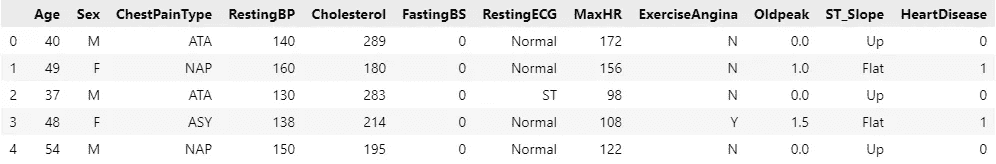
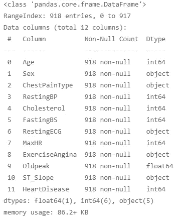
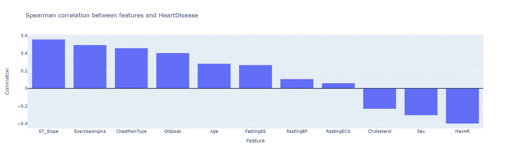
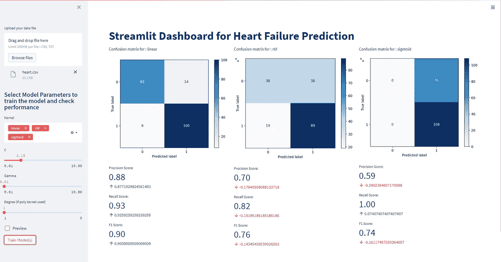

# 简化模型监控仪表板(1/3)。

> 原文：<https://pub.towardsai.net/model-monitoring-dashboards-made-easy-1-3-471b94313b5f?source=collection_archive---------1----------------------->

## [数据可视化](https://towardsai.net/p/category/data-visualization)

## 在这个由 3 部分组成的系列中，我将展示如何轻松地制作模型监控仪表板。

我知道模型监控和重新训练模型的痛苦对于任何机器学习工程师来说都不是很愉快，如果没有任何简单的方法来跟踪部署在生产中或其他需要监控的地方的所有模型，就更是如此。

在这个由 3 部分组成的系列中，我将介绍用交互式 GUI 构建模型监控仪表板，并用最少的 GUI 部分代码。

***第 1 部分:*** *构建一个简单的 GUI 界面，带有一个基本的模型监控界面和评估指标。我们将使用*[*streamlit*](https://streamlit.io/)*来完成工作，这是所有竞争对手中最好的。*

**第 2 部分:**我们将添加更复杂的模型监控指标，在这里，我们将使用类似[的服务，显然是](https://evidentlyai.com/)，将数据传递给已经构建好的具有基本功能的 GUI。

**第 3 部分:**我们将尽可能在再培训中加入自动化，并使用 GitHub actions 构建 CI/CD 管道，还将尝试不同的替代方案。

**注意:本指南是最基本的指南，假设您已经设置了数据获取管道(CSV 文件、数据库、REST APIs)。**

斯蒂芬·道森在 [Unsplash](https://unsplash.com/s/photos/data?utm_source=unsplash&utm_medium=referral&utm_content=creditCopyText) 上拍摄的照片

让我们开始吧。

# **要做的事情:**

*   数据探索(简介)
*   模型监控简介
*   简化基础知识和 GUI 构建

# 数据探索(简介)

我们将要使用的数据来自 kaggle。这里可以找到[。这是一个心力衰竭预测的数据集。让我们对数据有一个基本的了解。](https://www.kaggle.com/fedesoriano/heart-failure-prediction)

数据集的标题(5)

上面是数据的一瞥，让我们检查数据中的数据类型和空值(如果有的话)。

数据上的 df.info()

数据集中没有任何空值，总共有 **11** 个要素可以确定是否存在患心脏病的风险。我将在这里做一个非常基本的 EDA，因为复杂的 EDA 超出了本文的范围。

我们将研究不同特征与目标变量*心脏病的相关性。*

我们现在对这些特征是如何相关的有了一个概念。对于一个详细的，插图丰富的 EDA，看看这个[笔记本](https://www.kaggle.com/francescovattiato/heart-disease-prediction-with-svm-up-to-100-rec)。

# 模型监控简介

虽然这本身是一个更大的概念，但我将尝试简单介绍一下为什么我们甚至需要模型监控。

让我们举一个例子，您编写了一些代码来从数据库中获取数据，并在前端显示出来。在这种情况下，如果数据库本身没有被篡改，那么即使过了很长时间，编写的代码也会像预期的那样工作。这是代码的确定性行为，在机器学习模型的情况下，模型的概率性质和不断变化的数据使得模型的结果非常不确定，并且模型性能会随着时间而降低。尽管所述时间并不一致，并且随着每个用例而变化，并且是非常特定于域和数据的，因此需要实时(或接近实时)地对模型性能进行建模。

模型的这种不确定性可能是由许多因素造成的，我将尝试解释其中的一些因素。

*   *数据分布随时间变化(可能)*

这是……非常特定的领域。随着时间的推移，数据分布可能会发生变化，针对一种数据训练的模型可能不是另一种数据的最佳选择。

*   *模型漂移*

一些模型需要定期重新训练以确保准确性，例如时间序列数据，还有许多模型可以运行一年以上而无需任何更新，例如 CV 模型和一些分类场景。无论是哪种情况，现在能给出好结果的模型在一段时间后不一定能给出最好的结果。这个模型会随着时间而衰退。

*   *异常值*

如果管道没有很好地处理异常值，从长远来看，它会损害性能。在某些情况下，比如创业初期，可能根本没有异常值，但随着业务的增长，将会有许多异常值，而旧模型将无法保留这些异常值。

您可能出于许多原因想要在生产中监控您的模型，例如*向高层管理人员或客户解释模型，生产中的预测延迟可能与本地不同。解释所有这些本身就需要一篇文章，所以我不会深入细节。*

# 简化基础知识和 GUI 构建

Streamlit 让数据科学家和机器学习工程师的生活变得更加轻松。它是竞争对手中最好的，只是因为它没有任何隐藏的定价问题(据我所知)，而且社区支持非常好，更新非常定期。

首先，在您的 python/conda 环境中使用下面的命令安装 streamlit。我建议做一个新的，那样会更容易运输。

`pip install streamlit`

现在你只需要这个包，除了基本的 numpy、pandas 和 matplotlib/plotly。

为了文章的简洁，我现在尝试只使用 SVM。您可以根据需要添加任意多的算法。要获得上面的接口，你只需要在一个 python 文件中编写下面的代码。如果你想尝试 dash live，你可以点击这里的****。****

**真的很简单，不是吗，对于任何额外的按钮或选择框，请参考非常简单直观的 streamlit 的 API 参考。**

**在这一部分中，我们将只提供基本的监控控制，我们将启用更高级的监控工具和模型评估指标，同时为用户提供更好的选择。这只是我们希望如何在仪表板中看到我们的数据的基本介绍。**

**这是这部分的结尾。我不想在一篇文章中包含所有的内容，这会使阅读和理解变得很麻烦。**

**敬请期待下一部分。别忘了摆弄这个[在线应用](https://share.streamlit.io/mohneesh7/streamlit-demo-dashboard/main/dashboard.py)。**

**干杯！！**