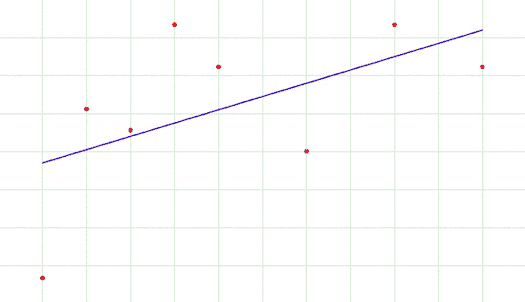
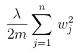
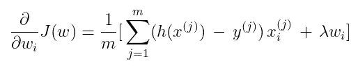

# 模型过度拟合？使用 L2 正规化！

> 原文：<https://pub.towardsai.net/model-overfitting-use-l2-regularization-9f7ca4aadb19?source=collection_archive---------4----------------------->

## [深度学习](https://towardsai.net/p/category/machine-learning/deep-learning)

## 用这个来增强你的深度学习模型！

由 [Samuel-Elias Nadler](https://unsplash.com/@mrsamuel?utm_source=medium&utm_medium=referral) 在 [Unsplash](https://unsplash.com?utm_source=medium&utm_medium=referral) 上拍摄

被困在付费墙后面？点击[这里](https://d3nyal.medium.com/model-overfitting-use-l2-regularization-9f7ca4aadb19?source=friends_link&sk=0ddf4a825566bd4124e6afb17a511488)阅读完整故事与我的朋友链接！

在上一篇文章中，我们讨论了指数加权平均值！现在，为了进一步提高模型的准确性，我们将讨论 L2 正则化。在这里看一看我的上一篇文章:

 [## 训练时间太长？使用指数加权平均值！

### 使用这种优化来加快你的训练！

medium.com](https://medium.com/towards-artificial-intelligence/training-taking-too-long-use-exponentially-weighted-averages-c15279f3df55) 

> 正则化是我们对学习算法进行的任何修改，目的是减少其泛化误差，而不是训练误差。~伊恩·古德菲勒

现在，有两种类型的正规化， **L1** 和 **L2** 。当然，还有其他的，但这些是我们谈论 *L 正则化*时通常想到的。我们改天会谈到 L1 正规化，今天，让我们把手伸进 L2。

# L2 正则是什么？

使用 L2 的模型叫做 [***岭回归***](https://ncss-wpengine.netdna-ssl.com/wp-content/themes/ncss/pdf/Procedures/NCSS/Ridge_Regression.pdf) ***。***

但首先，你可能会问 ***这有什么必要？*** 我们这些机器学习从业者，通常会尝试不同的架构来尝试解决一个 ML 问题。事先，几乎不可能预测架构是否会做得好，有时，模型 [***过拟合***](https://www.investopedia.com/terms/o/overfitting.asp) 。过度拟合是这样的:

来源:[走向数据科学](https://towardsdatascience.com/over-fitting-and-regularization-64d16100f45c)

你看到了吗？该模型在*不犯任何错误的前提下*，只是训练自己成为给定数据的最佳模型，因此，它不会在**新数据**上很好地*推广*。这就是为什么，我们有像正则化等技术。

正则化基本上是给算法的损失函数增加一个**惩罚项**。这改变了模型的权重，这是由于*最小化*损失函数而产生的。

对于使用 L2 的正则化，我们基本上*改变***损失函数**和我们**反向传播的方式**。

损失函数被改变，使得该表达式被**添加到现有的损失函数中**。添加的表达式是:

添加的表达式

这个术语叫做“ ***星等的平方*** ”。

其中:
- ' *λ'* 是一个*正则化超参数*。
-*m*为 SET _ y . shape【1】
-*W*为权重矩阵。

*λ，*此处*，*控制两个目标之间的*权衡*:***很好地拟合训练数据*** vs ***保持参数较小以避免过拟合*** *。*

并且通过添加正则化项的梯度来改变反向传播，该梯度为:

新渐变

# λ怎么选？

选择超参数的值在深度学习领域已经混乱了几十年，这个超参数也不例外。

但是在选择 *λ* 的值时，请记住以下几点:

*   更大的值 *λ* 将使权重收缩到更接近 0，这可能会导致拟合不足。
*   *λ***= 0****，*** 将没有正则化效果。*

*此外，在选择 *λ* 的值时，我们必须牢记偏差与方差的权衡。*

*现在，我听到了这场辩论。但是我们改天再讨论这个话题。*

*我本可以在使用 L2 之前和之后添加一个模型准确性的例子，但是不，拖延！*

*好吧，我希望这篇文章能帮助你！下面我们连线一下 [Linkedin](https://www.linkedin.com/in/d3ni/) 。*

# *进一步阅读*

* [## 训练时间太长？使用指数加权平均值！

### 使用这种优化来加快你的训练！

medium.com](https://medium.com/towards-artificial-intelligence/training-taking-too-long-use-exponentially-weighted-averages-c15279f3df55)  [## 模型过度拟合？使用辍学！

### 最好的正规化技术。

medium.com](https://medium.com/datadriveninvestor/model-overfitting-use-dropout-a32010f0afd0)  [## 针对猫 vs 狗分类的深度学习！

### 区分猫狗的循序渐进指南！

medium.com](https://medium.com/quick-code/deep-learning-for-cats-vs-dogs-classification-309463f3fc46) 

# 联系人

如果你想了解我最新的文章和项目[，请在 Medium](/@D3nii) 上关注我。以下是我的一些联系人详细信息:

*   [Linkedin](https://www.linkedin.com/in/d3ni/)
*   [GitHub](https://github.com/D3nii?tab=repositories)
*   [推特](https://twitter.com/danyal0_o)

> 快乐学习。:)*