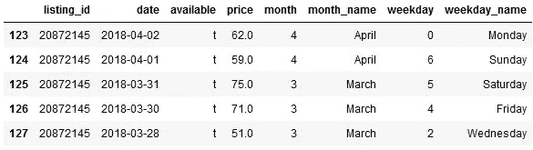
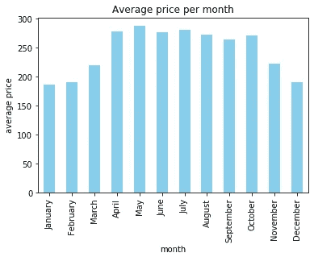
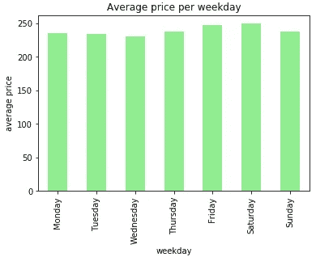
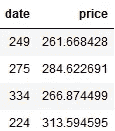
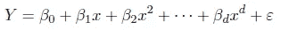
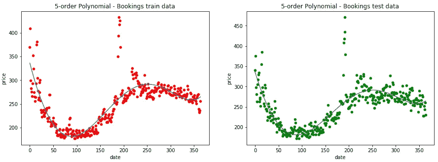
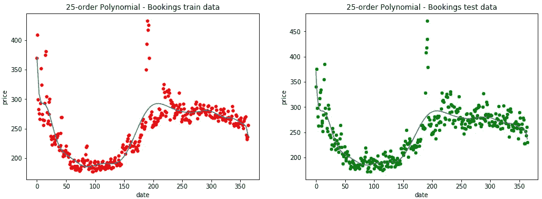
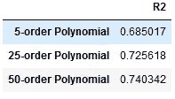

# Airbnb 价格的季节性建模

> 原文：<https://pub.towardsai.net/modeling-seasonality-of-airbnb-prices-80bd60ea307?source=collection_archive---------1----------------------->

## [数据科学](https://towardsai.net/p/category/data-science)， [Python](https://towardsai.net/p/category/programming/python) ， [R](https://towardsai.net/p/category/programming/python)

## 使用 Python 和 R 的多项式回归实用指南

多年来，合租扰乱了酒店的价格和入住率。对于新冠肺炎，社交距离、卫生和退款政策可能是新的干扰。在本文中，我们构建了一个多项式回归模型来预测给定日期的 Airbnb 租赁价格。

克里斯·罗斯·哈里斯在 [Unsplash](https://unsplash.com/photos/bJqeJxeyiJE) 上的照片

# 数据

数据来源于 Airbnb 网站的公开信息。文件`calendar_train.csv`和`calendar_test.csv` 包含 Airbnb 单元的可用性和价格数据。

每一行都描述了在`date`的`listing_id`上进行的预订。如果预订是提前很久进行的，那么`available`的值为`f`，而`price`为空(未知)。否则`available`为`t`并给出`price`。

下面，我们展示了在 2019 年疫情奥运会之前，波士顿地区每月的挂牌均价。

波士顿地区 Airbnb 房源示例([来源](http://insideairbnb.com/get-the-data.html)

平均预订价格在 4 月至 10 月期间最高，在 11 月至 2 月期间最低。夏季的高价格是意料之中的。在寒冷的月份可以观察到较低的价格。

在 2019 年疫情奥运会之前，波士顿地区 Airbnb 房源的月平均价格

周五和周六是预订最贵的工作日。这些是周末预订。其余几天平均价格相同。

在 2019 年疫情奥运会之前，波士顿地区 Airbnb 房源的平均每日价格

# R 中的多项式回归

我们将拟合一个回归模型，该模型使用该日期作为预测器，并预测该日期 Airbnb 租赁的平均价格。

为此，我们将日期转换成一个数字变量。然后我们考虑每个日期的平均价格。

> 当我们知道真正的均值函数 Y 相对于预测值 x 是曲线时，对预测值的多项式函数进行建模非常有用。

Python 中多项式回归的两个流行选项是 [scikit-learn](http://scikit-learn.org/) 和 [StatsModels](http://www.statsmodels.org/) 。虽然 scikit-learn 提供了许多简单易学的算法，但 StatsModels 提供了统计学和计量经济学工具，这些工具与 r 等其他统计软件很接近。

来自 R 世界的新手仍然可以在 Python 笔记本中使用众所周知的 R 函数。

下面我们使用 R 语言的 Python 接口 [rpy2](https://pypi.org/project/rpy2/) 对 Airbnb 数据拟合多项式函数。 [rpy2.robjects](https://rpy.sourceforge.io/rpy2/doc-dev/html/robjects.html#module-rpy2.robjects) 中的对象 *r* 代表正在运行的嵌入式 R 进程。

# 偏差与方差的权衡

观察拟合训练数据的蓝线，我们可以观察到曲线随着多项式阶数的增加而增加。这是由于模型复杂性增加，因为高阶多项式试图追踪训练集中的每个单个数据点。尤其是在具有异常值的区域(图的开始和中间部分)，更高次的多项式倾向于朝着这些异常值的方向。

因此，具有 50 阶多项式的模型具有最高的方差。与低阶多项式相比，它在训练数据上也具有最低的偏差，这通过最高的 R 得分来反映，低阶多项式具有较低的 R，这意味着较高的偏差，但方差较低。低阶多项式对训练数据不太敏感。

似乎随着多项式阶数的增加，R 值也会增加。预计随着模型变得更加复杂，它将能够拾取更多信号，并更好地匹配训练集。当 R 值随着复杂性的增加而增加时，它不会过度拟合。

# 结论

多项式回归用于定义或描述曲线现象。本文展示了如何使用多项式模型预测 Airbnb 在给定日期的价格。我们还介绍了 rpy2 包，它允许 R 开发人员在 Python 生态系统中工作。

多项式回归很少在实践中使用，除非科学理论要求使用多项式。更灵活的方法是使用分段多项式。特别是，我们可以使用连接的分段多项式，也称为样条。

[新冠肺炎破坏了扰乱者](https://www.nytimes.com/2020/05/14/travel/hotels-versus-airbnb-pandemic.html)吗？本文提供的代码可进一步用于分析 Airbnb 在新冠肺炎疫情期间的价格和上市情况。